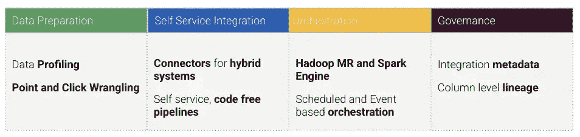
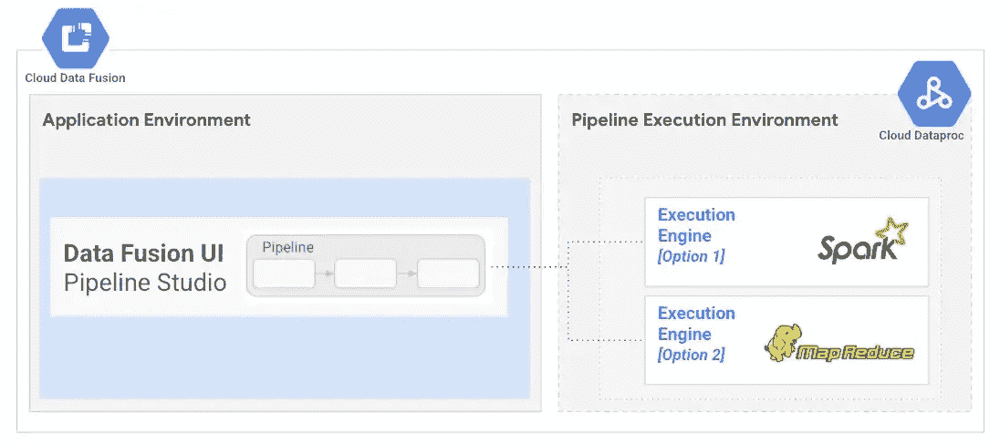
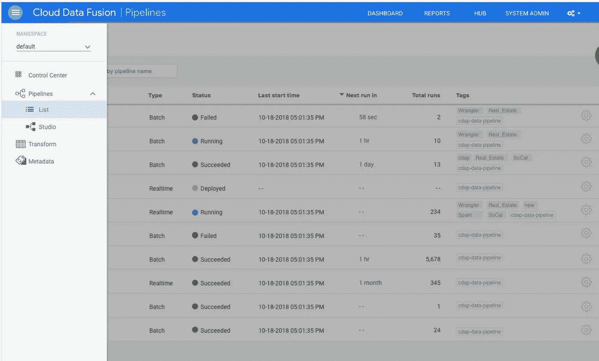
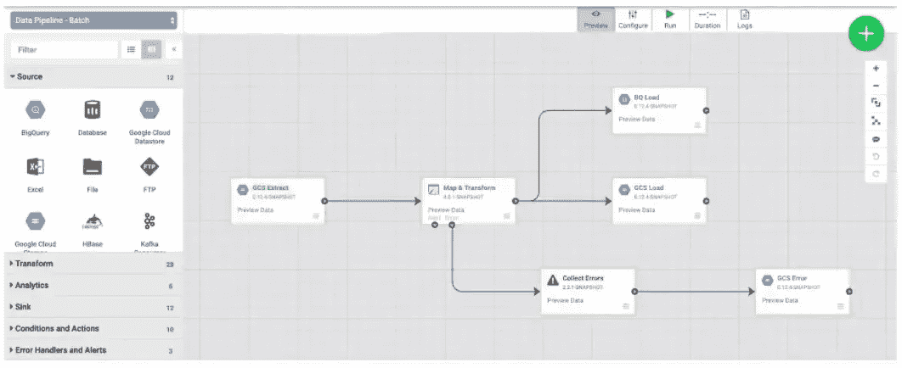

# 数据融合基础

> 原文：<https://medium.com/google-cloud/data-fusion-basic-concepts-c40b09efd695?source=collection_archive---------7----------------------->

任何规模的完全托管的云原生数据集成。

[**云数据融合**](https://cloud.google.com/data-fusion) 是一个基于 GUI 的数据集成服务，用于构建和管理数据管道。它基于 [CDAP](https://github.com/cdapio/cdap) ，这是一个为内部和云资源构建数据分析应用的开源框架。它为 GCP、其他公共云和内部资源提供了各种现成的连接器。

让我们看看我们在 ETL 处理中经常观察到的一些挑战，

*   **不同的**数据资产在**云中**和**本地**
*   集成需要深厚的技术专业知识和昂贵的资源
*   **减慢**业务**决策**
*   **重复**和**老死不相往来**

数据融合解决了上述挑战，因为它提供了:

*   **图形化、无代码的**界面——提供简单性，让**非技术人员**也能使用
*   **统一查看**所有数据
*   数百个内置**云和本地连接器**
*   **标准化**通过**扩展性**和**复用性**

数据融合有两个主要目的:简化 ETL 处理，

1.  **无需编写任何代码即可构建数据管道**:由于 Data Fusion 建立在开源的 CDAP 项目之上，它已经拥有 100 多个连接器，并且还在不断增长。在源和接收器之间建立管道只需要点击几次。
2.  **无需编写任何代码即可进行转换:**数据融合附带了一组内置转换，您可以无缝地将它们应用到您的数据中。

除了能够创建基于无代码 GUI 的管道之外，数据融合还提供了可视化数据分析和准备功能、简单的编排功能以及管道的粒度沿袭。

数据融合能力

现在我们将通过一些数据融合的基本概念来更好地理解它，

# 云数据融合实例

云数据融合*实例*是云数据融合的独特部署。

您可以在单个 Google Cloud console 项目中创建多个实例，并可以指定 Google Cloud 区域来创建您的云数据融合实例。

根据您的需求和成本限制，您可以创建一个[开发人员、基本人员或企业](https://cloud.google.com/data-fusion/pricing#comparison_of_basic_enterprise_and_developer_editions)实例。

每个云数据融合实例包含一个独特的、独立的云数据融合部署，该部署包含一组服务，用于处理管道生命周期管理、编排、协调和元数据管理。这些服务使用[租户项目](https://cloud.google.com/service-infrastructure/docs/glossary#tenant)中的长期运行资源运行。

# 执行环境

当您手动运行管道时，或者当管道通过时间表或管道状态触发器运行时，云数据融合会创建短暂的执行环境来运行管道。云数据融合支持 [Dataproc](https://cloud.google.com/dataproc) 作为执行环境，在其中你可以选择运行管道作为 MapReduce、Spark 或 Spark 流程序。

数据融合执行环境

# 管道

*管道*是一种可视化设计数据和控制流的方法，用于从各种内部和云数据源提取、转换、混合、聚合和加载数据。通过构建管道，您可以创建复杂的数据处理工作流，帮助您解决数据接收、集成和迁移问题。根据您的需求，您可以使用云数据融合来构建批处理和实时管道。

## 管道节点

在云数据融合 UI 的 **Studio** 页面中，管道被表示为一系列*节点*排列在有向无环图(DAG)中，形成单向流动。节点表示您可以对管道采取的各种操作，例如从源读取、执行数据转换以及将输出写入接收器。您可以通过将源、转换、接收器和其他节点连接在一起，在云数据融合 UI 中开发数据管道。

# 插件

一个*插件*是一个可定制的模块，可以用来扩展云数据融合的功能。云数据融合为源、转换、聚合、接收器、错误收集器、警报发布器、操作和运行后操作提供插件。

# 计算配置文件

一个*计算配置文件*指定如何以及在哪里执行流水线。概要文件封装了设置和删除管道的物理执行环境所需的任何信息。

# 用户界面

数据融合用户界面

# 名称空间

您可以使用名称空间对云数据融合实例进行分区，以在您的设计和执行环境中实现应用程序和数据隔离。

# 中心

在云数据融合 UI 中，可以点击 **Hub** 来浏览插件、样本管道和其他集成。

# 流水线执行

样本数据融合管道

管道部署在名为“数据管道-批处理”的命名空间中。它有多个管道节点，这些节点执行读取、写入或转换数据的特定操作。一旦管道准备就绪，就可以在 dataproc 集群上运行了。

希望这篇文章对你有帮助！！快乐阅读！！！