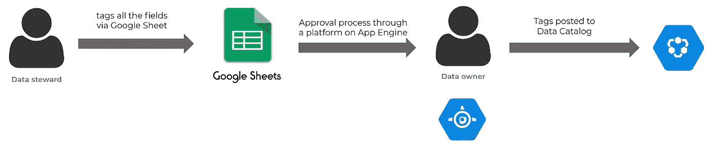
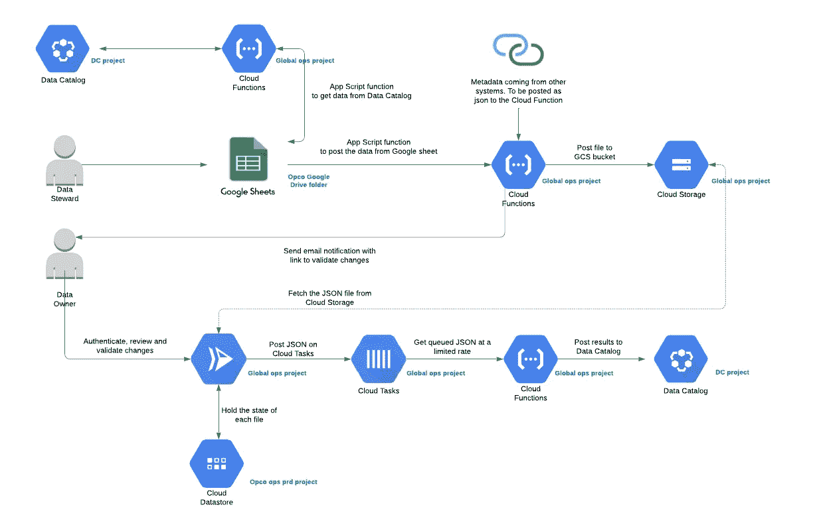

# 数据治理:通过 Google Sheets 标记 PII 数据

> 原文：<https://medium.com/google-cloud/data-governance-tagging-pii-data-through-google-sheets-7927b7cd3dd9?source=collection_archive---------1----------------------->

在本文中，我们将重点关注数据标签的工业化。您可以将标记操作视为向数据添加元数据。拥有关于表和字段的良好元数据是健壮的数据治理的首要前提。只有这样，您才能开始构建新的数据治理层，例如围绕个人身份信息的自动化流程(PII)。如何确保你的分析数据库可以系统地删除某人的数据，如果有人问？如何确保任何人都无法访问这些 PII 数据？只有在表和字段中有可靠的元数据的情况下，才能解决这些问题。

> 没有大数据分析，公司就像瞎子和聋子，像高速公路上的小鹿一样在网络上游荡。

**如果说今天有什么能定义成功的企业，那就是对公司数据的成功理解、使用和策略。**在每家公司，数据都在以指数速度增长。虽然这可能导致洞察力的增加，但它通常会导致公司迷失在这个巨大的数据沼泽中。

出于正确的原因，因为**扩展到 TB 或 Pb 的数据需要一些强大的数据治理**来理解这一切。

在过去的两年里，我们一直致力于 Google Cloud 上的各种数据仓库项目以及这些项目的数据治理。big query 与[数据目录](https://cloud.google.com/data-catalog)的结合使得通过单一平台管理整个组织的数据变得非常高效。

# 数据目录和大查询

**数据目录是组织级别的资源**，它将允许您通过单一访问点访问所有项目的数据。

**默认情况下，BigQuery 表的所有模式都会出现在那里。**因此，它满足了数据治理支柱之一所需的可见性要求。

# 数据目录中的标签模板

数据目录通过[标签模板](https://cloud.google.com/data-catalog/docs/quickstart-tagging)真正展示了其标签的可能性。

使用这些模板，您可以定义一个标记模板，然后您可以为任何 BigQuery 表和任何表中的字段填充该模板。

字段级别的标签示例包括:

*   **has_pii (boolean)** :声明 pii 存在与否的布尔值
*   **描述(字符串)**:明确的描述
*   **分类(列举)**:该字段包含的数据类型(id、金融、科学等。)
*   等等。

您可以轻松地想出十几个标签，让所有数据和业务分析师更容易地搜索和理解您的数据。

# 数据目录中的手动标记过程

当您开始拥有许多标签和大量数据时，Data Catalog 的一个缺点是，如果您通过 UI 进行标记，标记过程可能会非常耗时，而且不太方便。此外，不应该只有一个人负责标记。

[数据管理员](https://en.wikipedia.org/wiki/Data_steward)可能需要事先与数据所有者讨论标记的创建和更改，然后在 GCP 控制台中手动创建标记。

如果这个过程可以简化和工业化，那不是很好吗？这正是我们通过在数据目录上创建一个名为 Google sheets 的 UI 层所解决的问题。

# 使用 Google Sheets 自动化标记过程的解决方案

借助我们的标签解决方案，数据管理员只需使用 Google Sheets 就可以轻松地将标签批量发布到数据目录中。通过使用一些[应用程序脚本](https://developers.google.com/apps-script)，我们自动将所有带有当前标签的 BigQuery 模式加载到 Google Sheets 中。然后，由任何数据管理员开始对数据进行大规模标记。

一旦他们完成标记，点击应用程序脚本“保存”按钮将触发一个批准过程，该过程将向数据所有者发送一封电子邮件进行审查。然后，数据所有者可以通过 App Engine 上托管的 web 应用程序查看所有更改。如果他/她同意更改，新的标签将被发布到数据目录。

# 在 Google Sheets 解决方案中标记 PII 数据的架构

该流程的概要架构如下所示。真正的架构包括一些用于收集和验证数据的[云函数](https://www.fourcast.io/blog/google-cloud-functions-serverless-noops-solutions)，一个用于批准或拒绝过程的应用引擎服务，用于保存密钥集的数据存储等等。

作为用户，你唯一需要交互的工具是 Google Sheet 和 App Engine，用于批准或拒绝标签中的更改。

在幕后，有更多的事情发生，使整个过程变得健壮。以下是所使用的所有谷歌产品的完整架构:

该架构有三个主要部分:

**1。通过 Google Sheets** 进行标记:数据管理员需要通过 Google Sheet 为所有数据(表和列级别)输入一系列标记，然后在数据所有者接受后将标记发布到数据目录。
为了避免手动错误，我们在谷歌表单中添加了一些下拉菜单，让你更容易地了解你需要填写到标签中的值。还会执行一些数据验证过程，以便在将更改发送给数据所有者之前对其进行检查。Google 表单中有两个功能:

*   **刷新数据**:这将调用一个谷歌云函数，从数据目录中获取所有数据的最新标签。
*   **保存数据**:这将把你所有的标签保存在云存储的 json 文件中，同时向数据所有者发送一个批准请求。

**2。批准流程**:该部分是一个简单的 web 应用程序，托管在 App Engine 上，授权用户可通过 [IAP](https://cloud.google.com/iap) 访问。数据所有者可以查看该 web 应用程序上的标签，如果他/她批准了更改，只需点击“批准”即可将所有标签分派给[云任务](https://cloud.google.com/tasks)。

**3。标签的发布:**云任务队列上的一个任务对应一个 BigQuery 字段。这个队列的处理程序是一个云函数。这允许我们为每个任务利用大量的调用，并且只为每个函数调用运行的几毫秒付费。

**结论 Google Cloud 提供了令人难以置信的分析套件，为了保护数据并提供数据可见性，将它与强有力的治理结合使用非常重要。这篇文章关注于通过数据目录上的 Google Sheets 来工业化你的标记过程。在下一篇文章中，我们将看到如何通过 BigQuery 的内置问题自动加密和解密您的 PII 数据，这些问题是关于这种从数据治理开始的伟大方式，或者关于任何其他数据&分析挑战？我们很高兴与您讨论最佳的前进方式！如何通过加速您的数据分析战略来节省大量时间&资源&？阅读有关我们的数据仓库加速器 Flycs 的更多信息！** [AEAD](https://cloud.google.com/bigquery/docs/reference/standard-sql/aead-encryption-concepts#:~:text=AEAD%20encryption%20functions.-,Purpose%20of%20AEAD%20encryption,by%20using%20encryption%20at%20rest.&text=AEAD%20encryption%20functions%20allow%20you,rotate%20keys%20within%20a%20keyset.) **功能连同数据目录。**

*原载于*[*https://www . fourcast . io*](https://www.fourcast.io/blog/starting-with-data-governance-tagging-personally-identifiable-information-data-through-google-sheets)*。*