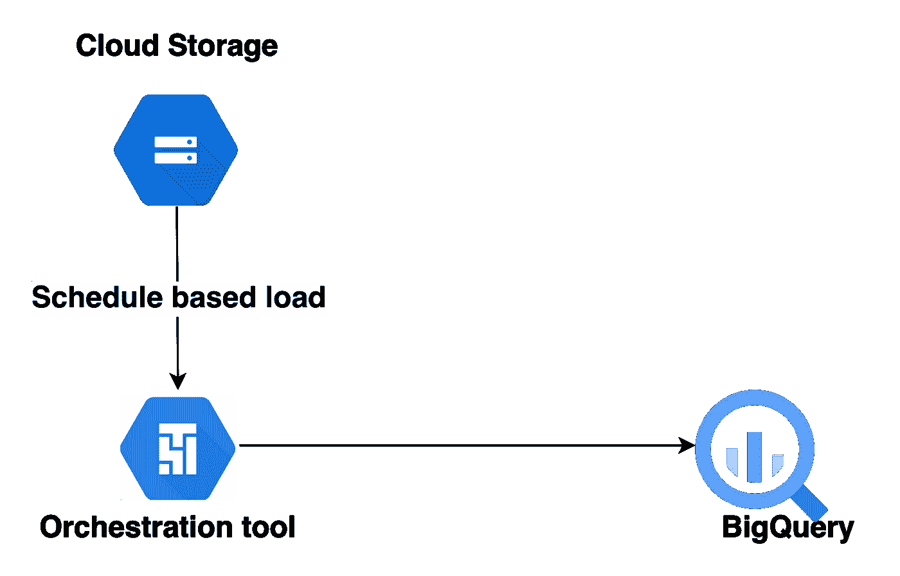
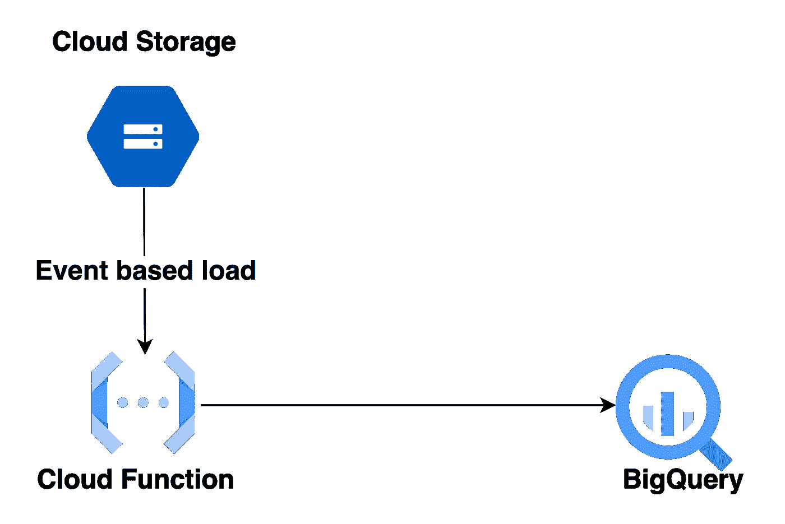
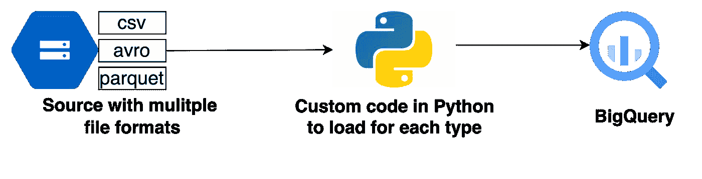
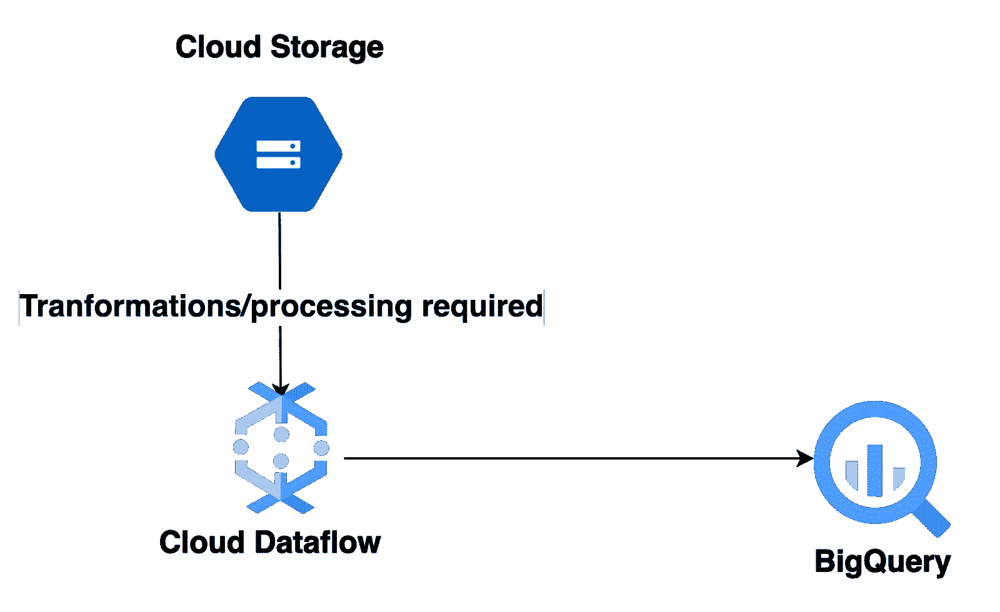

# 数据网格自助服务—从 GCS(Google 云存储)到 BigQuery(网格数据存储)的摄取模式

> 原文：<https://medium.com/google-cloud/data-mesh-self-service-ingestion-pattern-from-gcs-google-cloud-storage-to-bigquery-data-store-609aa4bedd8c?source=collection_archive---------1----------------------->

Google Cloud 中最常用的摄取用例之一是将文件从 GCS(Google Cloud Storage)加载到 BigQuery。围绕这一点已经有了很多模板，每一个都有不同的用途。在这篇博客中，我们将讨论各种用例以及要应用的特定工具/模板。此外，我们还将了解如何在一个模板中迎合各种文件格式。

# 负载类型:

1.  **基于时间表:**如果 GCS 中的文件有固定的到达时间，或者负载预计在特定时间运行，则可以使用基于时间表的方法。文件大小、成本、性能等各种因素都会影响工具/服务的选择。

*   Cloud Composer:在 GCP，每当我们想到基于时间表的负载时，首先想到的就是 Composer。Composer 是一个基于 Apache Airflow 的完全托管的工作流编排服务。它有各种内置的操作符，如 [gcs_to_bigquery 操作符](https://airflow.apache.org/docs/apache-airflow-providers-google/stable/_api/airflow/providers/google/cloud/transfers/gcs_to_bigquery/index.html)，可以用来将文件直接从 gcs 加载到 bigquery。如果我们需要编写任何自定义逻辑或转换，可以用 python 编写脚本，并使用 [Python 操作符](https://airflow.apache.org/docs/apache-airflow/stable/howto/operator/python.html)运行。Composer 提供了一个非常好的 UI，可以用来查看不同日期的负载和日志。它提供了从 UI 为特定负载重新运行作业的能力。但是由于所有这些特性，Composer 非常昂贵，这是选择这个工具的主要因素。
*   云工作流:GCP 提供的另一个轻量级编排服务是云工作流。与 Composer 相比，它们相当便宜，但也有一些限制。例如，我们可以在特定日期从 UI 重新运行 Composer 中的 DAG，但是工作流不提供这种灵活性。它们也没有像 Composer 中那样的内置操作符。

*   除此之外，还有 Cloud Scheduler，它可以与各种 GCS 服务结合使用，将文件从 GCS 加载到 BigQuery。

使用编排工具调度基于负载

**2。基于事件:**如果文件到达时间不固定，需要在文件到达时加载，可以使用基于事件的方式。云功能是能够在文件到达事件上执行任务的服务。我们可以编写一个定制的包装器来将文件加载到 BigQuery。云功能可以调用其他 GCP 服务来高效地执行文件加载任务。

使用云函数的基于事件的负载

# 迎合多种文件格式:

其中一个用例可能是为相同的负载使用不同类型的文件格式。假设一个表需要加载一个 CSV 和一个 Avro 文件。现在，两种格式是不同的，所以像模式检查和头检查这样的验证也应该是不同的。然后，为了最终在 BigQuery 中加载文件，加载作业也应该根据具体的文件格式而有所不同。

为了让一个模板能够加载各种文件格式，我们可以编写一个定制的包装器(比如用 Python)。它可以检查文件扩展名，并执行与扩展名对应的验证和加载。因此，可以增强相同的代码，为各种文件格式添加逻辑。入口点可以是相同的，然后基于格式，它可以执行特定于格式的加载。

用单个模板加载多种文件格式

# 使用转换加载:

在某些情况下，数据需要在加载到 BigQuery 之前从文件中转换出来。转换可能需要来自处理工具/服务的一定量的计算和内存。

GCP 提供的一个这样的工具是数据流。数据流是一个统一的流和批量数据处理，无服务器，快速，经济高效。它可以用于使用 beam transformations 和 load in BigQuery 来转换数据。它可以根据文件大小和处理要求自动缩放。

通过转换加载文件的云数据流

# 总结:

在本系列的前一部分 [Data Mesh Self Service —从 Spanner 到 BigQuery(Mesh 的数据存储)的摄取模式](/google-cloud/mesh-self-service-data-ingestion-template-for-moving-data-from-spanner-to-bigquery-data-store-94186c0f13e5)中，我们讨论了 Spanner 到 BigQuery 的模式，以及如何针对 Spanner 中的任何模式更改处理 big query 中的[自动模式演变](/google-cloud/automatic-schema-evolution-in-bigquery-for-any-change-in-spanner-using-spanner-change-stream-d44710880855)。

在这一部分中，我们讨论了将文件从 GCS 加载到 BigQuery 的各种方法(基于时间表的和基于事件的)。我们还看到了加载文件的各种 GCP 服务。除此之外，我们还讨论了如何通过创建自定义包装器在一个模板中满足各种文件格式的需求。然后我们讨论了使用数据流加载文件，这需要一些数据转换。

在本系列的下一部分中，我们将介绍如何在 BigQuery 中处理自动模式进化，以防文件中出现额外的列，而无需任何手动干预。