# 使用 Airbyte 将数据从 MongoDB Atlas 迁移到 BigQuery，并使用自定义查询处理原始数据(JSON)

> 原文：<https://medium.com/google-cloud/data-migration-from-mongodb-atlas-to-bigquery-using-airbyte-and-handling-the-raw-data-json-using-28ec90d71236?source=collection_archive---------0----------------------->


数据迁移是将数据从一个位置移动到另一个位置，从一种格式移动到另一种格式，或者从一个应用程序移动到另一个应用程序的过程。在这个博客中，我们将看到如何将数据从 MongoDB(一个 NoSQL 数据库)迁移到 BigQuery。

BigQuery 提供了机器学习、地理静态分析和商业智能等功能来帮助您管理和分析数据。BigQuery 提供了一种无服务器的体系结构，允许您使用 SQL 查询来回答组织的问题。

**我们将使用 Airbyte 将我们的数据从 MongoDB 迁移到 BigQuery。**

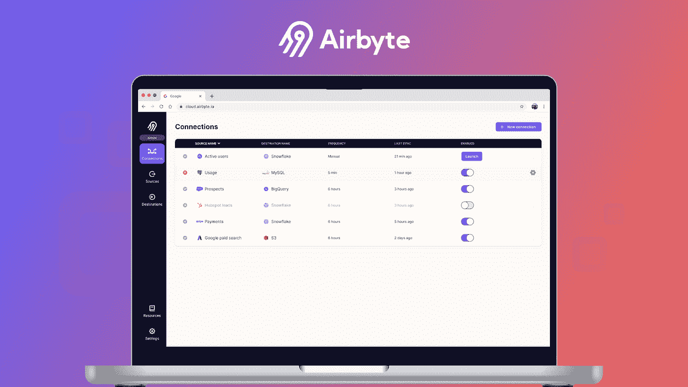

# Airbyte 简介:

**Airbyte** 是一个开源数据管道平台，可以替代*stick Data*和 *Fivetran* 。尽管这些现有的数据管道平台提供了大量与诸如 *Stripe* 和 *Salesforce* 之类的知名来源的集成，但当前模型中存在一个遗漏了小型服务集成的缺口。

**为什么要选择空气细胞？**

*   提供免费社区版的轻松部署。
*   拥有 150 多个数据源，所有数据仓库、湖泊和数据库均为目的地。
*   Airbyte 上的连接器在 **Docker 容器**中运行，允许独立操作。您只需监控每个连接器，根据需要刷新它们，并安排更新。
*   Airbyte 为您提供了一个功能来监控您的每一个连接器，根据需要刷新它们，并安排更新。

# 同步模式

1.  完全刷新覆盖:同步整个流，并通过覆盖来替换目标中的数据。
2.  完全刷新附加:同步整个流并将数据附加到目标。
3.  增量追加:同步流中的新记录，并将数据追加到目标。
4.  增量重复数据消除历史记录:同步流中的新记录并在目标中追加数据，还提供了反映源中流状态的重复数据消除视图。

# 归一化和变换

1.  原始数据(JSON): Airbyte 只将数据推入“JSON 格式”的原始表中。
2.  标准化表格数据:Airbyte 将数据推入原始表中，然后使用自己的查询将数据先推入临时表中(采用标准化表格格式)，然后使用合并脚本将数据推入最终表中。

# 业务用例:

**MongoDB** 是一个著名的 NoSQL 数据库，它要求数据以“JSON 格式”建模。如果应用程序的数据模型自然适合 MongoDB 推荐的数据模型，那么它可以为事务性工作负载提供良好的性能、灵活性和可扩展性。

然而，当涉及到分析知识时，MongoDB 不是一个好的解决方案——它缺乏适当的连接，从其他系统向 MongoDB 传输数据很困难，并且它缺乏原生 SQL 支持。在 MongoDB 的聚合框架中编写复杂的分析逻辑不像在 SQL 中那么容易。

因此，有很多用例将数据从 MongoDB 传输到 BigQuery，然后将 BigQuery 用于其他分析和 ML 场景..

# 当 Airbyte 本身可以处理所有事情时，我们为什么要使用自定义查询呢？

对于大多数业务用例来说，**增量追加/增量重复数据删除模式**通常被选为同步方法，并且通常使用来自规范化的**规范化表格数据选项**将数据直接推送到主表。

与许多 ETL/ELT 工具类似，我们无法控制 Airbyte 在后端构建的合并查询，所以如果我们使用相同的查询，我们最终可能会为 BigQuery 付出很多。

在这篇博客中，我们将看看如何在选择**原始数据(JSON)** 作为使用 **Airbyte 的增量追加/增量重复数据删除模式**的**规范化**选项时，只推送原始数据。自定义查询将用于处理一切，这将降低 BigQuery 的成本。


*图一。原始数据(JSON)样本*

补充一下，当使用规范化特性时，Airbyte 为单个最终表生成大约七个表，其中只有三个是必需的。其余的是由 Airbyte 为内部目的创建的。Airbyte 将所有的 staging、raw 和 final 表保存在一个数据库中，当我们有大量的表时，这会造成很多混乱。

# 步骤:

1.  在 GCP 计算引擎上安装 **Airbyte** 。

参考链接:[https://docs . airbyte . com/deploying-airbyte/on-GCP-compute-engine/](https://docs.airbyte.com/deploying-airbyte/on-gcp-compute-engine/)

## Airbyte 用户界面

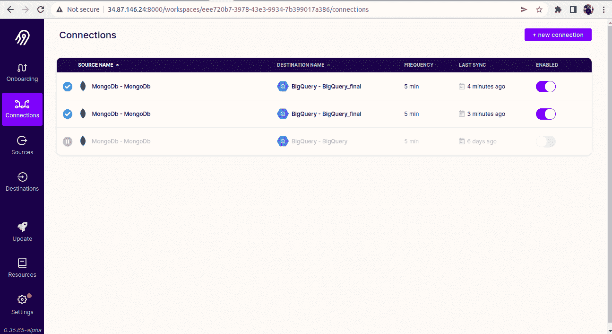

*图二。Airbyte 用户界面*

2.设置信号源

*   点击左侧窗格中的**信号源**，然后点击**新信号源。**

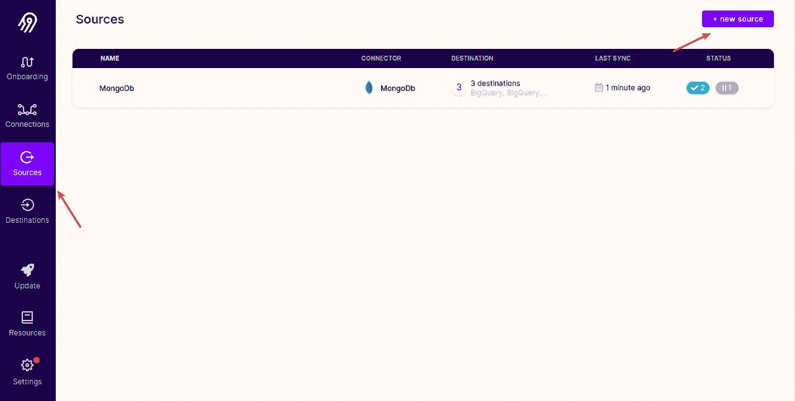

*图三。设置信号源*

*   填写所有详细信息并点击**设置源**。


*图 4。设置信号源*


*图 5。设置信号源*

3.设置目的地

*   设置目的地时，只需点击左侧窗格中的**目的地**，然后选择右上角的**新目的地**。

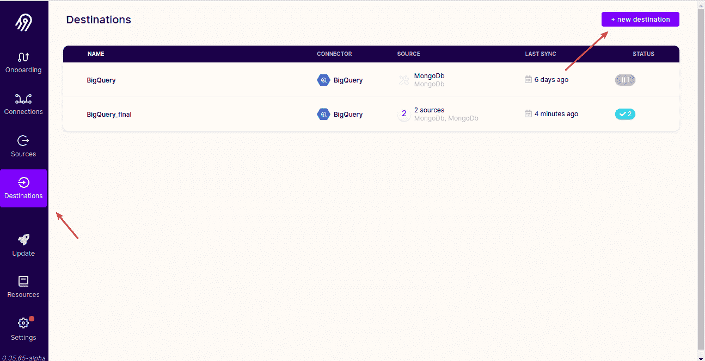

*图六。设置目的地*

*   填写所有细节。

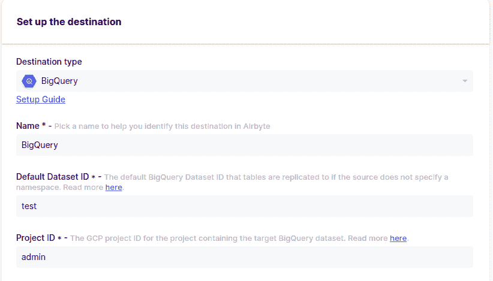

*图 7。设置目的地*

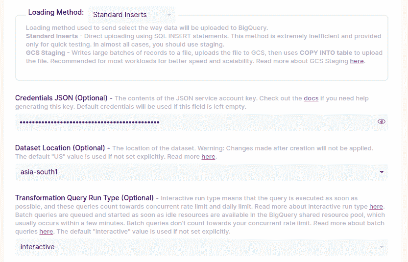

*图 8。设置目的地*


*图九。设置目的地*

4.设置连接。

*   点击左窗格**中的**连接**然后点击右上角的**新连接**。**

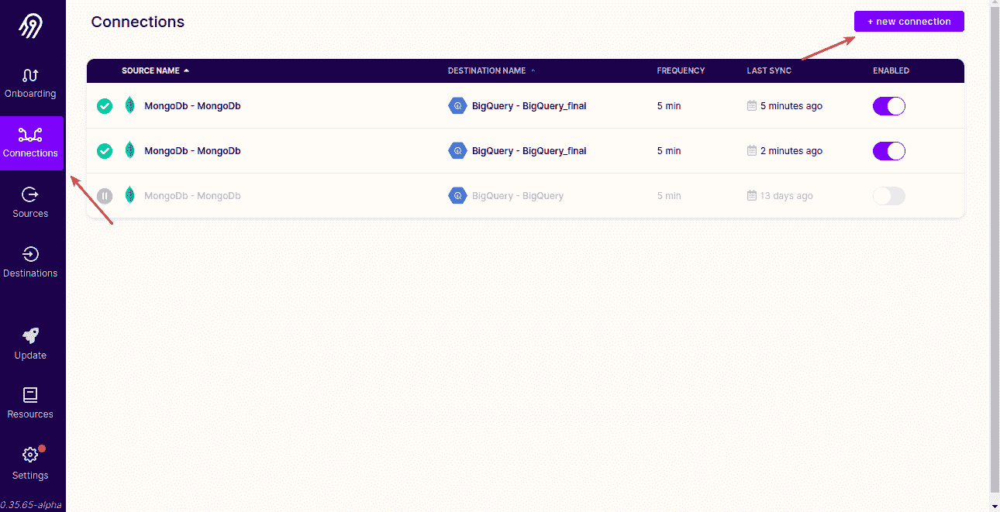

*图 10。设置连接*

*   选择您的**源**，并点击使用现有的源作为**目的地**。

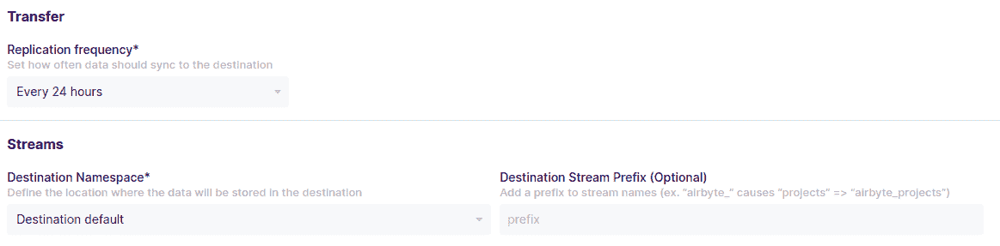

*图 11。设置连接*

*   选择同步模式、光标字段和主键。

**游标字段**:游标字段是用于从 MongoDB atlas 服务器获取增量数据的字段。

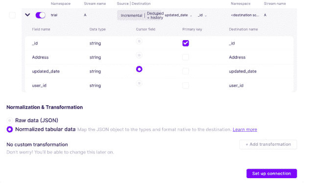

*图 12。设置连接*

*   最后在标准化和转换部分:我们使用**原始数据(JSON)** 模式作为我们的用例。

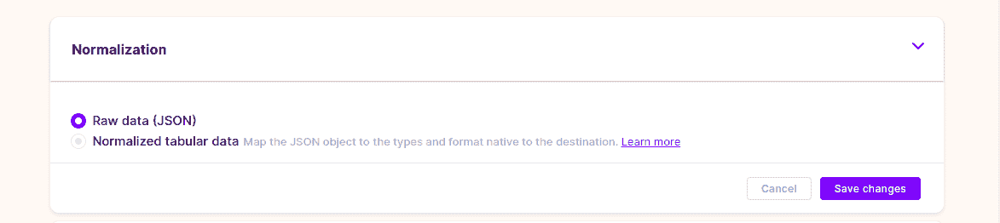

*图 13。建立连接(标准化方法)。*

5.点击**设置连接**。

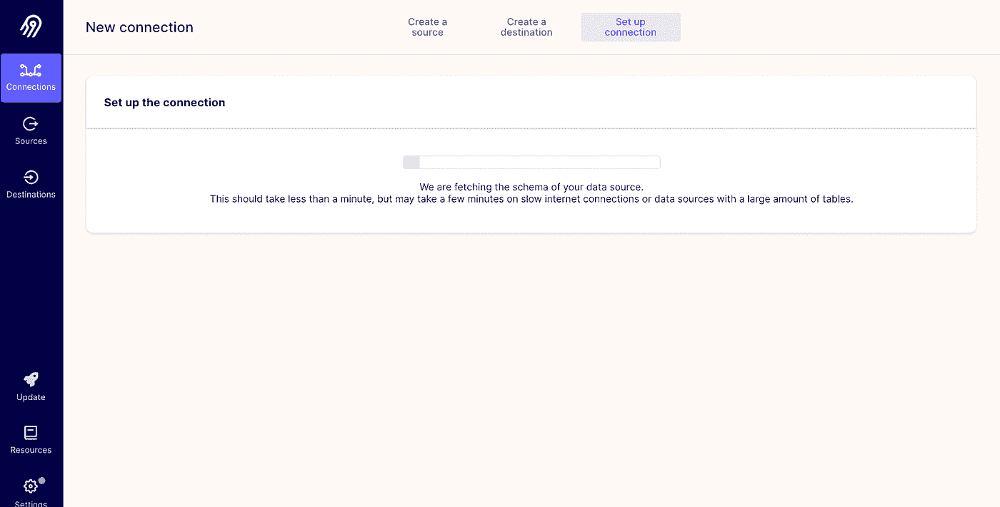

*图 14。设置连接*

*   现在 BigQuery 中有了原始数据:

_ **airbyte_ab_id，_airbyte_emitted_at** 是 airbyte 在将我们的数据推送到 BigQuery 时添加的列，_airbyte_data 是我们实际需要的数据。


*图 15。原始表*

# 自定义标准化和转换:

由于 Airbyte 可能会将数据推送到一个原始表中，我们将编写自己的**脚本，首先将原始数据**推送到一个规范化的表中，然后在稍后阶段，推送到一个包含所有合并数据的主表中。为了**最小化查询扫描**和**降低 BigQuery 端的成本**，我们将在 staging 和 final 表中维护**分区**。


*图十六。标准化和转换*

*   **规范化数据查询:**

规范化后，下面的查询将从原始表中提取数据，并将其推送到临时表中。对于这一步，我们将使用 **json extract()** 函数。

```
INSERT INTO *`*Demo.test.A_temp`
SELECT
json_extract(_airbyte_data, "$['_id']") as _id,
json_extract(_airbyte_data, "$['Address']") as Address,
json_extract(_airbyte_data, "$['created_at']") as created_at,
json_extract(_airbyte_data, "$['updated_date']") as updated_date,
json_extract(_airbyte_data, "$['user_id']") as user_id,
FROM
`Demo.test._airbyte_raw_A`
```

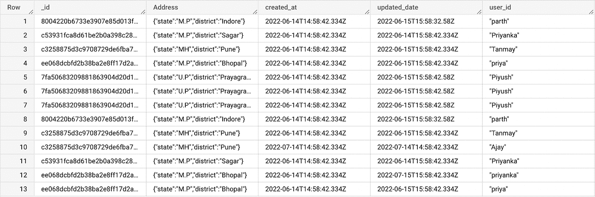

*图 17。暂存表*

*   **样本合并查询**

最后一步是运行合并查询，并将整个数据推送到最终的表中。在推送数据之前，我们可以检查重复的行，如果有，我们可以使用 **row_number()** 函数进行重复数据删除。此外，为了限制数据扫描，我们可以从 staging 表中获取最小和最大时间戳列值，并在合并查询中使用 **ON** 条件推送相同的值。这将有助于我们降低扫描成本，因为我们将只扫描最终表中所需的部分。

```
MERGE <target_table> [AS TARGET]
USING <table_source> [AS SOURCE]
ON <search_condition>
[WHEN MATCHED 
   THEN <merge_matched> ]
[WHEN NOT MATCHED [BY TARGET]
   THEN <merge_not_matched> ]
[WHEN NOT MATCHED BY SOURCE
   THEN <merge_matched> ];
```

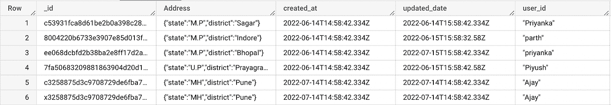

*图 18。最终表格*

# 设置增量管道:

*   这个方法分为两部分。

1.  **将数据从 MongoDB 同步到 BigQuery:** 这由 Airbyte 处理。Airbyte 只根据在 Airbyte 的 UI 中定义的光标字段检索新数据。
2.  **编写自己的查询将数据从原始表同步到最终表:** 如前所述，我们可以编写自己的查询并在 BigQuery 中使用 scheduled queries 选项对它们进行调度，以将所有数据从原始表同步到最终表。

在 BigQuery 中，我们可以使用**元表**概念来设置**增量负载**。

一个**元表**只是一个保存其他表的元数据的表。我们使用元表来存储最终表的最大值“updated_at”。此元数据信息由**规范化查询**使用，以仅返回“ **updated_at** ”值**大于元表中存储的**信息**的值。**

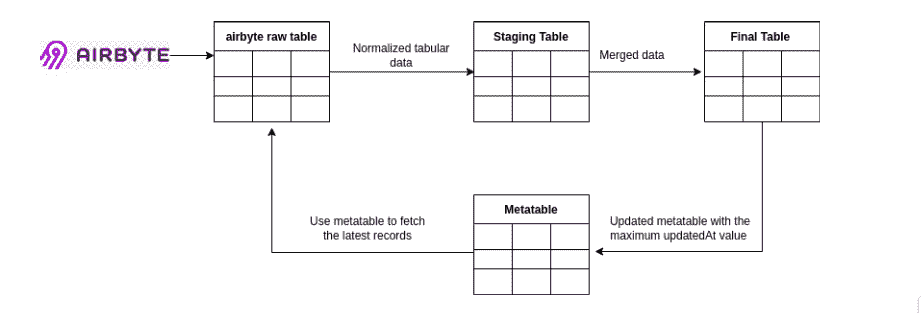

*图 19。正常化和转变*

# 元表更新查询示例:

```
UPDATE `test.metatable` SET max_updated_at = ( SELECT MAX(updated_date) FROM `Demo.test.final_A`) WHERE table_name='final_A'
```

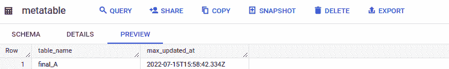

*图 20。元表*

# 使用 Airbyte 时发现的挑战:

*   添加新的列或表时，必须重新同步整个数据集。
*   Airbyte 不支持删除。
*   Airbyte 无法处理记录形式的复杂数据，例如，如果您有一个格式为: **{"Name":"jack "，" phno":xxxxxxx，" Address ":{ " full Name ":" jack Mathew "，" address line 1":"northern street "，" pincode":123432}}** 的地址列，在这种情况下，Airbyte 会使地址列**为空**
*   无法跳过历史加载，只能运行增量加载。

**结论:**
在这篇博客中，我们探讨了如何使用 Airbyte 将数据从 MongoDB Atlas 迁移到 BigQuery，并使用定制查询处理 Airbyte 原始表数据

非常感谢你阅读这个博客，快乐的 deployments☁️😄。

我要特别感谢 [Priyanka Raikwar](https://medium.com/u/55ed6b8ddc44?source=post_page-----28ec90d71236--------------------------------) 、 [Parth Gangrade](https://medium.com/u/7dcf7c11e818?source=post_page-----28ec90d71236--------------------------------) 、 [Tanmay Sakpal](https://medium.com/u/b35ae0f531c8?source=post_page-----28ec90d71236--------------------------------) 、 [Shreya Goel](https://medium.com/u/e59a962731f6?source=post_page-----28ec90d71236--------------------------------) 对我的贡献和激励我写这篇博客:)