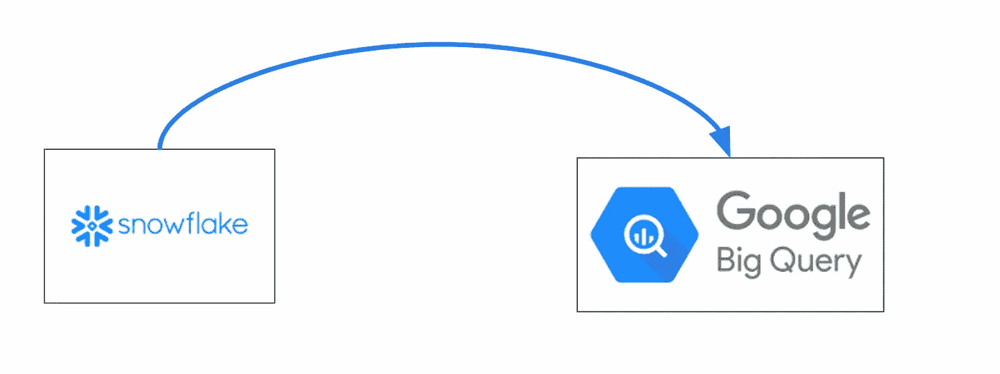
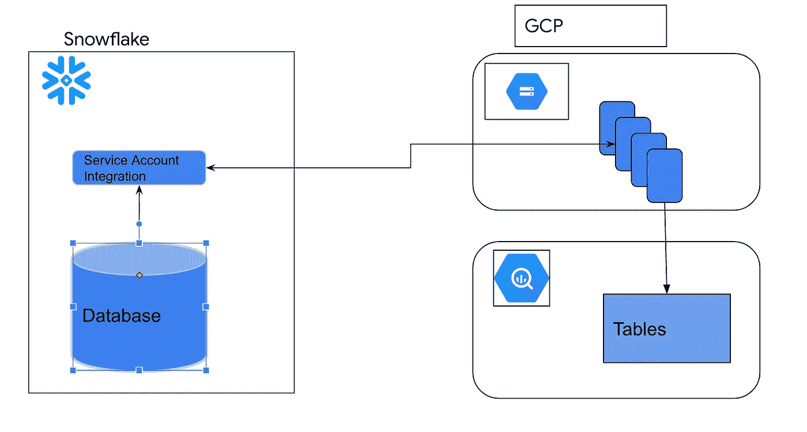
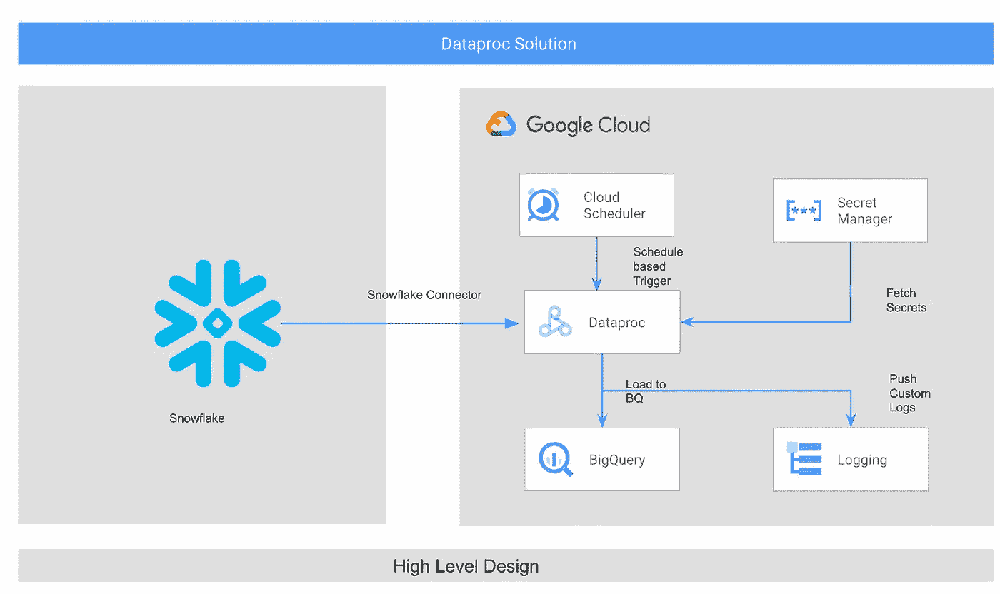
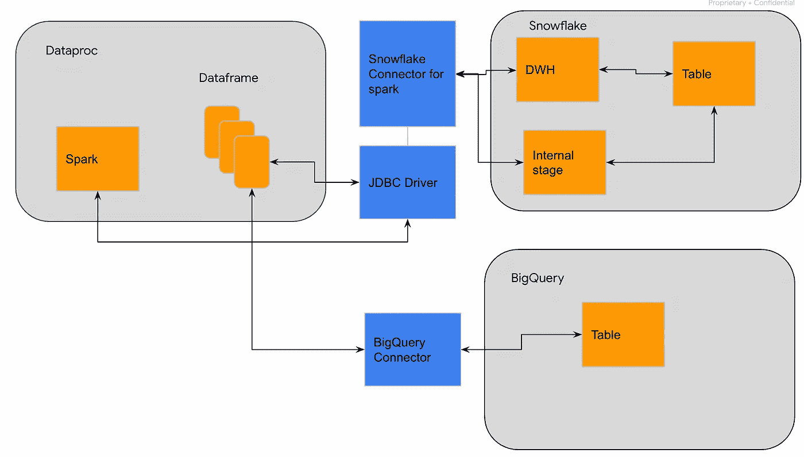
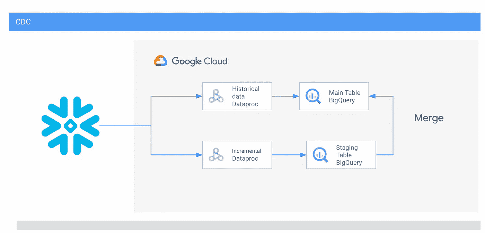

# 使用 GCP Dataproc 从雪花到 Bigquery 的数据迁移

> 原文：<https://medium.com/google-cloud/data-migration-from-snowflake-to-bigquery-using-gcp-dataproc-f10e88f4d51a?source=collection_archive---------2----------------------->

在本文中，我将讨论使用 Dataproc 上的 Spark 作为 ETL 处理引擎将数据从雪花迁移到 BigQuery。该博客涵盖了历史数据迁移的高级设计、增量批量复制以及使用 ETL 方法实现 CDC 的方法。

雪花到 BigQuery

雪花是一个全面管理的 SaaS 工具，为数据仓库解决方案提供了一个单一的平台。雪花是一个云原生工具，可以托管在 GCP、AWS 和 Azure 上。雪花在数据治理、工具、服务、sql 支持、连接、复制和数据共享方面提供了一系列丰富的功能。

# 使用外部阶段作为云存储迁移到 BQ 的通用方法

通过创建外部阶段进行数据迁移

雪花提供了从其他来源导入和导出数据的功能。将数据导出到其他接收器最常用的方法之一是创建外部阶段。雪花提供了在 AWS S3、Azure storage 和 Google 云存储上创建外部 stages 的选项。

对于与谷歌云存储的集成，雪花使用具有云存储权限的服务帐户进行身份验证，并将数据加载到 GCP 云存储桶的外部阶段。要在雪花上创建外部存储桶，用户必须是帐户管理员。一旦创建了外部阶段，数据就被直接复制到云存储中。雪花支持多种数据格式，如 csv、json、parquet、avro 等。

然后，可以使用 BQ 数据传输服务将写入云存储的数据加载到 BigQuery。该服务需要关于存储位置、BigQuery 数据集、BigQuery 表和写入模式(追加或覆盖)的输入。

尽管这种方法看起来简单且易于实现，但它的局限性很小。

1.  该方法可用于一次性迁移。如果需要定期复制，此方法对于自动执行定期复制没有用。
2.  为了使这种方法有效，数据用户必须是雪花帐户的所有者，因为它需要一个帐户管理员角色来创建外部存储。如果用户有一个雪花阅读器帐户，这种方法是不可行的。
3.  提取和加载管道是一种手动方法，依赖于 Snowflake 来导出数据。

# 使用 Dataproc 将数据从雪花迁移到 BigQuery

正在提出的 Dataproc 数据迁移方法将克服这些挑战，并提供对 ETL 管道的更多控制，消除对雪花的所有依赖。

组件:

1.  云调度程序—云调度程序是一个完全托管的企业级 cron 作业调度程序。Cloud scheduler 可以调度任何 Dataproc 批处理作业和基础设施操作。它能够监控作业，并在失败时执行自动重试。
2.  Secret Manager——Secret Manager 是一种安全便捷的服务，用于存储 API 密钥、密码、证书和其他敏感信息。
3.  data proc——data proc 是一个完全托管的、高度可伸缩的服务，用于运行 Apache Hadoop 和 Apache Spark 工作负载。
4.  GCP 数据仓库服务。这是一种用于存储和分析数据的无服务器服务。
5.  日志记录— GCP 日志记录服务，用于存储和检索监控日志。

架构流程

1.  要迁移的数据存储在雪花上。要连接到雪花帐户，需要以下参数-雪花帐户、雪花用户、雪花密码或私钥、数据库和表名称、数据仓库名称(可选)。
2.  Cloud Scheduler 在 Dataproc 无服务器批处理上提交定制的 Spark 应用程序。
3.  Spark 应用程序通过使用存储在 Secret Manager 上的雪花连接凭证来建立到雪花的连接。
4.  一旦连接建立，spark 引擎从 Snowflake 读取数据，并将数据存储在 Dataproc 集群的“内存存储”中。
5.  管道是一个“提取&加载”过程，假设不需要转换，spark 引擎可以直接将数据加载到 BigQuery。如果需要某些转换，如数据类型转换、时间戳转换，spark engine 可以转换数据。
6.  系统日志直接写入云日志。对于自定义日志，云日志代理用于移动日志。

# 内部工作

1.  火花引擎使用 JDBC 和雪花火花连接器建立到雪花的连接。
2.  Spark 引擎创建优化的逻辑计划、物理计划和 sql 查询计划。
3.  spark 的雪花连接器将 spark sql 查询计划转换为可执行查询，并将其提交给雪花上的一个数据仓库。
4.  查询结果被重定向到雪花上的一个内部阶段。
5.  spark 应用程序从内部阶段读取数据，并将结果存储为 spark 数据帧。
6.  使用 spark BigQuery 连接器将 spark 数据帧加载到 BigQuery。

# 批量更新和软删除的变更数据捕获

在将数据从雪花数据库增量复制到 BigQuery 的情况下，可能会出现对雪花数据库进行更新和删除的场景。为了保持 BigQuery 和 Snowflake 中的表同步，必须将更改复制到 BigQuery 表中。

雪花是一个 OLAP 数据库，在大多数情况下，它将是一个批量更新和软删除，也将有一个额外的表列来维护上次更新的时间戳。只有在这种情况下，才可以使用下面提到的方法。

批量更新和删除的步骤:

1.  每小时/每周/每月的增量数据被加载到分段表中。
2.  对临时表和主表执行合并操作。新的、更新的记录被向上插入到 BigQuery 表中。可以从 BigQuery 表中删除软删除的记录。

# 用于硬删除和原子更新的 CDC

对于无法跟踪更新和删除的情况，可以选择从雪花到 BigQuery 覆盖整个表。Dataproc 解决方案是可伸缩的，可以处理大量数据。

# 使用 Dataproc 的优势

1.  解决方案甚至可以用于雪花读者帐户。
2.  解决方案可用于从雪花到 BigQuery 的数据增量复制。
3.  使用 Dataproc 的 ETL 管道是一个独立的解决方案。它不依赖于雪花。
4.  该解决方案可以处理带有覆盖和合并操作的 CDC。