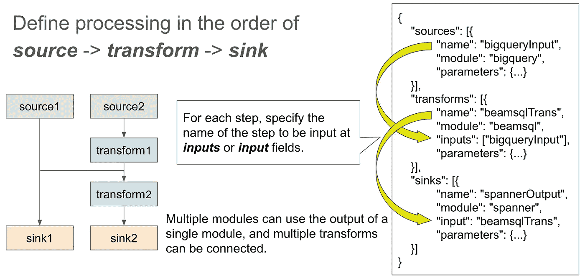
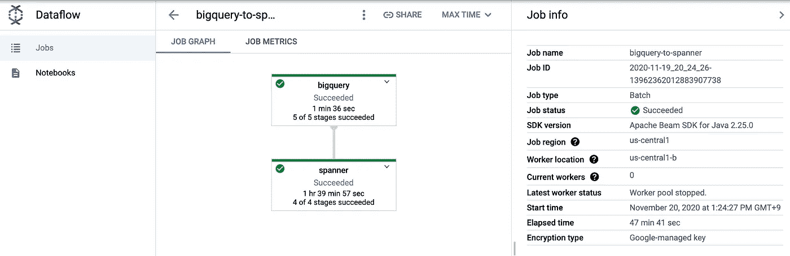
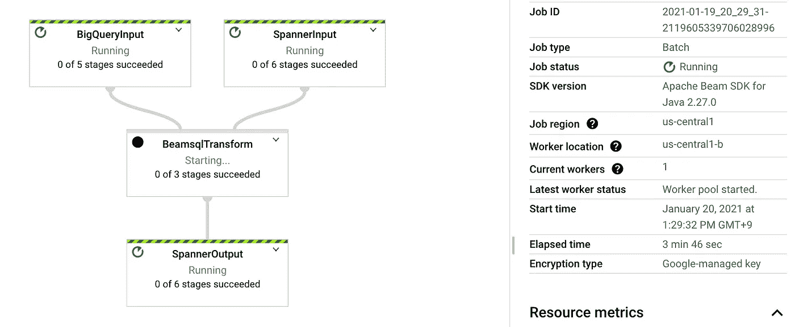
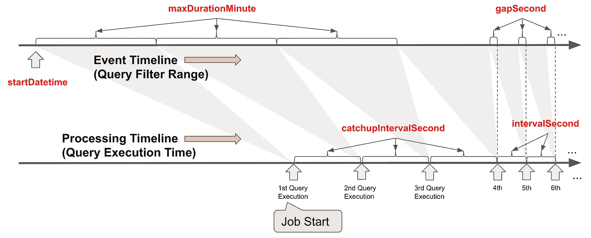
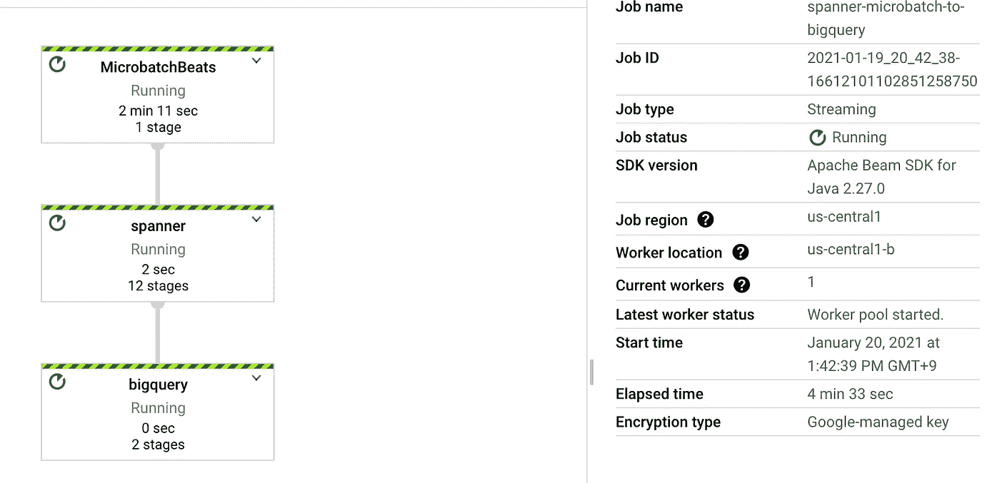

# 使用 Mercari 数据流模板使用云扳手进行数据操作

> 原文：<https://medium.com/google-cloud/data-operation-with-cloud-spanner-using-mercari-dataflow-template-dcc095e9a8f3?source=collection_archive---------0----------------------->

[Mercari data flow Template](https://github.com/mercari/DataflowTemplate)(MDT)是一款 OSS 工具，使用 GCP 的分布式数据处理服务[云 Dataflow](https://cloud.google.com/dataflow) 轻松处理数据。
它在 [Merpay，Inc.](https://www.merpay.com/) 中用于组合、处理和存储各种数据源之间的数据。
在本文中，我将介绍使用 MDT 向/从 Cloud Spanner 输入/输出和处理数据的例子。

# 如何使用 Mercari 数据流模板？

首先，您需要部署 MDT。之后，描述配置文件(称为管道文件)，该文件以 JSON 格式定义了您想要执行的流程。将该文件上传到 GCS，并使用 [gcloud 命令](https://cloud.google.com/sdk/gcloud/reference/dataflow/flex-template/run)或 [Dataflow 的 REST API](https://cloud.google.com/dataflow/docs/reference/rest/v1b3/projects.locations.templates/launch) 启动它。
在本节中，我们将向您展示如何使用 MDT 部署、定义和执行数据处理。(有关如何使用 MDT 的更多信息，请参考[文档](https://github.com/mercari/DataflowTemplate/tree/master/docs))

## 部署管道

首先，您需要从 [GitHub](https://github.com/mercari/DataflowTemplate) 存储库中克隆 MDT 代码，并使用以下命令部署它。(你需要安装 Java 11 和 maven 3)

```
mvn clean package -DskipTests -Dimage=gcr.io/{deploy_project}/{template_repo_name}
```

MDT 在云数据流中使用了一个名为 [FlexTemplate](https://cloud.google.com/dataflow/docs/guides/templates/using-flex-templates) 的特性，允许用户在不编写程序的情况下定义和执行数据处理。
使用上面的命令，MDT 管道代码将作为 Docker 映像打包并部署到您指定的云容器注册中心(GCR)。
此外，通过执行以下命令，用于从在 GCR 中注册的映像启动云数据流作业的模板文件将在 GCS 中注册。

```
gcloud dataflow flex-template build gs://{path/to/template_file} \
  --image "gcr.io/{deploy_project}/{template_repo_name}" \
  --sdk-language "JAVA"
```

这就完成了 MDT 的部署。接下来，我们将看到如何定义我们想要在 MDT 中执行的数据处理。

## 定义管道

如前所述，数据处理在 JSON 格式中被定义为管道文件。管道文件主要由源、转换和接收器组成。这些字段描述了定义数据读取源的源模块、定义如何处理输入的转换模块以及定义数据写入目的地的接收模块。

```
{
  "**sources**": [
    { 
      "name": "input1",
      "module": "bigquery",
      "parameters":    {...}
    },
    ...
  ],
  "**transforms**": [
    {
      "name": "trans1",
      "module": "beamsql",
      "inputs": ["input1"],
      "parameters": {...}
    },
    ...
  ],
  "**sinks**": [
    {
      "name": "output1",
      "module": "spanner",
      "input": "trans1",
      "parameters": {...}
    },
    ...
  ]
}
```

在源、转换和接收模块中， ***名称*** 和 ***模块*** 字段是必需的。 ***模块*** 字段指定流程的适当模块名称(可用模块列表见 [GitHub](https://github.com/mercari/DataflowTemplate/blob/master/docs/config/module/README.md) )。 ***名称*** 字段指定管道中步骤的名称，在管道文件中应该是唯一的。
每个转换步骤可以有几个*，从一个源或其他转换步骤获取数据，而接收器只接受一个 ***输入*** 。通过在输入或输入字段中指定要用作每个步骤的输入的步骤名称，可以将步骤链接在一起以创建管道。
在 ***参数*** 字段中，您可以指定针对每个模块的配置项。*

**

## *执行管道*

*使用以下 gcloud 命令，您可以从部署为 FlexTemplate 的 MDT 和您定义的管道文件启动云数据流作业。*

```
*gcloud dataflow flex-template run bigquery-to-spanner \
   --project=myproject \
   --region=us-central1 \
   --template-file-gcs-location=gs://example/template \
   --parameters=config=gs://example/pipeline.json*
```

*另一种启动作业的方法是直接调用 [REST API](https://cloud.google.com/dataflow/docs/reference/rest/v1b3/projects.locations.templates/launch) 。(gcloud 命令也使用 REST API)
如果要从云调度程序或程序中执行作业，可以使用 REST API。
以下是使用 curl 命令从 REST API 执行作业的示例。*

```
*PROJECT_ID=[PROJECT_ID]
REGION=us-central1curl -X POST -H "Content-Type: application/json"  -H "Authorization: Bearer $(gcloud auth print-access-token)" "https://dataflow.googleapis.com/v1b3/projects/${PROJECT_ID}/locations/${REGION}/templates:launch"`
   `"?dynamicTemplate.gcsPath=gs://example/template" -d "{
     'parameters': {
       'config': 'gs://example/pipeline.json'
     }
     'jobName':'myJobName',
   }"*
```

*#注意 gcloud 和 REST API 的[部署方法](https://github.com/mercari/DataflowTemplate/blob/master/docs/deploy/README.md)略有不同。*

# *基于 MDT 的云扳手数据操作*

*在本节中，我将介绍使用 MDT 向 Cloud Spanner 实际输入/输出数据并对其进行处理的示例。*

## *1.将 BigQuery 查询结果插入云扳手*

*让我们从一个将 BigQuery 的查询结果插入 Spanner 的简单例子开始。
首先如下图定义管道文件，上传到 GCS(谷歌云存储)。
在管道文件中， ***bigquery*** 被指定为数据源， ***扳手*** 被指定为目的地。*

```
*{
  "sources": [
     {
       "name": "bigqueryInput",
       "module": "**bigquery**",
       "parameters": {
         "query": "SELECT * FROM `myproject.mydataset.mytable`"
       }
     }
   ],
   "sinks": [
     {
       "name": "spannerOutput",
       "module": "**spanner**",
       "input": "bigqueryInput",
       "parameters": {
         "projectId": "myproject",
         "instanceId": "myinstance",
         "databaseId": "mydatabase",
         "table": "mytable"
       }
     }
   ]
 }*
```

*接下来，执行以下命令。
(假设您已经将 MDT 部署到***GS://example/template***，并将管道文件保存到***GS://example/pipeline . JSON***)*

```
*gcloud dataflow flex-template run bigquery-to-spanner \
   --project=myproject \
   --template-file-gcs-location=gs://example/template \
   --parameters=config=gs://example/pipeline.json*
```

*过了一会儿，数据流作业应该启动，流程按照管道文件中的定义执行。*

**

## *2.将云扳手查询结果插入 BigQuery*

*与前一个例子相反，这里有一个将 Spanner 的查询结果插入 BigQuery 的例子。
可以看到， ***bigquery*** 被交换为汇， ***扳手*** 为源。*

```
*{
  "sources": [
    {
      "name": "spanner",
      "module": "spanner",
      "parameters": {
        "projectId": "myproject",
        "instanceId": "myinstance",
        "databaseId": "mydatabase",
        "query": "SELECT * FROM mytable"
      }
    }
  ],
  "sinks": [
    {
      "name": "bigquery",
      "module": "bigquery",
      "input": "spanner",
      "parameters": {
        "table": "myproject.mydataset.mytable",
        "createDisposition": "CREATE_IF_NEEDED",
        "writeDisposition": "WRITE_TRUNCATE"
      }
    }
  ]
}*
```

*作业执行方法与前面的示例相同。*

## *3.用 SQL 结合不同资源的数据*

*在前面的例子中，我们只是简单地移动了数据，但是您也可以使用 [Beam SQL](https://beam.apache.org/documentation/dsls/sql/overview/) 来执行 SQL 连接和处理数据。
以下管道文件示例使用 SQL 将扳手表与 BigQuery 的查询结果连接起来，并将结果存储在另一个扳手表中。
在这个例子中，除了源模块和接收模块之外， ***beamsql*** 被指定为转换模块来处理 sql 中的数据。
在转换模块中，在 ***输入*** 中指定你想要处理的数据的名称。用 ***sql*** 参数指定要处理的 SQL。表名可以通过输入中指定的名称来引用。*

```
*{
   "sources": [
     {
       "name": "**BigQueryInput**",
       "module": "bigquery",
       "parameters": {
         "query": "SELECT BField1, BField2 FROM `myproject.mydataset.mytable`"
       }
     },
     {
       "name": "**SpannerInput**",
       "module": "spanner",
       "parameters": {
         "projectId": "myproject",
         "instanceId": "myinstance",
         "databaseId": "mydatabase",
         "table": "mytable",
         "fields": ["SField1","SField2"]
       }
     }
   ],
   "**transforms**": [
     {
       "name": "BeamsqlTransform",
       "module": "**beamsql**",
       "**inputs**": [
         "**BigQueryInput**",
         "**SpannerInput**"
       ],
       "parameters": {
         "**sql**": "**SELECT BigQueryInput.BField1 AS Field1, IF(BigQueryInput.BField2 IS NULL, SpannerInput.SField2, BigQueryInput.BField2) AS Field2 FROM BigQueryInput LEFT JOIN SpannerInput ON BigQueryInput.BField1 = SpannerInput.SField1**"
       }
     }
   ],
   "sinks": [
     {
       "name": "SpannerOutput",
       "module": "spanner",
       "input": "BeamsqlTransform",
       "parameters": {
         "projectId": "anotherproject",
         "instanceId": "anotherinstance",
         "databaseId": "anotherdatabase",
         "table": "anothertable"
       }
     }
   ]
 }*
```

*如果您运行与上一个示例相同的命令，将会启动以下数据流作业。*

**

## *4.从 Spanner 加载数据，并以微批处理方式保存到 BigQuery*

*在某些情况下，您可能想要接近实时地使用来自 Spanner 的最新数据。MDT 支持通过微批处理执行查询从 Spanner 获取数据。
以下配置是一个微批处理的示例，该微批处理定期执行一个查询，以指定的频率扳手来检索数据并将其插入到 BigQuery 中。*

```
*{
  "sources": [
    {
      "name": "spanner",
      "module": "spanner",
      "**microbatch**": ***true***,
      "parameters": {
        "projectId": "myproject",
        "instanceId": "myinstance",
        "databaseId": "mydatabase",
        "query": "SELECT * FROM MyTable@{FORCE_INDEX=MyTableCreatedAtDesc} WHERE ShardCreatedAt = 1 AND CreatedAt >= TIMESTAMP_SECONDS(**${__EVENT_EPOCH_SECOND_PRE__}**) AND CreatedAt < TIMESTAMP_SECONDS(**${__EVENT_EPOCH_SECOND__}**)",
        "**startDatetime**": "2021-01-01T00:00:00Z",
        "**intervalSecond**": 60,
        "**gapSecond**": 30,
        "**maxDurationMinute**": 60,
        "**catchupIntervalSecond**": 60
      }
    }
  ],
  "sinks": [
    {
      "name": "bigquery",
      "module": "bigquery",
      "input": "spanner",
      "parameters": {
        "table": "myproject:mydataset.mytable",
        "createDisposition": "CREATE_IF_NEEDED",
        "writeDisposition": "WRITE_APPEND"
      }
    }
  ]
}*
```

*为了在微批次中运行扳手查询，在扳手源模块中将 ***微批次*** 参数设置为真。
在上面的例子中，对 Spanner 的查询是为微批处理执行准备的。
在微批处理执行的查询中，使用名为**_ _ EVENT _ EPOCH _ SECOND _ PRE _ _**和 **__EVENT_EPOCH_SECOND__** 的变量指定过滤条件。这些变量将根据配置中指定的频率和间隔在查询执行时嵌入。
查询执行的频率和间隔由 ***startDatetime、******intervalSecond***、 ***gapSecond*** 、***maxDurationMinute***、***catchupIntervalSecond***等参数指定。这些参数与查询执行时间和过滤条件的关系如下图所示。
(关于微批处理执行的详细说明，参见 [GitHub](https://github.com/mercari/DataflowTemplate/blob/master/docs/config/module/source/microbatch.md) 。)*

**

*要在微批处理中运行管道，请在流模式下使用如下所示的流参数运行数据流。*

```
*gcloud dataflow flex-template run spanner-microbatch-to-bigquery \
   --project=myproject \
   --region=us-central1 \
   --template-file-gcs-location=gs://example/template \
   --parameters=config=gs://example/pipeline.json \
   **--****parameters=streaming=true***
```

**

***正如本文所介绍的，使用 MDT，您可以将想要执行的数据处理定义为管道文件，并在云数据流中执行。
其他管道文件的例子可以在 [GitHub](https://github.com/mercari/DataflowTemplate/tree/master/examples) 上找到，所以如果你有兴趣，请找一个和你想做的数据处理类似的文件。
MDT 还是一个刚刚发布的开发中的 OSS。如果您发现任何错误、功能请求或问题，请随时在 [GitHub](https://github.com/mercari/DataflowTemplate) 上告诉我们。***