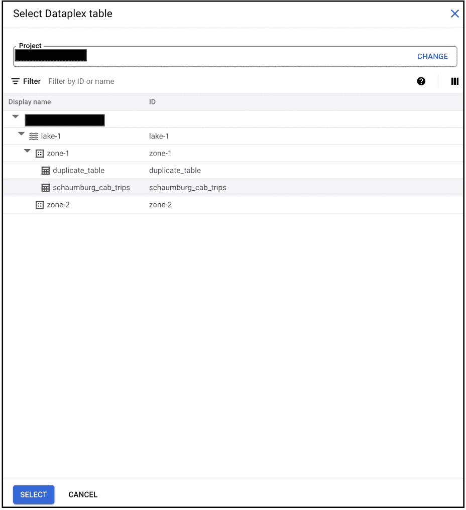

# 在 GCP 使用 Dataplex 进行数据剖析

> 原文：<https://medium.com/google-cloud/data-profiling-using-dataplex-in-gcp-dcca8f7063ec?source=collection_archive---------3----------------------->

*照片由* [*奥斯登上*](https://unsplash.com/photos/744oGeqpxPQ)

D 数据分析是检查、分析、审查和汇总数据集以深入了解数据的过程。数据分析有助于您发现和了解数据的细节，如源数据的结构、质量和内容。它提供了对信息的重要见解，用户或组织可以利用这些信息进行快速决策和分析。

# Dataplex 数据配置文件

通过利用 Dataplex 的数据概要特性，数据用户现在可以很容易地了解他们在 GCP 的数据的共同特征。您可以通过配置和安排对数据的检查来分析 Dataplex 管理的数据的概要。它可以识别常见的统计特征，如空值百分比、唯一百分比或数据的分布特征。

数据分析扫描与一个 BigQuery 表相关联，并扫描该表以生成分析结果。扫描结果可作为每次扫描执行的一部分。

图片来自[谷歌文档](https://cloud.google.com/dataplex/docs/data-profiling-overview)

**请注意，Dataplex 数据分析目前处于公开预览阶段，功能集有限*。*

# 创建数据配置文件扫描的演示

按照下面的简单步骤扫描您在 GCP 的第一个 Bigquery 表。

# 第一步

在 Dataplex 中，您会发现一个新的链接作为概要文件(预览)。您可以通过单击创建新的数据配置文件扫描

# 第二步

输入所有必需的详细信息，如显示名称、id 等，如下所示

# 第三步

选择要扫描的表格。要扫描的 BigQuery 表必须是 Dataplex lake 的一部分。

# 第四步

将范围选择为“整个数据”或“增量”。您可以选择“重复”或“按需”计划选项。数据分析可以按计划运行，以查看更新的数据，从而获得最新的配置文件信息。

# 第五步

一旦您点击“创建”按钮，您的配置文件扫描将创建如下所示

单击作业名称，您可以找到您的配置文件作业的所有详细信息，如表名、计划时间等

# 第六步

您的扫描将在预定时间开始，状态显示为“正在运行”。完成后，状态将变为“成功”,您可以看到作业的详细信息和扫描结果。

# 数据分析结果

基于你的数据，你会发现有趣且有用的结果。这些信息加快了分析和决策的速度。例如，本次扫描中获取的数据集是出租车出行数据，其中包含公司名称、费用、付款类型等字段，以下是一些观察结果。

**观察 1** :整个数据集有 3 家公司数据，以 *303 出租车*为首。

**观察 2** -票价分布，最低为 0.01，最高为 107.6

**观察 3** - 82.3%的付款是用现金支付的。

**观察结果 4** -其他统计计算，如平均出行里程为 3.8 英里等。

# 总结:

数据配置文件对于理解您的源数据非常有用，并且可以更有效地分析数据。Dataplex 数据分析允许您识别 BigQuery 表的列的公共统计特征。

有关该功能的更多详细信息和最新更新，请参考[谷歌文档](https://cloud.google.com/dataplex/docs/data-profiling-overview)。