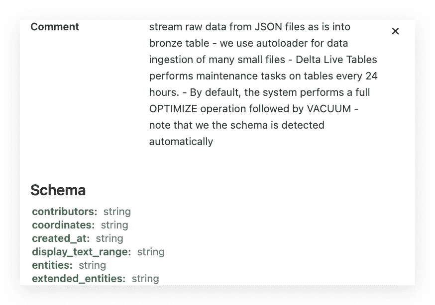
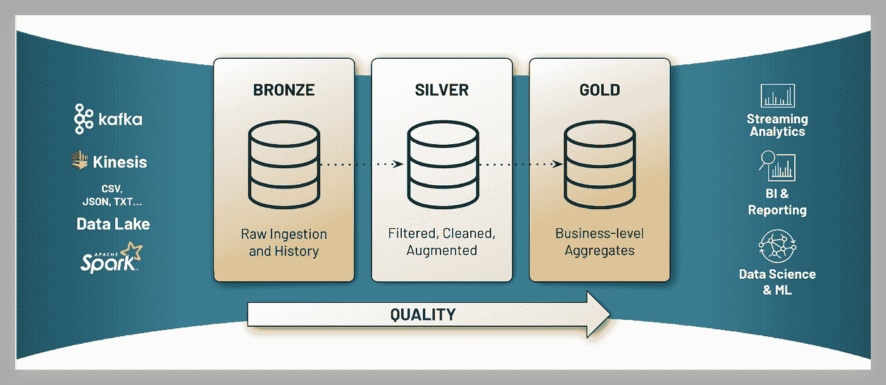
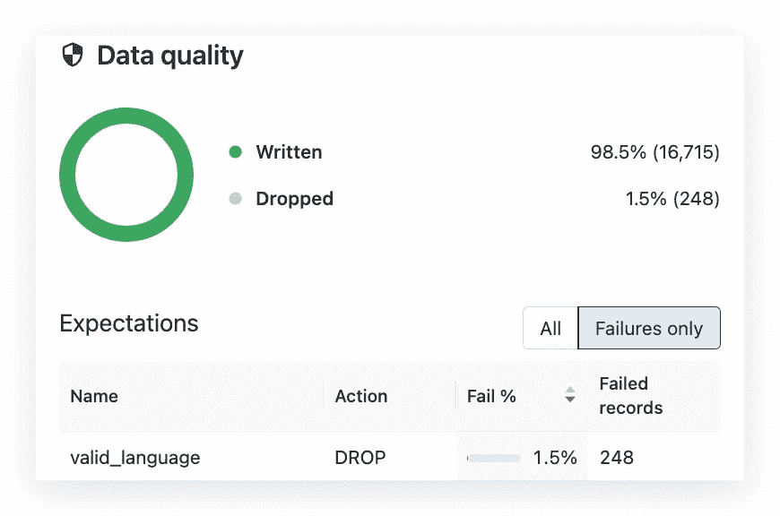

# 湖边小屋的数据质量

> 原文：<https://medium.com/google-cloud/data-quality-in-the-lakehouse-9a0bb7dc6023?source=collection_archive---------0----------------------->

## 数据工程是关于数据质量管理的

我那篇关于 GCP 数据砖湖畔小屋的文章比我想象的还要成功。这是另一篇关于数据质量的更概念性的文章，适用于任何云上的 Databricks Lakehouse。

现代数据工程的主要目标是提取质量足以满足下游分析和人工智能的数据。数据工程师的角色是构建和运行创造高保真数据产品的机器——从摄取到货币化的整个过程。数据质量和[湖畔小屋](https://databricks.com/blog/2021/08/30/frequently-asked-questions-about-the-data-lakehouse.html)深深交织在一起。在 Lakehouse 中，数据质量在不同的级别上实现:

*   在**技术层面**，通过实施和发展数据存储模式(如[增量表](https://docs.databricks.com/delta/index.html)模式实施和模式发展)和接收模式(如[自动加载器](https://docs.databricks.com/spark/latest/structured-streaming/auto-loader.html)模式检测)来保证数据质量。

*   在**架构层面**，数据质量通常通过实现 medallion 架构来实现。medallion 架构是一种数据设计模式，用于在 [lakehouse](https://databricks.com/glossary/data-lakehouse) 中对数据进行逻辑组织，其目标是在数据流经架构的每一层时，逐步提高数据的结构和质量，例如从铜层表到银层表再到金层表。

数据砖奖章建筑

*   medallion 架构中的数据流管道可以使用期望来加强和观察数据质量。

*   **由 Databricks Unity Catalog 实施的数据治理**提供了强大的数据质量管理，内置质量控制、测试、监控和实施，以确保下游 BI、分析和机器学习工作负载可以获得准确而有用的数据。

如果你喜欢这篇文章，请在 Medium 上关注我，并为它鼓掌。如果你喜欢更多基于云的数据科学、数据工程和 AI/ML，请随时关注我的[***Twitter***](https://twitter.com/frankmunz)***(或***[***LinkedIn***](https://www.linkedin.com/in/frankmunz/)***)。***