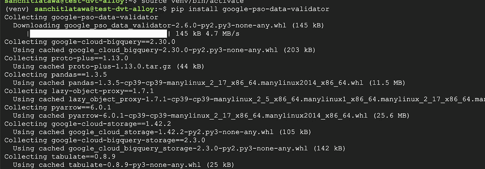
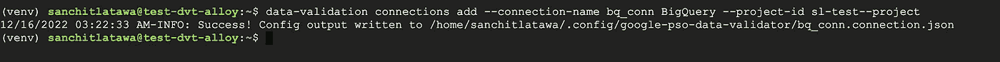
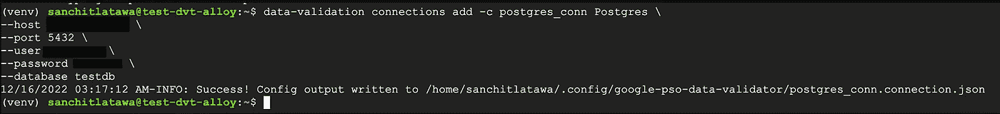
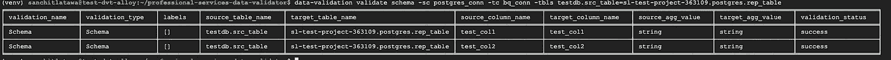

# 数据验证变得简单易用—数据验证工具(DVT)

> 原文：<https://medium.com/google-cloud/data-validation-made-easy-using-data-validation-tool-dvt-bbf33a9b75c3?source=collection_archive---------4----------------------->

将数据从一个源移动到另一个源可能非常耗时，此外，开发人员将花费时间编写协调工具来验证数据传输，这使得数据迁移过程更加耗时且容易出错。去年，Google Cloud [发布了](https://cloud.google.com/blog/products/databases/automate-data-validation-with-dvt) DVT 作为开源 Python CLI 工具，它可以跨多个数据库自动执行验证检查。

**本博客的目标**是在不到 10 分钟的时间内设置 DVT 并让您运行第一个数据验证任务。对于这个博客，我们将比较 Postgres 和 BQ 系统的数据，但 DVT 支持多个数据库，你可以在这里看到完整的支持列表。

步骤 DVT 的安装

先决条件-在您的系统上运行 python3.7+和 gcc。

如果您不满足先决条件，那么请按照这里的详细说明[安装这些。](https://github.com/GoogleCloudPlatform/professional-services-data-validator/blob/develop/docs/installation.md)

前面的步骤都完成了，现在让我们进入下一步

```
pip install google-pso-data-validator
```



步骤 2 —设置 DVT 连接—为了让 DVT 能够与您的数据库对话，我们需要传递连接详细信息，同样在您的数据库端，确保您已经将运行 DVT 的机器的 IP 列入白名单

**设置 BQ 连接**

```
data-validation connections add --connection-name bq_conn \
BigQuery --project-id data-poc-1234
```



[请注意:我在托管 BQ 数据集的同一个项目中的 GCE 上运行 DVT

**设置 Postgres 连接**

```
data-validation connections add -c postgres_conn Postgres \
--host "XX.X.XXX.X" \
--port 5432 \
--user XXX \
--password XXXX \
--database testdb
```



本页[这里](https://github.com/GoogleCloudPlatform/professional-services-data-validator/blob/develop/docs/connections.md)有更多关于连接其他数据库的细节。

第 3 步——所有设置我们已经准备好跨 BQ 和 Postgres 系统比较表，请注意 DVT 支持多种比较方式——行、列，还允许传递源和目标比较的自定义查询，这超出了本博客的范围。这里，我们将在我在 Postgres 和 BQ 上设置的表之间运行一个模式验证任务

```
data-validation validate schema -sc postgres_conn -tc bq_conn -tbls testdb.src_table=sl-test-project-363109.postgres.rep_table
```

在上面的命令中，我们传递了在步骤 2 中创建的连接，并尝试将 Postgres 'src_table '中的源表与 BQ 'rep_table '中的下游复制表进行比较。



DVT 的标准输出打印在终端上，但也可以直接输出到 BQ，您可以在那里转储您的结果。从屏幕截图中可以看到，DVT 已经在不同数据库的两个表之间进行了比较，并在屏幕上输出了汇总报告

**在结论**中，我们已经安装了 DVT，并从命令行运行了我们的第一个数据验证作业。