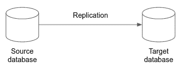
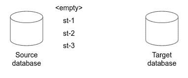
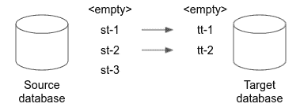

# 数据库迁移和复制:关于一致性

> 原文：<https://medium.com/google-cloud/database-migration-and-replication-on-consistency-b167b44a1061?source=collection_archive---------1----------------------->

## 记住关键的复制原则

**TL；dr** 在许多情况下，数据一致性是数据库迁移或复制的关键要求:如果不能保证一致性，目标数据库(的内容)可能与源数据库(的内容)不一致。这篇博客从数据一致性的角度从概念上讨论了数据迁移和复制，独立于任何特定的数据库迁移或复制系统或技术，也独立于任何非功能方面，如吞吐量或延迟。

# 数据库复制一致性的定义

数据库复制最简单的形式是将所有数据从源数据库连续复制到目标数据库:

基本复制

为了讨论的清晰，这个博客集中在一个复制方向上的单个源和目标数据库。没有讨论其他情况，如用于回退的反向复制、数据分割、数据合并、数据过滤或 n:m 复制；基本原则也适用于这些情况。

数据库复制和数据库迁移之间的区别将在下面的“数据库复制与数据库迁移”一节中单独讨论。

# 数据库一致性

数据库一致性可以基于事务来定义。源数据库在其初始的空状态下是一致的，然后在每个成功提交的事务之后也是一致的。下图用“st”表示源事务，编号是提交 1、2 和 3 的顺序。未来可能会有额外的交易，目前有 3 个提交的交易。

源数据库事务

源事务根据源数据库中实现的事务序列化和提交协议(ACID 属性)进行线性化。

即使在源事务执行期间，不同源事务的语句是交错的，源数据库也建立了线性提交顺序(并且在某些情况下，建立了提交树来说明并发和独立的提交事务，为了简单起见，这里将其抽象出来，因为它不改变下面的讨论)。给定任意两个事务，一旦它们被提交，它们在源数据库中的执行顺序是已知的，即使它们的执行可能是并发的和交错的。

源数据库中源事务的线性顺序非常重要，因为每个提交的事务都建立了一致的状态。源事务的这一顺序稍后将被复制到目标数据库中，以建立相同的一致状态。

# 数据库复制一致性

数据库复制一致性可以定义在线性源数据库事务顺序的等价性上。在以下情况下，目标数据库与源数据库一致

1.  目标数据库为空
2.  目标数据库有一些(但不是全部)等价的源事务，从第一个源事务开始，以相同的顺序执行一次
3.  目标数据库拥有源数据库的所有等价事务，每个事务从第一个源事务开始，以相同的顺序执行一次

“恰好一次”断言没有源事务被遗漏，或者在目标数据库中被执行两次(或更多次)。

下图显示了情况 2。每个源事务被表示为一个目标数据库事务，标记为“tt ”,上面的数字建立了对应关系和顺序。

将源数据库事务作为独立事务应用到目标数据库

目标数据库将前两个源事务作为两个目标事务执行。第三个源事务尚未在目标数据库中执行。目标数据库在其之前的某个时间点上与源数据库一致，这意味着它落后了—在本例中落后了一个事务—但具有过去的一致状态。

如果根据源事务执行顺序，源数据库和目标数据库在任何时候都是一致的，那么数据库复制就是一致的。

**注**:上述一致性定义允许延迟(步骤 2)。如果可以提交源事务，并且这些事务稍后在目标数据库上作为目标数据库事务执行，则这种延迟是可能的。“稍后”基本上是指一种异步复制协议，它在提交源事务后复制它们。同步复制协议将确保目标事务与相应的源事务一起提交。在同步复制协议中，上述步骤 2 不适用。

在下文中，讨论集中在异步复制上，因为当涉及没有作为本地数据库技术实现的数据库复制技术时，这是主要的方法。

实现异步复制的数据库复制技术有时会将单个语句应用于目标数据库，而不是事务。这种方法将在“系统架构方面”一节中讨论。

# 事务复制和执行

到目前为止，我还没有讨论交易的两个方面，但是这两个方面也很重要:

1.  **交易内报表**。事务是像查询、插入、更新和删除这样的一系列语句。它们在源数据库中的执行顺序也必须保留在目标数据库中，因为几个语句可以修改相同的数据。与对应的源事务相比，目标事务中不同的语句顺序可能会导致不同的数据值，从而破坏一致性。
2.  **查询**。只有事务中的修改语句是相关的:插入、更新和删除(以及它们的顺序)。查询(读取)可以省去。这意味着，如果源事务包含查询语句，则不必在目标数据库中执行这些语句。如果源事务是从源数据库事务日志中获得的，那么这些事务可能不再包含查询。

每个源数据库事务都必须复制为相应的目标数据库事务:

*   交易中语句的相同顺序
*   可选地省略查询(如果还没有从源事务中移除)

每个复制的目标数据库事务必须按照与其对应的源事务相同的顺序执行一次。

# 关键复制公理

为了确保目标数据库始终与源数据库一致，在复制过程中的任何时候都必须遵循以下复制原则:

*   **完整性**。从第一个事务开始的完整的源数据库事务集必须作为目标数据库中相应的目标事务来执行。Complete 还意味着没有事务被遗漏，并且源数据库和目标数据库都是从空状态开始的。
*   **恰好一次**。每个源事务在目标数据库中作为相应的目标事务执行一次。恰好一次意味着没有重复的事务执行。
*   **下令**。目标事务的执行顺序与其对应的源事务完全相同。这意味着目标事务提交顺序相对于对应的源事务提交顺序没有变化。
*   **孤立的**。目标数据库必须与任何其他可能的更改隔离开来，与源事务相对应的更改除外。如果目标数据库的模式或表集完全独立于那些作为源数据库副本的表，那么它们的并发修改是可能的。根据定义，这些独立的模式和表是隔离的。

实际上，这意味着为了让目标数据库始终与源数据库保持一致(在上面的定义中),任何迁移或复制技术都必须遵守处理原则。

# 错误语义和行为

数据库复制通常由独立的复制系统实现，该复制系统可以从源数据库获得源数据库事务，并在目标数据库中执行等效的目标数据库事务。因此，一个复制系统与两个数据库都有接口，并且必须遵守刚才概述的复制原则。

这同样适用于内置于数据库引擎技术本身的复制技术。在下文中，这包含在复制技术的概念中。

数据库复制系统是第三个独立的系统，主要有三种故障情况:

*   对源数据库系统的访问失败(可能是 API 调用错误，或者源数据库文件系统损坏等原因)
*   访问目标数据库系统失败
*   复制系统本身出现故障

如果出现故障，复制系统有两种选择

*   从失败中恢复并继续处理，确保不违反任何复制原则。这只有在复制系统精确跟踪复制进程以确保在所有可能的失败情况下都支持复制公理的情况下才是可能的。
*   从空的目标数据库开始重新启动，并从第一个源事务开始执行与源事务相对应的目标事务。如果复制系统不能确保复制公理得到维护并且不被违反，这是一个安全的选择。

例如，目标数据库事务可能会中止。在这种情况下，在以适当的顺序执行下一个目标事务之前，复制系统必须重试该事务，直到成功为止。目标事务可能永远不会成功。为了防止无休止的重试尝试，通常会设置一个上限，如果达到该上限，复制过程将完全停止。在错误情况得到解决之前，不会执行进一步的目标事务。

另一个例子是复制系统本身可能会出现故障并重新启动。在这种情况下，重启后，迁移系统必须建立其最后的一致状态以及整个复制的一致状态。它必须确定已经获取了哪些源事务，执行了哪些目标事务，并在不违反复制原则的情况下继续处理。如果复制系统无法建立一致的状态，它必须从第一个源事务和一个空的目标数据库重新开始。

# 数据库复制与数据库迁移

数据库复制和迁移在意图上有所不同。数据库复制的目的是一个持续的、原则上永无止境的过程——“永远”。一次开始，数据库复制将源数据库复制到目标数据库，没有预先定义复制过程的结束。

相反，数据库迁移有着不同的目的。其目的是建立一个临时的过程，将源数据库复制到目标数据库，最终关闭源数据库。另一个方面是，在关闭源数据库之前，目标数据库包含与源数据库完全相同的状态，因此没有数据丢失。

原则上，数据库迁移是数据库复制的受控结论。基于这种差异，数据库迁移可以从数据库复制的角度定义如下:

*   遵循复制原则，不断地将源数据库复制到目标数据库
*   停止对源数据库的任何更改
*   按照复制原则，等到所有源事务都作为目标事务应用到目标数据库中
*   关闭源数据库

# 系统架构方面

已经实现了许多数据库复制和迁移系统、产品以及自行开发的机制。下面简要讨论一些选定的方面。

# 警告

在下文中，我将讨论一些注意事项，如果一致性是您的主要关注点，您可能需要注意这些事项:

*   **语句复制**。一些复制系统不在目标数据库中执行与源事务相对应的目标事务。相反，它们为每个源语句(！idspnonenote)插入一个目标事务。)的源事务。因此，如果源事务有 5 个 DML 语句，那么目标数据库中就会有 5 个事务。这导致了持续的不一致，因为目标数据库是不一致的，除非且仅当事务的最后一个语句被提交时。
*   **没有订购**。一些系统不保证目标事务的顺序对应于等效源转换的顺序。因为违反了复制公理，所以不能保证目标数据库是一致的。
*   **不完全一次或至少一次**。一些系统声明重复的目标事务是可能的。由于违反了复制公理，目标数据库可能会拒绝事务，或者导致数据不一致。
*   **不保证完整性**。一些系统不保证完整性，一些源事务可能不会以等价的目标数据库事务的形式在目标数据库中执行。因为这违反了复制原则，所以不一致的目标数据库是可能的。
*   **错误不会停止系统**。一些系统在遇到错误时不会停止，而是写入一个日志条目，并继续下一个目标事务。由于完整性被破坏，目标数据库可能会变得不一致。
*   **死信队列**。一些系统基于排队系统实现复制功能。可能存在包含所有失败事务的死信队列。系统将一个事务放入死信队列，并继续下一个事务。由于这违反了完整性，目标数据库可能不一致。

对于上述某些方面，可能的解决方法如下。

*   **语句复制= >语句集合**。如果目标数据库在上述意义上始终保持一致很重要，那么复制系统可以按照正确的语句顺序收集事务的所有语句，并执行整个事务，而不是目标数据库中的各个语句。
*   **没有订购= >订购**。通过保留源数据库建立的顺序，可以在复制系统中建立排序。如果做不到这一点，可以从元数据(如果可用的话)中重新创建事务顺序。
*   **不正好一次= >重复检测**。复制系统通常具有状态，并且其状态可以通过跟踪执行进度来建立目标数据库事务的恰好一次执行。
*   **不保证完整性= >完整性验证**。假设源数据库是完整的，并提供源数据库事务的完整序列。这种完整性可以由复制系统通过在其内部状态中跟踪目标数据库事务执行来保持。
*   **出错不停止系统= >出错时立即停止**。不可恢复的错误可以立即停止目标事务的执行，以便遵守复制公理。
*   **死信队列= >移除**。执行目标事务时，死信队列不能有条目。一旦事务失败，系统必须停止以解决错误。

# 初始载荷

上述一致性是在从空源数据库开始的源事务上定义的。在实际的数据库迁移部署中，可能在执行源事务后很久才需要复制。在这些情况下，初始载荷的概念适用。启动复制时，在快照(一致)中读取整个源数据库，在将快照应用到目标数据库后，快照后的源事务在目标数据库中作为目标数据库事务执行。源快照是截至该时间点的所有事务的组合，快照是一致的。当在快照之后实现复制公理时，这种方法会产生一致的目标数据库。

# 最佳化

系统可能会实现优化，例如，如果目标事务彼此完全独立，则可以并发执行它们。然而，首先，优化不能违反复制原则。第二，虽然从数据集的角度来看目标数据库是一致的，但其他方面是不同的，主要是事务执行顺序。如果任何客户端依赖于目标数据库中的特定事务顺序(例如，通过读取日志文件)，那么这可能会导致客户端不一致。

# 从头开始

在不可恢复的错误情况下，可能需要使用空的目标数据库重新启动迁移过程。虽然这是完全可能的，并且如果遵循复制原则，将产生一致的目标数据库，但是如果客户端依赖于调查或响应单个目标数据库事务，则可能会出现其他问题。重启通常不会单独重放每个源事务，因为这些源事务可能不可用，而是执行初始转储。

# 摘要

这篇博客仅从数据一致性的角度讨论了数据库复制和迁移。它建立了一个定义，并从那些复制公理中推断出复制技术必须遵守的规则。它还从数据一致性的角度审视了选定的系统架构方面。

# 承认

我要感谢 Pritesh Jani 和 John Darrah 的全面审查和一些意见，以提高这一内容的准确性。

# 放弃

Christoph Bussler 是谷歌公司(Google Cloud)的解决方案架构师。这里陈述的观点是我自己的，而不是谷歌公司的。