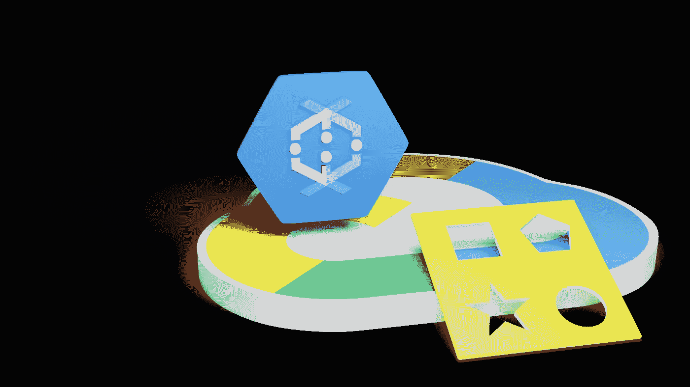
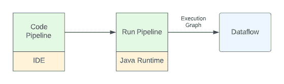
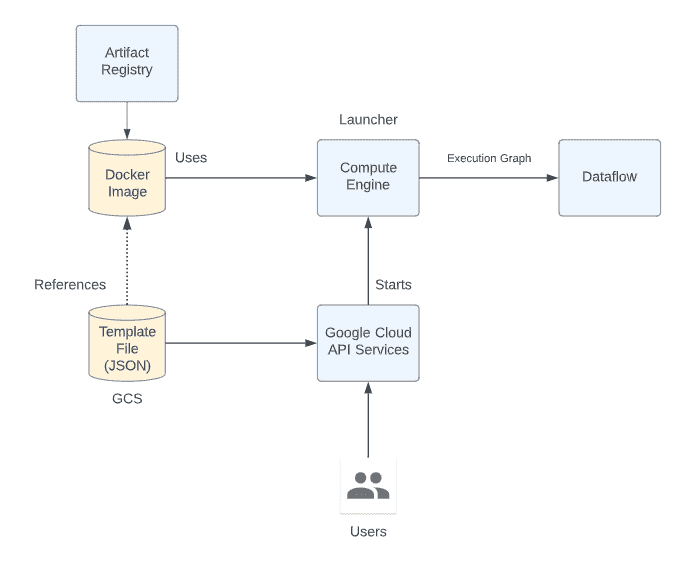
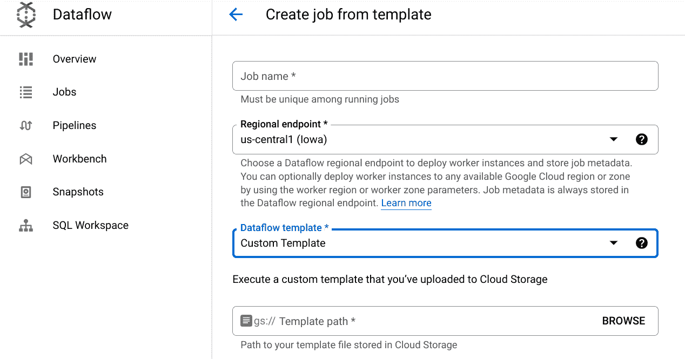
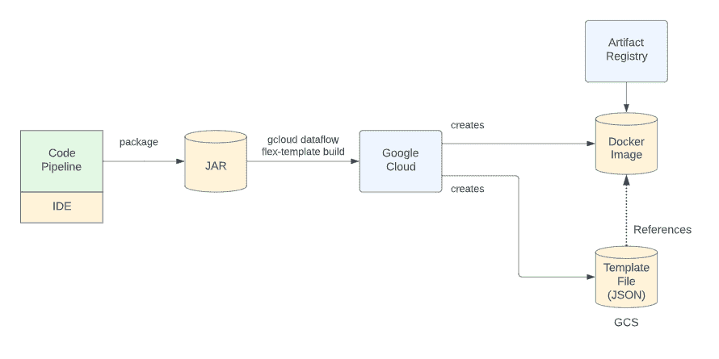

# 数据流弹性模板

> 原文：<https://medium.com/google-cloud/dataflow-flex-templates-2819572f165f?source=collection_archive---------0----------------------->

借助 Dataflow Flex 模板，我们可以定义一个 Dataflow 管道，该管道可以通过来自云控制台、gcloud 或 REST API 调用的请求来执行。通过 REST API，就有可能通过云调度器或许多其他机制来启动作业。

当我坐下来使用 Dataflow Flex 模板时，我阅读了文档，似乎有相当多的部分可以让它运行起来。随着我的进一步研究，模型和需求最终都到位了。本文试图简化并说明如何使用 Flex 模板。

让我们首先回顾一下在没有 Flex 模板的情况下启动数据流作业需要做些什么。

开发人员用 Java 编写一个 Beam 管道(也可以是其他语言，但为了便于讨论，我们将只关注 Java)。然后，开发人员运行管道。他们可以在笔记本电脑上运行它进行测试/开发，也可以在计算引擎或其他 GCP 生产环境中运行。当 pipeline 应用程序启动时，它会构建一个 Apache Beam 执行图，然后发送给 Dataflow。数据流然后使用它的数据流运行引擎执行图形。对于开发和测试来说，这个工作流是好的，但是对于生产来说有一些问题。首先，为了执行数据流作业，必须将执行图发送到数据流，这是通过使用包括 JVM 和其他库的环境运行管道应用程序来完成的。这意味着管道(由开发人员编写)可能有一组依赖关系，但当其他人运行管道时，这些依赖关系必须完全复制。这些包括 JVM 的版本、Beam SDKs 的版本等等。这为不匹配创造了机会。说到 CI/CD 管道，我们就崩溃了。如果开发人员将他们的管道代码签入源代码库，就不能保证测试和生产团队拥有相同的编译和执行环境。

接下来，考虑用户或操作人员。假设您被告知运行一个数据流作业。现在，您必须执行自己的组装来构建启动所需的所有先决条件。如果您是用户，您可能会问“为什么我不能从列表中选择作业并启动它？”。

这些只是 Flex 模板解决的几个难题。

现在让我们看看 Flex 模板的模型。我将使用一种渐进的架构披露技术来帮助我们理解。让我们从最后的结果开始，我们将向后工作。

Flex 模板为我们创建了两个工件，允许我们启动数据流作业。这是一个 Docker 映像和一个 JSON 文件，存储在 Google 云存储(GCS)中。

这些在下图中显示为 Docker 图像和模板文件:

现在让我们来分解一下，这样我们就能清楚地看到发生了什么。我们将从用户想要运行数据流作业的核心概念开始。因此，用户将向 Google Cloud API 服务发送一个请求，说“开始我的数据流作业”。用户**实际上**这样做的方式是命名一个 JSON 文件，它存在于一个我们称之为模板文件的 GCS 桶中。我们将在后面介绍这个文件是如何创建的。现在，假设模板文件指向工件注册表中的 Docker 映像(同样，Docker 映像来自哪里将在后面讨论)。

用户刚刚声明“在 GCS 上运行本文件中描述的数据流作业”。然后，谷歌云查看文件内部，找到 Docker 图像的身份。然后，谷歌云启动了一个计算引擎，称之为*启动器*，并使用 Docker 映像作为在该计算引擎中运行的映像。Docker 映像包含开发人员最初编写的 Apache Beam 管道的编译代码。当启动器计算引擎最终开始运行时，Docker 映像运行并导致数据流执行图被创建并被发送到数据流以执行 Beam 流水线。

在这里停下来思考这个故事。如果开发人员将他们的 Beam 管道打包成 Docker 映像，那么无论在哪里使用它(test，prod ),它都将是完全相同的代码，并且打包了正确的依赖项。这解决了一些最初的困惑。此外，要使用管道，用户只需要*知道 GCS bucket 中包含的文件的身份，因为当他们启动作业时，这就是他们需要指定的全部内容。*

用户可以使用以下方式启动数据流作业:

`gcloud dataflow flex-template run`

或者

[方法:projects . locations . flex templates . launch](https://cloud.google.com/dataflow/docs/reference/rest/v1b3/projects.locations.flexTemplates/launch)—REST API

或者

这三个都将 GCS 文件对象作为输入参数。

现在我们开始关注我们故事中缺失的部分。我们还没有描述模板文件中包含了什么或者它是如何创建的，也没有描述如何正确地构建 Docker 映像。

虽然 Docker 映像*可以手工构建*，但我们不会在这里描述它。相反，我们将描述最简单的方法。Google 提供了一个名为:

`gcloud dataflow flex-template build`

该命令将以下内容作为输入:

*   将创建的模板文件的 GCS 路径
*   用作构建 Docker 映像基础的基本 Docker 映像
*   将保存构建的 Docker 映像的工件存储库
*   波束管道的预编译代码和依赖项

当该命令运行时，它将创建*和*Docker 映像以及相应的模板文件。

整个图表如下所示:

到现在为止，你有希望得到我们已经分成两部分的架构模型。

开发人员希望创建一个 Docker 映像和一个模板文件，最终用于启动数据流作业。用户将知道指向 Docker 图像的模板文件的名称，Docker 图像将用于启动最终的数据流作业。

我们现在将注意力转向如何构建由开发人员构建的 JAR，该 JAR 将被打包到 Docker 映像中。这个比较棘手。JAR 必须不仅包含编译后的 Beam 代码，还必须包含*所有*在构建过程中使用的级别所需的先决条件。Google 为此提供了一个包含 maven `pom.xml`文件的 Github 项目示例。遗憾的是，我不是任何类型的专家，所以无法解释它是如何工作的…但是从使用的角度来看，我们执行:

`mvn package`

并且在目标文件夹中创建一个称为“fat”或“Uber”jar 的文件。它很大，包含执行所需的一切。

关于 Flex 模板，我们可以说的还有很多，包括:

*   如何向管道传递参数
*   如何为运行时参数指定默认值
*   如何使用 Java 以外的语言

…但是我们现在有足够的钱让我们继续前进。接下来是让 Flex 模板可操作的方法。

1.  创建项目

我们为我们的测试创建一个 GCP 项目。如果你愿意，你可以重复使用现有的。

2.启用服务

在我们的测试中，由于我们创建了一个新项目，没有预先启用任何服务，我们将启用我们需要的服务。

*   计算引擎
*   数据流
*   工件注册表
*   云构建

3.创建 GCS 存储桶

我们需要创建一个 GCS 存储桶来保存我们的 Flex 模板 GCS 文件。

`gs://kolban-dataflow6-tmp`

4.创建一个 VPC 网络

我建议不要使用默认的 VPC 网络(如果您有)，并创建了一个名为`myvpc`的新 VPC 网络。

5.为工作人员创建服务帐户

当数据流运行时，它会创建作为工作者运行的计算引擎。这些必须作为服务帐户运行，这里我们创建一个新的服务帐户，它们将作为服务帐户运行。我称我的为“工人”。

6.授予工人数据流工人

为了能够执行数据流工作者的角色，新创建的服务帐户必须被授予数据流工作者角色。

7.创建码头报告

一个 Docker 图像将被创建，我们需要一个 repo 来存储它。我们称这种回购为“T4”。

8.授予 repo 上的 worker 工件注册表读取器

worker 服务帐户是启动程序运行时使用的服务帐户。它必须拥有读取工件注册表的权限。我们授予它读者角色。

9.克隆我们的示例项目

我们克隆了我们的示例 Github 项目:

`git clone [https://github.com/kolban-google/flex-templates](https://github.com/kolban-google/flex-templates)`

10.切换到克隆的 github 项目

`cd flex-templates`

11.编辑`Makefile`并改变变量

*   `PROJECT_ID`
*   `BUCKET_NAME`

12.运行代码生成器

我假设您的环境中安装了 Java 11 和 Maven。

运行`make build-code`

这将编译代码并构建 fat jar。

13.运行 Flex 模板生成器

运行`make build-flex`

这将运行`gcloud`命令来构建 Flex 模板。它将使用 fat jar 并在 GCS bucket 中构建 Docker 映像和 Flex 模板文件。

14.运行 Flex 模板

运行`make run-flex`

这将使用 Flex 模板向数据流提交一个作业

最后…一个视频演示了本文的一些概念:

# 参考

*   [数据流数据管道模板|谷歌云](https://cloud.google.com/dataflow/docs/concepts/dataflow-templates)
*   [g Cloud data flow flex-template run | Google Cloud CLI 文档](https://cloud.google.com/sdk/gcloud/reference/dataflow/flex-template/run)
*   [为什么您应该将 Flex 模板用于您的数据流部署|数据集成](https://cloud.google.com/blog/topics/developers-practitioners/why-you-should-be-using-flex-templates-your-dataflow-deployments)
*   [从任何数据流管道创建模板|谷歌云博客](https://cloud.google.com/blog/products/data-analytics/create-templates-from-any-dataflow-pipeline)
*   [快速构建步骤&部署数据流灵活模板(Python&Java)| by Chhavi Sharma | Medium](/@emailchhavisharma/quick-steps-to-build-deploy-dataflow-flex-templates-python-java-728fc366f0d1)
*   [如何使用 Flex 模板部署数据流模板——云端技术](https://headintheclouds.appsbroker.com/how-to-deploy-a-dataflow-template/)
*   [数据流 Flex 模板](https://www.youtube.com/watch?v=xaoruVUt0jk)—2020 年梁数字峰会
*   [一种用于数据流 Flex 模板的声明式方法— Binx](https://binx.io/2022/07/28/a-declarative-approach-for-dataflow-flex-templates/)
*   [在谷歌云中构建、测试和部署数据流灵活模板](/cts-technologies/building-and-testing-dataflow-flex-templates-80ef6d1887c6)
*   [使用带有数据流灵活模板的定制容器](/@tjwebb/using-custom-containers-with-dataflow-flex-templates-f5b59a95ceae)
*   [谷歌云数据流动态(批处理&流)管道使用 Flex 模板(Python)](/@amal.kumar.singh/dataflow-dynamic-batch-streaming-pipeline-using-flex-templates-python-cc245dad60cd)
*   [GCP 上的流数据生成器数据流灵活模板| prat hap Reddy |谷歌云—社区| Medium](/google-cloud/streaming-data-generator-978846c5c807)
*   [本文 Github](https://github.com/kolban-google/flex-templates)