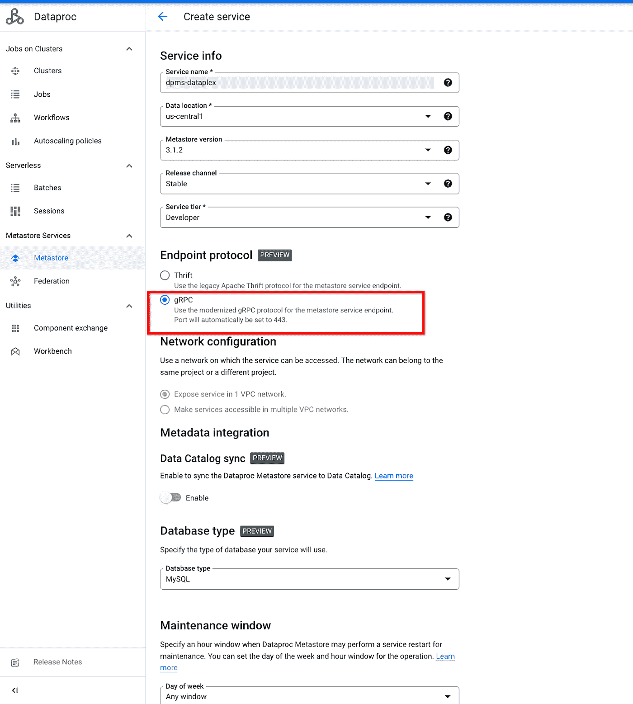

# Dataplex:通过 PySpark 访问 Dataproc 元数据存储

> 原文：<https://medium.com/google-cloud/dataplex-accessing-the-dataproc-metadata-store-via-pyspark-bf32165df18a?source=collection_archive---------1----------------------->

本文描述了如何通过标准接口(如 Hive Metastore)访问 Dataplex 中的元数据，以支持 Spark 查询的方法。我们将专门讨论在 PySpark 查询中访问基于 gRPC 的 Hive metastore。

在这篇文章中，我们将讨论以下内容:

1.  为什么要 gRPC 和 Dataproc Metastore store？
2.  在其中激活 Dataplex 和 grpc Dataproc Metastore。
3.  Discovery UI explore 选项卡和使用 Pyspark 修改发现元数据
4.  搜索元数据:Dataplex 中的数据目录组件

# 背景

Dataplex 是一种智能数据结构，使企业能够在任何规模上快速地**管理**、**安全、**、集成、**分析**。同样，Dataplex 有一个 GCP 数据目录 作为继承的组件。从而开箱即用地解决企业元数据管理需求。

# 为什么 gRPC 和 Dataproc Metastore 存储

Dataproc Metastore 是一个托管的 Apache Hive Metastore 服务。当访问存储在服务中的数据库和表元数据时，它提供 100%的 OSS 兼容性。

例如，您可能有一个存储在 Google 云存储的 Parquet 文件中的表。您可以在这些文件上定义一个表，并将元数据存储在 Dataproc Metastore 实例中。然后，您可以将云 Dataproc 集群连接到您的 Dataproc Metastore 服务实例，并使用 Hive、SparkSQL 或其他查询引擎查询该表。

[gRPC](https://grpc.io/) 是一个现代化的开源高性能 RPC 框架，可以在任何环境下运行，可以高效地连接数据中心内部和数据中心之间的服务。

提供 gRPC 作为访问 Metastore 的选项给我们带来了很多好处。与传统的 Thrift 相比，gRPC 支持为大型请求提供更好性能的流。此外，它还可以扩展到更高级的身份验证功能，并与支持细粒度权限检查的 Google IAM 服务完全兼容。在这个提议中，描绘了一条将 gRPC 与 Hive Metastore 集成的路径。

# Dataplex 中的元数据层

Dataplex 扫描以下内容:

*   **表实体:**数据湖中的结构化和半结构化数据资产，用于将表元数据提取到表实体中
*   **文件集实体:**非结构化数据，例如图像和文本，用于将文件集元数据提取到文件集实体中
*   **分区:**表或文件集实体中数据子集的元数据，由一组键/值对和一个数据位置标识。

您可以使用 Dataplex 元数据 API 来执行以下任一操作:

*   查看、编辑和删除表和文件集实体元数据
*   创建您的表或文件集实体元数据

您还可以通过以下方式分析 Dataplex 元数据:

*   数据目录，用于搜索和标记
*   Dataproc Metastore 和 BigQuery，用于表元数据查询和分析处理。

Dataplex 自动元数据发现扫描

阅读更多元数据管理:[https://cloud.google.com/dataproc-metastore/docs/overview](https://cloud.google.com/dataproc-metastore/docs/overview)

# 在其中激活 Dataplex 和 gRPC Dataproc Metastore。

在本节中，我们将讨论如何在您的湖上激活 Metastore 发现。

# 开始之前

*   [启用项目中的](https://cloud.google.com/dataproc-metastore/docs/enable-service) [Dataproc](https://console.cloud.google.com/marketplace/product/google/dataproc.googleapis.com) ， [Dataproc Metastore](https://console.cloud.google.com/marketplace/product/google/metastore.googleapis.com) ，BigQuery，GCS，Data [Catalog](https://console.cloud.google.com/marketplace/product/google/datacatalog.googleapis.com) ，以及[Data plex](https://console.cloud.google.com/apis/library/dataplex.googleapis.com)[A](https://cloud.google.com/dataproc-metastore/docs/enable-service)pi。
*   [了解特定于您项目的网络需求](https://cloud.google.com/dataproc-metastore/docs/access-service)。
*   有关所需角色和权限的更多详细信息，请参考[https://cloud . Google . com/data proc-metastore/docs/iam-and-access-control](https://cloud.google.com/dataproc-metastore/docs/iam-and-access-control)

为项目启用必需的 API。

# 创建新的湖、区域并附加 Dataproc Metastore

1.  转到 Dataplex 选项卡并单击顶部的 create 来创建一个新的 lake“demo-data plex”和 Zone。更多信息，请参见[创建湖泊](https://cloud.google.com/dataplex/docs/create-lake)。
2.  创建后开始暂存你的资产:关于暂存你的资产的更多细节，请参考[将你的资产添加到 Dataplex lake](https://cloud.google.com/dataplex/docs/manage-assets?hl=en#add-asset) 。
3.  在启用 gRPC 的情况下，在与您的 lake 相同的项目中创建一个 [Dataproc Metastore 服务](https://cloud.google.com/dataproc-metastore/docs/create-service)

注意:每个 Dataproc Metastore 只能连接到一个 Dataplex lake。要跨多个湖检查元数据，要么使用 Dataplex 中的“Discovery”部分，要么在 BigQuery 中查询元数据。

在项目中创建元数据存储区的步骤。

4.将启用了 gRPC 的 Metastore 连接到您的 demo-dataplex lake。

将启用 gRPC 的 Metastore 附加到 Dataplex 中新创建的 lake。

# Dataplex 的发现 UI explore 选项卡

Dataplex 的 discovery 选项卡有两个选项卡，即 Search 和 Explore。要浏览 DP gRPC metastore 中的元数据存储，我们必须使用 explore 选项卡。

Dataplex 的发现 UI。

一旦你点击它；如下所示，您将获得为 Notebook 和 Spark 创建环境的选项。

开源工具可以用来与存储在 dataplex 中的元数据进行交互。

## 使用自定义 pySpark 作业访问元数据

Dataplex 中管理的元数据可以通过标准接口访问，比如 Hive Metastore，以支持 Spark 查询。查询在后台的 Dataproc 集群上运行。

一种方法是使用 Dataplex 任务 UI 下的 Auto-Infra provisioning 特性。我们可以转到 Manage Lake → Manage → Process 选项卡，提交存储在 GCS 中的自定义 PySpark 作业，如下图所示。

> Dataplex 负责创建在后台运行 spark 作业所需的基础设施。

使用 Dataplex Auto-infra provisioning 提交我们的自定义 pySpark 作业。

我们将尝试在 metastore 上通过 pySpark 代码(spark SQL)运行一些 DML。Dataplex 不允许您改变表的位置或编辑表的分区列。更改表格不会自动将[用户管理的](https://cloud.google.com/dataplex/docs/reference/rest/v1/projects.locations.lakes.zones.entities#Schema.FIELDS.user_managed)设置为真。

在 Spark SQL 中，您可以[重命名表](https://cloud.google.com/dataplex/docs/access-metadata#rename-table)，[添加列](https://cloud.google.com/dataplex/docs/access-metadata#add-columns)，以及[设置表的文件格式](https://cloud.google.com/dataplex/docs/access-metadata#set-file-format)。

> 湖中的每个 Dataplex 区域都映射到一个 metastore 数据库。

Alter Table 示例:我们将使用下面存储在 GCS 中的 pySpark 代码来修改存储在与 Dataplex 关联的 gRPC metastore 中的元数据。

> 对于拼花数据，将 Spark 属性`*spark.sql.hive.convertMetastoreParquet*`设置为`*false*`以避免执行错误。

元数据视图 1:在运行 pySpark 作业之前。我们将通过 DP gRPC metastore 中的外部表检查 BigQuery 中存储的元数据。

Explorer 选项卡:在运行 pySpark 之前，元数据在 BigQuery 中可见。

元数据视图 2:运行 pySpark 作业后。我们可以看到底层资产的元数据的表名已经更改。

Explorer 选项卡:运行 pySpark 后，在 BigQuery 中可以看到元数据。

我们可以看到 alter table 语句成功地更改了表名。类似地，我们可以对元数据做其他修改，如这里的[所示](https://cloud.google.com/dataplex/docs/access-metadata)。

# 搜索元数据:Dataplex 中的数据目录组件

*探索*体验与数据目录相结合，向您展示您在特定项目中可以访问的所有湖泊的资源。要了解更多信息，请参见[发现数据文档](https://cloud.google.com/dataplex/docs/discover-data)搜索您之前附加到区域的数据，然后单击资产。*实体详细信息*页面显示了所选资产的具体信息，包括数据链接

我们将在下一篇文章中更详细地讨论这个问题。

# 结论

在本文中，我们已经讨论了在 GCP 激活 Dataplex 并为其附加支持 gRPC 的 hive metastore。我们还讨论了如何使用定制的 PySpark 作业运行 Spark SQL 来访问/修改 Dataplex 中的 Metastore 数据。我们还展示了 Dataplex 的 Discovery 特性中可用的各种 UI 组件。

# 参考

*   [https://cloud.google.com/dataplex/docs/access-metadata](https://cloud.google.com/dataplex/docs/access-metadata)
*   [https://cloud.google.com/dataplex/docs/introduction](https://cloud.google.com/dataplex/docs/introduction)
*   [https://cloud . Google . com/data proc-metastore/docs/grpc-endpoints](https://cloud.google.com/dataproc-metastore/docs/grpc-endpoints)

希望你喜欢这篇文章，并发现它有用。感谢 [Shashanktp](https://medium.com/u/3082c39b9f6?source=post_page-----bf32165df18a--------------------------------)

感谢您的参与。你可以在 LinkedIn 上找到我。