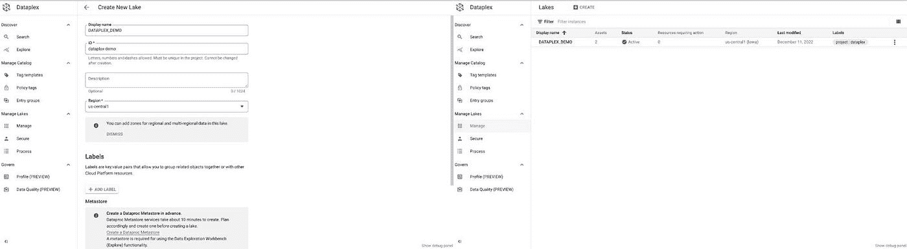
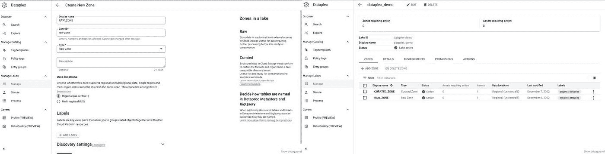
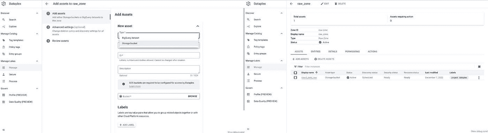
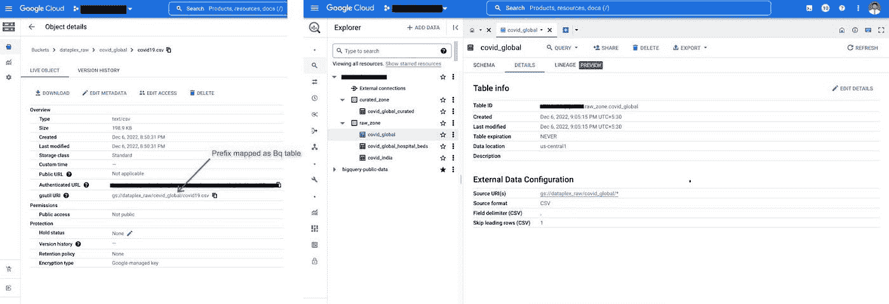
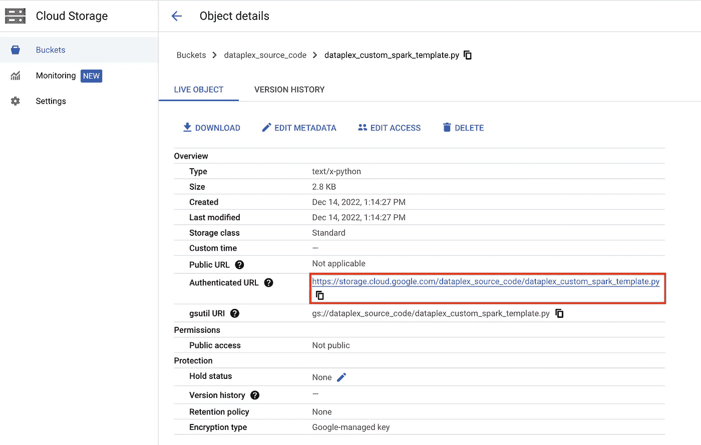
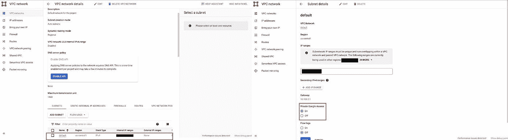
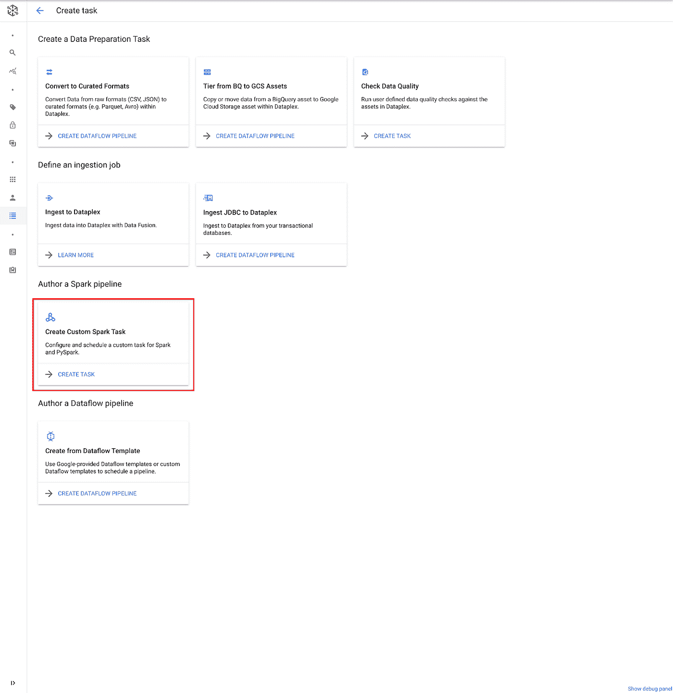
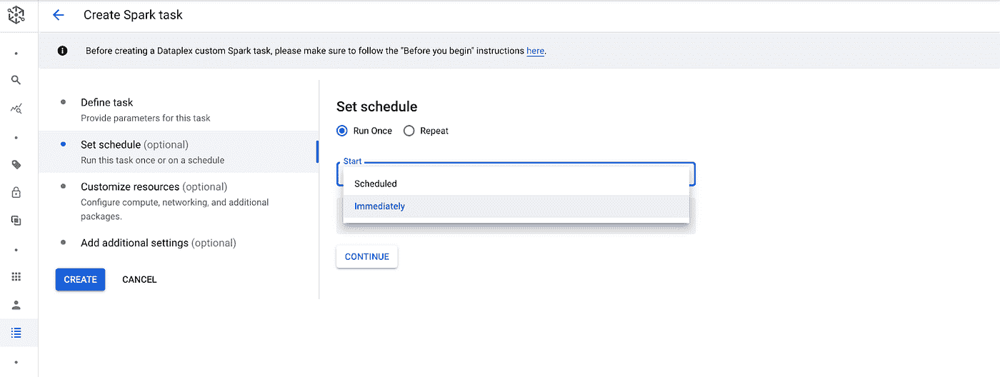
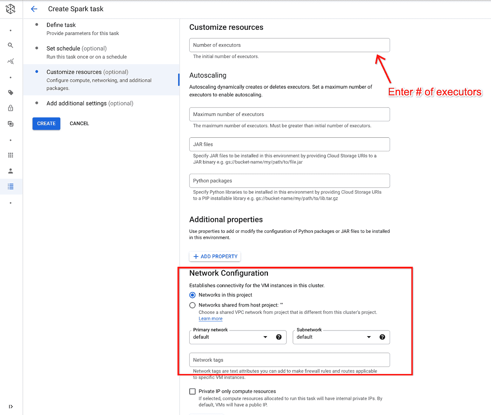
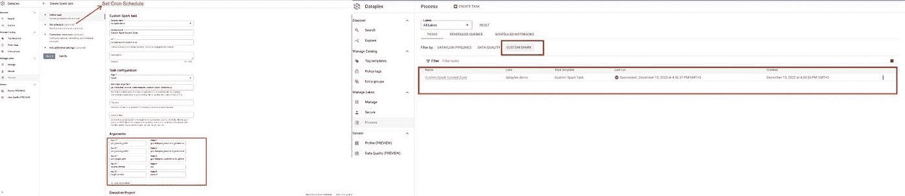

# Dataplex —使用定制 Pyspark/Spark 进行数据处理

> 原文：<https://medium.com/google-cloud/dataplex-data-processing-using-custom-pyspark-spark-1cb73753fa03?source=collection_archive---------1----------------------->

## **简介:**

D 它还集中了安全性和治理，实现了数据的分布式所有权和全局控制。Dataplex 为存储在云存储和大查询中的数据提供自动元数据发现。除此之外，用户可以安全地访问数据，并通过 BigQuery 作为外部表进行查询。用户可以运行 data quality 和 custom PySpark，后者运行无服务器批处理任务。Dataplex 还提供了完全管理的、无服务器的 Spark 环境，可以简单地访问笔记本和 SparkSQL 查询。

**在这篇文章中，我们将关注两个主要方面:**

*   设置数据管理—湖、区域、资产。
*   使用自定义 PySpark 任务设置和运行转换。

将详细介绍每个领域以及运行它所需的步骤。

## **先决条件:**

要访问 Dataplex UI 并运行定制的 PySpark 任务，用户应该对 [Cloud IAM](https://cloud.google.com/iam/docs/understanding-roles#cloud-dataplex-roles) 中授予的角色或服务帐户拥有适当的访问权限。如果数据转换任务需要读取或更新附加到 lake 的 Dataproc Metastore 实例，那么服务帐户也需要 [Dataproc Metastore 查看器或编辑器](https://cloud.google.com/dataproc-metastore/docs/iam-roles#predefined-roles)角色。

## **设置数据管理—湖泊、区域、资产:**

> **步骤 1:创建数据湖:**

从导航菜单>分析>选择 Dataplex >管理湖泊->选择管理->创建

> **第二步:定义数据区:**

这是建立数据湖的重要一步。区域限制了您可以存储的数据类型。数据湖中有两种类型的区域:

*   **原始区域:**原始格式的数据，没有经过严格的类型检查。
*   **精选区域:**经过清理、格式化并准备好进行分析的数据。在 Parquet、Avro、Orc 文件或 BigQuery 表中，数据是柱状的、配置单元分区的。例如，对数据进行类型检查，以禁止使用 CSV 文件，因为它们在 SQL 访问中表现不佳。

我们将在**湖** (Dataplex-demo)下创建 **Raw (RAW_ZONE)** 和**Curated(Curated _ ZONE)****ZONE**。对于每个创建的区域，Dataplex 自动创建一个 BigQuery 数据集。

单击新创建的数据湖>单击“Zones”选项卡下的“Add Zone”。

按照相同的步骤创建所需的分区(原始/管理的)。

> **第三步:添加资产:**

在这一步中，我们将在所需的区域下添加资产，即映射到云存储或 BigQuery 中存储的数据。您可以将存储在单独的 Google Cloud 项目中的数据作为资产映射到一个区域中。完成此操作后，数据发现作业将访问元数据，我们可以看到代表结构化和半结构化数据(表)以及非结构化数据(文件)的元数据的实体。

单击创建的原始区域>单击添加资产>在类型下->选择存储桶->为原始数据选择所需的桶->提供发现设置(继承/覆盖)->检查资产->提交

要在区域中添加资产，我们有两个选项:

*   存储桶
*   大型查询数据集

注意:当将存储桶设置为资产时，应该注意在桶中创建一个对象文件夹，因为对于每个文件夹，BigQuery 数据集中都会有一个表。Dataplex 自动创建带有区域名称的数据集(原始/管理的),该数据集是在湖中创建的。在存储桶中创建对象文件夹(前缀)的原因是因为资产遵循配置单元样式约定，文件夹代表具有相似模式的一个实体或一组实体。

Dataplex 将这些资产作为两个单独的表来发现，每个前缀/文件夹可以托管许多 Hive 风格的分区文件，Dataplex 将发现这些文件并创建一个表，只要这些文件具有相同的模式。

## **使用自定义 PySpark 任务设置并运行转换:**

现在，我们有了所需区域中的资产，我们创建了一个自定义 PySpark 任务，并通过传递参数运行转换作业，从原始区域资产中读取数据并转换它，然后将其写入与管理的区域资产映射的云存储桶中。Dataplex 支持使用 cron 或一次性运行来调度定制代码的执行。我们可以使用 Spark (Java)、PySpark ( < =3.2)或 SparkSql 来调度定制任务。这些脚本通过无服务器 Spark 处理和内置的无服务器调度程序执行。

在进入下一步之前，您一定想知道在 Dataplex 上运行定制 PySpark 任务的**好处是什么:**运行定制 PySpark 任务可以更加灵活地编写转换作业，并将它们存储在一个管理区域中，该区域将自动在 BigQuery 中创建表。除此之外，熟悉 Spark 背景的开发人员将能够轻松地用 Java、Spark、PySpark 或 Spark SQL 编写转换代码。

> **步骤 1:准备 PySpark 脚本并将其放入 GCS 桶中。**

data plex _ custom _ spark _ template . py

放置在 GCS bucket 中的上述脚本读取 Dataplex Create Task UI 中 Add Argument 部分指定的参数。该脚本采用源、目标路径以及源和目标格式，运行转换，并将其写入在管理区域中注册为资产的目标路径。

> **第二步:启用谷歌私人访问:**

为您的网络和/或子网络启用私人 Google 访问。如果未指定，它将采用默认子网。将在默认子网中启用私人 Google 访问。

从导航菜单>网络>选择 VPC 网络>点击默认->选择将运行 Dataplex 任务的子网区域->点击编辑->启用私有 Google 访问。

> **第三步:创建一个定制的 Spark 任务:**

按照以下步骤创建 Spark 任务:

在管理湖泊->选择过程->创建任务->点击创建自定义 Spark 任务。

> **步骤 3a:选择 Dataplex Lake，输入任务配置的详细信息:**

*   **类型:** Spark/ PySpark。
*   **主类或 Jar 文件:**对于 PySpark:完全合格的云存储 URI，对于 Spark 是完全合格的类名。
*   **文件 uri:**每个执行器的工作目录中要放置的文件的 GCS URIs，例如:log4j-spark-driver-template . properties 文件可以放在每个执行器中进行日志记录。
*   **归档文件:**归档文件提取在 Spark 工作目录下。
*   **添加参数:**输入要在 GCS Python 脚本中传递的参数。示例:输入源、目标路径和使用的源、目标格式。

> **步骤 3b:设置日程:我们可以在两个选项中选择:**

*   运行一次:选择立即或 Cron 选项。
*   每日:选择任何选项，如每日、每周、每月或自定义。

> **步骤 3c:** **选择自定义资源- >网络配置- >检查默认 VPC 应被选中，因为我们为默认 VPC 启用了私人 Google 访问。**

> **步骤 3d:** **验证您运行的自定义 Spark 作业:**

## 结论

在本文中，我们看到了如何在 Dataplex 中配置和运行 PySpark 任务来进行数据转换和处理。我们还讨论了如何传递多个参数并在 PySpark 脚本中使用它来执行转换，以及在 Dataplex 中使用数据管理时需要注意的各种问题。

## 参考

*   [https://cloud . Google . com/data plex/docs/schedule-custom-spark-tasks](https://cloud.google.com/dataplex/docs/schedule-custom-spark-tasks)
*   [https://cloud.google.com/dataplex/docs/introduction](https://cloud.google.com/dataplex/docs/introduction)

希望你喜欢这篇文章，并发现它有用。感谢 [KARTIK MALIK](https://medium.com/u/84d86011e914?source=post_page-----1cb73753fa03--------------------------------) 的投入。你可以通过 [LinkedIn](https://www.linkedin.com/in/shashank-t-743126104/) 联系到我。