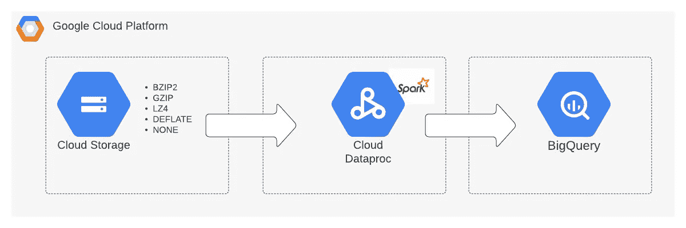

# Dataproc 无服务器 PySpark 模板，用于将压缩文本文件接收到 Bigquery

> 原文：<https://medium.com/google-cloud/dataproc-serverless-pyspark-template-for-ingesting-compressed-text-files-to-bigquery-c6eab8fb6bc9?source=collection_archive---------1----------------------->



[Dataproc 无服务器](https://cloud.google.com/dataproc-serverless/docs/overview)允许用户运行 Spark 工作负载，而无需供应或管理集群。因此，数据工程师现在可以专注于构建他们的管道，而不是担心集群基础设施。

[Dataproc 模板](https://github.com/GoogleCloudPlatform/dataproc-templates)是进一步简化数据工程师在 Dataproc 无服务器上的工作的倡议。这些模板附带了一组现成的特性，这些特性实现了基本的用例，并且可以根据需要进一步定制。模板有 Java 和 Python 两种版本。在这篇文章中，我们将关注如何使用“文本到 BigQuery PySpark 模板”将 GZIP 格式的压缩数据接收到 BigQuery 中。

# Dataproc 无服务器—“文本到大查询”模板

该模板用于从 Google 云存储中读取文本文件，并将它们写入 BigQuery 表。它还支持压缩文本文件在 **BZIP2，GZIP，LZ4，DEFLATE** 格式，作为输入。(如果文本文件未压缩，使用 **NONE** 作为压缩格式)。该模板使用 [Spark BigQuery 连接器](https://cloud.google.com/dataproc-serverless/docs/guides/bigquery-connector-spark-example)写入 BigQuery。

## 先决条件

为了运行这些模板，我们需要:

*   Google Cloud SDK 已安装并通过验证。
*   Python 3.7+已安装。
*   启用了专用 Google 访问的 VPC 子网。默认子网是合适的，只要启用了私有 Google 访问。你可以在这里查看所有的 Dataproc 无服务器网络需求。

## 配置参数

该模板包括以下参数来配置执行:

*   `text.bigquery.input.location`:输入文件的 GCS 位置。支持通配符。示例:`gs://BUCKET/*.gz`
*   `text.bigquery.input.compression`:输入文件压缩格式。`bzip2`、`gzip`、`lz4`、`deflate or none`其中之一。
*   `text.bigquery.input.delimiter`:输入文件文本分隔符。例如:`"/"`、`"|"`、`","`等。
*   `text.bigquery.output.dataset`:输出表的 BigQuery 数据集。
*   `text.bigquery.output.table`:big query 输出表。
*   `text.bigquery.output.mode`:火花输出保存模式。append、overwrite、ignore、errorifexists 之一。默认为追加。你可以在这里了解每种保存模式的表现[。](https://spark.apache.org/docs/latest/sql-data-sources-load-save-functions.html#save-modes)
*   `text.bigquery.temp.bucket.name`:Spark big query 连接器的临时桶。在将输出数据加载到 BigQuery 之前，连接器会将输出数据写入这个 GCS bucket。这种方法叫做间接写，你可以在这里了解更多。

## 运行模板

1.  **创建一个 GCS 存储桶**

需要一个 GCS 存储桶作为 Dataproc 的暂存位置。Dataproc 将使用这个桶来存储运行我们的无服务器集群所需的依赖项。

```
export STAGING_BUCKET=”my-staging-bucket”
gsutil mb gs://$STAGING_BUCKET
```

2.**克隆 Dataproc 模板库**

成功克隆后，导航到 Python 模板的目录

```
git clone [https://github.com/GoogleCloudPlatform/dataproc-templates.git](https://github.com/GoogleCloudPlatform/dataproc-templates.git)
cd dataproc-templates/python
```

3.**配置 Dataproc 无服务器作业**

为了将作业提交给 Dataproc Serverless，我们将使用提供的 bin/start.sh 脚本。该脚本要求我们使用环境变量来配置 Dataproc 无服务器集群。

强制配置包括:

*   `GCP_PROJECT`:在其上运行 Dataproc Serverless 的 GCP 项目。
*   `REGION`:运行 Dataproc 无服务器的区域。
*   `GCS_STAGING_LOCATION`:一个 GCS 位置，Dataproc 将在此存储登台资产。应该在我们之前创建的桶内。

```
*# Project ID to run the Dataproc Serverless Job*
export GCP_PROJECT=<project_id>*# GCP region where the job should be submitted*
export REGION=<region>*# The staging location for Dataproc*
export GCS_STAGING_LOCATION=gs://$STAGING_BUCKET/staging
```

在我们的例子中，Text To BigQuery 模板需要 Spark BigQuery 连接器在类路径中可用。连接器是公开托管的，所以我们将使用 JARS 环境变量来添加它。您还可以选择将 JAR 文件存储在您自己的存储桶中。

```
*# Path to the Spark BigQuery Connector JAR file*
export JARS=”gs://spark-lib/bigquery/spark-bigquery-latest_2.12.jar”
```

4.**执行文本到 BigQuery Dataproc 模板**

配置作业后，我们就可以触发它了。我们将运行 bin/start.sh 脚本，指定要运行的模板和执行的参数值。

```
./bin/start.sh \
-- --template=TEXTTOBIGQUERY \
 --text.bigquery.input.compression=<gzip|bzip4|lz4|deflate|none> \
 —-text.bigquery.input.delimiter=<delimiter> \
 --text.bigquery.input.location=<gs://bucket/path> \
 --text.bigquery.output.dataset=<dataset> \
 --text.bigquery.output.table=<table> \
 --text.bigquery.output.mode=<append|overwrite|ignore|errorifexists> \
 --text.bigquery.temp.bucket.name=”<temp-bq-bucket-name>”
```

**注意**:提交作业将要求您启用 Dataproc API，如果尚未启用的话。

5.**监控火花批量作业**

一旦提交了作业，我们就可以在 [Dataproc Batches UI](https://console.cloud.google.com/dataproc/batches) 中监控我们的作业。搜索批处理 id 以获取详细的指标和日志。

## 高级作业配置选项

在配置我们的 Dataproc 无服务器作业时，我们还可以指定以下高级配置选项:

*   `SUBNET`:运行 Dataproc 无服务器的 VPC 子网，如果不使用默认子网的话(格式:`projects/<project_id>/regions/<region>/subnetworks/<subnetwork>`)。
*   `JARS`:应该添加到 Spark 类路径中的逗号分隔的 JAR 文件。我们在本指南中使用它来为我们的工作提供 Spark BigQuery 连接器。
*   `FILES`:放置在 Spark 工作目录中的逗号分隔文件。
*   `PY_FILES`:要添加到 PySpark 的逗号分隔的 Python 脚本或包。支持`.py`、`.zip`和`.egg`格式。
*   `HISTORY_SERVER_CLUSER`:作为 Spark 历史服务器的现有 Dataproc 集群(格式:`projects/<project_id>/regions/<region>/clusters/<cluster_name>`)。
*   `METASTORE_SERVICE`:用作外部 Metastore 的 Dataproc Metastore 服务的名称(格式:`projects/<project_id>/locations/<region>/services/<service_name>`)。

## 火花配置选项

当提交 Spark 批处理工作负载时，我们还可以设置 [Spark 属性](https://cloud.google.com/dataproc-serverless/docs/concepts/properties)供 Dataproc Serverless 为特定的批处理使用。这允许您确定分配工作负载的计算、内存和磁盘资源。

在下面的例子中，我们指定**最小**和**最大执行者**分别作为 **100** 和 **400** 。

```
./bin/start.sh \
--properties=spark.dynamicAllocation.minExecutors=100, \
spark.dynamicAllocation.maxExecutors=400 \
-- --template=TEXTTOBIGQUERY \
 --text.bigquery.input.compression=<gzip|bzip4|lz4|deflate|none> \
 —-text.bigquery.input.delimiter=<delimiter> \
 --text.bigquery.input.location=<gs://bucket/path> \
 --text.bigquery.output.dataset=<dataset> \
 --text.bigquery.output.table=<table> \
 --text.bigquery.output.mode=<append|overwrite|ignore|errorifexists> \
 --text.bigquery.temp.bucket.name=”<temp-bq-bucket-name>”
```

在上面的资源分配下，BigQuery 中的 **~6TB** 负载用了 **~43 分钟**。在**最少 10 个**和**最多 100 个执行器**的情况下，同样的负载用了 **1 小时 20 分钟**。

## 摘要

“ [Text To Bigquery Template](https://github.com/GoogleCloudPlatform/dataproc-templates/blob/main/python/dataproc_templates/gcs/README.md#text-to-bigquery) ”提供了一个从压缩/未压缩文本文件(带有任何分隔符)直接向 Bigquery 摄取数据的起点。此外，它还具有以下优点:

*   可以直接将压缩文本文件从 GCS 接收到 BigQuery。不需要先解压缩数据。
*   可根据任何加工或转换要求进行定制。
*   允许在自定义分隔符上拆分数据。

**注意:**如果您正在从 **avro、parquet、csv** 或 **json** 文件中寻找数据摄取，请使用“ [GCS To Bigquery Template](https://github.com/GoogleCloudPlatform/dataproc-templates/blob/main/python/dataproc_templates/gcs/README.md#gcs-to-bigquery) ”。

## 参考资料:

*   [Dataproc 无服务器文档](https://cloud.google.com/dataproc-serverless/docs/overview)
*   [Dataproc 模板库](https://github.com/GoogleCloudPlatform/dataproc-templates)
*   [data proc 无服务器 PySpark 模板入门](/@ppaglilla/getting-started-with-dataproc-serverless-pyspark-templates-e32278a6a06e)