# data proc——GCP 星火星团在几分钟内

> 原文：<https://medium.com/google-cloud/dataproc-spark-cluster-on-gcp-in-minutes-3843b8d8c5f8?source=collection_archive---------0----------------------->

我已经决定在 [**谷歌云平台**](https://cloud.google.com/) 上以各种方式尝试运行 **Apache Spark** ，

我会告诉你一点我的经验和执行所有需要的行动的方法。

对于第一种方式，**我先从最简单的方式**开始，使用 Google 的 [**DataProc 服务**](https://cloud.google.com/dataproc/) (目前在测试版)。如果你们中的一些人正在使用亚马逊的 AWS，它相当于他们的 EMR(弹性 MapReduce)服务，你可以在谷歌云控制台中使用 GUI 工具、REST API 或通过命令行工具启动 Spark 集群(接下来我将展示所有的可能性)。

首先，你需要创建一个谷歌云帐户，你可以在[下一个链接](https://cloud.google.com/free-trial/)中这样做，你可以获得 300 美元信用的免费试用，这对你所有的测试来说绰绰有余。一旦您创建了帐户，我们就可以开始使用 web 控制台来启动群集。

**您可能需要提前准备两件事情**(如果没有，您将获得默认设置，这也很好):

1.  创建一个**“云存储暂存桶”**来在客户机和集群之间暂存文件，如 Hadoop jars。如果未指定，则使用默认存储桶。
2.  **为 Spark 集群创建网络**集群使用的计算引擎网络。如果未指定，将为您选择默认网络。
    我添加了一个我创建的网络截图，名为**“spark-cluster-network”**，并且只打开了相关的防火墙规则(既用于连接到集群，也用于查看 Spark 集群的 UI 特性)。

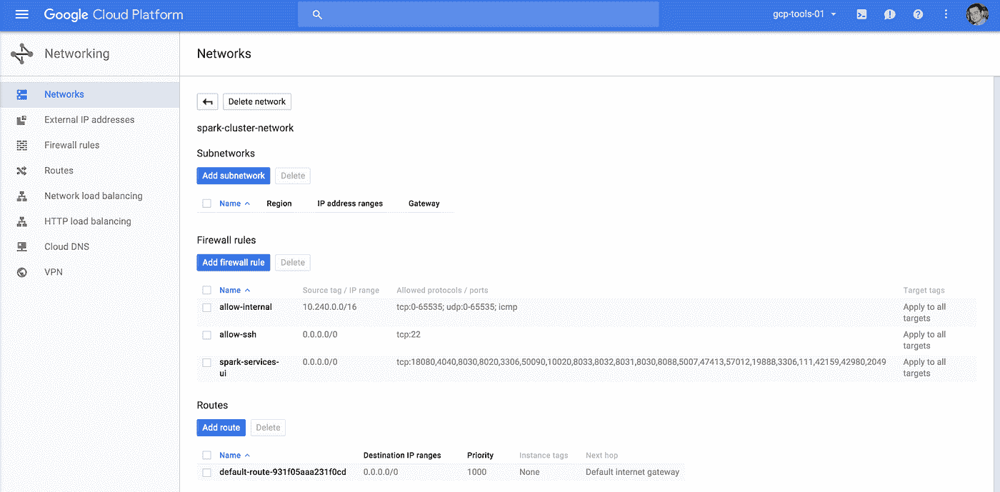

**下一步是用 DataProc 启动集群，有 3 种方法可以做到:**

# **云控制台上 DataProc 的 GUI 工具:** 要进入 DataProc 菜单，我们需要遵循以下步骤:

在主控制台菜单上找到 **DataProc** 服务:

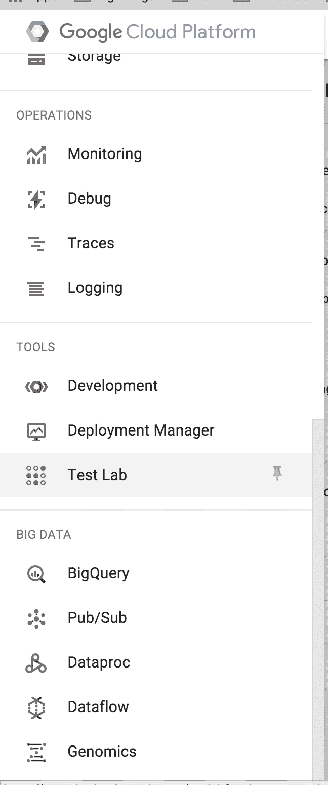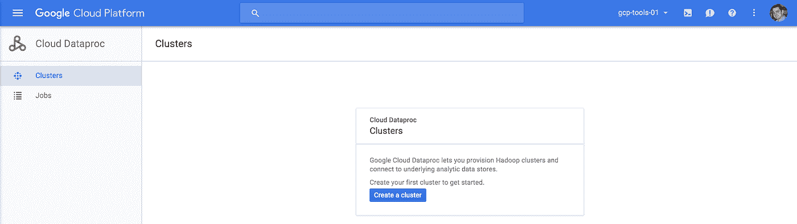

然后，您可以使用我们之前讨论过的所有参数创建一个新的集群，在我们的示例中，它被称为**“cluster-1”**。

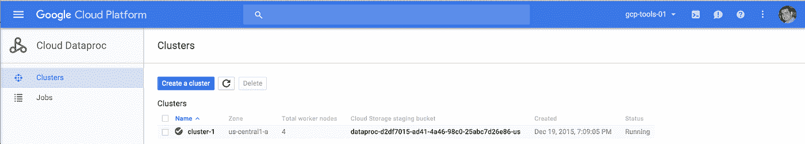

发出启动命令后，群集在大约 45 秒后启动并运行，我能够通过 SSH 连接到它:

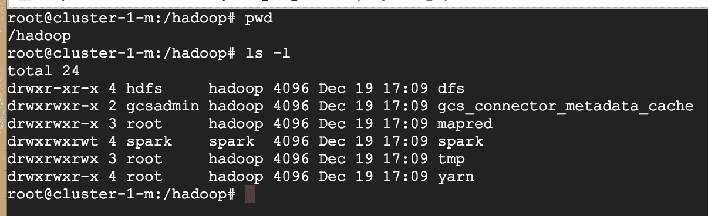

而且你可以看到 Apache Spark 已经预装在 **"/var/lib/spark"** 。

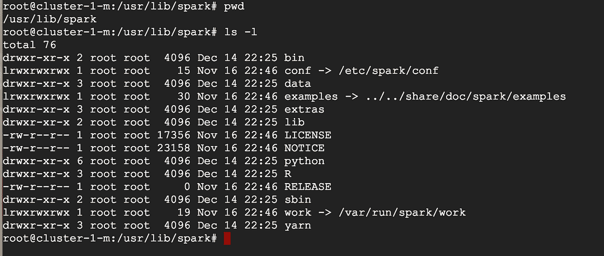

为了检查一切是否正常，我运行了 spark-shell:

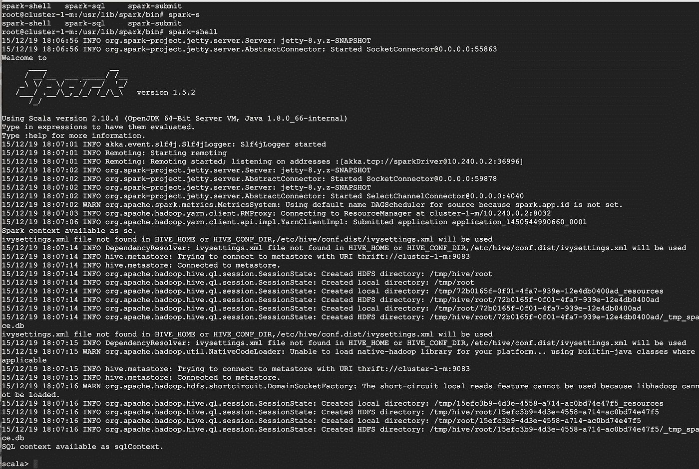

但是请注意一件非常重要的事情，您需要用 config 参数启动每个应用程序(包括 spark-shell ),以覆盖 YARN 的动态分配特性。

当我在没有这个配置的情况下启动作业时，我遇到了这个问题，在 spark-shell 运行期间，我会突然失去执行器:(你可以在 spark master UI 中看到执行器被删除了)

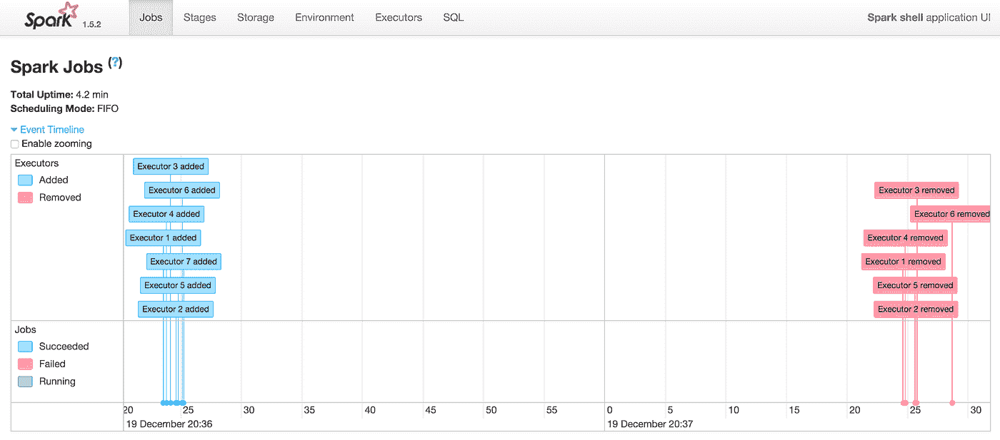

**感谢**[**Vadim solo vey**](https://www.linkedin.com/in/vadimska)**，**动态分配导致 spark 放弃闲置的执行人回纱，不幸的是此时 Spark 打印出那条垃圾但无害的“失去执行人”消息。这是纱线上的火花的经典问题，spark 最初瘫痪了它运行的集群，因为它会抓取它认为需要的最大数量的容器，然后永远不会放弃它们。

使用动态分配，当您开始一个长作业时，spark 会快速分配新的容器(类似于指数级上升，可以在几分钟内快速填满一个完整的纱线簇)，当空闲时，会以大约 60 秒的间隔释放具有相同下降速度的执行器(如果空闲 60 秒，释放一些执行器)。

如果要禁用动态分配，可以运行:**" spark-shell-conf spark . dynamic allocation . enabled = false "**

或者，

**"gcloud beta dataproc 作业提交 spark-properties spark . dynamic allocation . enabled = false-cluster<your-cluster>application . jar "**

或者，如果指定固定数量的执行者，它也应该自动禁用动态分配:
**" spark-shell—conf spark . executor . instances = 123 "**

或者，

**"gcloud beta dataproc 作业提交 spark—properties spark . executor . instances = 123—cluster<your-cluster>application . jar "**

您可能希望运行其他一些有用的配置有:

**"—conf spark . logconf = true—conf spark . logconf = true—conf spark . ui . kill enabled = true "**

# **命令行工具**

你需要在你的管理机器上安装 cloud SDK。
例如:(您也可以从 GUI 工具生成命令)

**gcloud beta dataproc 集群创建 cluster-1-zone us-central 1-a-master-machine-type n1-standard-4-master-boot-disk-size 500-num-worker 2-worker-machine-type n1-standard-4-worker-boot-disk-size 500-num-preemptive-workers 2-image-version 0.2-project GCP-tools-01**

# REST API

您也可以从启动集群。

> POST/v1beta 1/projects/GCP-tools-01/clusters/
> {
> " cluster name ":" cluster-1 "，
> "projectId": "gcp-tools-01 "，
> " configuration ":{
> " configuration bucket ":"，
> " gceClusterConfiguration ":{
> " network uri ":" https://www . Google APIs . com/compute/v1/projects/GCP-tools-01/global/networks/default "，

您还可以创建一个初始化脚本，即在集群初始化期间要执行的脚本列表。**每个都必须是带有 gs://前缀的 GCS 文件。**

**要进行的具体网络配置调整:**

因为我们已经创建了自己的网络，现在对外部世界开放，我们需要打开一些重要的端口来暴露一些 Spark 服务的 Web UI，**允许 TCP 端口:** 4040、18080、8088、19888 将允许您使用下一个服务。
(注意:如果您选择运行下列框架之外的其他框架，您可能需要为外部世界打开其他端口:

**星火主控 UI:** [http:// <主控](http://<Master) IP 地址> :4040

**星火历史服务器:** [http:// <主](http://<Master) IP 地址> :18080

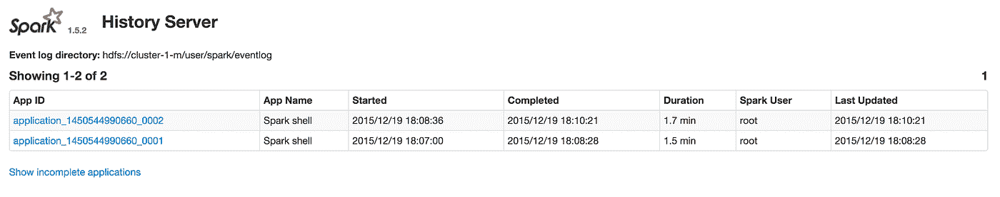

**纱线应用主控:** [http:// <主控](http://<Master) IP 地址> :8088/cluster

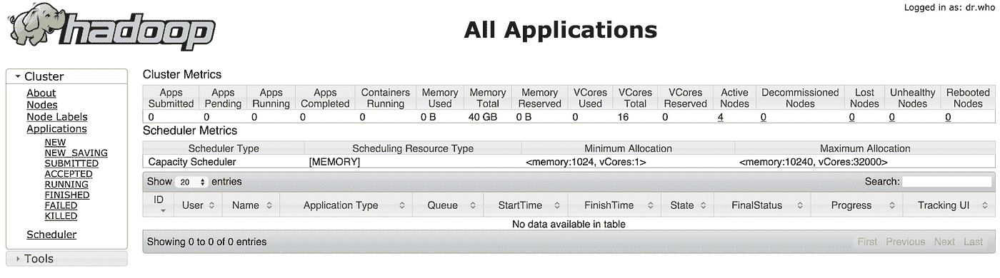

**Hadoop 作业历史服务器:** http:// <主 IP 地址> :19888/jobhistory

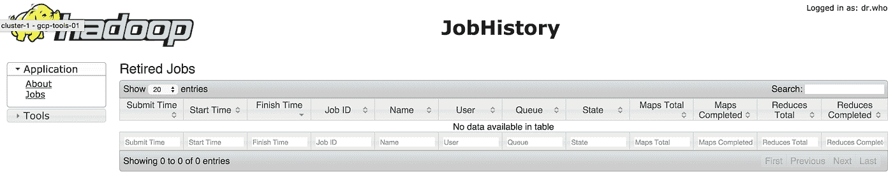

# 结论:

在几分钟内，你就有了它，甚至在不知道任何关于 **DataProc / Spark cluster 启动**的情况下，你将在 Google 云平台上拥有一个运行环境。

在这个过程中，你还可以选择一定数量的 [**可抢占虚拟机**](https://cloud.google.com/preemptible-vms/) 作为更多的执行者，这将比**计算引擎虚拟机**更便宜，它们将作为你的集群的一部分启动。

综上所述，这是一项付费服务，您需要考虑到这一点，**我认为大多数情况下，您希望运行 DataProc 是为了一段预先定义的时间作业，您需要启动一个集群，执行计算负载，然后销毁集群，而不是为了一个永远运行的 Spark 集群，您可能希望在其上进行调整并安装额外的工具。**

**那么，在 GCP 上运行 Apache Spark 还有其他选择吗？**
接下来我们将展示 Google 的[**BD util**](https://cloud.google.com/hadoop/bdutil)**，这是一个命令行工具，它提供 API 来管理 GCP 上的 Hadoop 和 Spark 工具，以及另一种方式**在 GCP** 之上启动 Mesos 集群 **，然后在其上运行 Apache Spark，****

****但那会在以后的博客文章中。****

**如果你有任何进一步的问题，请留下评论，希望这能帮助你进入 GCP 的火花世界。**

***原载于 2016 年 1 月 5 日 progexc.blogspot.co.il***。****