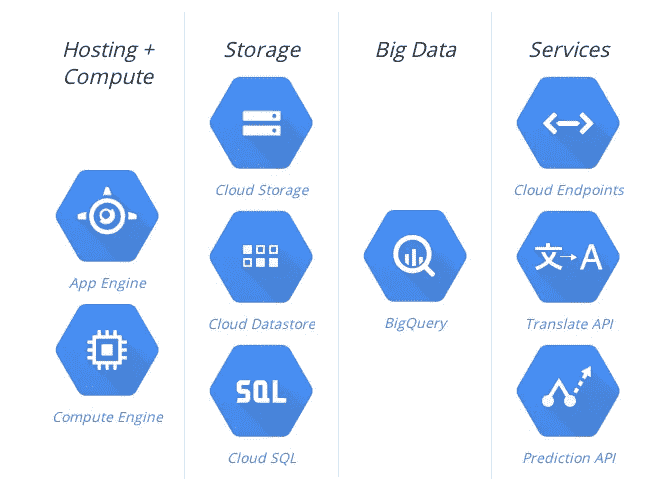

# 使用谷歌云的第 0 天

> 原文：<https://medium.com/google-cloud/day-0-with-google-cloud-202386080587?source=collection_archive---------0----------------------->

今天会很激动人心。这一天从一些需要我关注的临时任务开始，在午餐前完成。我们昨晚已经向谷歌申请了信用点数，并且正在申请中。

这些积分本身就是吸引我们使用谷歌云的主要原因，另一个原因是一个新项目的开始。虽然从任何云服务开始总是轻而易举的事情，但是将您当前的架构从一个服务提供商转移到另一个服务提供商就不那么容易了。我们已经在 AWS 上工作了一段时间，现在是时候探索其他云服务提供商了。

在今天之前，我花了很多时间了解谷歌的云平台，但我对谷歌云的实际知识仅限于应用引擎。但今天会不同，非常不同。

全部由谷歌云完成

所以按照我的习惯，我从平台的命令行工具开始， [GCLOUD](https://cloud.google.com/sdk/gcloud/) 实用程序为我服务。丰富的命令与详尽的控制在我的指尖。啊！当您的身份验证由 OAuth 令牌为平台本身管理的每个用户单独完成时，那种感觉。

接下来是检查 GCLOUD 的身份验证后重定向将我带到的页面。嗯，作为一个蜘蛛人(网络开发人员)，我知道最好的链接应该在标题上，瞧！[去我的控制台](https://console.developers.google.com/)‘哈哈带上我吧！带我走吧！！

对于那些说 UI 不如 CLI 好的人，这里是答案。您需要的一切，只需点击一个按钮。最好的东西，源代码集成和来自基于浏览器的终端的 SSH。虽然[即按即部署](https://cloud.google.com/tools/repo/push-to-deploy)与 [GitHub](http://github.com) 和 [BitBucket](http://bitbucket.com) 的集成已经存在一段时间了，即使对于免费用户来说，在企业版中拥有它也有它自己的好处。

我在 platform 上花了大约 90 分钟，在这么短的时间内，它让我感到惊讶。足以让我去寻找最佳实践。一个好的工具，需要小心处理和正确理解。[定价计算器](https://cloud.google.com/products/calculator)是理解权衡的良好开端，我将需要做出权衡，以便在优化系统的同时最大限度地降低成本。

从晚上开始，我一直在探索这个工具的各种可能性。点击部署，大查询，云 DNS 和端点，Google APIs，容器使用 [Docker](http://docker.com) ， [da daa do doo da daa](https://cloud.google.com/why-google/) ..这是一个人可能需要的全部。

让我们希望如此。早上开始发育。#晚安