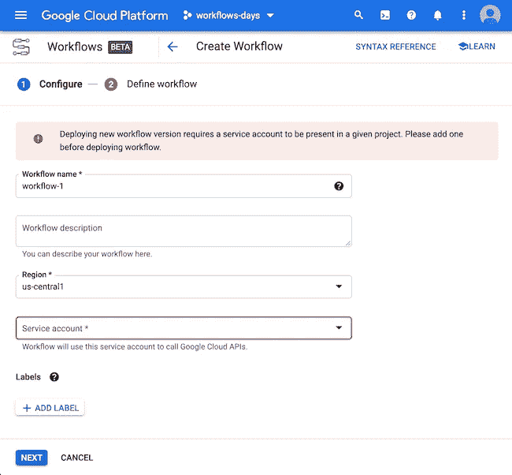

# 云工作流的第一天:你迈向“Hello World”的第一步

> 原文：<https://medium.com/google-cloud/day-1-with-cloud-workflows-your-first-step-to-hello-world-4b545064759e?source=collection_archive---------2----------------------->

随着越来越多的互连服务的出现，理解它们之间的交互变得至关重要。有了 Google [云工作流](https://cloud.google.com/workflows)，开发者可以通过创建无服务器工作流来编排和自动化这样复杂的系统。

在这一系列文章中，我们将一起学习如何使用云工作流，并了解它的所有功能，以及简单易懂的教程。第一天，我们将在[云控制台](https://console.cloud.google.com/)中发现并使用工作流 UI。我们将创建一个简单的“hello world”工作流，由一个简单的步骤组成。接下来，在接下来的几天里，我们将了解更多关于高级特性的内容。但是首先要做的是！

在 Google Cloud 控制台用户界面中，您可以在汉堡菜单的工具部分找到工作流:


您可以将此菜单项固定在列表的顶部。

第一次访问该页面时，您会看到以下屏幕，要求您启用工作流 API。所以只需点击“启用”:


启用 API 后，您将进入工作流主屏幕:


单击“创建”按钮创建您的第一个工作流定义:



为您的工作流找到一个名称(应该以字母开头)。您可以提供可选的描述。目前，只有“美国中心 1”可用于云工作流的测试版，但以后会有更多地区可用。

请注意，我们必须选择一个服务帐户，工作流将使用它来调用其他 Google Cloud APIs，但是这里有一个警告，告诉我们该项目需要一个服务帐户。因为我创建了一个全新的项目，所以我没有创建任何服务帐户。例如，如果您事先使用了云功能，就会创建一个默认的服务帐户。如果您需要创建服务帐户，您可以在“IAM & Admin >服务帐户”中创建一个，然后使用这个帐户。

我的第一个工作流将被称为“w01-first-workflow”:


点击“下一页”按钮进入下一部分。这是您定义工作流程的地方:


第一个工作流包含一个称为“sayHello”的步骤，其唯一目的是返回 hello world 消息:

```
- sayHello:
 return: Hello from Cloud Workflows!
```

如你所见，工作流定义是使用 [YAML](https://yaml.org/) 配置语言编写的。

单击“部署”以部署工作流。然后，您将看到新工作流程的详细信息。在“执行”选项卡中，您可以看到过去的执行情况。


在“日志”部分，您可以看到与您的工作流创建、部署和执行相关的日志消息:


在“定义”部分，您可以看到刚刚创建的 YAML 描述:


现在点击“执行”按钮。您将看到输入部分(我们将在下一篇文章中了解输入参数)，以及 YAML 定义。单击另一个“执行”按钮:


您将看到您的执行结果(“成功”，以及关于执行的其他细节)，以及输入和输出，还有我们的问候消息:


而你在这里！您创建了您的第一个工作流定义，并启动了此工作流的第一次执行！

在接下来的几天里，我们将更深入地了解工作流定义的结构(它的步骤)，如何定义输入参数，以及如何从命令行创建工作流的执行。

*最初发表于*[*【http://glaforge.appspot.com】*](http://glaforge.appspot.com/article/day-1-with-cloud-workflows-your-first-step-to-hello-world)*。*