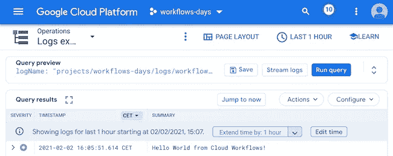

# 使用云工作流的第 13 天:使用云日志记录进行日志记录

> 原文：<https://medium.com/google-cloud/day-13-with-cloud-workflows-logging-with-cloud-logging-93c030ec2ed?source=collection_archive---------1----------------------->

是时候回到我们的云工作流系列了。有时，出于调试或审计的目的，能够通过云日志记录一些信息是很有用的。正如我们上个月看到的，您可以从工作流中调用 HTTP 端点。我们实际上可以使用[云日志的 REST API](https://cloud.google.com/logging/docs/reference/v2/rest/v2/entries/write) 来记录这样的消息！让我们看看实际情况。

```
- log:
    call: http.post
    args:
        url: [https://logging.googleapis.com/v2/entries:write](https://logging.googleapis.com/v2/entries:write)
        auth:
            type: OAuth2
        body:
            entries:
                - logName: ${"projects/" + sys.get_env("GOOGLE_CLOUD_PROJECT_ID") + "/logs/workflow_logger"}
                  resource:
                    type: "audited_resource"
                    labels: {}
                  textPayload: Hello World from Cloud Workflows!
```

我们调用 https://logging.googleapis.com/v2/entries:writeAPI 端点[来写入新的日志条目。我们通过 OAuth2 进行身份验证——只要用于工作流执行的服务帐户允许它使用日志 API。然后，我们传递一个 JSON 结构作为调用体，指示要使用的记录器的名称、它适用于哪些资源，以及包含我们的文本消息的 textPayload。您还可以使用${}表达式来记录更复杂的值。](https://logging.googleapis.com/v2/entries:write)

一旦完成并部署了这个工作流定义，您就可以执行它，并且您应该在日志中看到您的消息:



瞧啊。可以将消息记录到云日志！

让我们回顾一下这段视频:

在下一集，我们将利用子工作流来创建一组可重用的步骤，通过将这个日志记录示例转换为子工作流，您可以在整个工作流定义中多次调用这些步骤，而无需重复。

*原载于*[*http://glaforge.appspot.com*](http://glaforge.appspot.com/article/day-13-with-cloud-workflows-logging-with-cloud-logging)*。*