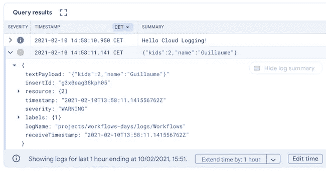

# 使用云工作流的第 15 天:内置云日志记录功能

> 原文：<https://medium.com/google-cloud/day-15-with-cloud-workflows-built-in-cloud-logging-function-823f5f77d5d6?source=collection_archive---------0----------------------->

在前两集里，我们看到了如何[创建和调用子工作流](http://glaforge.appspot.com/article/day-14-with-cloud-workflows-subworkflows)，我们将这一技术应用于创建一个可重用的云日志记录例程。然而，已经有一个内置函数可以实现这个目的！所以让我们来看看这个整合。

要调用内置日志记录函数，只需创建一个新步骤，并调用 sys.log 函数:

```
- logString:
    call: sys.log
    args:
        text: Hello Cloud Logging!
        severity: INFO
```

这个函数有一个强制参数:text。还有一个可选的:严重性。

text 参数接受所有类型的受支持值，因此它不仅是字符串，还包括所有类型的数字，以及数组和字典。它们的字符串表示将被用作文本。

可选的 severity 参数是一个枚举，它可以接受以下值:DEFAULT、DEBUG、INFO、NOTICE、WARNING、ERROR、CRITICAL、ALERT、EMERGENCY，如果没有指定 severity，则默认值为！

下面是另一个例子，使用一个字典作为参数，它将以文本形式输出到日志中，并带有警告的严重性:

```
- createDict:
    assign:
        - person:
            name: Guillaume
            kids: 2
- logDict:
    call: sys.log
    args:
        text: ${person}
        severity: WARNING
```

在云日志控制台中查看结果，您会看到两条消息:



不要犹豫，看看[参考文档](https://cloud.google.com/workflows/docs/reference/stdlib/sys/log)，找到更多关于可用内置函数的信息。

【http://glaforge.appspot.com】最初发表于[](http://glaforge.appspot.com/article/day-15-with-cloud-workflows-built-in-cloud-logging-function)**。**