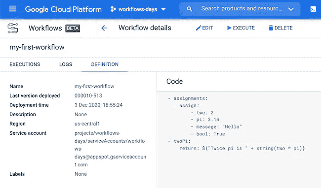

# 云工作流第 3 天:变量赋值和表达式

> 原文：<https://medium.com/google-cloud/day-3-with-cloud-workflows-variable-assignment-and-expressions-78da02ae15c3?source=collection_archive---------1----------------------->

既然我们的工作流定义中有多个步骤，那么让我们看看如何将数据从一个步骤传递到另一个步骤。



在一个步骤中，您可以为变量赋值。这些值可以是 int、doubles、strings 或 booleans(也可以是 null)。按如下方式使用 assign 关键字:

```
- assignments:
    assign:
        - two: 2
        - pi: 3.14
        - message: "Hello"
        - bool: True
```

这些变量在整个工作流范围内都可用，并且可以在其他步骤中访问。让我们看看如何利用这些变量做些什么。让我们向工作流定义添加第二步:

```
- twoPi:
    return: ${"Twice pi is " + string(two * pi)}
```

我们使用${}符号来创建一个表达式。我们将两个数字相乘，将它们转换成一个字符串，并将两个字符串连接在一起，得到最终值。

请注意，并非所有类型都允许所有操作，因此您可能需要使用内置的[转换函数](https://cloud.google.com/workflows/docs/reference/syntax?hl=en#conversion_functions)进行一些转换，如我们示例中的 string()函数。有各种各样的算术运算符或布尔逻辑运算符。

更多信息，你可以阅读关于[变量赋值](https://cloud.google.com/workflows/docs/reference/syntax?hl=en#assign-step)、[数据类型](https://cloud.google.com/workflows/docs/reference/syntax?hl=en#data_types)和[表达式](https://cloud.google.com/workflows/docs/reference/syntax?hl=en#expressions)。下一次，我们还将看看更复杂的数据类型。

*最初发表于*[*http://glaforge.appspot.com*](http://glaforge.appspot.com/article/day-3-with-cloud-workflows-variable-assignment-and-expressions)*。*