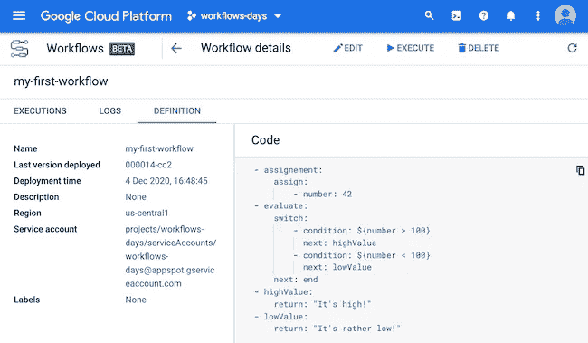

# 云工作流的第 4 天:在切换条件下跳跃

> 原文：<https://medium.com/google-cloud/day-4-with-cloud-workflows-jumping-with-switch-conditions-c2a42f75251f?source=collection_archive---------0----------------------->



由于“切换”指令，有条件地跳转到不同的步骤。

在之前关于谷歌的文章中，我们谈到了如何[云工作流](https://cloud.google.com/workflows) [分配变量，创建表达式](http://glaforge.appspot.com/article/day-3-with-cloud-workflows-variable-assignment-and-expressions)，以及如何[从一个步骤跳到另一个步骤](http://glaforge.appspot.com/article/day-2-with-cloud-workflows-a-workflow-is-made-of-steps-or-even-jumps)。多亏了 switch 指令，现在是时候结合这两个方面来理解我们如何进行条件转移了。

让我们从定义变量的第一步开始，我们将在 switch 条件中使用该变量的值:

```
- assignment:
    assign:
        - number: 42
```

然后，我们将创建第二个步骤，该步骤将使用 switch 指令，并带有一个表达式:

```
- evaluate:
    switch:
        - condition: ${number > 100}
          next: highValue
        - condition: ${number < 100}
          next: lowValue
    next: end
```

我们用两个表达式定义了两个条件，检查数字是大于还是小于 100，然后我们进入不同的步骤(高值或低值步骤)。如果没有一个条件得到满足，我们就转到工作流的末尾(或者我们可以返回一些值或者引发一些错误)。

我们还需要我们的两步走:

```
- highValue:
    return: "It's high!"
- lowValue:
    return: "It's rather low!"
```

我们完事了。如果数字是 42，就像在我们的例子中一样，工作流的执行将通过 lowValue 步骤，并返回字符串说它是一个低值。

感谢[开关条件](https://cloud.google.com/workflows/docs/reference/syntax?hl=en#jumps)，通过表达式和跳转，我们可以在工作流定义中拥有非线性逻辑。在接下来的文章中，我们还将了解如何使用更复杂的数据结构，如数组和字典，以及如何定义输入和输出。

*最初发表于*[*http://glaforge.appspot.com*](http://glaforge.appspot.com/article/day-4-with-cloud-workflows-jumping-with-switch-conditions)*。*