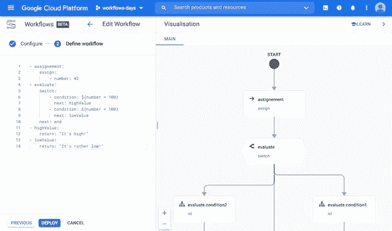

# 云工作流的第 5 天:可视化工作流定义的结构

> 原文：<https://medium.com/google-cloud/day-5-with-cloud-workflows-visualizing-the-structure-of-your-workflow-definition-c0ad7a5adeed?source=collection_archive---------1----------------------->

到目前为止，在我们的云工作流系列中，我们已经看到了一些用于定义工作流的 YAML 语法。然而，作为一系列步骤定义，步骤是一个接一个定义的，但是尽管有跳转指令和条件，您并不能真正直观地看到工作流执行中的下一个潜在步骤是什么。

幸运的是，一个新的 UI 增强功能已经登陆 Google Cloud Console:当您编辑定义时，可以用图形可视化工作流定义。此外，当您对定义进行更新时，图表会准实时更新。

让我们在下面的视频中看看这一点:

由于这种可视化，更容易进一步理解您的工作流定义是如何构造的，执行是如何操作的。您可以更容易地跟踪特定步骤之后的步骤。

尽情享受吧！

*最初发表于*[*【http://glaforge.appspot.com】*](http://glaforge.appspot.com/article/day-5-with-cloud-workflows-visualizing-the-structure-of-your-workflow-definition)*。*