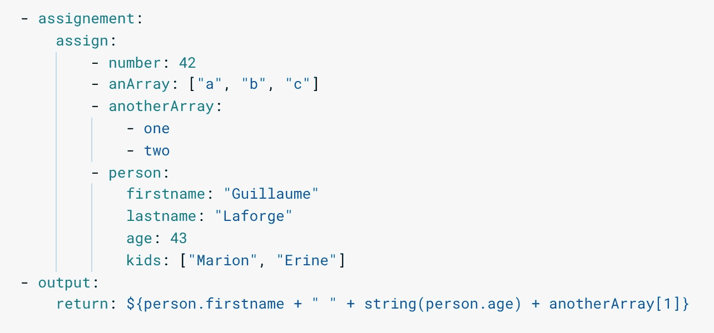

# 云工作流第 6 天:阵列和字典

> 原文：<https://medium.com/google-cloud/day-6-with-cloud-workflows-arrays-and-dictionaries-eb25fdde666?source=collection_archive---------3----------------------->



到目前为止，在这个关于[云工作流](https://cloud.google.com/workflows)的系列文章中，我们已经使用了简单的数据类型，比如字符串、数字和布尔值。然而，也可以使用更复杂的数据结构，比如[数组](https://cloud.google.com/workflows/docs/reference/syntax?hl=en#arrays)和[字典](https://cloud.google.com/workflows/docs/reference/syntax?hl=en#dictionaries)。在这一集里，我们将使用这些新的结构。

数组可以内联定义(如 Array)或跨几行定义(如 anotherArray):

```
- assignment:
    assign:
        - anArray: ["a", "b", "c"]
        - anotherArray:
            - one
            - two
- output:
    return: ${anArray[0] + anotherArray[1]}
```

对于词典，您可以按如下方式定义它们:

```
- assignment:
    assign:
        - person:
            firstname: "Guillaume"
            lastname: "Laforge"
            age: 43
            kids: ["Marion", "Erine"]
- output:
    return: ${person.firstname + " and " + person.kids[1]}
```

输出步骤将返回字符串“Guillaume and Erine”。

注意，我们在字典中嵌套了一个数组。因此，你可以很容易地创建包含数组的字典，包含其他字典，等等，就像任何 JSON 或 YAML 结构。

在这个例子中，我们能够访问这个人的第二个孩子，混合了字段(点)和索引(方括号)符号来访问我们的字典的字段和数组的元素。

这个视频展示了数组和字典的作用:

在接下来的文章中，我们将看到这样的数据结构对于处理 API 端点调用来说非常方便。

*原载于*[*http://glaforge.appspot.com*](http://glaforge.appspot.com/article/day-6-with-cloud-workflows-arrays-and-dictionaries)*。*