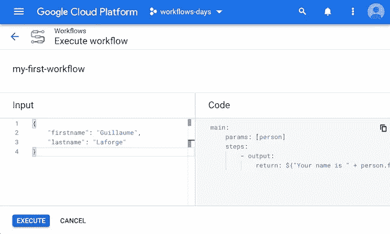

# 云工作流的第 7 天:向工作流传递一个输入参数

> 原文：<https://medium.com/google-cloud/day-7-with-cloud-workflows-pass-an-input-argument-to-your-workflow-7bd75dc63d9b?source=collection_archive---------3----------------------->

到目前为止，我们在本系列中看到的所有工作流定义都是独立的。它们没有被参数化。但是我们经常需要我们的业务流程接受参数(订单的 ID、订单的细节等。)，这样我们就可以对待那些输入值，并对它们做些什么。这就是工作流输入参数变得有用的地方！

让我们从一个简单的问候消息开始，我们希望用名字和姓氏对其进行定制。我们希望我们的工作流看起来像这样:

```
- output:
    return: ${"Your name is " + person.firstname + " " + 
               person.lastname}
```

在上面的例子中，我们有一个 person 变量，在这个变量上我们请求 firstname 和 lastname 字段。这实际上是一本字典。但是我们如何让云工作流知道这个变量呢？我们需要以某种方式定义它。

工作流参数对于所有步骤都是全局的，因此需要在步骤本身的范围之外定义它们。实际上，工作流可以由子工作流构成:有一个主工作流，可能还有附加的子工作流，比如例程或内部函数定义。我们将在后面的文章中再次讨论子工作流的主题。为了声明我们的输入参数，我们将在主工作流的级别上进行，但是以一种更明确的方式，使用下面的符号:

```
main:
    params: [person]
    steps:
        - output:
            return: ${"Your name is " + person.firstname + " " + 
                       person.lastname}
```

我们明确显示了主工作流的名称。我们使用 params 指令。请注意，我们的单个参数 person 用方括号括起来。主工作流只能接受一个字典参数，但是，正如我们将在后面看到的，子工作流可以接受几个输入参数，因此用方括号符号来指定参数列表。



我们如何传递这个输入参数？在执行屏幕中，在左侧的输入窗格中，我们创建了一个 JSON 对象，带有 firstname 和 lastname 键。这个 JSON 对象是我们的工作流定义的 person 变量中的字典。

在本视频中，您将看到实际的输入参数:

*最初发表于*[*【http://glaforge.appspot.com】*](http://glaforge.appspot.com/article/day-7-with-cloud-workflows-pass-an-input-argument-to-your-workflow)*。*