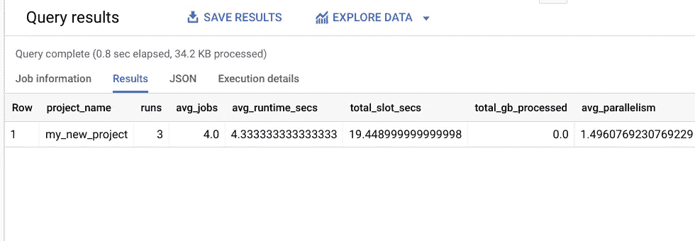

# DBT 大查询性能

> 原文：<https://medium.com/google-cloud/dbt-bigquery-performance-277b17f5613d?source=collection_archive---------0----------------------->

# 介绍

DBT 是编排和管理针对数据仓库运行的 SQL 的一个很好的工具。当使用 BigQuery 时，对 DBT 运行的进行**分析并捕获**插槽使用情况**和处理的**字节**来测量成本是很有用的。**

## DBT 增强

DBT [问题 2808](https://github.com/fishtown-analytics/dbt/issues/2808) 和 [PR 2809](https://github.com/fishtown-analytics/dbt/pull/2809) 用 dbt_invocation_id 为每个 BigQuery 作业添加了一个标签。这可以从 BigQuery 的 [INFORMATION_SCHEMA](https://cloud.google.com/bigquery/docs/information-schema-jobs) 作业日志中提取。作业日志可以按用户、项目、文件夹或组织提供，这完全取决于您的访问权限。您还可以从 BigQuery [审计日志](https://cloud.google.com/bigquery/docs/reference/auditlogs)中获取作业日志。在本例中，将使用 JOBS_BY_PROJECT。最后，跟踪 DBT 元数据的 [on-run-start](https://docs.getdbt.com/reference/project-configs/on-run-start-on-run-end) 钩子可以被组合。

*你到底是怎么问的？让我给你看看！*

# 跟踪绩效步骤

使用 Felipe Hoffa 的[开始使用 BigQuery 和 dbt，这是一个简单的方法](https://hoffa.medium.com/get-started-with-bigquery-and-dbt-the-easy-way-36b9d9735e35)让你的第一个模型运行起来。这叫做 first_model。

## 步骤 1:为 DBT 创建作业日志

在每次运行之前，创建运行日志表(如果它不存在),并插入一行，其中包含当前时间戳、调用 id 和 DBT 项目名称。可以添加其他元数据来跟踪许多其他细节。

这是添加到 dbt_project.yml 中的代码，可以添加到 first_project 中。DBT 提供了大量宏，包括 [invocation_id](https://docs.getdbt.com/reference/dbt-jinja-functions/invocation_id) 。

配置:

```
on-run-start:
  - >
    CREATE TABLE IF NOT EXISTS `<project>.temp.dbt_log`
    (start_time TIMESTAMP,
     invocation_id STRING,
     project_name STRING)
  - >
    INSERT INTO `<project>.temp.dbt_log` VALUES
    (CURRENT_TIMESTAMP(),
     '{{invocation_id}}',
     '{{project_name}}')
```

## 第二步:跑 DBT

从 first_project 目录正常运行 dbt:`./local/bin/dbt run`

## 第三步:分析结果

请记住，INFORMATION_SCHEMA 必须由**区域**指定。在下面的示例中，地区是欧盟。

使用子选择，我们可以将 INFORMATION_SCHEMA jobs 表中的匹配标签值连接到 dbt_log 表中。

首先，我们额外的一个查询分析 DBT 运行。这仅提取过去两天的数据(如果表已分区，则减少表扫描)。查询如下所示:

```
SELECT
  dbt_log.invocation_id,
  dbt_log.project_name,
  SUM(1) AS jobs,
  MIN(jobs.start_time) AS start_time,
  -- If there is no end_time (null), then runtime is 0.
  IFNULL(
    TIMESTAMP_DIFF(
      MAX(jobs.end_time),
      MIN(jobs.start_time),
      SECOND),
    0)
    AS runtime_secs,
  SUM(IFNULL(jobs.total_slot_ms, 0))/1e3
    AS total_slot_secs,
  SUM(IFNULL(jobs.total_bytes_processed, 0))/POW(2, 30)
    AS total_gb_processed
FROM
  `temp.dbt_log` dbt_log
  JOIN `region-eu.INFORMATION_SCHEMA.JOBS_BY_PROJECT` jobs
  ON (dbt_log.invocation_id =
      -- Select the value (any value) where key is dbt_invocation_id
      (SELECT ANY_VALUE(l.value) FROM jobs.labels l
       WHERE l.key='dbt_invocation_id')
     )
WHERE
  dbt_log.start_time >
    TIMESTAMP_SUB(CURRENT_TIMESTAMP(), INTERVAL 2 DAY) AND
  jobs.creation_time >
    TIMESTAMP_SUB(CURRENT_TIMESTAMP(), INTERVAL 2 DAY)
GROUP BY
  1,2
```

最后，我们将这些信息组合在一起，以获得汇总统计数据:

```
WITH
  RunAnalysis AS (
    <analysis query>
  )
SELECT
  project_name,
  SUM(1) AS runs,
  SUM(jobs)/SUM(1) AS avg_jobs,
  SUM(runtime_secs)/SUM(1) AS avg_runtime_secs,
  SUM(total_slot_secs) AS total_slot_secs,
  SUM(total_gb_processed) AS total_gb_processed,
  -- BigQuery has large variation in parallel. This is
  -- a crude measure of how many slots (on average) you're using
  -- in parallel during queries
  SUM(total_slot_secs)/SUM(runtime_secs) AS avg_parallelism,
  MIN(start_time) AS first_run,
  MAX(start_time) AS last_run
FROM
  RunAnalysis
GROUP BY
  1;
```

查询结果:



# 结论

通过将 DBT invocation_id 公开到 BigQuery 日志中，它支持丰富的数据分析模式。BigQuery 日志引用了表、完整查询和许多其他有趣的属性，这些属性可以与 DBT 运行和元数据相关联。