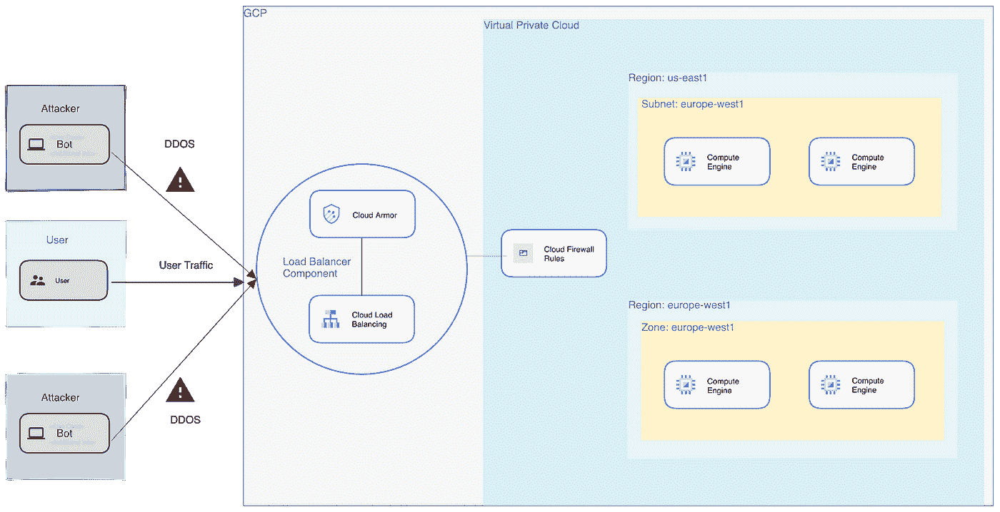

# DDOS 攻击和云防护

> 原文：<https://medium.com/google-cloud/ddos-attacks-cloud-armor-protections-1b7cf6213445?source=collection_archive---------1----------------------->

**什么是 DDOS**

DDOS 代表分布式拒绝服务攻击，在这种攻击中，攻击者向网站或服务器发送大量请求，使得网站或服务器无法处理这些请求并变得无响应

当攻击者形成一个被入侵的计算机网络，并立即向网站或服务器发送流量，阻塞带宽和资源，使网站或服务器无响应时，DDOS 攻击就被有效地执行了

DDOS 攻击正在增加，一些最大的企业也不能幸免于这种类型的攻击。DDOS 攻击可能是由各种原因造成的，从竞争对手试图搞垮在线业务到网络战

【DDOS 如何工作

DDOS 攻击通常是通过从互连设备的网络中同时发送流量来实施的。这种网络被称为**僵尸网络**。作为网络一部分的每个设备被称为**机器人**。机器人只不过是被指定执行某项工作的网络机器人。这些机器人可能包括被入侵的计算机、物联网设备、手机等。通常被入侵的设备也被称为僵尸，僵尸网络被称为僵尸军队

**僵尸网络**是由攻击者通过恶意软件感染受害者计算机而建立的，攻击者可以通过它向受害者计算机发送远程命令。攻击者建立僵尸网络并从代表命令&控制中心的 **C & C 控制它。控制设备的攻击者被称为机器人牧人，机器人牧人发送命令让机器人执行某个操作。僵尸主机使用 IRC 或 HTTP 作为通道向僵尸网络发送命令**

一旦攻击者建立了僵尸网络，他就让僵尸网络中的所有设备同时向特定的网站或服务器发送流量。这使服务器或网站不堪重负，最终无法使用

**DDOS 攻击的类型**

*   协议攻击
*   应用攻击
*   体积攻击

**协议攻击**

协议攻击通常是发生在 OSI 模型中**第 3 层—第 4 层(L3/L4)** 的攻击。协议攻击的例子有 SYN flood、UDP & ICMP flood 攻击。例如，SYN flood 攻击是一种攻击，攻击者可能从欺骗的 IP 地址向受害者服务器发送多个 TCP SYN 消息。受害服务器用 SYN-ACK 响应 SYN 消息。受害者然后等待接收来自客户端的 ACK。因为客户端在这里是非法的，所以服务器将永远不会接收到 ACK，并且因为服务器不能关闭连接，所以它将通过使会话表过载并最终变得无响应来保持连接打开

**应用攻击**

这些攻击的目标是在第 7 层(L7)压倒或耗尽目标系统的资源。应用程序攻击的常见例子是 HTTP flood。

HTTP 洪水

这是一种攻击，对手同时从多个受感染的系统(僵尸网络)发送 POST / GET 等 HTTP 请求。该请求将像一个合法的请求，而不是一个格式错误的数据包或基于欺骗的请求。

对手通常发送一个复杂的 HTTP 请求，这使得终端服务器分配大量资源来完成该请求。这增加了很多负载，并且多个类似的请求被发送到服务器，它变得不可用。

**体积攻击**

这是一种攻击，攻击者试图消耗互联网管道的所有可用带宽，例如通过从僵尸网络中的多个僵尸程序发送大量流量。由于所有的流量同时到达目标系统，它阻塞了互联网管道，从而使企业提供的服务不可用。

**谷歌云甲**

**Google Cloud Armor 是 Google Cloud** 提供的 DDOS 防护服务，保护客户免受 DDOS 攻击。用户可以获得谷歌在过去 20 年中为保护自己的基础设施而开发的相同服务。

Google Cloud Armor 通过与外部负载平衡器协同工作来抵御 DDOS 攻击。Cloud Armor 内置了安全策略，有助于抵御 DDOS 攻击。您可以使用预定义或自定义的规则集来防范攻击。Google Cloud Armor 在 Google 网络的边缘提供保护，防止接近源头的攻击。

(架构示例)

**谷歌云装甲托管保护**

Google Cloud Armor Managed Protection 是一项帮助抵御 DDOS 攻击和其他基于互联网的威胁的服务。它始终处于保护状态，保护负载平衡器免受 DDOS 威胁。

**谷歌云装甲自适应防护**

与托管保护一起启用的云防护自适应保护有助于抵御攻击，如 **HTTP flood 和其他第 7 层复杂攻击**。自适应保护具有机器学习模型，可检查潜在攻击的流量异常。如果它发现了潜在的攻击，它会立即创建一个签名，并将其应用到 WAF 规则来阻止特定的流量。

启用后，自适应保护需要 1 个小时来了解不同后端服务的流量基准。一旦学习并设置了基线，它就会监控流量，以发现与学习的基线相比的意外流量峰值。如果发现一个意外的峰值，它会立即对变化和潜在威胁发出警报。

**谷歌云盔甲如何工作**

Google Cloud Armor 与负载平衡器一起部署，提供针对**网络-L3/L4 攻击、应用-L7 和基于协议的容量攻击**的保护。它减少了网络攻击，只允许格式良好的数据包通过负载平衡代理。谷歌云盔甲附着在云边缘，防止恶意流量进入 VPC 网络。

云甲附着在:-

*   全局外部 HTTP(S)负载平衡器
*   全局外部 HTTP(S)负载平衡器(经典)
*   外部 TCP 代理负载平衡器
*   外部 SSL 代理负载平衡器

可见性和遥测是防御 DDOS 攻击的关键方面之一。Google Cloud Armor 根据请求捕获 l **ogs，并将其发送到云日志**。**实时警报被发送到云监控**进行查看，有关**流量峰值等信息被发送到安全指挥中心**进行调查

有关云甲的更多信息，请访问[此处](https://cloud.google.com/armor)