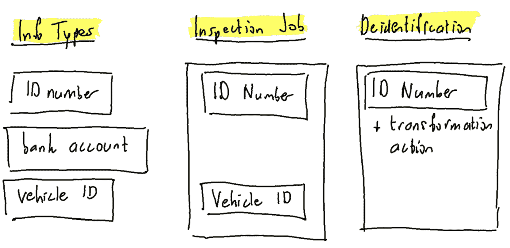
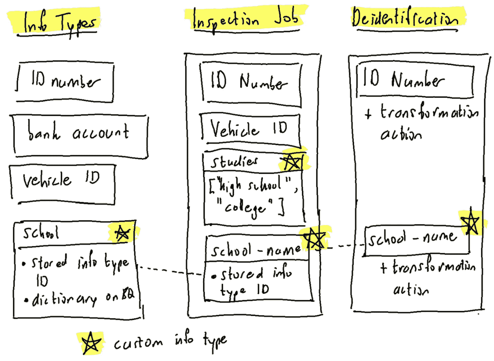
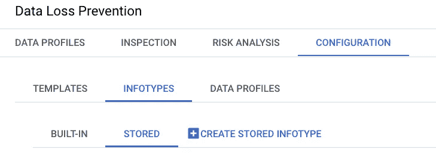
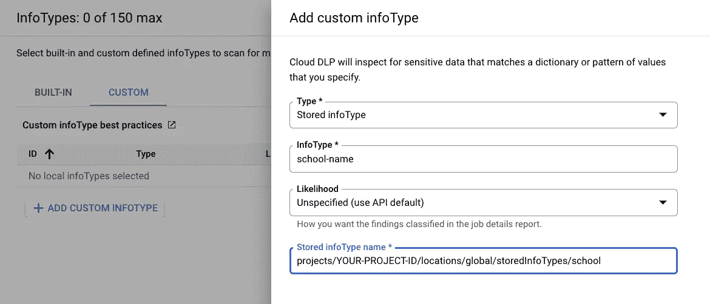
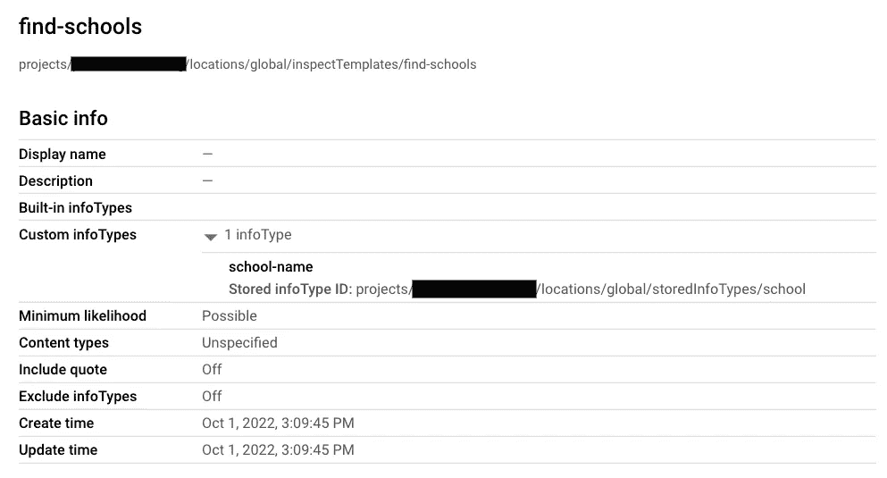
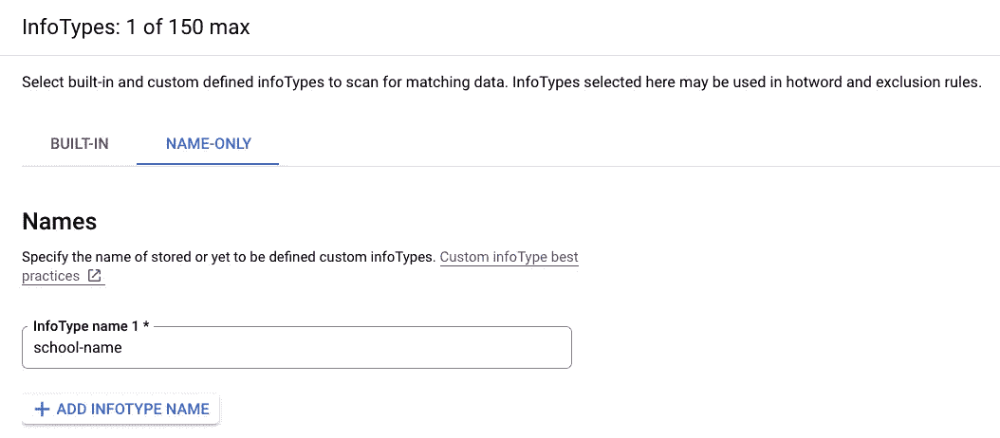
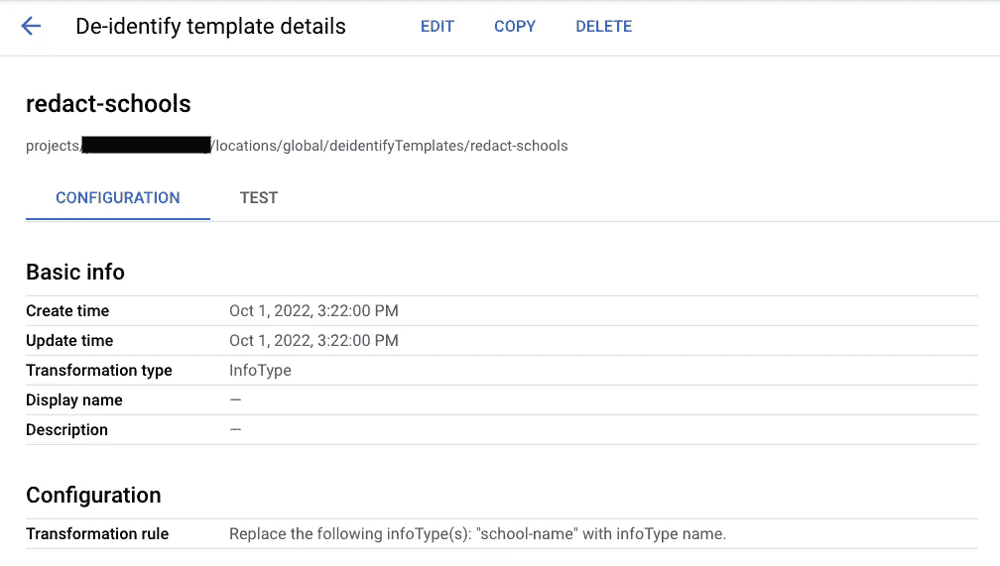
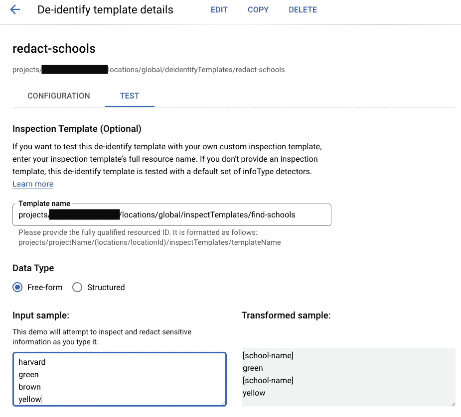

# 通过 Google Cloud 上的 DLP 使用自定义信息类型来识别数据

> 原文：<https://medium.com/google-cloud/de-identifying-data-using-custom-info-types-with-dlp-on-google-cloud-122f5729b0f9?source=collection_archive---------0----------------------->

谷歌云提供一种服务，通过屏蔽、加密或其他转换来查找和识别敏感数据。这项服务被称为数据丢失防护，简称 DLP。在撰写本文时，它预定义了 158 种类型的敏感数据或“信息类型”。这些信息从性别这样的简单信息，到西班牙国民身份号码、日本银行账号和美国车辆识别号码。但是，如果您有一个这些都不包括的项目列表，该怎么办呢？就像你们国家的学校，或者职业，或者其他什么…一个几个单词的字典，或者一本大字典，或者一个正则表达式？您需要自定义信息类型。这篇文章将描述这是如何工作的，但首先，基础。

# 数据丢失防护基础知识

DLP 作业将始终有一个“检验”部分，以及相应的“检验配置”。或者，它可以对检查的结果做一些事情，比如加密。这是在“去认同”中完成的。

检验配置将指定要识别的信息类型，取消识别将定义必要时要应用的操作。例如，我们可以识别银行账号并加密它们(可逆的)，或者散列它们(不可逆的)，或者通过用类似“X”的特定字符覆盖它们来屏蔽它们。还有许多其他选项，例如，日期都可以移动一段时间，以保留数据集中事件的时间线。

在下图中，我们展示了三种预定义的信息类型。检查作业只寻找其中的两个，ID 号和车辆 ID。减少信息类型的数量可以减少检查作业的延迟。在去标识步骤中，我们只对 ID 号进行转换，例如，我们可以对它进行哈希运算。我们还可以定义检查和取消识别模板，以简化不同作业的配置管理，但这不会改变概念。

检验作业可以使用信息类型。在可选的去标识步骤中，可以基于来自检查作业的一些信息类型将转换应用于发现。

像这样的预定义信息类型，有一个 ID，我们可以看到，它有一个实现，这是不公开的。我们不知道识别日本银行账号的算法，也找不到答案。我们只是通过 ID 来引用预定义的信息类型。

# 介绍自定义信息类型

如果我们有一个预定义的信息类型都不能满足的需求，我们可能需要自己定义一个信息类型。有许多不同的自定义类型，但基本上有一个基于正则表达式，还有几个基于字典。字典可以是我们输入 info 类型本身的单词列表，也可以是 Google 云存储上的文本文件，或者如果我们有一个非常大的字典，它可以存储在 BigQuery 上。

请注意，我们在这里讨论的是不同的信息类型是如何实现的。这是预定义信息类型的一个重要区别。

自定义信息类型可以在我们创建检验作业时定义，或者我们可以将自定义信息类型定义单独存储为“存储信息类型”，以便我们可以在另一个检验作业中重复使用。为了简单起见，假设我们想要在数据中隐藏人们上过的学校以及他们的学习水平的信息，这些信息只能是“高中”或“大学”。这个国家的学校数量是一个大字典，我们可能想要重复使用。因此，让我们为所有学校创建一个存储信息类型，我们可以在检查作业中定义学习级别。

预定义和自定义信息类型的混合(用星号标记)，用于检查作业和身份识别过程。

在检查作业中，我们首先为研究级别添加了一个自定义信息类型，它基于一个只有两个单词的单词列表，并且我们没有在外部存储它。

用于识别学校的信息类型存储在检验配置之外。stored info 类型被赋予一个名称以便于识别，它获得一个完全限定的资源 ID，并且它有一个实现:在本例中，是 BigQuery 上的一个字典。当我们在 inspect 配置中包含学校信息类型时，我们可以随意给它起一个我们想要的名字。我在这里选择了“学校名称”，以区别于存储的信息类型名称“学校”。inspect config 通过其完全限定的资源 ID(而不是名称)引用回存储类型。

inspect 配置中的定制信息类型有另一个属性，它没有出现在图中:可能性。基于预定义信息类型的搜索结果被分配一个可能性，例如，取决于一系列数字引用日本银行账户的可能性。对于存储的信息类型，我们可以指定我们的发现被分配的概率，范围从“非常不可能”到“非常可能”。例如，在作业级别，我们可以指定我们只希望看到至少是“可能”的结果。如果我们将自定义信息类型中的结果设置为“不太可能”，它们将被过滤。这种调整可以减少噪音，但是您也可以将所有结果保存到 BigQuery，并在那里进行过滤。

这些是概念，让我们看看这是如何在谷歌云控制台中完成的！

# 演示时间

我们将创建一个基于单词列表检测学校名称的存储信息类型，使用该信息类型定义一个检查模板，以及一个从文本中编辑学校的去标识模板。

首先，我们将跳转到您项目的 DLP 配置的[存储信息类型部分。点击“创建存储信息类型”按钮。](https://pantheon.corp.google.com/security/dlp/landing/configuration/infoTypes/stored)

Google Cloud 控制台中 DLP 配置的存储信息类型部分。

我们说过我们将在一个单词列表上创建一个存储的信息类型，在这个演示中，这省去了我们必须创建一个外部字典的麻烦。因此，选择“单词或短语列表”作为类型，输入“学校”作为信息类型 ID。我们将这种信息类型称为“学校”，我们将识别的学校列表仅限于“哈佛”、“耶鲁”和“布朗”。请注意，这将识别“Harvard ”,无论哪个字母是大写字母，哪个不是。创建信息类型。

基于单词列表创建存储的信息类型。

如果您返回到 DLP 配置的 stored infotypes 部分，您现在应该会看到一个名为“school”的信息类型。您可能希望单击它并复制信息类型的 ID，因为我们以后会需要它。它类似于“projects/YOUR-PROJECT-ID/locations/global/storedInfoTypes/school”，当然在正确的位置插入您的项目 ID。

现在让我们创建一个检查模板，稍后我们可以使用它来快速创建检查作业以查找学校名称。在 DLP 配置的[检验模板部分，点击“创建模板”。](https://pantheon.corp.google.com/security/dlp/landing/configuration/templates/inspect)

在模板创建过程的步骤 1 中，我们将模板 ID 设置为“find-schools”。在步骤 2 中，我们单击“管理信息类型”,在打开的侧面板中，我们选择“自定义”。这里没有列出任何类型，所以让我们将存储的信息类型添加到这个模板中。单击“添加自定义信息类型”，选择“存储信息类型”作为类型，使用“学校名称”命名，并提供我们之前创建的存储信息类型的 ID(记住用您的实际项目 ID 替换“您的项目 ID”)。

将我们的定制信息类型添加到检验模板中。

保存信息类型并创建模板。您现在应该看到您的检查模板配置，如下所示。

带有自定义存储信息类型的“查找学校”检查模板。

最后，我们将创建一个去识别模板，并测试它，看看它是否有效。转到 DLP 配置的[去识别模板部分，在那里点击“创建模板”。](https://pantheon.corp.google.com/security/dlp/landing/configuration/templates/deidentify)

在“定义模板”中，我们将使用“修订-学校”作为模板 ID。在步骤 2“配置取消标识”下，我们将选择“用信息类型名称替换”作为方法。我们可以将这个规则应用于检查模板中的所有信息类型，但是让我们把它明确化。选择“指定信息类型”和“管理信息类型”。一个侧面板打开，我们可以选择任何内置的信息类型，或者我们可以选择“仅名称”。点击它，然后“添加信息类型名称”。在这里，我们必须添加我们在检查模板中为此信息类型指定的名称“学校名称”。

将自定义信息类型添加到取消标识模板。

点击“完成”,确保“学校名称”信息类型已经列出。单击“创建”创建模板。

取消身份模板的详细信息。

现在我们终于到了真相大白的时刻。点击“测试”，看看这是否有效。请注意,“test”页面指定您输入的任何文本都将使用默认的信息类型列表进行扫描。从逻辑上讲，我们新的自定义信息类型不在这个列表中。因此，我们必须为此提供我们的检查模板。输入一些文本，看看它是否工作！

测试去识别模板。

使用自定义信息类型可以让您自由地扫描和识别特定领域的信息，例如本地学校名称，以及部门或使用正则表达式、特定用例的典型标识符，例如机票号码或航空业的预订参考。