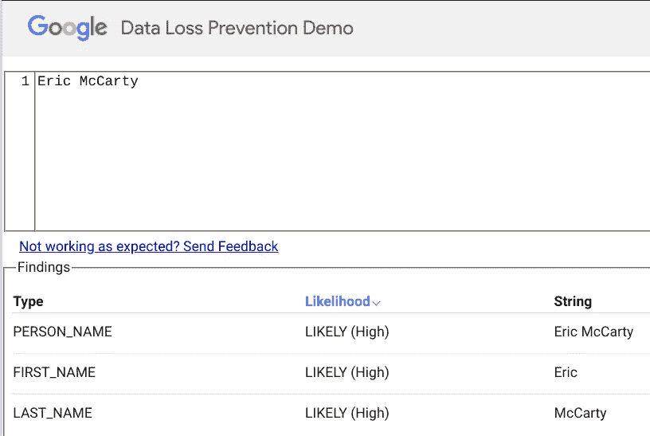
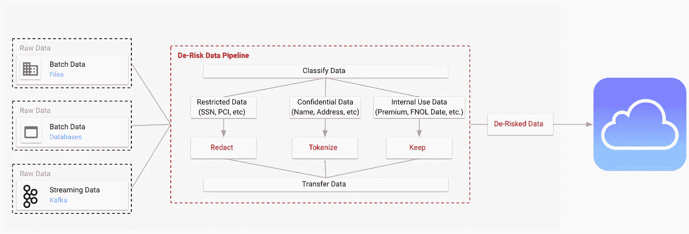
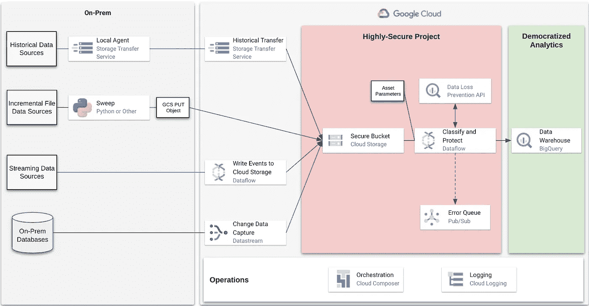

# 降低数据风险，加速您的云之旅:第 3 部分—将设计变为现实

> 原文：<https://medium.com/google-cloud/de-risk-your-data-to-accelerate-your-cloud-journey-part-3-turning-design-into-reality-363fd6c21e41?source=collection_archive---------1----------------------->

在将数据迁移到云的同时降低数据风险，可以帮助您在云之旅中尽早取得成功，而不会给业务增加不必要的风险。

肖恩·阿拉巴斯特在 [Unsplash](https://unsplash.com?utm_source=medium&utm_medium=referral) 上的照片

本系列的第 1 部分可以在[这里](https://ericmccarty.medium.com/de-risk-your-data-to-accelerate-your-cloud-journey-part-1-how-did-we-get-here-68eeab52762c)找到，它涵盖了高度监管和/或规避风险(这里称为 HRRA)的公司如何变得不敢将大型数据集迁移到公共云的历史。本系列的第 2 部分可以在[这里](https://ericmccarty.medium.com/de-risk-your-data-to-accelerate-your-cloud-journey-part-2-design-and-potential-pitfalls-2538592fc281)找到，它深入探讨了如何通过去风险数据管道和可能出现的潜在陷阱来加速您的云之旅。

但现实一点:截至目前，我们还没有谈到如何做任何事情。现在情况变了。

# 设计去风险数据管道

> 听起来不错，但我如何实际创建一个消除风险的数据管道，并降低进入公共云的门槛？

免责声明:本系列的第 1 部分和第 2 部分是特意与技术和云无关的。这是因为我相信，无论您选择什么样的公共云服务提供商，都应该应用这些原则和设计模式。但我确实为谷歌工作，我来这里工作的部分原因是因为我相信谷歌云平台(GCP)拥有技术堆栈和流程，是对您的数据风险最小的云。从这一点开始，一切都将变得相当 GCP 沉重。

以下是我认为 GCP 最适合成为您的数据分析之旅中风险最低的云的原因。

## 为什么 GCP 是对您的数据风险最小的云

*   [**云数据丢失预防(DLP**](https://cloud.google.com/dlp)**)**——当你让人们背诵 GCP 的服务时，通常是像 [BigQuery](https://cloud.google.com/bigquery) 、 [Kubernetes 引擎](https://cloud.google.com/kubernetes-engine)、[云运行](https://cloud.google.com/run)、以及[数据流](https://cloud.google.com/dataflow)等工具。这是有充分理由的:它们都是出色的、与众不同的产品，为客户带来了巨大的价值。但对我来说，这项服务没有得到应有的爱，那就是云 DLP:在我看来，它是这个星球上最好的敏感数据检测和保护工具。Cloud DLP 最适合用作本博客第 2 部分的[图 2 中所示的“分类”、“修订”和“标记化”框。现在就开始玩](https://miro.medium.com/max/1000/1*CXJH7LE2GDm5PJWVibr-kw.png) [DLP 演示](https://cloud.google.com/dlp/demo/)，看看这项技术有多强大。例如，如果你开始输入我的名字，并键入“埃里克”，它会说“可能”是一个名字。一旦你开始输入我的姓“McCarty ”,它会立刻识别出这很有可能是一个名字，甚至会把我的名和姓拼对。它能够通过使用谷歌庞大的训练数据集和机器学习能力来不断提高准确性，而大多数其他敏感数据检测工具使用简单的模式识别，这很容易出错。云 DLP 是您去风险数据管道的关键组成部分。稍后我们将对此进行详细介绍。

图 5 —您真正拥有的云 DLP 演示

*   **隐私和安全内置—** 好吧，这有点笼统，但谷歌确实为其隐私和安全姿态感到非常自豪。例子包括[谷歌设计的泰坦芯片为 GCP 服务器](https://cloud.google.com/blog/products/identity-security/titan-in-depth-security-in-plaintext)建立硬件信任根，谷歌的[零信任安全模型](https://cloud.google.com/beyondcorp)，以及[谷歌的零计划](https://en.wikipedia.org/wiki/Project_Zero)在世界上一些最大的漏洞如 Spectre 和 Meltdown 被 GCP 利用之前发现并修补它们。但我关注的是谷歌的网络，它承载着全球超过 25%的互联网流量。这使得 GCP 在通过专用主干网而不是公共互联网路由流量时具有优势。尽管大多数云提供商试图将流量转移到公共互联网以降低成本，但谷歌试图尽可能长时间地将流量保留在私有网络上以提高隐私性(以及可靠性和性能)。

图 6-GCP 的网络态势

*   **谷歌云风险保护计划(共担风险)——**如前所述，通常云提供商调用[共担责任模式](https://www.cloudpassage.com/articles/shared-responsibility-model-explained/):公共云提供商负责物理和基础设施安全，客户负责应用和数据安全。这导致在将数据迁移到云之前，与云客户签订法律协议的周期时间很长，以及前面提到的“安全性和治理接近完美”的情况。谷歌是第一个引入[风险保护计划](https://cloud.google.com/blog/products/identity-security/google-cloud-risk-protection-program-now-in-preview)的公司，该计划将客户推向一个命运共享而非责任共担的模式。这并不是说客户仍然没有责任，但这是公共云中的一种独特产品，有助于减轻公司可能感受到的风险负担。

## 去风险数据管道的设计选项

让我们再来看看本系列第 2 部分中去风险数据管道的高级设计:

基于这种设计，需要考虑许多因素。

*   **管道往哪里跑。**您可以完全在本地、完全在云端或混合环境中运行该管道。完全内部部署的优势在于，您可以确保没有敏感数据暴露在公共云中。缺点是，您不得不管理和扩展本地基础架构，协调数据中心之间的管道，并且您会失去一些 Cloud DLP 最丰富的功能。您还可以运行混合模式，在本地检测/编辑最敏感的数据资产(“受限数据”漏斗)，并在云中执行最复杂(但风险较低)的功能。*建议:*将所有原始数据推送到高度锁定的云区域，运行您的管道，并将您的去风险数据发布到其目的地。这允许您利用云，并且数据暴露将最小化。
*   **如何触发管道。**这可能看起来微不足道，但想象一下通过管道移动一条数据是很容易的。但是，当管道扩展到数百或数千个资产时，它会变得非常复杂。如何实际启动管道成为一个关键的决策:您可以为每个资产创建单独的管道实例，或者拥有一个定期运行的大规模管道，收集和处理所有“就绪”的资产独立实例的优势在于范围:一旦单个资产准备就绪，它就可以运行，任何失败都只会影响一个特定的实例。对于那些习惯于使用传统工具进行数据工程的人来说，这也感觉更舒服(遗留的 ETL 工具也是在“一次一个资产”的范例中工作的)。这种方法面临的挑战是规模和上市时间。管理数百或数千个作业变得非常复杂，尤其是当资产在不同的时间间隔到达，或者必须应用于所有事物的管道频繁变化时。*建议:*定期以中等规模的批次运行您的管道(通常是每 15 分钟一次)。以可有效管理的规模对特定领域或业务领域进行“准备就绪的处理”。这是 GCP 的另一个插件， [Cloud Dataflow](https://cloud.google.com/dataflow) 是实现这一目标的完美工具，因为它可以根据需要完成的工作量进行扩展。如果您晚上的工作负载很轻，而月底的工作负载很重，Dataflow 可以根据这些需求进行扩展，而团队不必预先管理和适当配置基础架构。
*   **历史负荷与增量负荷。**我经常在数据管道文章和博客中看到缺少的一点是缺乏对历史和增量管道的区分。很少会只使用新数据启动数据管道，而是需要首先加载 3 年、5 年、25 年或更长时间的历史数据，才能完成数据集。并且很可能您将需要一套不同的工具来处理您的历史负载，而不是您的增量负载(特别是如果增量负载将是流式的，而不是历史批处理)。如果您试图在数据移动时对其进行分类和保护，这可能是一个挑战，而且为本质上是一次性的移动创建一堆代码是很痛苦的。*建议:*与第一个考虑类似，如果您将原始数据推送到云中，并在那里处理您的管道，这将变得容易得多。您可能需要使用类似于[存储传输服务](https://cloud.google.com/storage-transfer-service)用于大型历史负载、[云存储 PUT 对象](https://cloud.google.com/storage/docs/xml-api/put-object)用于增量批处理负载、[云发布/订阅](https://cloud.google.com/pubsub)用于流接收、[数据流](https://cloud.google.com/datastream)用于 CDC 接收，以及其他接收方法。但是，如果您必须在每种方法中采用一种分类和保护策略，那么维护起来会很困难，并且可能会导致不同的输出。将原始数据接收到锁定的云存储桶中，然后您可以利用数据流扩展到历史或增量大小的处理，而无需预先配置基础架构。此外，您还可以拥有一个[统一代码库](https://beam.apache.org/)，用于分类和保护历史数据、增量批处理数据和增量流数据。

## 把所有的放在一起

考虑到这些因素，去风险数据管道看起来像什么？下面是一个高级参考架构示例:

去风险数据管道的参考架构

主要组件包括:

*   **多种摄入管道:**很多公司会试图向你推销一种一刀切的解决方案。但是一般来说，除非您非常幸运地在具有同构数据源的环境中工作，否则您需要合适的工具来完成这项工作。重要的是有一个一致的目的地，云存储是所有类型的数据源最容易访问的。
*   **分类和保护:**数据流是管道的重要组成部分，它最适合于此，因为它能够根据工作负载进行扩展。如上所述，我建议在特定的、可管理的域中，以固定的时间间隔对所有资产批量运行这个。正如本博客系列的第 2 部分所描述的，随着要保护的元素数量的增加，复杂性会增加，但是不管怎样，错误或问题还是会时有发生。为未达到保护信心阈值的数据建立一个错误队列，可以在未来运行时对其进行筛选、批准/拒绝和重新处理，而不是硬停止。利用 DLP 作为您的分类和保护功能的大脑，将大大降低您的数据风险，因为您的管道将数据移出高度安全的区域。
*   **民主化的分析:**流程的最后是皇冠上的明珠:一个无风险的分析环境，使您的公司能够在没有通常与云分析相关的数据风险的情况下做出业务决策。作为 Forrester 云数据仓库浪潮中[最强的领导者](https://cloud.google.com/forrester-wave-cloud-data-warehouse-2021)，BigQuery 是加速您的分析之旅的显而易见的选择。

这些只是指导方针，在为您的组织做类似的事情时，有许多因素需要考虑。我很乐意听到您在将分析工作负载转移到云中时，为降低数据风险而做出的修改或其他想法。如果你想讨论或发表意见，请给我留言:[emccarty@google.com](mailto:emccarty@google.com)或[在 LinkedIn](https://www.linkedin.com/in/jemccarty/) 上联系我。

*额外收获:如果你想探索使用 DLP 和云函数构建管道的教程，这是一个非常适合增量批处理流的过程，请随意遵循此处[列出的步骤](https://cloud.google.com/architecture/automating-classification-of-data-uploaded-to-cloud-storage)。这将提供一个很好的视角，让你知道怎样做才能满足你公司的需求。