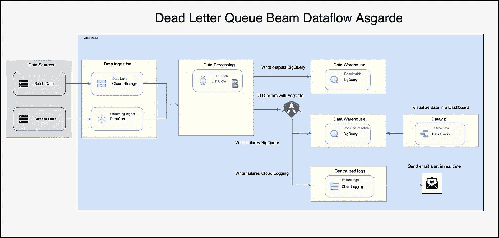
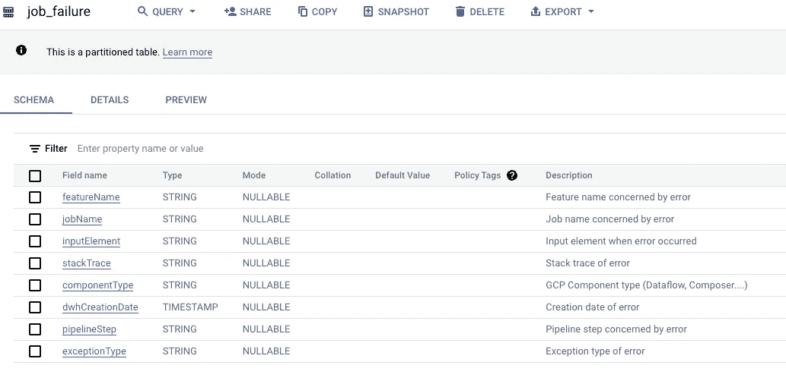
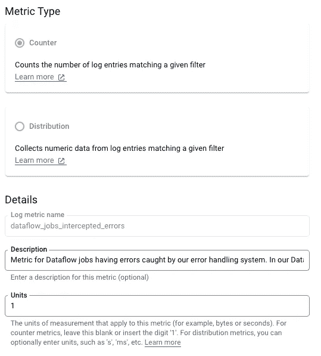
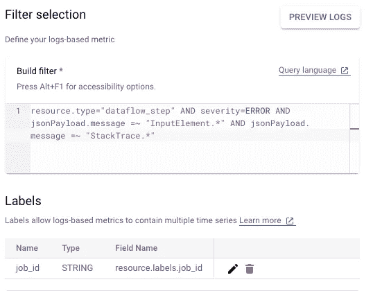
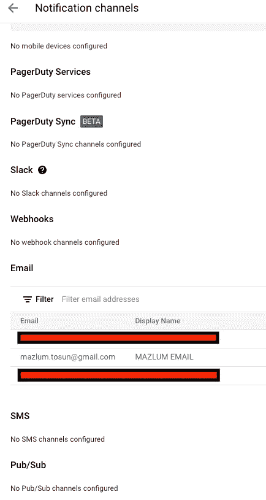
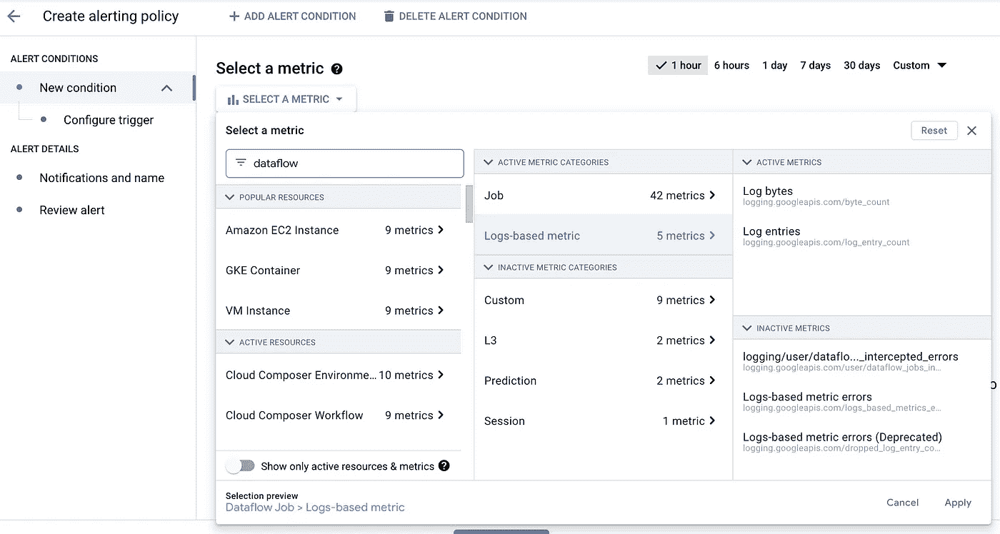
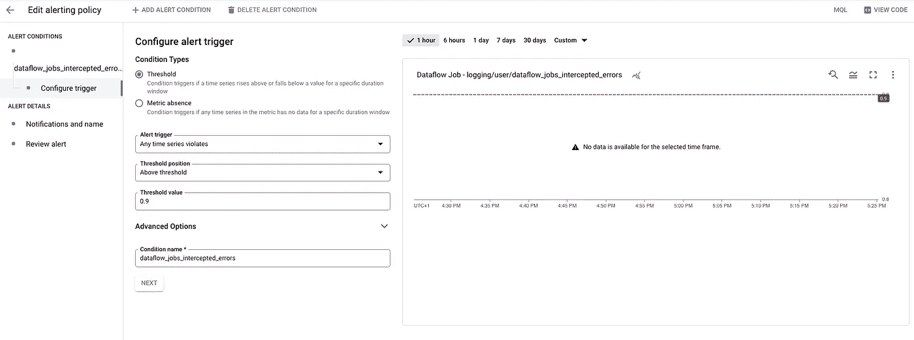
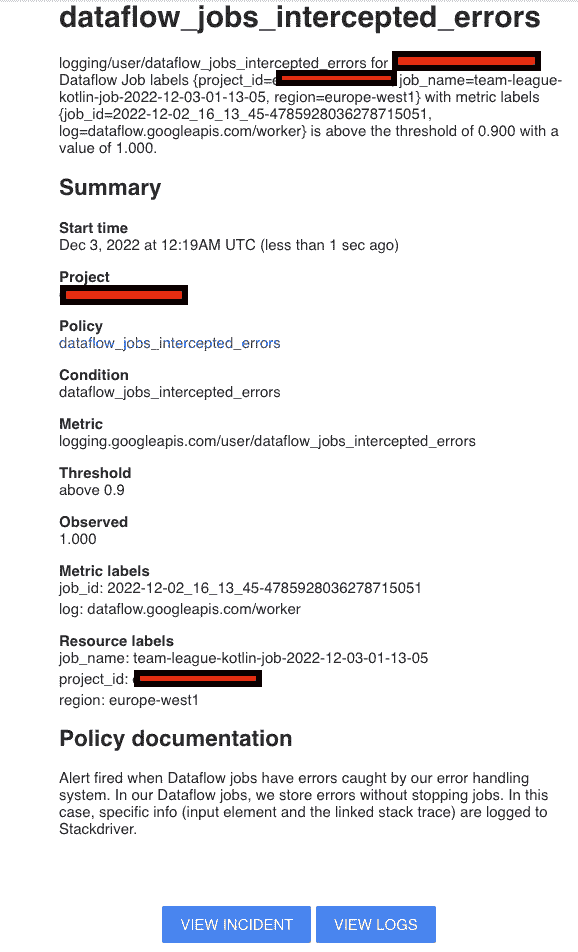
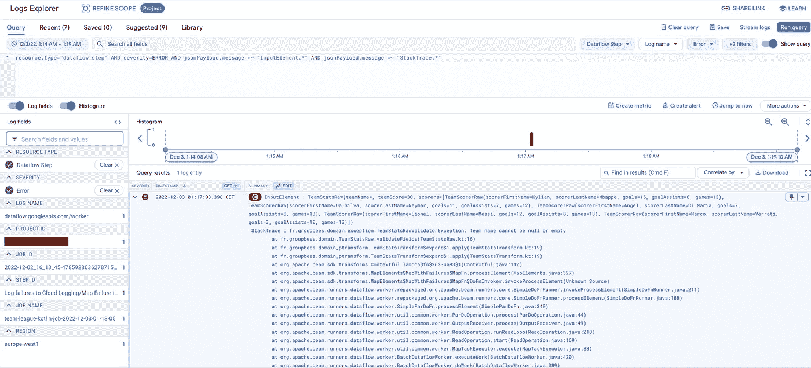
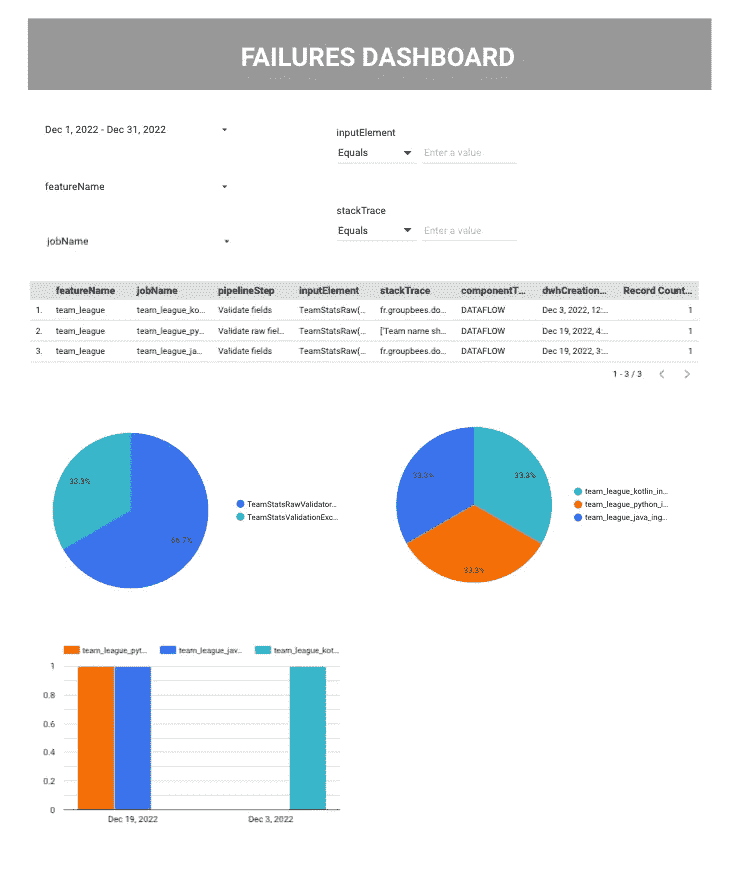

# 死信队列，用于波束、Asgarde、数据流和实时报警的错误

> 原文：<https://medium.com/google-cloud/dead-letter-queue-for-errors-with-beam-asgarde-dataflow-and-alerting-in-real-time-5745225e12b7?source=collection_archive---------0----------------------->

本文的目标是展示一个用例，其中的一个`Beam`管道包含一个`dead letter queue`，用于处理通过`Asgarde`库应用的错误。

关于`Asgarde`库的更多细节，可以查看这篇文章:

[](/google-cloud/error-handling-with-apache-beam-presentation-of-asgarde-ce5e5dfb2d74) [## Apache Beam 的错误处理:Asgarde 演示

### 波束 ParDo 和 DoFn 的误差逻辑

medium.com](/google-cloud/error-handling-with-apache-beam-presentation-of-asgarde-ce5e5dfb2d74) 

# 1.本文中出现的用例的解释

`dead letter queue`是一种在不中断作业的情况下捕捉数据管道中的错误的方法。这项技术很有趣，因为错误不会丢失，并且可以根据错误处理策略在最佳存储服务中消失:

*   可以在`PubSub topic`中发送错误以重新加载
*   错误可以存储在一个`Bigquery`表中，以允许开发团队或合作伙伴分析错误，并在仪表板中显示它们
*   可以将错误写入`Cloud storage`文件，稍后以`batch`模式重新加载

在本文中，选择了一个`Bigquery`表中的存储。

> *`***Beam***`***作业包含 2 个汇:****

*   *写在`Bigquery`表中的良好输出*
*   *记录在`Bigquery`表和`Cloud Logging`中的故障*

> ****故障将以如下方式被利用:****

*   *当在`Cloud Logging`中写入故障时，会实时发送电子邮件警报*
*   *一个`Datastudio`仪表板将显示一个日期范围内的故障*

*这里你可以看到这篇文章的用例图:*

**

# *2.具有梁本机的死信队列*

*在这一节中，我们将展示如何使用`Beam` native 应用死信队列和错误处理。*

## ***2.1 用梁 Java 的例子***

*为了应用`dead letter queue`和错误处理，`Beam`建议用以下方式处理侧输出:*

*   *`TupleTags`在`DoFn`类中*
*   *内置组件`MapElements``FlatMapElements``exceptionInto`和`exceptionVia`的方法，举例:*

```
*@Override
public Result<PCollection<TeamStats>, Failure> expand(PCollection<TeamStatsRaw> input) {
    Result<PCollection<TeamStatsRaw>, Failure> res1 = input.apply("Validate fields", MapElements
            .into(of(TeamStatsRaw.class))
            .via(TeamStatsRaw::validateFields)
            .exceptionsInto(of(Failure.class))
            .exceptionsVia(exElt -> Failure.from("Validate fields", exElt)));

    PCollection<TeamStatsRaw> output1 = res1.output();
    PCollection<Failure> failure1 = res1.failures();

    Result<PCollection<TeamStats>, Failure> res2 = output1.apply("Compute team stats", MapElements
            .into(of(TeamStats.class))
            .via(TeamStats::computeTeamStats)
            .exceptionsInto(of(Failure.class))
            .exceptionsVia(exElt -> Failure.from("Compute team stats", exElt)));

    PCollection<TeamStats> output2 = res2.output();
    PCollection<Failure> failure2 = res2.failures();

    final TransformToTeamStatsWithSloganFn toStatsWithSloganFn = new TransformToTeamStatsWithSloganFn(
            "Add team slogan",
            slogansSideInput
    );
    final PCollectionTuple res3 = output2.apply(name,
            ParDo.of(toStatsWithSloganFn)
                    .withOutputTags(toStatsWithSloganFn.getOutputTag(), TupleTagList.of(toStatsWithSloganFn.getFailuresTag()))
                    .withSideInput("slogans", slogansSideInput));

    PCollection<TeamStats> output3 = res3.get(toStatsWithSloganFn.getOutputTag());
    PCollection<Failure> failure3 = res3.get(toStatsWithSloganFn.getFailuresTag());

    PCollection<Failure> allFailures = PCollectionList
            .of(failure1)
            .and(failure2)
            .and(failure3)
            .apply(Flatten.pCollections());

    return Result.of(output3, allFailures);
}*
```

*这种方法的问题是，代码冗长，我们必须重复技术代码来处理错误。*

***链接到 Github 库:***

*[](https://github.com/tosun-si/teams-league-java-dlq-native-beam-summit/blob/main/src/main/java/fr/groupbees/domain_ptransform/TeamStatsTransform.java) [## teams-league-Java-dlq-native-beam-summit/teamstatsform . Java at main…

### 此时您不能执行该操作。您已使用另一个标签页或窗口登录。您已在另一个选项卡中注销，或者…

github.com](https://github.com/tosun-si/teams-league-java-dlq-native-beam-summit/blob/main/src/main/java/fr/groupbees/domain_ptransform/TeamStatsTransform.java) 

## **2.2 梁 Python 示例**

在`Python` sdk 中，原理是一样的，我们必须在一个`DoFn`类中使用`TupleTag`，例如:

```
def expand(self, inputs: PCollection[TeamStatsRaw]) -> \
        Tuple[PCollection[TeamStats], PCollection[Failure]]:
    # When.
    outputs_map1, failures_map1 = (
            inputs | VALIDATE_FIELDS >> ParDo(TeamStatsRawFieldsValidationFn(VALIDATE_FIELDS))
            .with_outputs(FAILURES, main='outputs')
    )

    outputs_map2, failures_map2 = (
            outputs_map1 | COMPUTE_TEAM_STATS >> ParDo(TeamStatsMapperFn(COMPUTE_TEAM_STATS))
            .with_outputs(FAILURES, main='outputs')
    )

    final_outputs, failures_map3 = (
            outputs_map2 | ADD_SLOGAN_TEAM_STATS >>
            ParDo(
                TeamStatsWithSloganFn(ADD_SLOGAN_TEAM_STATS),
                AsSingleton(self.slogans_side_inputs)
            )
            .with_outputs(FAILURES, main='outputs')
    )

    result_all_failures = (
            (failures_map1, failures_map2, failures_map3)
            | 'All Failures PCollections' >> beam.Flatten()
    )

    return final_outputs, result_all_failures
```

至于 Java 部分，问题是相同的，我们必须重复错误处理的技术代码。

**链接到 Github 库:**

[](https://github.com/tosun-si/teams-league-python-dlq-native-beam-summit/blob/main/team_league/domain_ptransform/team_stats_transform.py) [## teams-league-python-dlq-native-beam-summit/team _ stats _ transform . py at main…

### 此时您不能执行该操作。您已使用另一个标签页或窗口登录。您已在另一个选项卡中注销，或者…

github.com](https://github.com/tosun-si/teams-league-python-dlq-native-beam-summit/blob/main/team_league/domain_ptransform/team_stats_transform.py) 

# 3.带 Asgarde 库的死信队列

在这一节中，我们将展示如何使用`Beam`和`Asgarde`库应用死信队列和错误处理。

## **3.1 用 Asgarde Java 的例子**

`Asgarde` `Java`提出了一个`CollectionComposer`类，用更少的代码和更有表现力的代码来简化错误处理:

```
@Override
public Result<PCollection<TeamStats>, Failure> expand(PCollection<TeamStatsRaw> input) {
    return CollectionComposer.of(input)
            .apply("Validate fields", MapElements.into(of(TeamStatsRaw.class)).via(TeamStatsRaw::validateFields))
            .apply("Compute team stats", MapElementFn
                    .into(of(TeamStats.class))
                    .via(TeamStats::computeTeamStats)
                    .withStartBundleAction(() -> LOGGER.info("####################Start bundle compute stats")))
            .apply("Add team slogan", MapProcessContextFn
                            .from(TeamStats.class)
                            .into(of(TeamStats.class))
                            .via(c -> addSloganToStats(c, slogansSideInput))
                            .withSetupAction(() -> LOGGER.info("####################Start add slogan")),
                    Collections.singletonList(slogansSideInput))
            .getResult();
}
```

**链接到 Github 库:**

[](https://github.com/tosun-si/teams-league-java-dlq-asgarde-beam-summit/blob/main/src/main/java/fr/groupbees/domain_ptransform/TeamStatsTransform.java) [## teams-league-Java-dlq-as garde-beam-summit/teamstatsform . Java at main…

### 此时您不能执行该操作。您已使用另一个标签页或窗口登录。您已在另一个选项卡中注销，或者…

github.com](https://github.com/tosun-si/teams-league-java-dlq-asgarde-beam-summit/blob/main/src/main/java/fr/groupbees/domain_ptransform/TeamStatsTransform.java) 

## 【with Asgarde Kotlin 的例子

`Asgarde`还提议用更多的函数式编程风格对`Kotlin`进行扩展:

```
override fun expand(input: PCollection<TeamStatsRaw>): Result<PCollection<TeamStats>, Failure> {
    return CollectionComposer.of(input)
        .map("Validate fields") { it.validateFields() }
        .mapFn(
            name = "Compute team stats",
            startBundleAction = { LOGGER.info("####################Start bundle compute stats") },
            transform = { TeamStats.computeTeamStats(it) })
        .mapFnWithContext<TeamStats, TeamStats>(
            name = "Add team slogan",
            setupAction = { LOGGER.info("####################Start add slogan") },
            sideInputs = listOf(slogansSideInput),
            transform = { addSloganToStats(it, slogansSideInput) }
        )
        .result
}
```

**链接到 Github 库:**

[](https://github.com/tosun-si/teams-league-kotlin-dlq-asgarde-beam-summit/blob/main/src/main/kotlin/fr/groupbees/domain_ptransform/TeamStatsTransform.kt) [## teams-league-kot Lin-dlq-as garde-beam-summit/teamstats transform . kt at main…

### 通过在 GitHub 上创建一个帐户，为 tosun-si/teams-league-kot Lin-dlq-as garde-beam-summit 开发做出贡献。

github.com](https://github.com/tosun-si/teams-league-kotlin-dlq-asgarde-beam-summit/blob/main/src/main/kotlin/fr/groupbees/domain_ptransform/TeamStatsTransform.kt) 

## **3.3 Asgarde Python 的例子**

`Asgarde` `Python`与`Java`库中一样，提出了一个`CollectionComposer`类来简化错误处理:

```
def expand(self, inputs: PCollection[TeamStatsRaw]) -> \
            Tuple[PCollection[TeamStats], PCollection[Failure]]:
    result = (CollectionComposer.of(inputs)
              .map("Validate raw fields", lambda t_raw: t_raw.validate_fields())
              .map("Compute team stats", TeamStats.compute_team_stats)
              .map("Add slogan to team stats",
                   self.add_slogan_to_stats,
                   slogans=AsSingleton(self.slogans_side_inputs),
                   setup_action=lambda: '######### Start add slogan to stats actions')
              )

    return result.outputs, result.failures
```

**链接到 Github 库:**

[](https://github.com/tosun-si/teams-league-python-dlq-asgarde-beam-summit/blob/main/team_league/domain_ptransform/team_stats_transform.py) [## teams-league-python-dlq-as garde-beam-summit/team _ stats _ transform . py at main…

### 通过在 GitHub 上创建一个帐户，为 tosun-si/teams-league-python-dlq-as garde-beam-summit 开发做出贡献。

github.com](https://github.com/tosun-si/teams-league-python-dlq-asgarde-beam-summit/blob/main/team_league/domain_ptransform/team_stats_transform.py) 

# 4.波束管道故障 IO

在本例中，管道输出为:

*   写在`Bigquery`表中的良好输出
*   用写在`Bigquery`表中的`Beam/Asgarde`捕获的故障，用于在仪表板中分析和展示
*   用包含输入元素和堆栈跟踪的特定`log` `pattern`在`Cloud logging`中编写的故障

`BigQuery` `job_failure`表的模式是:



为了节省成本，我们在`dwhCreationDate`字段上每天添加一个**分区**。

我们还在`featureName` `jobName` `componentType`和`pipelineStep`字段上添加了一个**聚类**，以提高用户使用 **WHERE** 子句时的查询性能。

`json`模式:

```
[
    {
        "name": "featureName",
        "type": "STRING",
        "mode": "NULLABLE",
        "description": "Feature name concerned by error"
    },
    {
        "name": "jobName",
        "type": "STRING",
        "mode": "NULLABLE",
        "description": "Job name concerned by error"
    },
    {
        "name": "pipelineStep",
        "type": "STRING",
        "mode": "NULLABLE",
        "description": "Pipeline step concerned by error"
    },
    {
        "name": "inputElement",
        "type": "STRING",
        "mode": "NULLABLE",
        "description": "Input element when error occurred"
    },
    {
        "name": "exceptionType",
        "type": "STRING",
        "mode": "NULLABLE",
        "description": "Exception type of error"
    },
    {
        "name": "stackTrace",
        "type": "STRING",
        "mode": "NULLABLE",
        "description": "Stack trace of error"
    },
    {
        "name": "componentType",
        "type": "STRING",
        "mode": "NULLABLE",
        "description": "GCP Component type (Dataflow, Composer....)"
    },
    {
        "name": "dwhCreationDate",
        "type": "TIMESTAMP",
        "mode": "NULLABLE",
        "description": "Creation date of error"
    }
]
```

## 4.1 Beam Java 中 **BigQuery IO** 的代码

```
public PTransform<PCollection<Failure>, ? extends POutput> write() {
    return BigQueryIO.<Failure>write()
            .withMethod(BigQueryIO.Write.Method.FILE_LOADS)
            .to(failureConf.getOutputDataset() + "." + failureConf.getOutputTable())
            .withFormatFunction(failure -> toFailureTableRow(failureConf, failure))
            .withCreateDisposition(BigQueryIO.Write.CreateDisposition.CREATE_NEVER)
            .withWriteDisposition(BigQueryIO.Write.WriteDisposition.WRITE_APPEND);
}

private static TableRow toFailureTableRow(FailureConf failureConf, Failure failure) {
    val creationDate = Instant.now().toString();

    return new TableRow()
            .set(FEATURE_NAME.getValue(), failureConf.getFeatureName())
            .set(PIPELINE_STEP.getValue(), failure.getPipelineStep())
            .set(JOB_NAME.getValue(), failureConf.getJobName())
            .set(INPUT_ELEMENT.getValue(), failure.getInputElement())
            .set(EXCEPTION_TYPE.getValue(), failure.getException().getClass().getSimpleName())
            .set(STACK_TRACE.getValue(), ExceptionUtils.getStackTrace(failure.getException()))
            .set(COMPONENT_TYPE.getValue(), COMPONENT_TYPE_VALUE)
            .set(DWH_CREATION_DATE.getValue(), creationDate);
}
```

**链接到 Github 库:**

[](https://github.com/tosun-si/teams-league-java-dlq-asgarde-beam-summit/blob/main/src/main/java/fr/groupbees/infrastructure/io/bigquery/FailureBigqueryIOAdapter.java) [## teams-league-Java-dlq-as garde-beam-summit/failurebigqueryioadapter . Java at main…

### 此时您不能执行该操作。您已使用另一个标签页或窗口登录。您已在另一个选项卡中注销，或者…

github.com](https://github.com/tosun-si/teams-league-java-dlq-asgarde-beam-summit/blob/main/src/main/java/fr/groupbees/infrastructure/io/bigquery/FailureBigqueryIOAdapter.java) 

## **4.2 Beam Java 中云日志 IO 代码**

```
public PDone expand(PCollection<Failure> input) {
    input.apply(STEP_MAP_FAILURE_JSON_STRING, new LogTransform());
    return PDone.in(input.getPipeline());
}

static class LogTransform extends PTransform<PCollection<Failure>, PCollection<String>> {
    public PCollection<String> expand(PCollection<Failure> input) {
        return input
                .apply(STEP_MAP_FAILURE_JSON_STRING, MapElements
                        .into(strings())
                        .via(FailureCloudLoggingWriteTransform::toFailureLogInfo))
                .apply(STEP_LOG_FAILURE, MapElements.into(strings()).via(this::logFailure));
    }

    private String logFailure(String failureAsString) {
        LOGGER.error(failureAsString);
        return failureAsString;
    }
}

private static String toFailureLogInfo(Failure failure) {
    val inputElementInfo = "InputElement : " + failure.getInputElement();
    val stackTraceInfo = "StackTrace : " + ExceptionUtils.getStackTrace(failure.getException());

    return inputElementInfo + "\n" + stackTraceInfo;
}
```

**Github 资源库的链接:**

[](https://github.com/tosun-si/teams-league-java-dlq-asgarde-beam-summit/blob/main/src/main/java/fr/groupbees/infrastructure/io/cloudlogging/FailureCloudLoggingWriteTransform.java) [## teams-league-Java-dlq-as garde-beam-summit/failurecloudloggingwrite transform . Java at main…

### 此时您不能执行该操作。您已使用另一个标签页或窗口登录。您已在另一个选项卡中注销，或者…

github.com](https://github.com/tosun-si/teams-league-java-dlq-asgarde-beam-summit/blob/main/src/main/java/fr/groupbees/infrastructure/io/cloudlogging/FailureCloudLoggingWriteTransform.java) 

## 4.3 Beam Python 中 **BigQuery IO** 的代码

```
def expand(self, inputs_failures: PCollection[Failure]):
    return (inputs_failures
            | 'Map to failure table fields' >> beam.Map(self.to_failure_table_fields)
            | "Sink failures to Bigquery" >> beam.io.WriteToBigQuery(
                project=self.pipeline_conf.project_id,
                dataset=self.pipeline_conf.failure_output_dataset,
                table=self.pipeline_conf.failure_output_table,
                create_disposition=beam.io.BigQueryDisposition.CREATE_NEVER,
                write_disposition=beam.io.BigQueryDisposition.WRITE_APPEND)
            )

def to_failure_table_fields(self, failure: Failure):
    return {
        FailureTableFields.FEATURE_NAME.value: self.pipeline_conf.failure_feature_name,
        FailureTableFields.JOB_NAME.value: self.pipeline_conf.job_type,
        FailureTableFields.PIPELINE_STEP.value: failure.pipeline_step,
        FailureTableFields.INPUT_ELEMENT.value: failure.input_element,
        FailureTableFields.EXCEPTION_TYPE.value: type(failure.exception).__name__,
        FailureTableFields.STACK_TRACE.value: get_failure_error(failure),
        FailureTableFields.COMPONENT_TYPE.value: 'DATAFLOW',
        FailureTableFields.DWH_CREATION_DATE.value: datetime.utcnow().strftime("%Y-%m-%d %H:%M:%S")
    }
```

**Github 资源库的链接:**

[](https://github.com/tosun-si/teams-league-python-dlq-asgarde-beam-summit/blob/main/team_league/infrastructure/io/bigquery/failure_bigquery_write_transform.py) [## teams-league-python-dlq-as garde-beam-summit/failure _ big query _ write _ transform . py at main…

### 通过在 GitHub 上创建一个帐户，为 tosun-si/teams-league-python-dlq-as garde-beam-summit 开发做出贡献。

github.com](https://github.com/tosun-si/teams-league-python-dlq-asgarde-beam-summit/blob/main/team_league/infrastructure/io/bigquery/failure_bigquery_write_transform.py) 

## 4.4 Beam Python 中**云日志 IO** 的代码

```
def expand(self, inputs_failures: PCollection[Failure]):
    return (inputs_failures
            | 'Map to failure log info' >> beam.Map(self.to_failure_log_info)
            | "Logs Failure to cloud logging" >> beam.Map(self.log_failure))

def to_failure_log_info(self, failure: Failure):
    input_element_info = f'InputElement : {failure.input_element}'
    stack_trace_info = f'StackTrace : {get_failure_error(failure)}'

    return f'{input_element_info} \n {stack_trace_info}'

def log_failure(self, failure_log_info: str):
    logging.error(failure_log_info)

    return failure_log_info
```

**Github 资源库的链接:**

[](https://github.com/tosun-si/teams-league-python-dlq-asgarde-beam-summit/blob/main/team_league/infrastructure/io/cloud_logging/failure_cloud_logging_write_transform.py) [## teams-league-python-dlq-as garde-beam-summit/failure _ cloud _ logging _ write _ transform . py at main…

### 通过在 GitHub 上创建一个帐户，为 tosun-si/teams-league-python-dlq-as garde-beam-summit 开发做出贡献。

github.com](https://github.com/tosun-si/teams-league-python-dlq-asgarde-beam-summit/blob/main/team_league/infrastructure/io/cloud_logging/failure_cloud_logging_write_transform.py) 

# 5.在 Google Cloud 中创建关于波束故障的警报策略

在`Cloud Logging`中写入失败后，我们想要实时发送电子邮件警报，以下是`Google Cloud`中实现这一需求的步骤:

*   创建一个`log based metric`来过滤由`Dataflow`任务写入的失败`pattern`
*   创建一个`notification channel`，本例中选择了电子邮件
*   基于之前创建的`log based metric`和`notification channel`创建一个`alerting policy`

## 5.1 创建基于日志的指标

我们将首先创建一个关于`Dataflow`工作失误的`log based metric`。

**关于** `**Cloud Logging**`日志格式的一些说明

`Cloud Logging`中的条目由`LogEntry`格式和对象表示:

[](https://cloud.google.com/logging/docs/reference/v2/rest/v2/LogEntry) [## 日志条目|云日志|谷歌云

### 无论您的企业正处于数字化转型的早期阶段，谷歌云都可以帮助您解决…

cloud.google.com](https://cloud.google.com/logging/docs/reference/v2/rest/v2/LogEntry) 

这里您可以看到`LogEntry`对象的`json`表示:

```
{
  "logName": string,
  "resource": {
    object (MonitoredResource)
  },
  "timestamp": string,
  "receiveTimestamp": string,
  "severity": enum (LogSeverity),
  "insertId": string,
  "httpRequest": {
    object (HttpRequest)
  },
  "labels": {
    string: string,
    ...
  },
  "metadata": {
    object (MonitoredResourceMetadata)
  },
  "operation": {
    object (LogEntryOperation)
  },
  "trace": string,
  "spanId": string,
  "traceSampled": boolean,
  "sourceLocation": {
    object (LogEntrySourceLocation)
  },
  "split": {
    object (LogSplit)
  },
  // Union field payload can be only one of the following:
  "protoPayload": {
    "@type": string,
    field1: ...,
    ...
  },
  "textPayload": string,
  "jsonPayload": {
    object
  }
  // End of list of possible types for union field payload.
}
```

我们可以在`LogEntry`字段上添加过滤器。

**创建**

在`Google Cloud Console`中，我们进入`log-based metric`菜单，首先填写`metric type` `metric name`和`description`:



**公制类型**

我们选择带有`counter`的`metric type`是因为每次`Dataflow`作业以特定模式在日志中写入错误时，我们都希望增加这个度量。

这个例子中的`metric name`是`dataflow_jobs_intercepted_errors`

**过滤器**

然后我们填充`filter`和`label`:



`filter`中使用的格式是`Cloud Logging`和`Google Cloud`中`logger explorer`通常使用的格式

`resource.type=dataflow_step`允许仅针对`Dataflow`工作和服务。

`severity=ERROR`指定过滤器只关注日志中的错误。

我们的`Dataflow`作业使用带有`InputElement`和`StackTrace`关键字的特定模式在`Cloud Logging`中写入错误，这就是过滤器添加基于`jsonPayload.message`的标准的原因

`jsonPayload.message =~ InputElement.*`

*   `=~`的意思是`contains`
*   `.*`的意思是`any character`
*   该标准允许搜索包含`InputElement`的模式

**标签**

标签允许基于日志的指标包含多个时间序列。

在这种情况下，我们添加了以下标签`resource.label.job_id`，因为我们希望根据`Dataflow job`对日志应用过滤器，而不是对所有作业一起应用过滤器。

## 5.2 创建通知渠道

在菜单*中，我们创建一个邮件通道*

**

## *5.3 根据基于日志的指标创建警报策略*

*在本节中，我们将基于之前创建的`log based metric`创建`alerting policy`。*

*首先在 ***新条件*** 菜单中，我们在指标搜索字段中填入`Dataflow`，然后选择`log based metrics`和之前创建的指标`dataflow_intercepted_errors`*

**

*在 ***配置触发*** 菜单中，我们选择**阈值**作为条件类型，**阈值**为 0.9*

*意思是，如果每个`Dataflow`任务有一个错误，将触发一个警报(1 大于 0.9)*

**

*最后一个要配置的菜单是 ***警报详细信息*** ，我们设置之前创建的通知通道，即电子邮件地址。*

*对于每个警报，将向指定的地址发送一封电子邮件。*

*值得注意的是，我们可以指定多个通知渠道(几封邮件、Slack……)。*

# *6.警报电子邮件示例*

*这里你可以看到一封示例邮件。*

**

*邮件中提出了 2 个链接:*

*   ***查看事件**提出链接`Google Cloud`中的当前事件*
*   ***查看日志**建议链接到`Cloud Logging`中的错误日志*

*`Cloud Logging`中`Dataflow`作业的错误日志示例:*

**

*你可以看到:*

*   *云日志记录浏览器页面*
*   ***中的过滤器查询**菜单*
*   *在左侧，日志字段:**资源类型、严重性、作业名称、区域** …*
*   ***查询结果**包含错误日志，它对应于**输入元素**和**堆栈轨迹**，这是光束/数据流作业指定的模式*

# *7.在 Datastudio 仪表板中显示故障*

*在本节中，我们将创建一个负责显示故障的`Datastudio`仪表板。*

**

*该仪表板建议使用以下过滤器:*

*   *`date`范围在`dwhCreationDate`上*
*   *`featureName`字段上的下拉列表*
*   *`jobName`字段上的下拉列表*
*   *`InputElement`上的高级过滤器(等于，包含..)*
*   *`StackTrace`上的高级过滤器*

*页面的其余部分包含:*

*   *结果表中的数据失败*
*   *根据`exceptionType`以百分比表示的饼图*
*   *根据`jobName`以百分比表示的饼图*
*   *根据`dwhCreationDate`和`jobName`记录计数的条形图*

*我将在另一篇文章中对这个仪表板进行深入的解释。*

***我分享了对本文中使用的一些组件有帮助的资源:***

**Asgarde Java :**

*[](https://github.com/tosun-si/asgarde) [## GitHub-tosun-si/as garde:as garde 允许用 Apache Beam Java 简化错误处理，用…

### 这个模块允许用 Apache Beam Java 简化错误处理。该项目托管在 Maven 存储库上。你可以…

github.com](https://github.com/tosun-si/asgarde) 

*Asgarde Python :*

[](https://github.com/tosun-si/pasgarde) [## GitHub-tosun-si/pas garde:as garde 允许用 Apache Beam Python 简化错误处理，用…

### 该模块允许使用 Apache Beam Python 简化错误处理。该项目托管在 PyPi 存储库上。你…

github.com](https://github.com/tosun-si/pasgarde) 

*在 Asgarde 上的 Beam Sumit 对话:*

如果你喜欢这个项目，请用明星✩来支持我们

> 如果你喜欢我的文章，想看我的帖子，请关注我:
> 
> - [中](/@mazlum.tosun)
> - [推特](https://twitter.com/MazlumTosun3)
> - [LinkedIn](https://www.linkedin.com/in/mazlum-tosun-900b1812)**