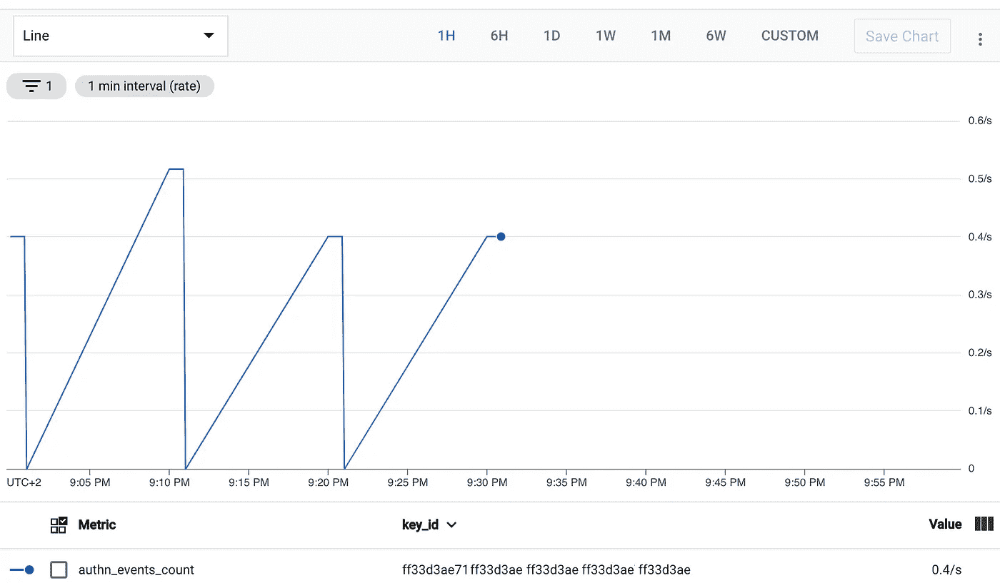
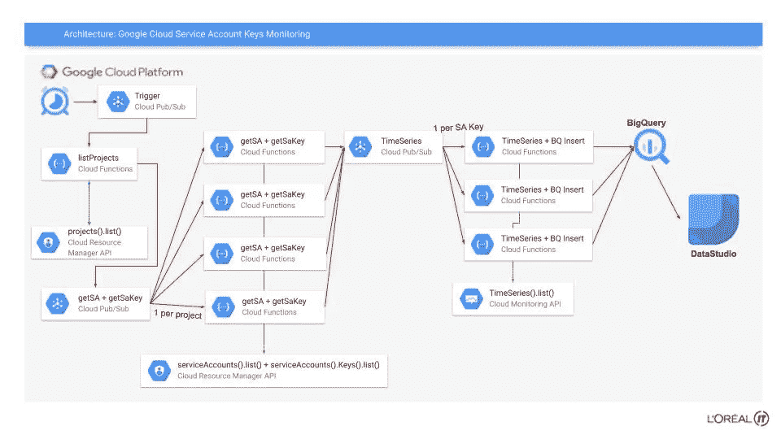
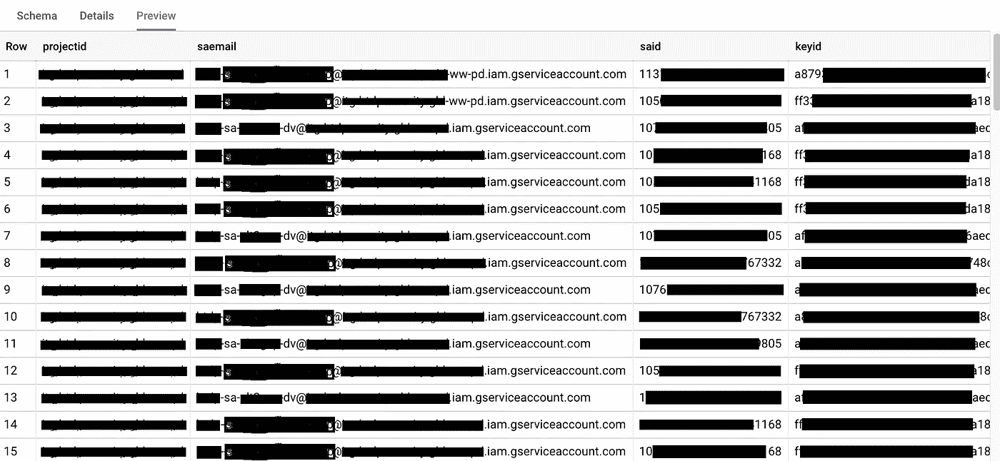
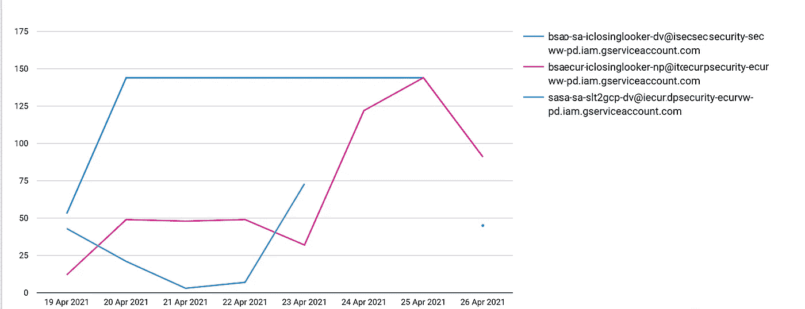

# 亲爱的 Keys，你还活着吗？

> 原文：<https://medium.com/google-cloud/dear-keys-are-you-still-alive-ad7c73ce63b9?source=collection_archive---------4----------------------->


几年前，我做了一个梦。当时，我的公司向我询问有关谷歌云服务账户密钥使用的详细信息，而我当时没有任何可用信息。

虽然现在这种情况已经改变，但最重要的是要记住，您应该:

# "仅在适当的情况下使用服务帐户密钥文件"

好的，你知道服务帐户必须只在适当的时候使用，对于服务帐户密钥来说更是如此，请查看 Google 官方博客:

[https://cloud . Google . com/blog/products/identity-security/how-to-authenticate-service-accounts-to-help-keep-applications-secure](https://cloud.google.com/blog/products/identity-security/how-to-authenticate-service-accounts-to-help-keep-applications-secure)

密钥的问题在于它的生命周期——我们知道建议轮换它们，只在强制时使用它们，不使用时删除它们…

在我以前的公司，我们有 2000 个服务帐户和 5000 多个密钥，清理这些密钥是不可能的，因为我们不知道哪些已经在使用。

所以现在我的目标是能够知道我创造的每一把钥匙:

*   它还活着吗？
*   用过几次了？

我希望这能帮我清理没用过的钥匙。

[](https://cloud.google.com/iam/docs/service-account-monitoring) [## 监控服务帐户和密钥的使用情况

### 本页解释了如何使用云监控来检查您的服务帐户和服务帐户密钥何时被使用…

cloud.google.com](https://cloud.google.com/iam/docs/service-account-monitoring) 

## 文档显示我可以通过云运营指标显示我的密钥信息



虽然这很有帮助，但对我来说还不够:

*   **因为**我有许多来自不同项目的关键字，而指标页面对我来说太小了
*   **因为**指标页面只显示`Key_Id`，不显示服务账户或项目
*   **因为**我无法与我的老板分享指标页面
*   因为这太专业了

## 所以，我正在做的是:



服务帐户密钥监控

*操作被分割到不同的云功能中，以尽可能保持简单，并避免超时或配额问题。可伸缩性很重要。*

***我将只关注 API 调用，而不是全局架构。你可以在谷歌文档中找到如何触发、调用发布/订阅等……* **

每日云调度程序作业将触发云函数，通过使用**发现方法**调用**resource Manager API v1**来解析我的所有 GCP 项目:

```
import google.authfrom googleapiclient import discovery credentials, project = google.auth.default(scopes=['https://www.googleapis.com/auth/cloud-platform']) **ressourceManagerClient =** discovery.build('cloudresourcemanager', 'v1', credentials=credentials)**projects_list** = **ressourceManagerClient**.projects().list().execute()for project in projects_list['projects']
    **project_id = project['projectId']**
```

现在，对于每个项目，使用 **IAM API v1** 调用一个云函数来获取项目的服务帐户列表以及每个项目的已创建密钥列表。谷歌文档说:

*`[*projects.serviceAccounts.keys.list*](https://cloud.google.com/iam/docs/reference/rest/v1/projects.serviceAccounts.keys/list)`*方法列出了一个服务帐户的所有服务帐户密钥。**

**在使用下面的任何请求数据之前，请传递以下参数:**

*   *`*PROJECT_ID*` *:您的 Google Cloud 项目 ID。项目 id 是字母数字串，像* `*myproject*` *。**
*   *`*SA_NAME*` *:您要列出其密钥的服务帐户的名称。**
*   *`*KEY_TYPES*` *:可选。要包含在响应中的以逗号分隔的键类型列表。密钥类型表示密钥是用户管理的(* `*USER_MANAGED*` *)还是系统管理的(* `*SYSTEM_MANAGED*` *)。如果留空，则返回所有键。** USER_MANAGED 是您创建的密钥，SYSTEM 是 Google 生成的密钥**

```
*import google.authfrom googleapiclient import discoverycredentials, project = google.auth.default(scopes=['https://www.googleapis.com/auth/cloud-platform']) **iamClient** = discovery.build('iam', 'v1', credentials=credentials)**accounts_list** = **iamClient**.projects().serviceAccounts().list(name="projects/**myproject**").execute()for **service_account** in accounts_list['accounts']:**key** =   **iamClient**.projects().serviceAccounts().keys().list(name=**service_account['name']**).execute() for sa_key in key['keys']: if sa_key['keyType'] == “USER_MANAGED”: **  Key_ID = (key['name']).split("keys/"))[1]
         Service_Account = accounts_list['name']
         Service_Account_ID = accounts_list['uniqueId']***
```

*现在，对于每个服务帐户密钥**，我**必须向**时序 API v3** 询问在特定时间段内使用密钥的所有事件:*

***查看关于这个时间序列调用的 Google 文档:***

**云监控 API 的* `[*timeSeries.list*](https://cloud.google.com/monitoring/api/ref_v3/rest/v3/projects.timeSeries/list)` *方法，当与特定过滤器一起使用时，允许您获取单个服务帐户密钥的使用情况指标。然后，您可以使用这些指标来确定最后一次使用密钥的时间。**

**在使用下面的任何请求数据之前，请使用以下参数:**

*   *`*PROJECT_ID*` *:您的 Google Cloud 项目 ID。项目 id 是字母数字串，像* `*myproject*` *。**
*   *`*KEY_ID*` *:您的服务账号密钥的唯一 ID。**
*   *`*END_TIME*` *:您要检查的时间间隔的结束，以百分比编码的* [*RFC 3339*](https://tools.ietf.org/html/rfc3339) *格式。比如* `*2020-06-12T00%3A00%3A00.00Z*` *。**
*   *`*START_TIME*` *:您要检查的时间间隔的开始，以百分比编码的*[*RFC 3339*](https://tools.ietf.org/html/rfc3339)*格式。比如* `*2020-04-12T00%3A00%3A00.00Z*` *。**

```
*import google.auth
import jsonfrom google.auth.transport.requests import AuthorizedSessioncredentials, project = google.auth.default(scopes=['https://www.googleapis.com/auth/cloud-platform'])**TIMESERIES_URL** = "https://monitoring.googleapis.com/v3/projects/**myproject**/timeSeries?filter=metric.type%3D%22iam.googleapis.com%2Fservice_account%2Fkey%2Fauthn_events_count%22%20AND%20metric.labels.key_id%3D%22"+str(***KEY_ID***)+"%22&interval.endTime=**2021-04-26T15:01:23Z**&interval.startTime=**2021-04-20T15:01:23Z**"**AUTHORIZED_SCOPE** = ["https://www.googleapis.com/auth/cloud-platform"]**credential** = google.auth.default(scopes=AUTHORIZED_SCOPE)[0]**authed_session** = AuthorizedSession(credential)**response** = authed_session.request(**method**="GET", url=**TIMESERIES_URL**)**key_usage** = response.json()test =  "timeSeries" in key_usageif test is True: **timeSeries** = key_usage['timeSeries'][0]['points'] for window in timeSeries: print(**window['interval']['startTime']**) print(**window['interval']['endTime']**) print(**window['value']['int64Value']**)*
```

*我将获得每个键在 10 分钟时间窗口内(开始和结束时间之间)的呼叫量*

## *最后一步是将所有这些数据发送给 BigQuery:*

```
*from google.cloud import bigquery**bigqueryClient** = bigquery.Client()**row** = [ { u"project_id": var_projectid, u"sa_email": var_saemail, u"sa_id": var_said, u"key_id": var_keyid, u"start_time": var_start, u"end_time": var_end, u"value": var_value }]**bigqueryClient**.insert_rows_json("**dataset.table**", row, row_ids=[None] * len(row))*
```

*现在，每个项目/每个服务客户/每个键/每个 10 分钟窗口都有一行:*

**

*请记住，根据文档，如果在特定窗口中没有使用我的密钥，则不会记录任何内容，因此不会显示任何内容:*

**如果服务帐户和服务帐户密钥用于调用任何 Google API，包括不属于 Google Cloud 的 API，则它们会出现在这些指标中。**

**这些指标包括成功和失败的 API 调用。**

**例如，如果一个 API 调用由于调用者未被授权调用该 API，或者由于请求引用了不存在的资源而失败，则用于该 API 调用的服务帐户或密钥出现在度量中。**

## *现在，让我们看看我们可以利用 DataStudio 做些什么和发现些什么:*

**

*哦耶！我可以看到我的服务帐户密钥被大量使用。否则，如果我的在我的仪表盘里找不到，那就意味着我大概可以删除它。*

*查看这些有用的 BigQuery 技巧来分析数据:*

```
****Query the project where there is the biggest usage of Keys :***SELECT SUM(value)as totalCount, projectIdFROM 'my-project.mydataset.mytable'GROUP BY projectIdORDER BY totalCount DESC***Query the Keys that have not been used since the last 30 days:***SELECT keyid, LastUse FROM ( SELECT keyid, MAX(start) AS LastUse FROM 'my-project.mydataset.mytable' GROUP BY keyid ORDER BY LastUse DESC )WHERE LastUse < TIMESTAMP_SUB(CURRENT_TIMESTAMP(), INTERVAL 30 day)*
```

# *结论*

*我现在可以了解我的 GCP 服务帐户密钥的情况，我可以轻松地分享这些信息，并采取行动！*

*点击查看回购的样本代码[。](https://github.com/antoinecastex/monitor_sakey_usage)*