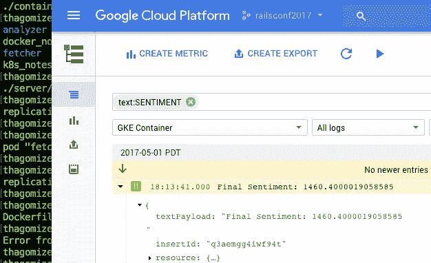

# 调试演示

> 原文：<https://medium.com/google-cloud/debugging-demos-79121c7515ea?source=collection_archive---------0----------------------->



这星期我一直在火车站。我在机器学习赛道用 Ruby 做了一个关于[自然语言处理的演讲。作为我演讲的一部分，我想重复我在 RubyConf 2015 上做的一个演示，在那里我使用了一个分布式系统来进行基于表情符号的情感分析。当时我觉得我使用了一些最热门的技术。我对管道的每个不同部分都使用了 Docker 容器，然后使用 Kubernetes 来协调整个过程。随着对 Kubernetes 演示的需求增加，这似乎是一种合理的方式来部署我希望能够定期上下旋转的东西。上周，我深入研究了代码，试图在中断 12 个月后让演示再次运行。在那段时间里，你所忘记的东西是令人惊奇的。我在这篇博文中分享了一些我学到的东西，希望其他人不要经历和我一样的战斗。](http://www.thagomizer.com/blog/2017/04/13/the-google-nlp-api-meets-ruby.html)

## 舍邦之战

当我构建这个演示时，Kubernetes 甚至还不到 1.0；现在我们达到了 1.5。所以毫不奇怪，`kubectl`和`gcloud` shell 命令中的一些略有变化。快速浏览了一下文档，我又回到了业务中，但是当我运行`kubectl get pods`时，我所有的 pod 都出现了状态 CrashLoopBackoff。所以我做了合乎逻辑的事情:删除它们，并尝试再次部署。这次我在创建控制器后立即运行了`kubectl get pods`，状态是`RunContainerError`。所以我重新构建了容器，并再次尝试，却得到了同样的错误。

虽然我知道执行到一个正在运行的容器中通常不是一个好主意，但这似乎是调试我当前问题的唯一方法。于是我用`docker run`启动了容器。这次我得到了一个新的错误。

```
standard_init_linux.go:178: exec user process caused "exec format error"
```

我仍然不知道这意味着什么，但我猜想我的入口点有问题，并花了一个多小时在网上搜索解决方案，尝试不同的东西，看看问题是什么。最后，出于绝望，我尝试使用 Dockerfile 文件，因为它出现在我的幻灯片上。成功了。我比较了这两个版本，唯一的不同是不工作的版本在文件开头有一个 Apache V2 许可头作为注释。有效的版本在文件的顶部有 shebang。我将 shebang 移到 Apache license 头的上方，重新构建容器，当我尝试用 Docker 运行它时，它工作了。

作为准备发布到 GitHub 的代码的一部分，我添加了许可证头。但是我从来没有用那个版本的文件做过演示。我总是用没有许可证头的不同版本来做。结果，我分享了一些不工作的开源代码。

## ruby:latest 和 ruby:onbuild 的区别

我遇到的下一个障碍更容易解决。之前的演示只使用了 Ruby 的标准库。新版本的演示需要`google-cloud-ruby`宝石。当我尝试部署进行情感分析的代码时，它会出错，因为 Ruby 找不到所需的库。我想知道使用 Ruby 2.4 是否是一个问题，但我相当肯定这不是问题。我用 Ruby 2.3 在本地运行了 Docker 的代码，运行得很好。

所以我去看了文档。我通读了我正在使用的 Ruby 映像的 Docker Hub 页面，并意识到如果我有 gem 依赖项，我需要使用 ruby:onbuild 并为 Bundler 提供一个`Gemfile.lock`。进行必要的修改修复了我的代码，唯一痛苦的部分是通过慢速 wifi 下载 ruby:onbuild 映像。

## 遮蔽

此时，我的演示已经启动并运行了，但是当我查看 pod 时，我注意到其中一些已经重启了几次。查看来自我的集群的日志，我看到这些豆荚正在死去，因为在谷歌云语言宝石深处有一个异常。当我更仔细地查看错误时，我发现 gem 不知何故通过了作为演示主干的 Rinda 服务器的 URI。最后，我发现了一个错误，它解释了我做错了什么

```
/usr/local/lib/ruby/2.4.0/uri.rb:97: warning: previous definition of URI was here
```

我很懒，没有为我的代码使用任何类或名称空间。因此，当我声明一个名为 URI 的常量并用它作为 Rinda 服务器的地址时，我是在隐藏标准库中的 URI 模块。修正我的命名修正了这个问题，我的演示是稳定的。此外，我还学到了关于适当命名空间的宝贵一课。现在演示已经启动并正常运行，我将很快在 GitHub 上发布工作版本。我的演讲进行得很顺利，在这个过程中，我学习和重新学习了一些东西。有人提醒我，命名空间很重要。

*原载于*[*——命运之刺*](http://thagomizer.com/blog/2017/04/27/debugging-demos.html)