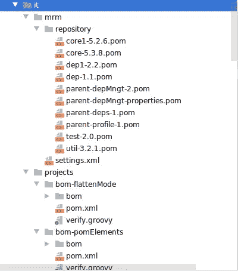
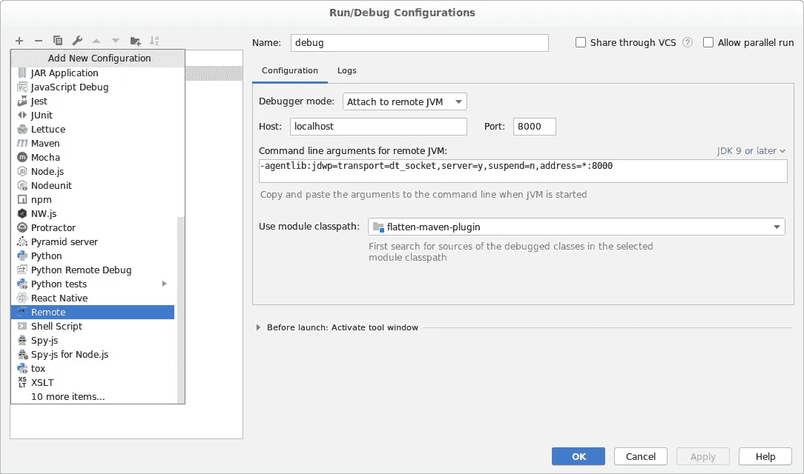

# 在 IntelliJ 中调试 Maven 插件

> 原文：<https://medium.com/google-cloud/debugging-maven-plugin-in-intellij-7dc7080b9a45?source=collection_archive---------0----------------------->

你是否使用 Maven 来管理你的 Java 项目，发现了一个非常酷的 Maven 插件，但是意识到它并不完全适合你的项目？您是 Maven 新手，想更好地了解它吗？您是否对开源软件开发感兴趣，并且可能考虑为其做出贡献？

你并不孤单。三个月前，我开始在 Maven 工作，在我的谷歌云客户端库[项目](https://github.com/googleapis/java-bigquerystorage)中遇到了各种各样的依赖性管理问题，所以我开始探索改进我们管理依赖性的方法。

我在谷歌会见了 [Ray Tsang](https://twitter.com/saturnism) ，讨论了我们一直面临的一些问题和他可能有的建议。经过几次卓有成效的对话，我们决定使用 [Flatten](https://www.mojohaus.org/flatten-maven-plugin/) 插件来扁平化客户端库项目 POM，以消除传递性依赖。这是由 Ray [最近为](https://github.com/mojohaus/flatten-maven-plugin/issues/92) [Flatten](https://www.mojohaus.org/flatten-maven-plugin/) 插件贡献了的新配置`<flattenDependencyMode>all</flattenDependencyMode>`实现的。

这是一个强大的新特性，它可以帮助我们解决由`<dependencyManagement>`部分管理时传递依赖版本丢失的问题，并允许我们为客户端库消费者提供一个更干净和完全解析的依赖树。

从扁平 pom 构建的依赖关系树

我非常渴望在我的项目 [BigQueryStorage Java 客户端](https://github.com/googleapis/java-bigquerystorage)中实现它。然而，经过一些测试，我们很快发现了 Ray 最初贡献的两个问题:1)[平序颠倒了](https://github.com/mojohaus/flatten-maven-plugin/issues/131)；以及 2) [一个依赖项(gax-grpc)从展平的 POM 中缺失。](https://github.com/mojohaus/flatten-maven-plugin/issues/132)

这篇文章记录了我从增强和贡献 Maven 插件的过程中学到的东西。

# 入门指南

首先在项目的父 POM 中按照推荐的配置插件[，运行`mvn verify`获取项目根目录中的`.flattened.pom`。](https://github.com/saturnism/dependency-conflict-examples/blob/9bfe61ed4572fa91d5e8e449806dfa1b2f00203c/example-5b-depmgmt-flatten/pom.xml#L76)

为了开始调试插件，派生并克隆 [flatten-maven-plugin](https://github.com/mojohaus/flatten-maven-plugin) 的源代码。

在本地分叉和克隆项目后，确保首先运行`mvn verify`,看看项目是否可以编译和构建。它应该没有任何错误。然后是时候检查项目的结构，找出代码和测试的位置。

# 从高层次理解代码

项目结构看起来非常清晰明了。`src/it`目录包含了所有的集成测试。它被进一步分解为`mrm`和`project`目录，其中`mrm`提供所有的测试依赖关系，而`project`提供所有利用测试依赖关系的集成测试。

项目结构— mrm 和项目目录

如果您在`project`的集成测试中检查几个 POM，您将会看到它们正在使用`mrm`中创建的测试依赖关系。这是一个很好的开始！

# 排除故障

接下来，我们如何开始实际的调试呢？好吧，我们确实知道的一件事是错误——在代码的某个地方，逻辑被破坏了，这导致了错误。因此，如果我们能够以集成测试的形式重现错误，那么我们也许可以设置断点并调试代码，以找出是哪个方法以及哪一行导致了错误。听起来像个计划！

# 第一步:从最简单的错误开始

总是从容易解决的问题开始。这不仅能让你快速接触到代码库，还能让你树立信心，在以后解决更难更复杂的问题。

在我们的两个问题中，逆序错误中的依赖解决看起来像是一个低挂的水果。我们最初的猜测是，在代码中的某个地方，使用了 stack 而不是 queue，因此当构造结果数据结构时，对象以 LIFO 顺序弹出，而不是以 FIFO 顺序轮询，这导致了相反的顺序。我们需要做的就是找出这个结果数据结构在代码中的构造位置，并在那里进行修复。

# 步骤 2:编写一个集成测试

首先编写一个集成测试，测试可能会失败的预期行为。这给了我们一个代码库的入口点，然后允许我们通过放置断点和检查调试器返回的语句来定位有问题的逻辑。

要知道如何编写一个合适的集成测试，参考一些已经在`src/it`目录中编写的其他集成测试。一旦你适应了，就写一个简单而全面的单元测试:

单元测试源 pom.xml

单元测试验证. groovy

例如，此处编写的测试只是验证扁平化 pom 的解析顺序应该是自然顺序，即 artifact id“dep”的依赖关系在 artifact id“test”的依赖关系之前被解析。

要运行集成测试，有几个选项。您可以:

1.  运行单一测试:

`mvn verify -Dinvoker.test=flatten-dependency-all-resolution-order`

2.运行名称中共享一个公共字符串的多个测试:

`mvn verify -Dinvoker.test=flatten-dependency-all-*`

3.运行所有集成测试:

`mvn verify`

继续运行预期行为的单元测试。例如，运行`flatten-dependency-all-resolution-order`给了我们一个失败，其中“测试”首先被解决。这正是我们想要的，所以我们可以继续。

# 步骤 3:配置调试器

接下来，我们需要确定哪一行代码导致了问题。为此，我们需要首先设置调试器，放置一些断点，然后再次触发测试，以查看每行返回的内容。

要设置调试器，您只需转到顶部菜单栏中的“编辑配置”并从“+”下拉菜单中选择“远程”。给调试器一个名称，然后将端口更新为 8000。根据您正在开发的内容选择合适的 JDK 版本。

IntelliJ 调试器配置

设置好调试器后，您可以在调试器模式下运行测试:

`mvn verify -Dinvoker.test=flatten-dependency-all-resolution-order -Dinvoker.mavenExecutable=mvnDebug`

这将在每个集成测试中停止并挂起，以监听调试器连接—单击顶部菜单栏中的绿色 bug 图标以启动调试器。

如果没有任何断点，调试器将运行、通过/失败并退出。这时，在您怀疑导致问题的方法上设置断点并检查每行返回的内容非常有用。

# **第四步:添加断点**

检查插件使用的配置并阅读代码。根据经验猜测哪种方法与您正在使用的特性相关，并设置几个断点，看看运行集成测试是否有所收获。

在我们的例子中，我们很快发现我们感兴趣的大多数方法都存在于`FlattenMojo.java`中。我们能够放置断点来缩小有问题的区域，并最终确定导致问题的确切方法。

一旦找到了有问题的逻辑，进行修复就相对简单了。你只需要通读代码，理解发生了什么，查看调试器的输出，然后修改代码。做出更改后，再次运行集成测试，查看新的输出以及集成测试是否通过。反复经历这个过程，进行小的、渐进的改变。

# **第五步:运行所有的集成测试**

一旦您对您的更改有信心，确保在提交任何代码更改之前运行`mvn verify`。这确保您的修复不会破坏任何其他东西。

如果你有兴趣了解更多，这里是对这两个错误的[修复](https://github.com/mojohaus/flatten-maven-plugin/pull/134)。

# 最后的想法

测试、测试和测试——确保添加足够多的单元测试，以覆盖您的基础和任何其他可能与您的修复直接或间接相关的场景。例如，在我们的例子中，我们固定了依赖解析顺序，所以我们也决定为具有复杂传递依赖的 POM 编写[附加测试](https://github.com/mojohaus/flatten-maven-plugin/pull/134/commits/a37d5f21eb971f1bd15fc4a7090efa2987ea2c02)。这是为了确保我们在修复现有错误的同时不会引入新的错误。这确实是说起来容易做起来难的事情。如果需要，一定要花时间仔细考虑并添加测试用例。

特别感谢 [Ray Tsang](https://github.com/saturnism) 的贡献！如果你想了解更多关于 Maven 依赖性管理策略的信息，请查看 Ray 和 Apache Maven 主席 Robert Scholte 的谈话。

最后，*调试愉快，享受学习的乐趣*！🙂

在推特上关注我王思的最新消息。