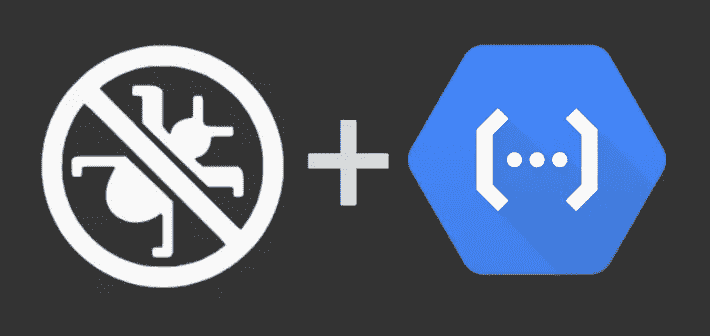
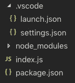
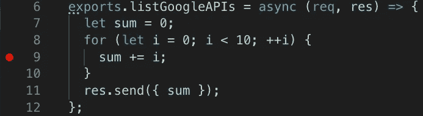
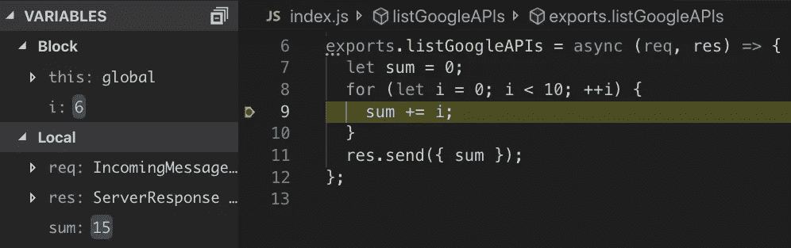
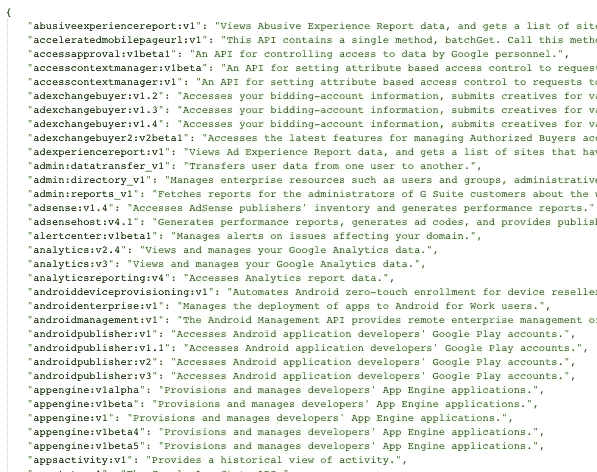
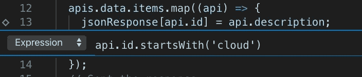
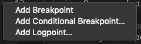

# VS 代码本地调试节点 Google Cloud 函数！

> 原文：<https://medium.com/google-cloud/debugging-node-google-cloud-functions-locally-in-vs-code-e6b912eb3f84?source=collection_archive---------0----------------------->

Google Cloud Functions Framework(FF)是一个强大的开发工具，允许开发人员在他们喜欢的 IDE 中调试无服务器功能！

在这篇博文中，我们将学习如何通过 **V8 Inspector 协议** ( `--inspect`)在 VS 代码中使用断点支持在本地调试 Google Cloud 函数*。*



🚫🐞➕⚡

# 设置您的项目

从您的终端，使用`npm` CLI 创建一个新的 FF 节点项目:

## package.json

*   `npm init`:用默认设置创建一个新的 npm 模块。(持续按下`<ENTER>`
*   `npm i @google-cloud/functions-framework`:安装 FF

## 索引. js

用`code .`打开 VS 代码，用以下*存根*内容创建一个名为`index.js`的新文件:

一个非常简单的用于测试的节点函数。

# 设置与代码

VS 代码自带内置节点调试器！但是我们仍然需要创建配置文件。

要创建一个基本项目，用下面的`launch.json`和`settings.json`文件创建一个`.vscode`目录:



我们的项目目录结构

`.vscode/launch.json`

`.vscode/launch.json`

*注意:*端口`9229`是`node --inspect`的默认端口号。

`.vscode/settings.json`

`.vscode/settings.json`

该选项将[自动将](https://code.visualstudio.com/blogs/2018/07/12/introducing-logpoints-and-auto-attach#_autoattaching-to-node-processes)节点调试器附加到 VS 代码。有用。

# 运行函数框架

使用菜单项`View > Terminal`打开 VS 代码中的终端。运行函数框架，使用:

```
node --inspect node_modules/@google-cloud/functions-framework --target=listGoogleAPIs
```

让我们来分解一下:

*   `node --inspect`:使用检查员 API 的节点标志。参见[文档](https://nodejs.org/en/docs/guides/debugging-getting-started/)。
*   `node_modules/@google-cloud/functions-framework`:这是 FF npm 模块的位置(包含一个`package.json` `bin`属性)。
*   `--target=listGoogleAPIs`:我们用我们的方法传入 FF 的一面旗帜。

您会看到类似这样的内容:

```
node --inspect node_modules/@google-cloud/functions-framework --target=listGoogleAPIsDebugger listening on ws://127.0.0.1:9229/a391af83-9e3a-4c87-a2d5-dce855afca7c
For help, see: [https://nodejs.org/en/docs/inspector](https://nodejs.org/en/docs/inspector)Serving function...
Function: listGoogleAPIs
**URL:** [**http://localhost:8080/**](http://localhost:8080/)
Debugger attached.
```

您正在本地运行函数框架，并附带了调试器。转到`localhost:8080`到*本地运行*功能！


你会注意到当调试器连接上时，VS 代码的状态栏变成了橙色。

你应该`{"sum":45}`。但是*我们如何调试*？请继续阅读！

# 添加断点

*当*您的`node`进程正在运行时，通过单击使用 VS 代码的调试器工具:


🐞➕🚫

> 注意:如果您没有创建`.vscode/settings.json`文件，那么您需要在运行 FF 之后使用左上角的图标手动连接调试器。

要添加断点，请单击行号的左侧以点亮鲜红色🔴。



注意左边的红点。

然后使用`[http://localhost:8080/](http://localhost:8080/)`运行该功能，在调试侧面板中查看有用的信息。将鼠标悬停在变量上以查看它们的值或向左看。



注意 i = 6，sum = 15。

当然，你可以`console.log`这些值，但是现在你可以看到栈上的每个变量，复制值，甚至注入你自己的变量值。在试图解决问题时，这真的很有帮助。

TypeScript 程序管理器的智慧之言

# 做一些有趣的事情

好的。所以我想 for 循环。但是让我们建立一些更令人印象深刻的东西。

[Google Discovery API](https://developers.google.com/discovery/) 是一个元 API，它列出了 Google APIs。调用 API 不需要 auth(甚至不需要 Google 账号！).让我们查询 API 并列出所有 Google(可发现的)API:

1.  安装 Google API 客户端库:

`npm install googleapis`

2.用以下代码替换`index.js`。

列出谷歌 API 的一小段代码

3.现在重新运行该函数。您应该会看到一个很大的 JSON 响应，其中包含一个 Google 服务列表。



提示:使用这个 Chrome 扩展进行漂亮的 JSON 格式化！

酷豆！

# 部署到谷歌云

将该功能部署到 Google Cloud 很容易。只需运行下面的`gcloud`命令:

```
gcloud functions deploy listGoogleAPIs --trigger-http --runtime nodejs10
```

过一会儿，你会得到一个`httpsTrigger` URL，如下所示:

```
[https://us-central1-my-project.cloudfunctions.net/listGoogleAPIs](https://us-central1-codercom-test.cloudfunctions.net/listGoogleAPIs)
```

简单的豌豆(柠檬榨汁机)。

# 高级调试

我们甚至可以做一些奇特的事情，比如条件调试:



仅在 api.id .以(' cloud ')开头时中断

厌倦了在 PRs 中意外提交`console.log`测试代码？添加一个日志点，保持代码整洁。只需右键单击行号的左侧。



添加线点的所有选项。

# 后续步骤

感谢阅读！看看这些相关的帖子:

*   [了解有关功能框架的更多信息](/@granttimmerman/google-cloud-functions-framework-9fbd899c201c)
*   [在 GitHub 上贡献功能框架](https://github.com/GoogleCloudPlatform/functions-framework-nodejs)
*   [阅读 VS 代码](https://code.visualstudio.com/docs/nodejs/nodejs-tutorial#_debugging-hello-world)中的调试节点