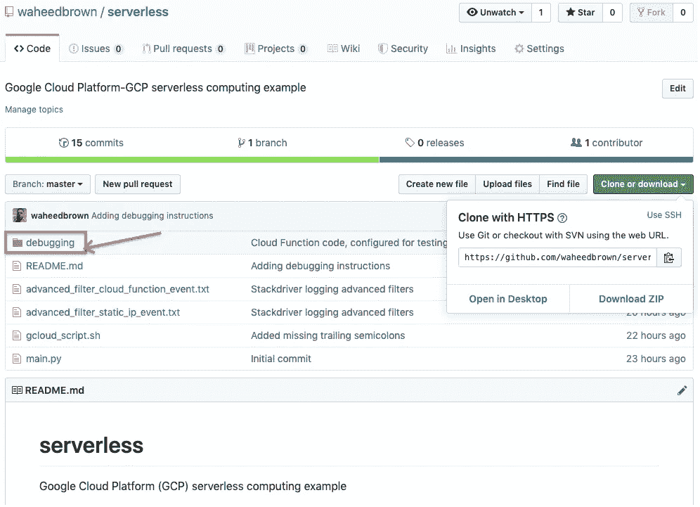

# 调试无服务器功能

> 原文：<https://medium.com/google-cloud/debugging-serverless-functions-53f99a7f3cb2?source=collection_archive---------0----------------------->

对于无服务器计算，真正的工作是有效的调试

…上接[无服务器计算变得简单](/google-cloud/serverless-computing-made-easy-40e534ae410e)

G oogle 云函数是实现无服务器计算的一种强大方式。完全使用这个工具需要一种调试代码的可靠方法。在这篇博文中，我们使用了 Python 3 云函数，并介绍了一种可靠的故障排除方法。

下面调试练习的示例代码可以在 Github 的[这里找到。这是在](https://github.com/waheedbrown/serverless)[之前的博客文章](/google-cloud/serverless-computing-made-easy-40e534ae410e)中使用的同一个存储库。此外，还假设您遵循了博客文章或 repo 自述文件中的安装步骤。测试云功能将引用安装过程中创建的谷歌云平台(GCP)资源。

Github 上有源代码和调试设置说明([点击这里](https://github.com/waheedbrown/serverless))

参考 repo 自述文件，调试安装说明如下:

1.将此存储库克隆到您的工作区

2.导航到调试文件夹

3.编辑 prepare_log.sh 脚本，在您的 Google 云平台(GCP)中添加项目 ID、区域、地区和虚拟机(VM)实例 ID 的特定值

在 prepare_log.sh 中添加您的 GCP 值，INSTANCE_ID 位于虚拟机详细信息页面上

VM 实例 ID 是 Stackdriver 日志中使用的唯一数字标识符

使用 sed 命令交换变量值的脚本。一个更干净的方法是使用 [envsubst](https://unix.stackexchange.com/questions/294835/replace-environment-variables-in-a-file-with-their-actual-values) ，但是我无法在我的 Ubuntu 环境中使用它。如果您想编写自己的日志准备脚本，这是值得一试的。

丰富的一个重要部分是如何创建 [sample_log.json](https://github.com/waheedbrown/serverless/blob/master/debugging/sample_log.json) 中的样本日志数据。流程是下载一个现有的 Stackdriver 日志，该日志触发您的生产云功能:

筛选您需要的日志；Github repo 中提供了一个示例过滤器，advanced _ filter _ static _ IP _ event . txt

“在新选项卡中查看”或“下载”来查看所需 Stackdriver 日志条目的原始 JSON 文本

准备您自己的测试日志的下一步是删除前后的方括号“[”和“]”。最后，您需要缩小 JSON，删除所有新的行字符。当包含新的行字符时，云函数测试器会中断。请参见 Github repo 中的 debugging/sample_log.json，以获得一个干净的示例日志文件(尽管存在 shell 变量)。

4.运行 prepare_log.sh，这将生成一个名为 prepared_log.json 的文件

云壳用于克隆 repo 并创建 prepared_log.json，这是他的 GCP 特定值

5.在 GCP 控制台中，创建一个 Python 3 云函数，“触发器”将是“Cloud Pub/Sub”，“主题”将是上面安装步骤中创建的那个；对于“源代码”,选择“内联编辑器”,对于“运行时”,选择“Python 3.x”

6.将 debugger/main.py 的内容复制粘贴到“main.py”字段中

**注意:**当您尝试复制 prepared_log.json 的内容时，您的终端可能会换行。如果云函数“测试”标签给你错误，这可能是原因。您必须使 JSON 文本成为一个连续的字符串，没有换行符，这样“Testing”选项卡才能接受它。

7.继续创建云函数，将它和“要执行的函数”命名为 test_migrate_vm

Python def 名称与“要执行的函数”名称匹配是至关重要的

注意 Python 代码中的第 5、12 和 13 行，在 Github repo 中也可以作为 debugging/main.py 获得。在第 5 行中，我们必须重命名已定义的函数(同样还有“要执行的函数”)。我们不希望测试云功能与生产云功能有命名冲突。

第 12 行期望 Stackdriver 日志行直接来自 Stackdriver 日志接收器。发布到接收器(或发布/订阅主题)的 Stackdriver 日志是 Base64 编码的。然而，我们的测试数据是纯文本，Python 认为它是一个简单的集合。注意测试数据是如何用大括号“{”和“}”括起来的，用逗号分隔键值字符串对。这使得元素易于引用，如第 14 行所示。

8.创建云函数后，导航到“测试”子选项卡

9.将 prepared_log.sh 的内容复制粘贴到“触发事件”文本框中

10.点击“测试功能”按钮

11.在正确执行时,“输出”应该是“OK ”,并且应该生成日志

如果该功能摄取了测试数据并正确执行，则它输出“OK”

12.Python 代码末尾的 print 语句将输出到 Stackdriver 日志。您添加的打印语句，如 print("test_string ")，也输出到 Stackdriver。在 Stackdriver Logging 页面上，确保选择“云函数”过滤器下拉资源，然后选择云函数名称。

在 Stackdriver 日志记录中,“云函数”筛选器下拉资源会将您带到输出

希望上面的调试方法能够帮助您解决自己的云功能问题。请记住，关键是依靠 Stackdriver 为您提供测试数据输入，并捕获您的云函数输出。print 语句也可以用于调试，它们的输出也可以在 Stackdriver 中捕获。