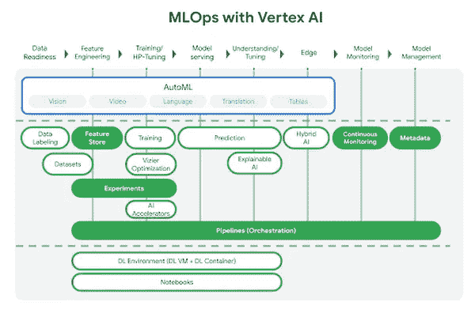
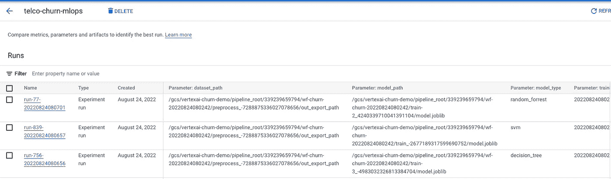
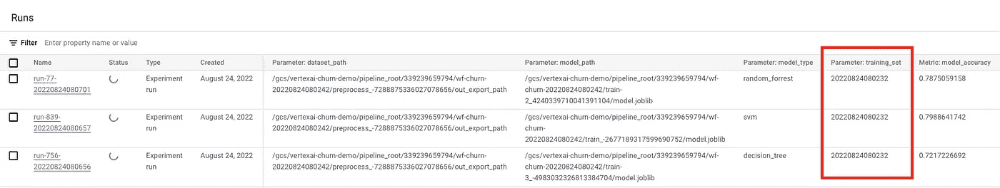
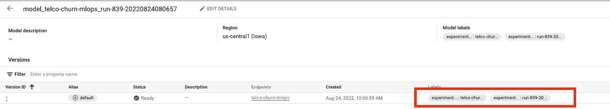
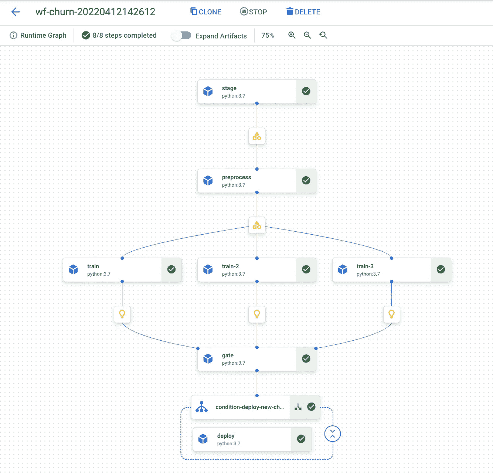
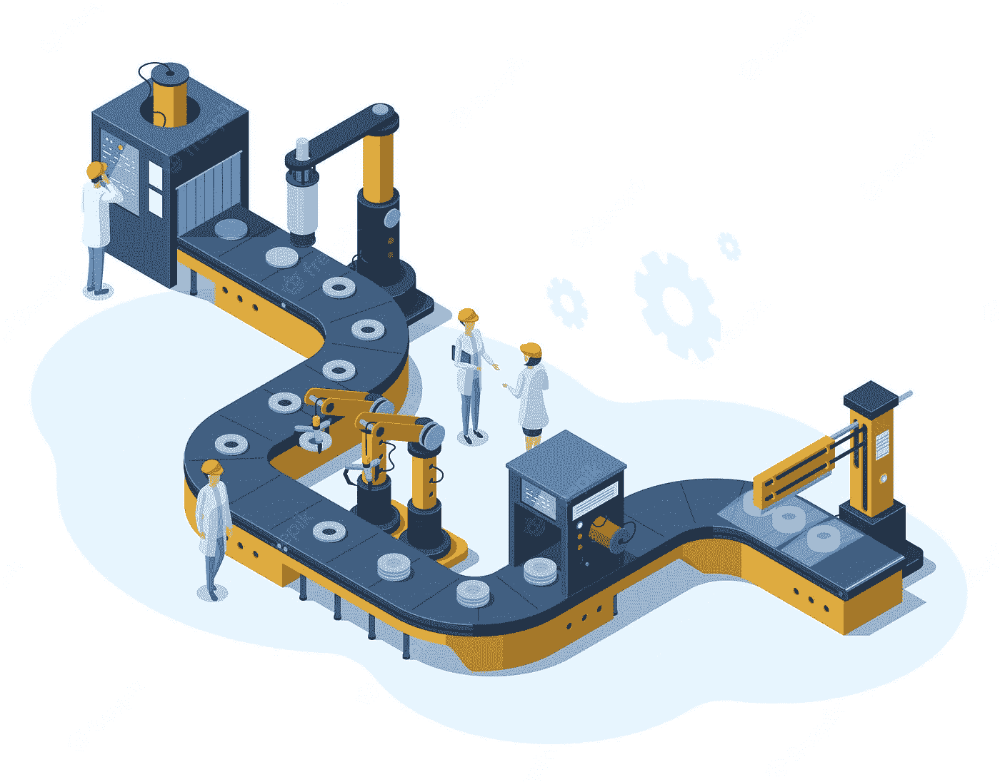

# 具有顶点人工智能实验的 MLOps 流水线的判决门

> 原文：<https://medium.com/google-cloud/decision-gate-for-mlops-pipelines-with-vertex-ai-experiments-73d5b258928e?source=collection_archive---------0----------------------->

当数据科学开始获得牵引力时，人们主要谈论算法，最终目标是拥有 ML 模型，不管它是如何在哪里被训练的。由此产生的模型就像一个烫手山芋——很少有人知道如何使用它，更少有人知道如何以及在哪里部署它、监控它等等。幸运的是，这样的日子已经一去不复返了，今天配备了 MLOps 实践的 ML 工程更像是建造生产流水线，所有阶段都是自动化的，随时可以按需交付新的模型版本。

MLOps 流水线的重要阶段之一是所谓的决策门，它决定新训练的模型是否比当前使用的模型执行得更好。本文的主要目标是展示如何使用顶点人工智能实验构建这样一个决策门。

# 语境

就本文而言，假设您是电信公司数据科学团队的新成员。您的目标是将数据科学实践提升到一个新的水平，并构建 MLOps 基础。你花了第一周时间与其他团队成员交谈，了解到该团队为其第一个用于预测客户流失的 ML 模型感到非常自豪。你见过做编码的人了解到模型是用 Sklearn 在 Jupyter 笔记本上训练的。每月一次，他在笔记本电脑上启动笔记本，训练新模型，并使用新模型建立预期流失的客户名单。他将该列表放入文本文件中，并发送给客户服务团队。在过去的 10 个月中，这个过程一直是这样工作的，但是没有记录模型属性及其性能特征。此外，事实证明，一旦模型被训练，它就留在笔记本电脑上。

还介绍你认识了 CRM 系统的产品经理。他希望加强与数据科学团队的合作，并有可能通过 REST API 调用 ML 模型。他的第一个用例是，每当与客户服务顾问有新的交流时，能够在客户资料页面上显示最新的客户流失概率。

这不是最差的起点，但仍有改进的空间。你已经知道还没有类似 ML 平台的东西，所以让我们给你一个顶点 AI 的简单介绍。

# 顶点人工智能

当谈到机器学习时，谷歌被视为黄金标准，拥有世界一流的研究团队，如谷歌大脑、谷歌研究和 Deep Mind，通过谷歌搜索、谷歌翻译和 TensorFlow、Kubeflow、Kaggle、Colabs、TPUs、Kubeflow、BERT、T5、ImageNet、Parti、LaMDA、PaLM 等多个贡献成功部署了 ML。这只是举几个例子。

鉴于上述所有情况，谷歌的机器学习平台名为 **Vertex AI** ，可作为服务在**谷歌云**上获得，似乎至少值得一试。

真正让 Vertex AI 与其他类似平台不同的一点是，它是**完全无服务器的**——你可以通过各种加速器访问谷歌的 ML 基础设施，如 GPU 和 TPU，而**不需要**管理服务器、虚拟机、kubernetes 集群，**不需要**安装和升级任何软件。

来源:[https://cloud . Google . com/blog/topics/developers-practices/new-ml-learning-path-vertex-ai](https://cloud.google.com/blog/topics/developers-practitioners/new-ml-learning-path-vertex-ai)

第二个值得一提的是，Vertex AI 是一个**端到端的 MLOps 平台。这是什么意思？这意味着它是一个单一的地方，您可以在这里管理功能、标记训练样本、使用您最喜欢的 ML 框架运行训练、执行自动化超参数调整、实施和执行 MLOps 管道、在模型注册表中注册您的模型、运行无服务器批量预测作业、将您的模型部署为 REST 端点并支持模型监控和预测的可解释性。**

**你为什么要关心这一切？**如果你真的打算通过标准化你的团队构建基于机器学习的解决方案的方式来扩展你的数据科学实践，这将对你有很大帮助。

最后一点是，Vertex AI 将允许你建立完全定制的模型，但也将让你访问许多由谷歌设计的最先进的架构，并作为 AutoML 培训提供。AutoML 意味着你需要做的就是准备和标记训练数据，然后运行 Vertex AI AutoML 训练，它将处理功能工程，检查许多架构，并为你进行超参数调整。相当强大的机制，至少可以建立参考模型。

# 顶点人工智能实验

每个 ML 模型训练都发生在某个上下文中，其中上下文实际上是可以给出关于训练和结果模型的更多细节的任何东西:算法名称、关于输入数据的细节、应用于该特定训练的超参数、模型性能度量等。事实上，应用机器学习的**关键部分是实验**,对于你试图用机器学习解决的每个业务问题，你需要实验许多不同的功能、ML 架构和超参数，然后才能得出结论，你有一个可以解决问题的模型。每一个这样的实验都有它自己的背景，如果你能够捕捉背景并保持它，那么这将有助于你比较不同的实验，跟踪模型的发展等。 **Vertex AI Experiments** 模块就是为这个用例设计的，它就像一个无服务器的数据库，用于实验环境的快照，具有方便的 UI 和 SDK 来收集和管理环境细节。

# **第 0 步:把你的模型从你的笔记本电脑放到可共享的顶点人工智能模型注册处**

现在回到你的新角色。你决定要做的第一件事是确定当前状态的基线。你让你的同事从他的笔记本电脑中取出最新版本的客户流失 ML 模型，并在 **Vertex AI 模型注册表中注册。**

听起来像是一个小变化，但它已经开启了许多可能性，如:

*   您有一个单一的地方，您可以在任何时候访问所有的 ML 模型，而不管您的团队假期日历。
*   你可以在 **Vertex AI 无服务器计算基础设施**上运行**批量预测作业**(可能使用 GPU 或 TPU 等加速器)来建立一个根据该模型即将离开的客户列表。这意味着您不再依赖笔记本电脑的计算能力。
*   您可以将您的模型作为 REST API 端点部署到无服务器的 **Vertex AI 端点，并能够处理来自其他组件的特别 HTTPS 预测请求**。

# 第一步:顶点人工智能管道——设计

然后，您希望自动执行准备必要数据、进行功能工程、运行模型训练和部署新模型所需的所有步骤。换句话说，你最终得到的不是模型，而是一个脚本化的配方，一个能够按需培训和部署新模型的管道。

**然后你听到这个问题:**但是我们应该为我们的用例使用哪种算法呢？流失预测是一个二元分类问题，这意味着给定输入数据，模型只有两个选项:是(1)或否(0)。这里可以使用许多现有的算法，从随机 Forrests 和逻辑回归到更复杂的深度神经网络。有人说，竞争总是一件好事。**它迫使我们尽力而为。**这也适用于 ML。与其专注于单个算法，为什么不选择其中的几个，让这些模型来竞争呢？我们将称这些模型为**挑战者。**最佳挑战者将与**当前的冠军**竞争——该型号目前已投入使用并满足生产需求。关于哪个挑战者是最好的，以及最佳挑战者是否比当前冠军更好的决定将由称为决策门的任务来处理。

# 步骤 2:决策阶段——设计

我们的决策门需要做出两个决策:

*   选择最佳挑战者
*   决定最佳挑战者是否比当前的冠军更好

两个决策都需要某种确定性的度量标准**，即什么意味着更好**。假设更好的模型只是具有更好性能指标的模型是非常直观的，当涉及到二元分类器时，我们通常使用 AUC ROC，它代表“接收器特征算子”(ROC)的“曲线下面积”(AUC)。

目标是收集每个挑战者的度量值，并将其提供给决策门。这就是我们将使用**顶点人工智能实验的地方。**在所谓的**实验运行**的上下文中，每个模型训练使用顶点 AI 实验 SDK 注册模型参数和度量。每个实验运行都有唯一的名称(id)和创建时间戳。因此，我们可以预期，我们想要训练多少挑战者，就会进行多少次实验。所有这些实验运行都属于同一个父实验，由它的名称来标识，例如:这里我们有三个实验运行属于同一个名为 telco-churn-mlops 的实验。

**实验**类似于一个数据库表，其中每个记录代表一个不同的实验运行(除了通常每个实验运行可以有不同的参数和度量列表)。因此，这个“表”将帮助我们跟踪由我们的管道的所有执行训练的所有模型的演变。**它有什么帮助？**如果您的数据科学团队中有一名新成员想要了解更多关于模型历史表现的信息，您只需要求该人检查 Vertex AI 中的相应实验。

然而，您可能会问以下问题:实验包含迄今为止发生的所有实验运行，而在我们的决策门中，我们只想比较为在同一管道执行中训练的挑战者收集的指标。我们如何识别对应于相同流水线执行的实验运行？这是一个有效的问题。我们必须对对应于相同流水线执行的实验运行进行分组的选项之一是记录表示给定流水线执行的附加参数。在我们的例子中，这个参数将被命名为: **training_set(我们训练属于同一个训练集的多个挑战者)。**

**最后一个问题是，我们如何识别与当前冠军相对应的实验运行？**当前冠军(如果存在)代表在先前流水线执行之一期间训练的最佳挑战者，因此其实验运行应该具有不同的 training_set 参数值。

这意味着要识别当前冠军的实验运行，我们需要使用另一个技巧。这个技巧要求我们用相应的实验运行名称来标记我们在 Vertex AI 模型注册表中注册的冠军模型。

这两个技巧将帮助我们收集与我们的挑战者和当前冠军相对应的实验运行，这是我们选择最佳挑战者所需的全部，然后决定最佳挑战者是否比当前冠军更好。如果后者是真的，我们的决策门应该启用我们管道中的下游任务，这些任务应该首先在 Vertex AI 模型注册表中注册最佳挑战者作为新版本，然后将其部署到 Vertex AI 端点。

# 第三步:顶点人工智能管道——实现

Vertex AI 附带 Pipelines 模块，这是一个使用 **Kubeflow Pipelines SDK v1 构建的 MLOps 管道的无服务器执行环境。** **8.9 以上**，或 TensorFlow 扩展 v0。30.0 或更高。这对你来说意味着什么？你不需要管理任何 ML 基础设施——你只需要将执行委托给 Vertex AI。如果你有自己的 Kubeflow 集群，那么你应该能够只需要你的 Kubeflow 管道，并在 Vertex AI 上运行它们。

在本文中，我们将使用 Kubeflow SDK 对 MLOps 管道进行编码。

我们的管道由以下步骤组成:

*   从 BigQuery 表中读取数据，并将其暂存在 Google 云存储中。
*   从 Google 云存储读取阶段性数据，做特征工程。将结果物化回谷歌云存储。
*   平行训练挑战者
*   **决策门**
*   如果最佳挑战者比当前冠军更好，则部署最佳挑战者

我们将在下面讨论一些编码细节，但最终当管道在 Vertex AI 上编码和执行时，您应该能够深入管道执行细节并可视化相应的运行时图，如下所示:

每个任务都作为容器执行，当你双击它时，你将能够浏览相应的执行日志。我们的管道训练三个挑战者(任务: **train，train-2，train-3** )。一旦所有都被训练好，流水线将运行代表我们的**决策门**的**门**任务。

说到代码，Kubeflow pipeline 是一个用@pipeline 注释的普通 python 函数。创建任务之间的相关性，将前面任务的输出变量作为输入变量注入下游任务:

> **staging _ task**= stage(in _ big query _ projectid，…..
> 
> feature _ eng _ task = preprocess(**staging _ task . output**，……

管道函数有相当多的输入参数。因此，这条管道将作为一个模板。

每个管道**任务**都编码为用@component 注释的 python 函数。由于这个注释， **train** 函数将作为来自基础映像(python 3.7)的容器执行，并按照 **packages_to_install** 列表中的指定安装附加包。

第 35–38 行是我们使用 Vertex AI SDK 实例化到 Vertex AI 服务的连接的地方。请注意，我们需要指定 GCP 项目、GCP 地区和实验名称。如果实验尚不存在，它将被创建。

第 42 行是我们开始新实验的地方。

第 77–82 行和第 84–90 行是我们分别为参数和指标构建两个键、值对映射的地方，我们希望在实验运行中注册这两个映射。我们有 training_set 的参数、模型类型(svm、random forrest、决策树)、输入文件在 Google 云存储上的位置以及我们保存训练好的模型在 Google 云存储上的位置(第 59–60 行)。另一方面，度量标准描述了我们的模型性能，我们决定记录准确度、精确度、召回率、logloss 和 auc roc。最后一个将由我们的决策门使用。

**Vertex AI SDK 提供了两个相当简单的方法来保存参数和指标:分别是 log_params 和 log_metrics** (第 92–93 行)。

# 步骤 4:决策阶段—实施

我们的决策门任务被编码为门函数。

第 25–28 行是我们使用 Vertex AI SDK 启动与 Vertex AI 通信的地方。

第 31–46 行是我们检查顶点人工智能模型注册表，看看冠军模型是否存在。你可以想象这个管道的第一次执行应该找不到冠军模型。Vertex AI 模型注册中心是所有 ML 模型的注册中心，而不仅仅是客户流失的注册中心。因此，当我们扫描注册表时，我们会寻找与实验名称相同的模型。在第 35 行，我们构建过滤器字符串来解释这个标签，然后在第 38–40 行向顶点 AI 模型注册中心询问满足这个过滤器的模型。

如果 champion 模型确实存在，那么在第 46 行，我们读取其代表实验运行 id 的标签。这是唯一的关键，将帮助我们读取这个冠军模型的顶点人工智能实验中注册的参数和指标。

第 50 行是读取顶点 AI '实例'中所有实验的所有实验运行所需的全部内容。换句话说，如果实验就像一个表，而实验运行就像表行，那么第 50 行将获取在给定顶点 AI 实例中创建的所有这些表的并集。这太多了，这就是为什么在第 51 行我们将第一个过滤器应用于结果数据帧，这将帮助我们只处理与我们的模型相对应的实验(表)的实验运行。此过滤器基于实验 _ 测向数据框的实验 _ 名称列。当然，这仍然比我们需要的多，因此在第 54 行中，我们应用了另一个过滤器，它将过滤掉所有不代表在该流水线执行中训练的挑战者的实验运行。如决策门设计部分所述，我们为此使用 **training_set** 参数(因此我们在滤波器表达式中有 *param.training_set* )。在同一流水线执行中训练的所有挑战者应该具有相同的**训练 _ 设置**参数值。

因此，在这个阶段，我们收集了一切有助于我们确定最佳挑战者的资料。

第 59–60 行使用与当前 champion 模型(如果存在)相对应的参数和指标进行实验运行。

第 62 行是我们实例化辅助变量的地方，它代表我们在决定哪个模型更好时想要使用的度量的名称。在我们的演示中，我们使用 *metric.model_auc_roc。*

好了，我们准备好进入半决赛了——让我们的挑战者们一决高下吧！

第 64-67 行用于查找对应于最佳挑战者(具有最大 AUC ROC)的实验运行。

当冠军模型在模型注册中不存在时，最佳挑战者成为冠军(第 84-86 行)——不需要*盛大的结局*。

如果 champion 确实存在，那么在第 77 行，我们将它放在特权位置，假设新的 champion 一定比当前的 champion 更好——否则我们将保持我们的生产系统不变。

第 80 行代表我们伟大的决赛，其中我们比较了当前冠军和最佳挑战者的 AUC ROC 指标。**这个决策门表达式可以和我们文章中的一样简单，但是您可以在这里编码多个条件，如果您需要，可以使它变得更复杂(例如，使用从上次管道执行日期收集的数据作为验证集，以测量当前 champion 在新数据上的性能)。**

我们的 gate 函数返回下游任务将使用的 NamedTuple 对象。如果该元组中的 *is_current_champion* 字段被设置为真，则条件任务将停止流水线执行，而不执行下游任务。否则，它将启用最后一步，即在 Vertex AI 模型注册表中注册新的 champion，并使用 Vertex AI 端点后面的无服务器托管基础架构将其部署为 REST 端点。

# 摘要

有了 Vertex AI，你的团队非常接近于建立智能微服务的**工厂**，在那里新的模型被训练并通过可靠的管道交付给下游消费。你所有的模型都被版本化并注册在一个中央**顶点人工智能模型注册中心**。每个模型都有自己的历史，完全可以通过**顶点人工智能实验进行审计。**正如我们在本文中所展示的，**顶点 AI 实验**也可以用作自动化 MLOps 流水线的**决策门的度量来源。我认为您的团队已经准备好再次与 CRM 产品负责人会面，并计划在您的 ML 工厂中建立新的创新。**

> ***本文由***[***Lukasz Olejniczak***](https://www.linkedin.com/in/lukasz-olejniczak-1a75a613/)***和***[***Jakub Skuratowicz***](https://www.linkedin.com/in/jakubskuratowicz)***合著。所表达的观点是作者的观点，不一定反映谷歌的观点。***

如果你喜欢这篇文章，请为它鼓掌。有关基于 google 云的数据科学、数据工程和 AI/ML 主题的更多详细信息，请关注我的[***LinkedIn***](https://www.linkedin.com/in/lukasz-olejniczak-1a75a613/)***。***