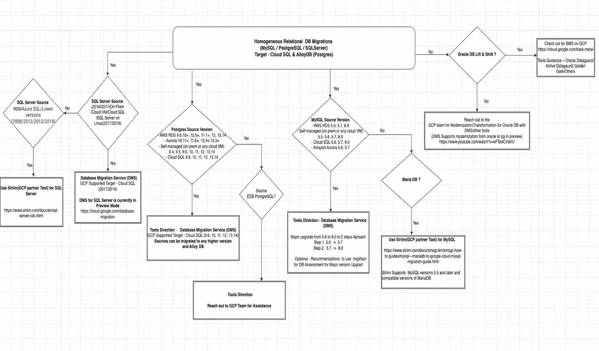
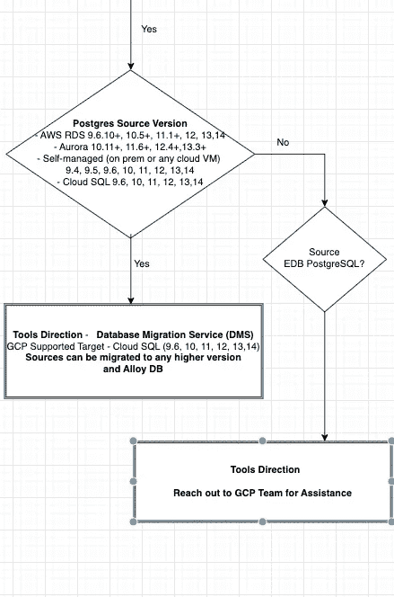

# 决策树—使用 GCP 数据库迁移服务(DMS)将同构数据库迁移到云 SQL & AlloyDB

> 原文：<https://medium.com/google-cloud/decision-tree-homogeneous-db-migration-to-cloud-sql-alloydb-with-gcp-database-migration-31e50edcc973?source=collection_archive---------0----------------------->

有了谷歌云，我们喜欢决策树来简化我们对 GCP 服务和方法的选择。

[GCP 在 2021 年初发布的数据库迁移服务](https://cloud.google.com/database-migration)在支持数据库向云 SQL 和 AlloyDB(Postgres)迁移方面有了巨大的增强。DMS 专门简化网络复杂性，处理源数据库和 CDC 的初始快照，并利用 insights 监控迁移作业。

在这个决策树方法中，我们的目标是使用云 SQL 和 Alloy DB(Postgres)将同构数据库迁移(相同的数据库引擎)到 GCP。

# 同构数据库迁移的决策树

让我们试着分析一下 Postgres 数据库引擎作为一个来源。如果菱形框中指定源 postgres 引擎为“是”，即满足条件，则可以使用 DMS。如果条件为“否”,则检查其他条件，如 EDB·波斯格里斯数据库，并寻求 GCP 的专业知识来简化数据库迁移。

希望你喜欢这个博客。敬请关注异构数据库迁移的决策树方法。

* * * GCP DMS 的已知限制—[https://cloud . Google . com/database-migration/docs/MySQL/Known-limits](https://cloud.google.com/database-migration/docs/mysql/known-limitations)