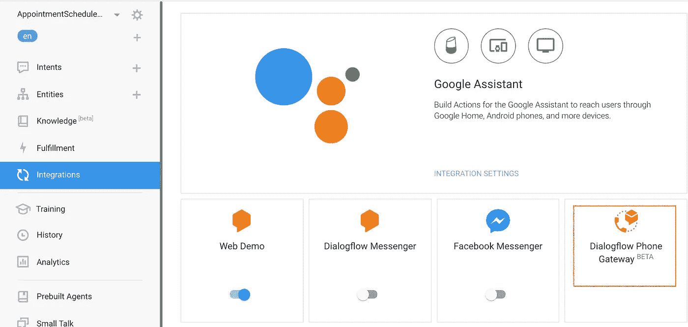
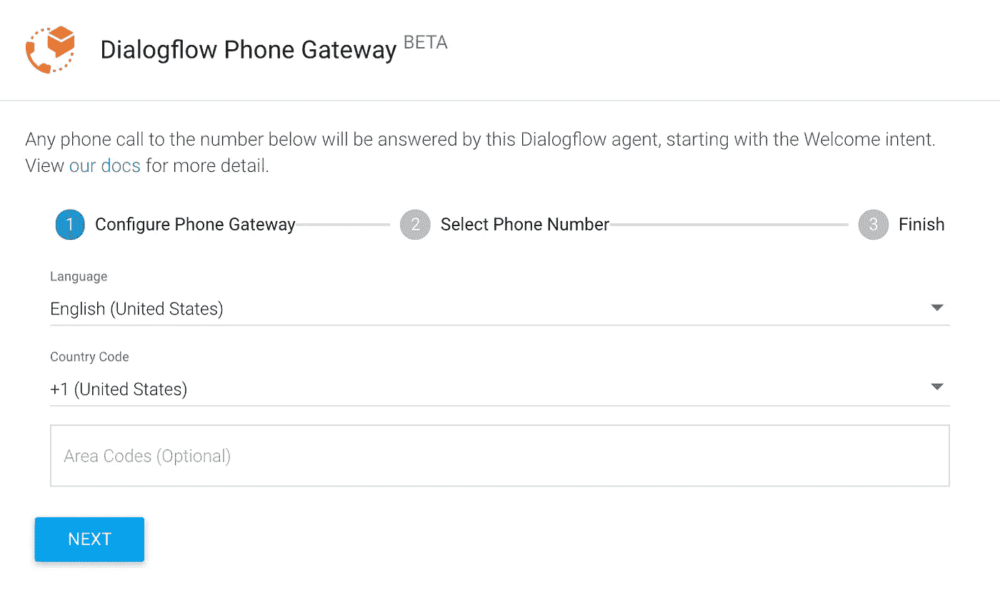

# 解构聊天机器人:集成 Dialogflow 和电话网关

> 原文：<https://medium.com/google-cloud/deconstructing-chatbot-integrate-dialogflow-with-telephony-gateway-f53159ac3779?source=collection_archive---------0----------------------->

# 介绍

在本文中，我们将了解 Dialogflow 如何与电话网关集成。电话网关功能为 Dialogflow 代理提供电话接口。尽管您可以使用任何 Dialoglfow 代理并通过本文来创建集成，但是如果您遵循解构聊天机器人系列，您可以使用我们在[之前的实验“约会调度程序”](/@pvergadia/deconstructing-chatbots-build-an-appointment-scheduler-with-dialogflow-2ee08614b630)中创建的同一代理。我们最后将通过聊天发送请求来测试集成。

# 你会学到什么

*   如何在 Dialogflow 中启用电话网关
*   如何测试与电话网关集成的 Dialogflow 代理

# 先决条件

*   对话流的基本概念和结构。关于介绍基本对话设计的 Dialogflow 教程视频，请查看[解构聊天机器人系列](https://www.youtube.com/watch?v=O00K10xP5MU&list=PLIivdWyY5sqK5SM34zbkitWLOV-b3V40B&index=1)。
*   我们将使用我们在[这篇](/@pvergadia/deconstructing-chatbots-build-an-appointment-scheduler-with-dialogflow-2ee08614b630)文章中构建的同一个约会调度聊天机器人，并在此基础上理解电话网关集成。
*   另外，请阅读“[解构聊天机器人:将 Dialogflow 与电话网关集成起来](https://www.youtube.com/watch?v=whZPw0HFnTE&list=PLIivdWyY5sqK5SM34zbkitWLOV-b3V40B&index=5)”一文。

# 什么是电话网关集成？

它用于构建对话式 IVR(交互式语音应答)解决方案，与呼叫中心网络的其余部分集成。目前(这项服务还在测试阶段)，你可以选择一个谷歌托管的电话号码。将来，您还可以转移现有的电话号码。

电话网关的最大优势是，您可以创建聊天或消息服务的代理，并毫不费力地将其转换为 IVR。你只需给已经构建好的聊天机器人分配一个电话号码，并通过电话和网络为用户提供相同的体验。

注意:请记住，这是测试版中的一项功能，因此随着服务正式上市，这些说明可能会有所变化。但是总的想法是一样的。

# 在 Dialogflow 中启用电话网关

我们将使用我们在之前的实验中构建的相同的约会调度聊天机器人，并完成集成。

*   导航至[对话流程控制台](https://console.dialogflow.com/api-client/)。
*   选择我们之前创建的 AppointmentScheduler 代理。

*   单击集成，然后单击“Dialogflow 电话网关”集成设置。

对话流集成，电话网关

*   它允许您选择国家和电话号码，并完成选择。

*   完成后，祝贺消息会显示一个分配给代理的电话号码，供用户拨打。

# 测试代理

为了测试具有此电话网关集成的 Dialogflow 代理，请拨打在上一步中分配的号码，并相应地浏览提示。如果您使用了预约调度代理来进行集成，您会发现您可以像聊天一样在电话上设置预约。

# 恭喜你！

您为现有的 Dialogflow 代理启用了电话网关，因此能够创建 IVR！

# 后续步骤

*   点击此处查看 Dialogflow 网站[获取文档、API、集成和更多内容。](https://cloud.google.com/dialogflow-enterprise/)
*   关注[解构聊天机器人](https://www.youtube.com/watch?v=O00K10xP5MU&list=PLIivdWyY5sqK5SM34zbkitWLOV-b3V40B&index=1)视频系列，订阅谷歌云平台 youtube 频道
*   想要更多的故事？查看我的[媒体](/@pvergadia/)，[在 twitter 上关注我](https://twitter.com/pvergadia)。
*   试试 [Dialogflow](https://dialogflow.com/) ，它是**免费**打造的一个 bot！看看这个。