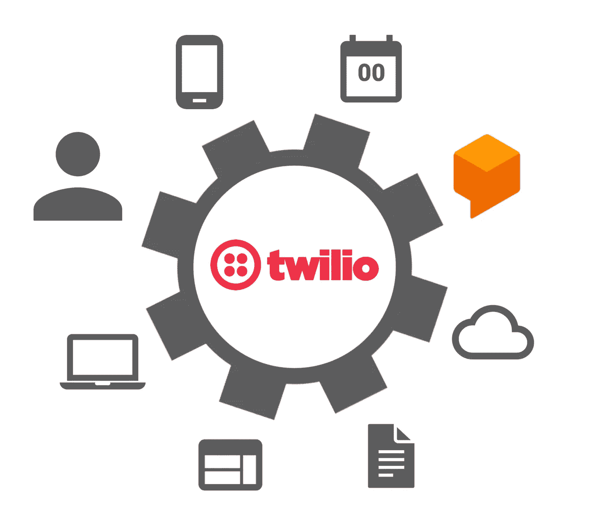
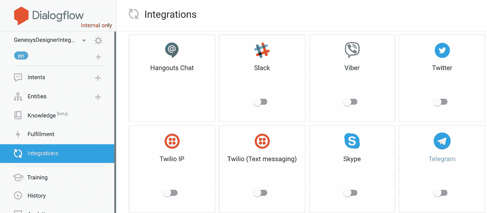
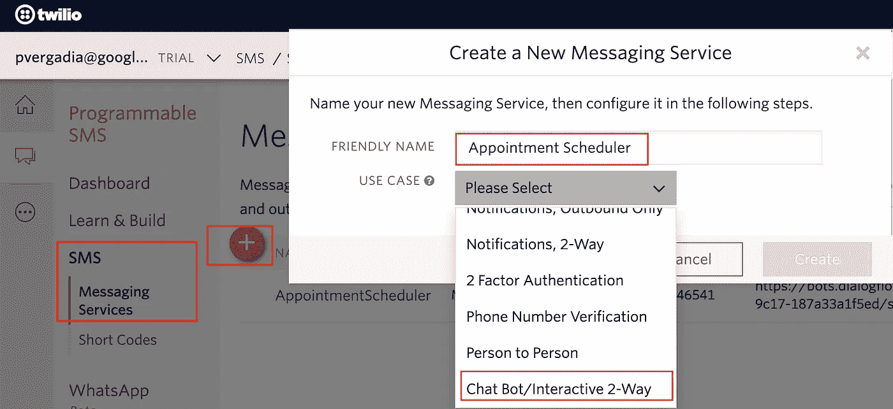

# 解构聊天机器人:集成 Dialogflow 和 Twilio 消息服务

> 原文：<https://medium.com/google-cloud/deconstructing-chatbot-integrating-dialogflow-with-twilio-messaging-service-34ccabec3fb5?source=collection_archive---------1----------------------->

# 介绍

在本文中，我们将了解 Dialogflow 如何与 Twilio 短信服务集成，从而轻松创建具有自然语言理解能力的 Twilio 机器人。Twilio 的可编程短信服务使发送和接收短信变得简单。如果您正在关注解构聊天机器人系列，我们将使用我们在[之前的实验“预约调度程序”](/@pvergadia/deconstructing-chatbots-build-an-appointment-scheduler-with-dialogflow-2ee08614b630)中创建的相同代理。尽管您可以使用任何 Dialoglfow 代理并通过本文来创建集成。我们最后将通过聊天发送请求来测试集成。

Dialogflow 与 Twilio 消息服务的集成

# 你会学到什么

*   如何从 Dialogflow 启用 Twilio 集成
*   如何测试集成了 Twilio 的 Dialogflow bot

# 先决条件

*   对话流的基本概念和结构。关于介绍基本对话设计的 Dialogflow 教程视频，请查看[解构聊天机器人系列](https://www.youtube.com/watch?v=O00K10xP5MU&list=PLIivdWyY5sqK5SM34zbkitWLOV-b3V40B&index=1)。
*   我们将使用我们在这篇文章中构建的相同的约会调度聊天机器人。
*   还可以浏览 youtube 视频“[解构聊天机器人:将 Dialogflow 与 Twilio Messaging Service](https://www.youtube.com/watch?v=t6ecd3Hi_hY&list=PLIivdWyY5sqK5SM34zbkitWLOV-b3V40B&index=7) ”以获得关于设置这种集成的更多说明。

# 从 Dialogflow 启用 Twilio 集成

我们将使用我们在之前的 codelab 中构建的相同的约会调度聊天机器人，并通过集成来工作。

*   导航到[对话流控制台](https://console.dialogflow.com/api-client/)。
*   选择我们之前创建的 AppointmentScheduler 代理。

*   点击集成，然后点击“Twilio(短信)”集成设置。

对话流集成

*   弹出有指示:点击开始，复制请求网址，并把它在 Twilio 可编程短信。

*   首先你需要一个 Twilio 账户，如果你没有的话，创建一个并登录。
*   从控制面板中，单击所有产品并导航至可编程 SMS。

Twilio 控制台中的可编程 SMS

*   进入可编程短信仪表板后，点击短信
*   如果您已经设置了约会计划程序消息服务，请使用它，如果没有，您可以创建一个。提供一个名称，在用例中，选择聊天机器人/交互式 2 路。

*   单击创建的消息服务来分配电话号码。
*   使用添加按钮购买新号码或使用现有号码。
*   点击通过美国选择，你应该有一个号码分配。

Twilio 控制台中的电话号码分配

*   此时，我们单击“配置”来集成 Dialogflow。
*   启用入站设置
*   在请求 URL 中，复制并粘贴由集成部分中的 Dialogflow 生成的 URL，然后保存。

*   从 Twilio 仪表板复制服务 ID、电话号码和 AuthToken，并将其粘贴到 Dialogflow 集成控制台中。完成后，点击开始。

从 Twilio 控制台复制这些项目

您会注意到 bot 已经成功启动。

# 测试代理

为了测试代理和 Twilio 集成，请在手机上使用短信。向分配给 Twilio 消息服务的号码发送文本消息，并运行适合您的代理的示例。

对于约会调度程序代理，您可以尝试以下测试:

# 恭喜你！

您使用 Twilio 消息服务为文本消息启用了 Dialoglfow 代理！

# 后续步骤

*   点击此处查看 Dialogflow 网站[获取文档、集成、API 等。](https://cloud.google.com/dialogflow-enterprise/)
*   关注[解构聊天机器人](https://www.youtube.com/watch?v=O00K10xP5MU&list=PLIivdWyY5sqK5SM34zbkitWLOV-b3V40B&index=1)视频系列，订阅谷歌云平台 youtube 频道
*   想要更多的故事？查看我的[媒体](/@pvergadia/)，[在 twitter 上关注我](https://twitter.com/pvergadia)。
*   试试 [Dialogflow](https://dialogflow.com/) ，它是**免费**打造的一个 bot！看看这个。