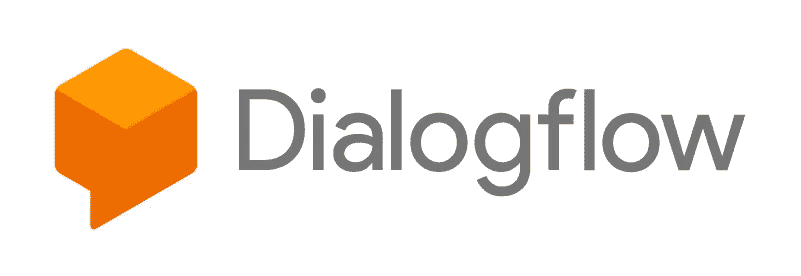

# 解构聊天机器人:概述

> 原文：<https://medium.com/google-cloud/deconstructing-chatbots-an-overview-80254544ad19?source=collection_archive---------0----------------------->

我在聊天机器人世界里呆了很长时间。当我加入谷歌云团队时，我的兴趣之一是关注 Dialogflow，很快我就开始收到开发者和商业领袖的 pings，他们希望帮助我开始使用 Dialogflow 和聊天机器人。所以，我决定开始这个名为“解构聊天机器人”的聚焦聊天机器人系列，我计划在这里与你分享我所有的学习。

解构聊天机器人:概述

对我们人类来说，交谈是很自然的，它是我们日常生活的一部分。我们从根本上理解它，以及围绕它的所有细微差别，因为老实说，这是我们的一部分。这就是为什么试图教一台机器进行对话如此困难。

你现在如何与机器互动似乎很简单。你只要问点什么，机器就会回应。但事实证明，对于机器来说，对话是一件非常困难的事情，因为人们以不同的方式寻求信息。

例如，要做一些简单的事情，比如了解天气，你可以说“今天天气如何”或者“现在天气如何”或者“明天旧金山的气温如何”

如果你要编写这样的代码，传统上——你很可能需要一个完整的条件矩阵来计算出用户可以要求这一单一事物的所有方式的所有边界情况。但是你可以想象，这是不可维护的。这就是 NLU(或者说，自然语言理解)的用武之地。

NLU 是一种帮助将人类语言翻译成计算机语言的技术，反之亦然。它与自然语言处理非常相似，但它更进一步，可以理解它没有经过训练的对话，如错误、拼写错误、口音、情绪等。这使得 NLU 非常适合聊天机器人。此外，NLU 同时处理语音和文本。

当您考虑客户支持时，对话体验可能不在您的列表之首，但它实际上是以非常个性化的方式满足客户期望的关键要素。随着时代的变化，任何产品或服务的用户都希望通过语音或聊天获得支持.. [**谷歌的 Dialogflow**](https://dialogflow.com/) 让这一切成为可能。

Dialogflow 通过提供强大的自然语言理解(NLU)引擎来处理和理解用户的需求，让您在产品和服务的基础上构建对话界面。这意味着当你使用 Dialogflow 时，你无需动一根手指，就能获得聊天机器人的 NLU 引擎的所有价值。

在本文中，我们讨论了对话体验，为什么它们很重要，NLU，以及 Dialogflow 如何让你快速启动并运行。在下一篇文章中，我们将描述聊天机器人世界中的一些关键术语，这将为我们开始构建实际的聊天机器人奠定坚实的基础。所以，继续关注解构聊天机器人。