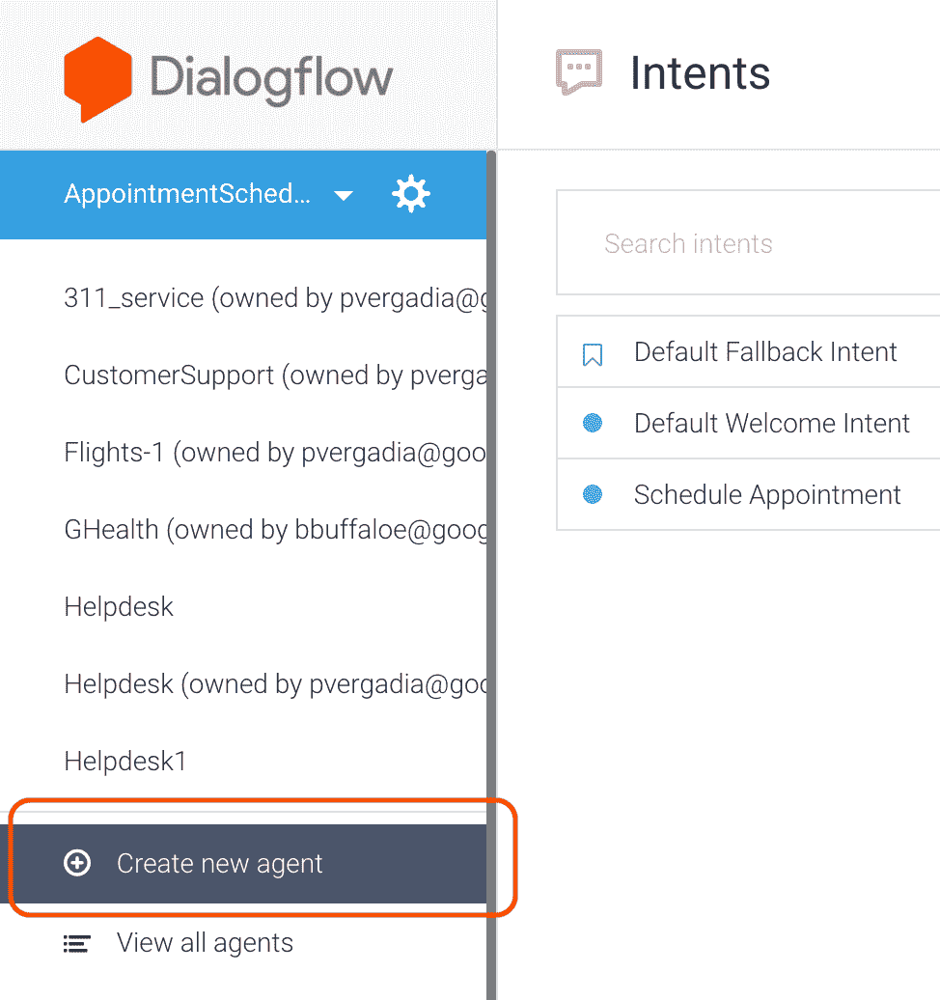
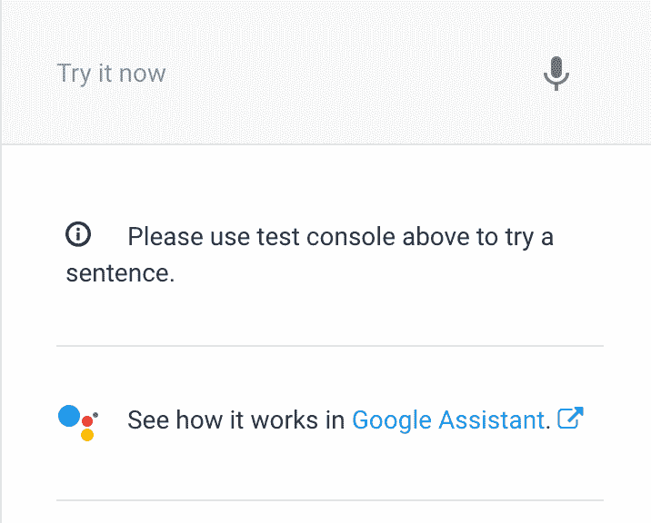
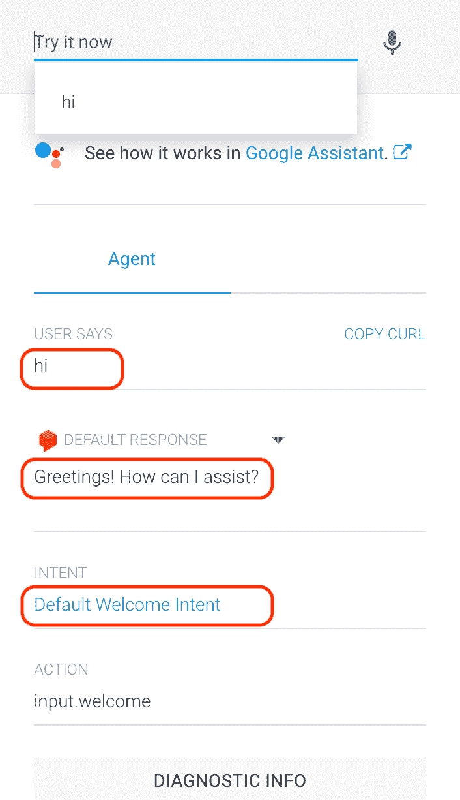
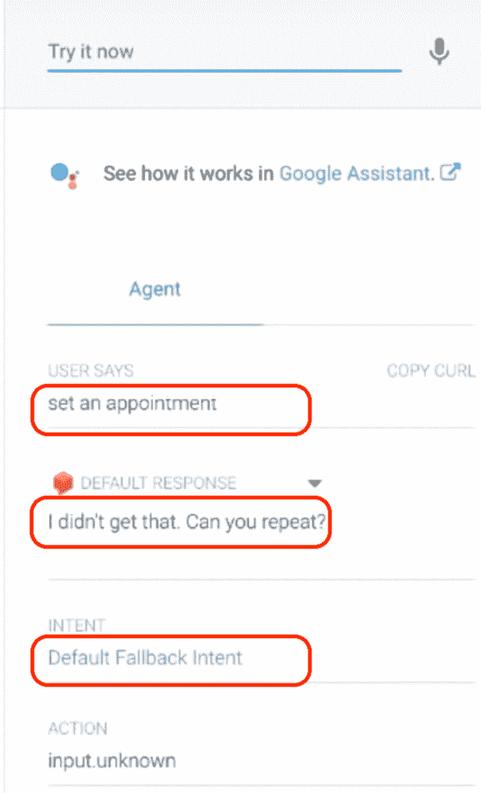
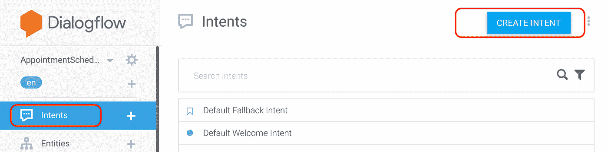
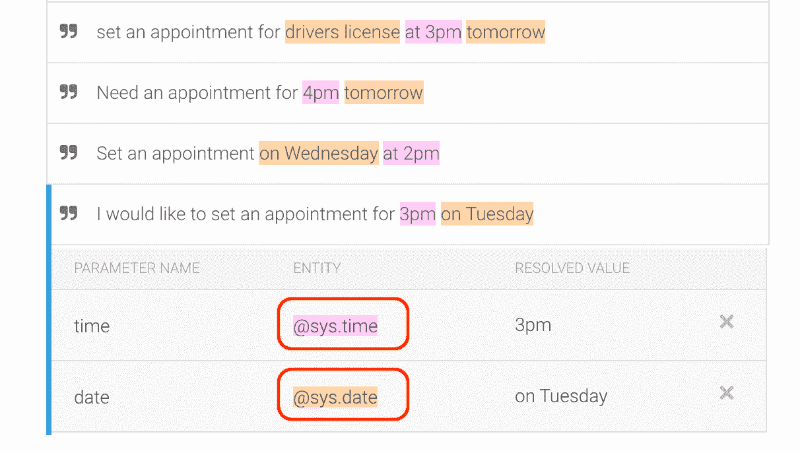
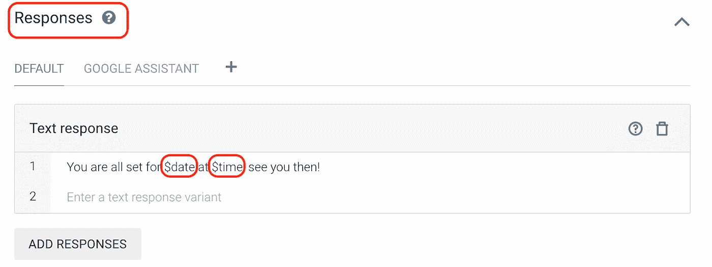
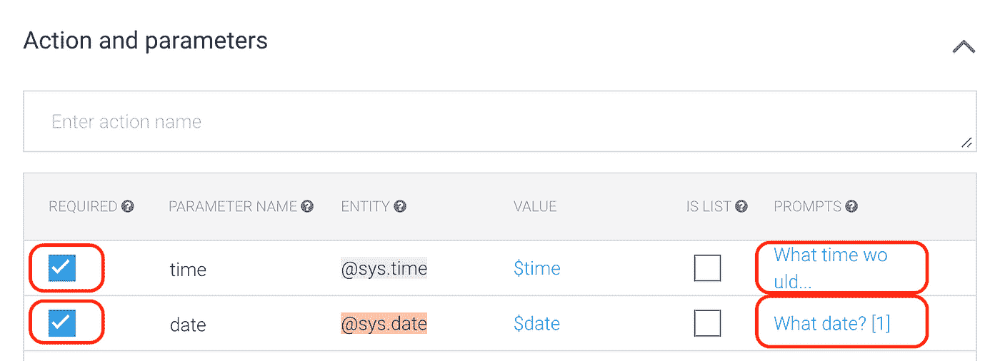
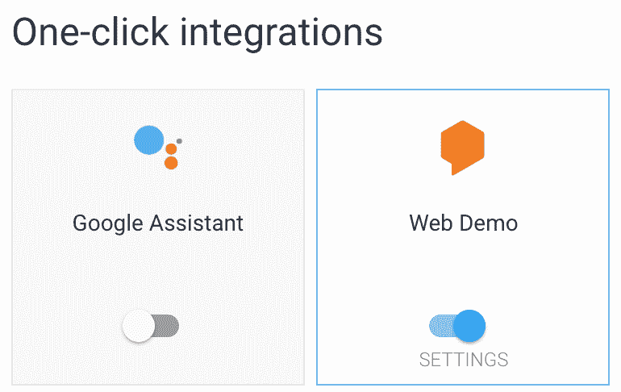
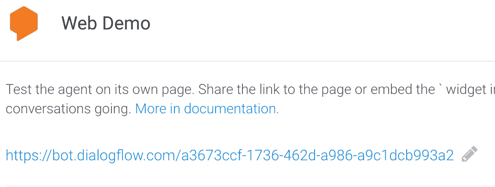

# 解构聊天机器人:用 Dialogflow 构建约会日程安排程序

> 原文：<https://medium.com/google-cloud/deconstructing-chatbots-build-an-appointment-scheduler-with-dialogflow-2ee08614b630?source=collection_archive---------0----------------------->

在第一篇博客中，我们学习了什么是对话体验，为什么它们很重要，简要介绍了 NLU，以及 Dialogflow 如何让你快速上手。在[的第二篇文章](/google-cloud/deconstructing-chatbots-getting-started-with-dialogflow-4f91deb32135)中，我们描述了一个简单的高级架构来在 Dialogflow 中设置一个代理，并学习了高级别的意图、实体、上下文和实现。现在，我们准备开始使用 Dialogflow 并创建我们的第一个聊天机器人。

**简介**

如果能在医生办公室、车管所或修理店访问预约日程安排，岂不是太棒了？在本文中，您将使用 Dialogflow 构建一个简单的聊天机器人，并学习如何使用一键集成将其与 web 集成。

这些练习旨在反映云开发人员的共同体验:

1.  创建对话流代理
2.  创建意图
3.  测试聊天机器人
4.  启用 web 集成

# 你会学到什么

*   如何创建 Dialogflow 代理
*   如何在代理内创建意图
*   如何在意向中创建培训短语
*   如何在意向中创建回应
*   如何测试 Dialogflow 代理
*   如何设置 web 集成

# 先决条件

对话流的基本概念和结构。有关介绍基本对话设计的 Dialogflow 教程视频，请查看以下视频:

# 创建对话流代理

*   导航到[对话流控制台](https://console.dialogflow.com/api-client/)。
*   登录，如果你是第一次使用，然后使用您的电子邮件注册
*   接受条款和条件，您将进入控制台
*   创建一个**代理。**要创建**，**单击左侧窗格中的下拉菜单，以查看“**创建新代理**

*   称之为“约会日程表”
*   Dialogflow 为你创建了一个 GCP 项目来访问日志，云功能等。您也可以选择一个现有的项目。
*   准备好后，点击**创建**。
*   作为代理的一部分，Dialogflow 创建了两个默认意图。
*   默认欢迎意图有助于问候您的用户
*   默认的回退意图有助于捕捉机器人不理解的所有问题。
*   在这一点上，我们有一个向用户问候的功能性机器人。

# 测试代理！

在 Dialgflow 控制台的右侧，您可以看到如下所示的测试面板:

要测试代理，请在“立即尝试”框中键入“嗨”。代理应回复“默认欢迎意图”中定义的默认问候。这可能是“问候！我该如何协助？”您也可以修改响应。

现在，如果你尝试“设置一个约会”,它不知道该怎么做，所以它启动了回退意图。这是因为我们没有创建任何意图来捕捉该特定问题！

# 创建意图

*   要创建意向，请单击“代理”中的“意向”，然后单击右侧的“创建意向”按钮。将意向命名为“计划约会”

*   现在，跳过顶部的上下文和事件。点击“添加培训短语”。你可以用下面的短语来表达。单独试用它们。

约定在周三下午 2 点见面

我需要预约明天下午 4 点

我想预约星期二下午 3 点

*   当您输入这些内容时，您会看到“日期”和“时间”被自动标识为系统实体@sys.date 和@sys.time。

*   为了实现这个功能，我们需要对用户做出回应。我们来补充一个回应。向下滚动到“响应”部分，并点击“添加响应”。你可以说——“你已经准备好了。到时候见！或者你可以说得更有趣些，比如“你已经准备好在$时间进行$日期的活动了。”。到时候见！“美元($)符号帮助您访问实体值。

*   此时，您可以单击“Save”并使用“set a appointment for 4pm on Thursday”测试代理不出所料，您会得到日期和时间正确的响应。

# 槽填充

现在，尝试测试“设置约会”，因为这不是很具体，我们目前还没有处理这种情况，它应该由回退意图来处理。为了支持这一点，我们使用了一种叫做**槽填充**的东西。

槽填充允许您为单个意图中的参数值收集设计一个对话流。如果没有一组特定的参数值，操作就无法完成，这很有用。要了解更多关于槽填充的信息，请参考[这份](https://dialogflow.com/docs/concepts/slot-filling)文件。

接下来，让我们设置槽填充。

*   点击“动作和参数”。
*   根据需要创建实体，Dialogflow 将确保在回复之前询问日期和时间。
*   对于时间，加上“你想什么时候来”
*   在日期中加上“什么日期”。您也可以添加其他变体。
*   完成后，点击**保存**。

# 测试你的聊天机器人！

此时，应该已经建立了 Dialogflow。通过输入以下对话，在右侧的**立即尝试**面板中进行测试:

*   用户:“嗨”
*   用户:“设置约会”
*   聊天机器人回应:“你想什么时候进来？”
*   用户:“上午 10 点”
*   聊天机器人回应:“什么日期？”
*   用户:“5 月 23 日”

# 启用一键式 Web 集成

Dialogflow 为您的聊天机器人提供了多种类型的集成。让我们来看看聊天机器人的示例 web 用户界面。

点击对话框左侧面板中的**集成**。

通过扳动开关启用**网络演示**集成

单击 URL 链接启动 Web 演示

开始使用聊天界面，在“提问”部分输入！如果你使用的是 Chrome 浏览器，点击麦克风图标，你就可以对聊天机器人说出你的问题。使用以下对话开始与聊天机器人聊天:

*   键入“Hi”并按回车键。聊天机器人应该像以前一样响应。
*   然后输入/说出“约定明天下午 4 点”。机器人应该用约会的确认来回应。

# 恭喜你！

你创建了一个聊天机器人，你现在是一个聊天机器人开发者！继续在 medium 或 GCP youtube 系列上阅读更多类似的教程。

# 后续步骤

*   点击查看 Dialogflow 网站[获取文档、API 和更多内容。](https://cloud.google.com/dialogflow-enterprise/)
*   关注[解构聊天机器人](https://www.youtube.com/watch?v=O00K10xP5MU&list=PLIivdWyY5sqK5SM34zbkitWLOV-b3V40B&index=1)视频系列，订阅谷歌云平台 youtube 频道
*   想要更多的故事？查看我的[媒体](/@pvergadia/)，[在 twitter 上关注我](https://twitter.com/pvergadia)。
*   试试 [Dialogflow](https://dialogflow.com/) ，它是**免费**打造的一个 bot！看看这个。