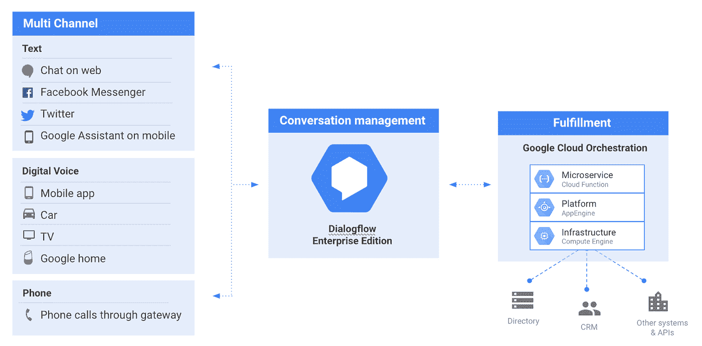
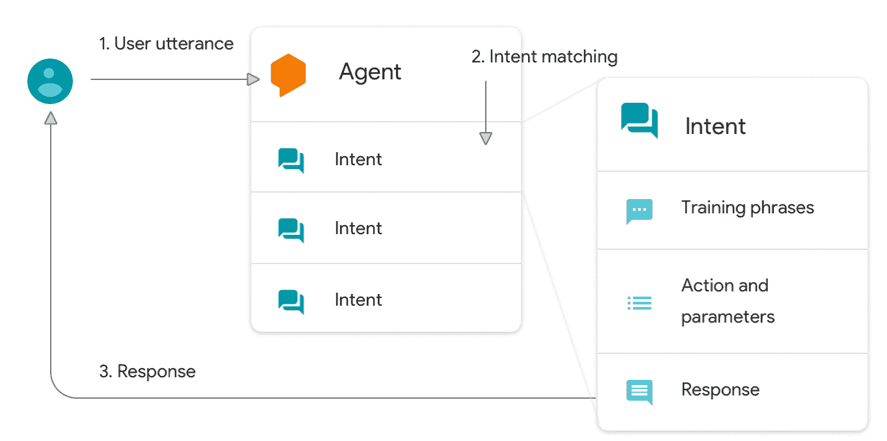
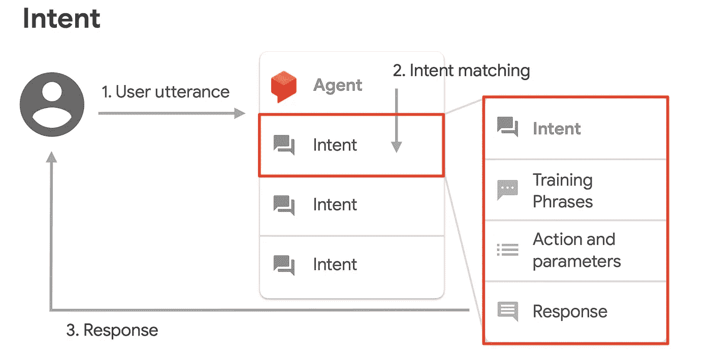
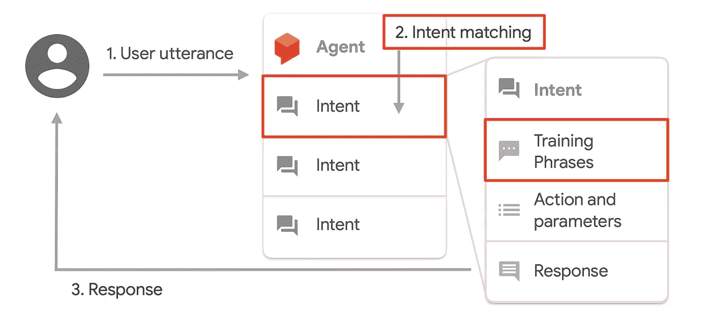
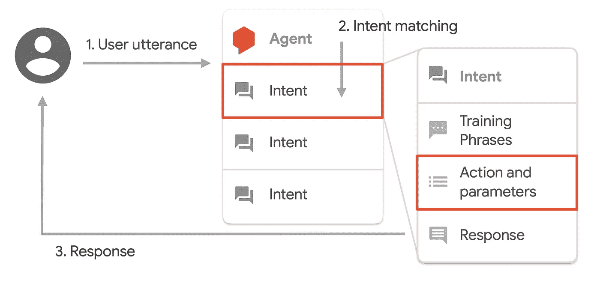
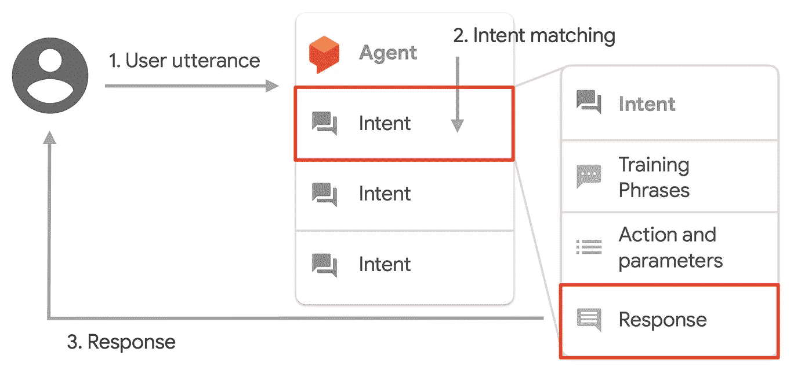
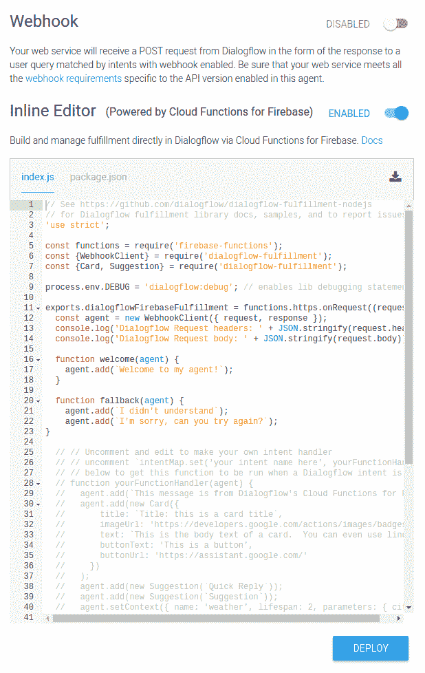

# 解构聊天机器人:Dialogflow 入门

> 原文：<https://medium.com/google-cloud/deconstructing-chatbots-getting-started-with-dialogflow-4f91deb32135?source=collection_archive---------1----------------------->

在上一篇文章中，我们介绍了 Dialogflow，这是一个由自然语言理解驱动的端到端工具，用于促进丰富而自然的对话。在本文中，我们将剖析聊天机器人的架构，以更好地理解由 Dialogflow 驱动的对话体验的构建块。

[https://www.youtube.com/watch?v=Ov3CDTxZRQc](https://www.youtube.com/watch?v=Ov3CDTxZRQc&t=2s)

这是高级架构:

对话流驱动的对话体验的高级架构

*   Dialogflow 位于堆栈的中间。
*   用户可以通过所有常见的渠道与它交互，包括文本、网站、手机应用程序、信使、twitter 和所有智能语音设备，如 google home。
*   Dialogflow 使用由您的示例训练的机器学习模型来处理将自然语言翻译成机器可读数据的工作。
*   一旦它识别出用户在谈论什么，它就可以把这些数据传递到你的后端，你可以用这些数据来做事情
*   在后端，您可以通过与您的其他服务、数据库甚至像 CRM 这样的第三方工具集成来满足请求。

让我们更深入地研究一下对话流本身。

我们首先在 Dialogflow 中创建一个**代理**。代理本质上是你的整个聊天机器人应用程序，收集用户所说的话，将它映射到意图，对它采取行动，并为用户提供响应的体验。在代理中，这一切都始于一个触发事件，称为**发言**。这是我们的用户调用聊天机器人的方式。

因此，如果我们说:*嘿，谷歌，播放一些音乐*——整个句子是话语。而短语*“嘿谷歌”*则是触发器。

我们再举一个例子。*嘿，谷歌，和预约安排者谈谈。*短语“talk to Appointment scheduler”是我们聊天机器人的**调用短语**,“Appointment Scheduler”是**调用名称**。

一旦机器人被激活并且已经收集了用户话语。我们需要理解用户的意图。本质上，他们为什么想和我们的机器人说话..

目的

所以当你说“*我想预约*”——短语“预约”就是这里的意图

或者如果你问“*你们的营业时间是什么时候*”？—那么工作时间就是目的。

训练短语和意图匹配

为了控制这一切，您为 Dialogflow 提供了用户意图的不同示例，如设置约会、工作时间等..Dialogflow 然后用更多相似的短语训练一个机器学习模型，最终将用户的短语映射到正确的意图。这个过程叫做**意图匹配。**

现在我们知道了用户的意图，我们需要知道做什么来提供响应。为此，您配置**动作和参数**来定义您想要收集和存储的变量。

动作和参数-实体

让我们看一个例子——*约定明天早上 5 点*。

当用户说— *早上 5 点*和*明天*是我们实际上需要预约的两个关键信息时。那些变量被定义为**实体**。

意向反应

Dialogflow 提供了不同类型的实体，我们将在下一篇文章中详细介绍。

一旦我们有了变量，我们可以使用它们向用户提供静态的**响应**。在大多数情况下，我们可能希望将变量发送到我们的后端，采取一些行动，然后向用户提供一个动态响应。

概括来说，意图包括训练短语、动作和参数以及响应。根据你的机器人提供的服务，你可能通常有几个到 1000 个意图。它们也可以是不同的语言。

当我们看架构时，有必要提一下**上下文**。上下文是聊天机器人存储和访问变量的一种方法，因此它可以在对话中从一个意图向另一个意图交换信息。上下文实际上是一个非常重要的主题，所以我们将在以后的文章中详细讨论上下文。

**Fulfillment** 是拼图的最后一块，它是您编写的与后端服务接口以响应动态请求的代码。

> **Dialogflow 内置了与谷歌云功能的集成，可以与您的后端接口。**

您还可以提供任何其他定制的 HTTP 或 HTTPS 端点来将 Dialogflow 连接到您的后端。

在本文中，我们查看了一个简单的高级架构来设置 Dialogflow 中的代理，我们还学习了高级的意图、实体、上下文和实现。

在下一篇文章中，我将构建一个简单的约会调度聊天机器人。所以，继续解构聊天机器人…