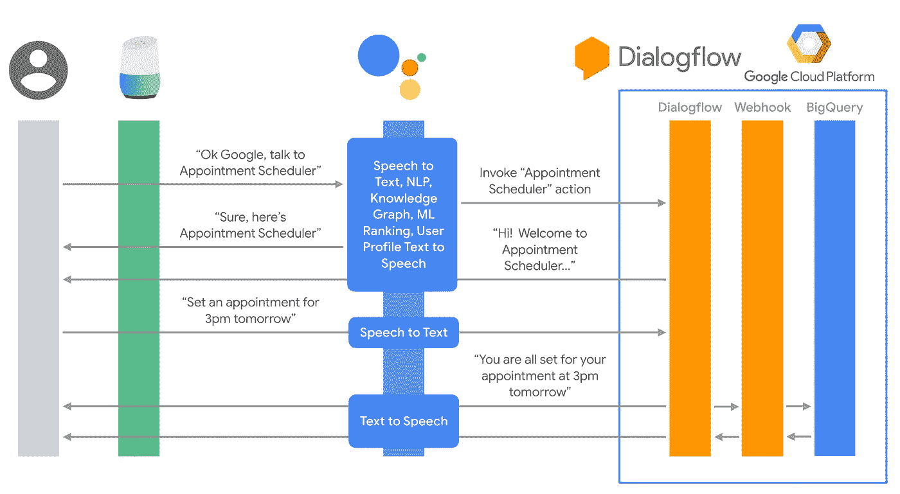
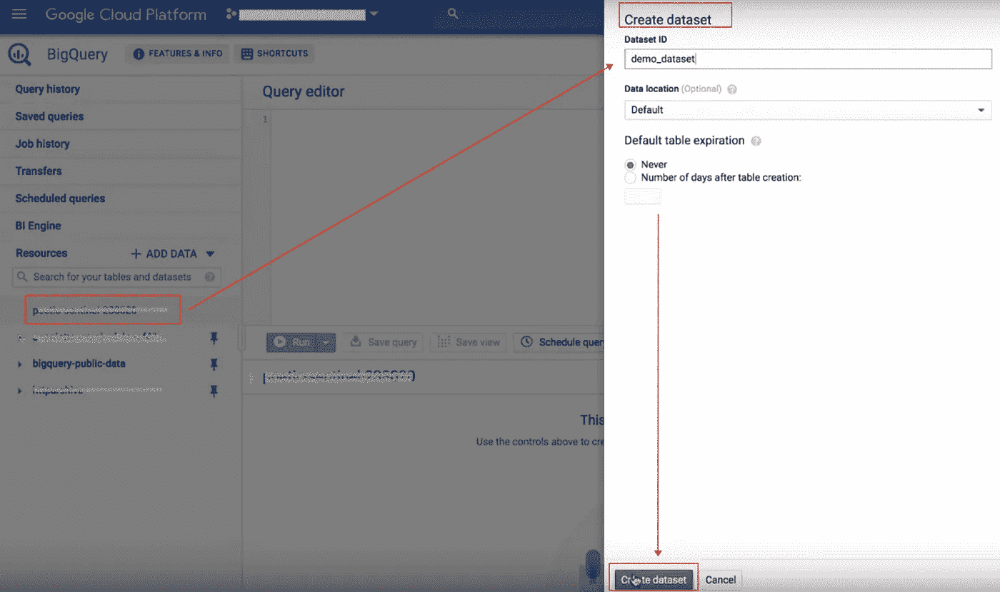
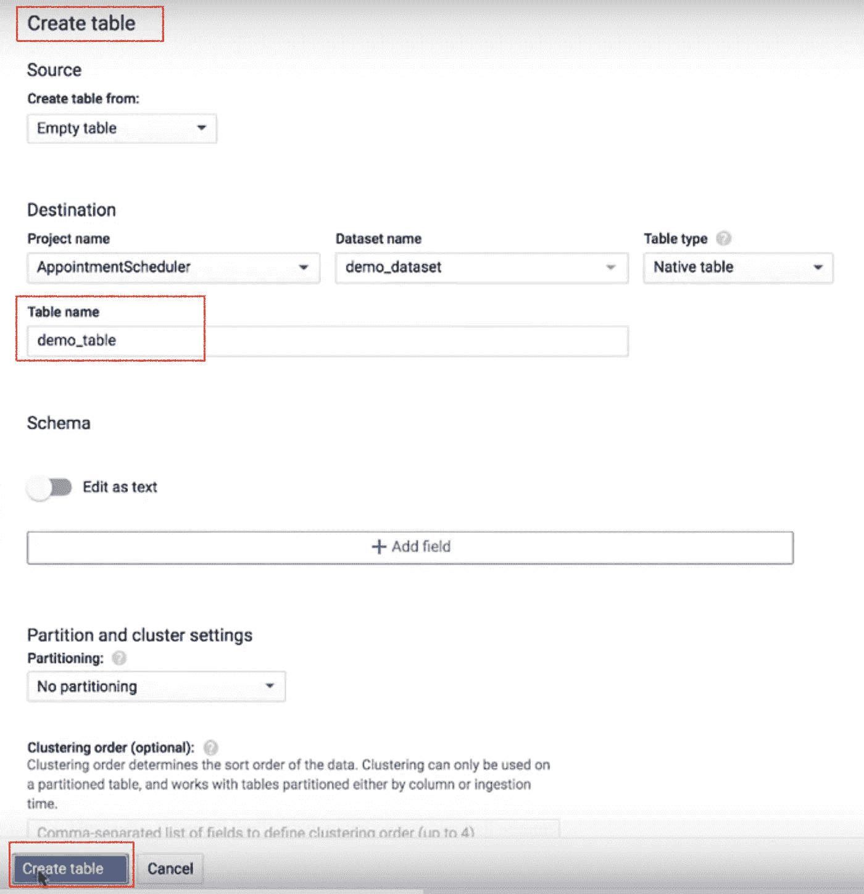
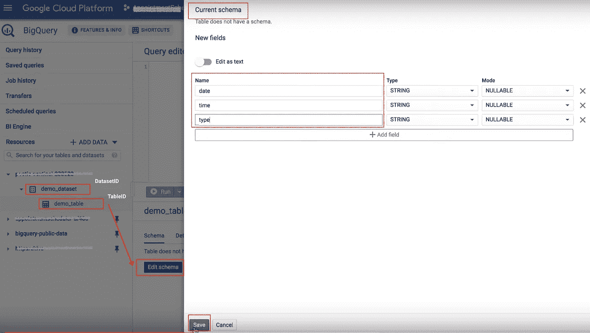
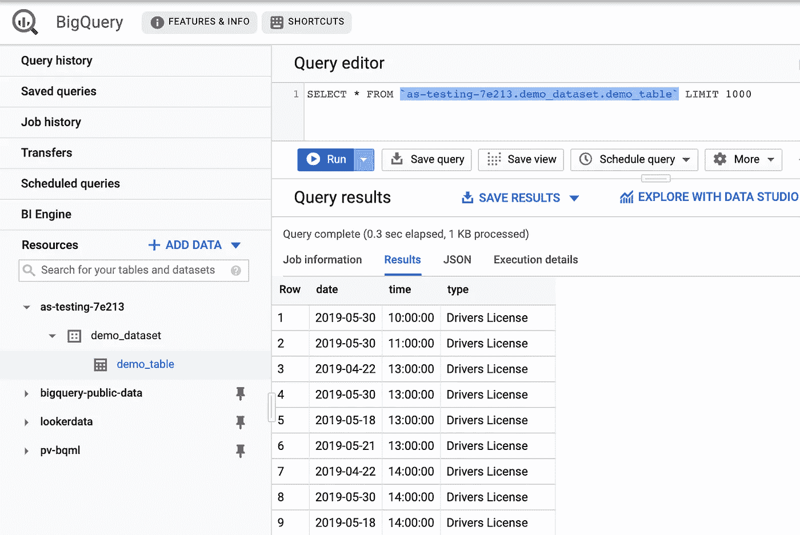

# 解构聊天机器人:如何集成 Dialogflow 和 BigQuery

> 原文：<https://medium.com/google-cloud/deconstructing-chatbots-how-to-integrate-dialogflow-with-bigquery-267b68f4e795?source=collection_archive---------0----------------------->

# 介绍

在本文中，我们将了解 Dialogflow 如何连接 BigQuery 并存储在对话过程中收集的信息。我们将使用我们在[之前的实验](/@pvergadia/deconstructing-chatbots-build-an-appointment-scheduler-with-dialogflow-2ee08614b630)[预约调度](https://www.youtube.com/watch?v=oU88sHd6ilE&list=PLIivdWyY5sqK5SM34zbkitWLOV-b3V40B&index=4)中创建的相同代理。在代理的 GCP 项目中，我们将在 BigQuery 中创建一个数据集和一个表。然后，我们将使用 BigQuery 数据集和表 id 编辑原始实现。最后，我们将测试交互是否被记录在 BigQuery 中。

下面是从用户到实现和 BigQuery 的事件序列图。

Dialogflow BigQuery 集成

# 你会学到什么

*   如何在 BigQuery 中创建数据集和表
*   如何在 Dialogflow fulfillment 中设置 BigQuery 连接详细信息。
*   如何测试履行情况

# 先决条件

*   对话流的基本概念和结构。对于介绍基本对话设计的 Dialogflow 教程视频，请查看 [*解构聊天机器人系列*](https://www.youtube.com/watch?v=O00K10xP5MU&list=PLIivdWyY5sqK5SM34zbkitWLOV-b3V40B&index=1) 。
*   正如我前面提到的，我们将使用我们在本文中构建的相同的“*约会调度器*”聊天机器人，并添加与 BigQuery 的集成。
*   另外，请阅读“ [*解构聊天机器人:通过将 Dialogflow 与 Google Calendar*](/google-cloud/deconstructing-chatbots-understanding-fulfillment-by-integrating-dialogflow-with-google-calendar-dde40a3856ff) ”文章，了解 Dialogflow fulfillment 的一些背景知识。
*   如果你想看这个视频，可以看看这个视频

将 Dialogflow 与 BigQuery 集成

# 步骤 1:在 BigQuery 中创建数据集和表

*   导航到[谷歌云控制台](https://console.cloud.google.com/)
*   在云控制台中，转到菜单图标☰>大数据>大查询
*   在左侧窗格的 Resources 下，单击项目 ID，一旦选中，您将在右侧看到 CREATE DATASET
*   点击创建数据集并命名。

BigQuery 中的数据集

*   创建数据集后，在左侧面板中单击它。您将在右侧看到创建表。
*   单击创建表格，提供表格名称，然后单击屏幕底部的创建表格。

在 BigQuery 中创建表

*   创建表格后，单击左侧面板中的表格。您将在右侧看到“*编辑模式”*按钮。
*   单击“编辑模式”按钮，然后单击“添加字段”按钮。添加“*日期*字段，对“*时间*”和“*类型*”重复相同的操作。
*   注意" *DatasetID"* 和" *tableID"*

# 步骤 2:将 BigQuery 连接详细信息添加到 Dialogflow 实现

*   打开 Dialogflow 代理并启用实现内嵌编辑器。如果你需要这方面的帮助，请参考[上一篇文章](/google-cloud/deconstructing-chatbots-understanding-fulfillment-by-integrating-dialogflow-with-google-calendar-dde40a3856ff)。
*   确保 Dialogflow fulfillment 行内编辑器中的“*package . JSON”*包含 BigQuery 依赖项。*“@ Google-cloud/big query”:“0 . 12 . 0”。*确保您在阅读本文时使用的是最新版本的 BigQuery。
*   在 index.js 中创建" *addToBigQuery* "函数，在 BigQuery 表中添加日期、时间和约会类型。
*   在 index.js 文件的 TODO 部分添加 *projectID* 、 *datasetID* 和 *tableID* ，以将您的 BigQuery 表和数据集正确连接到您的实现。

索引. js

## 事件顺序:

*   意图地图调用“*make appointment”*函数在 Google 日历上安排约会
*   在同一个函数中，调用“ *addToBigQuery* ”函数来发送要记录到 BigQuery 中的数据。

# 步骤 3:测试你的聊天机器人和 BigQuery 表！

让我们来测试我们的聊天机器人，你可以在模拟器中测试它，或者使用我们在以前的文章中学到的网络或 google home 集成。

*   用户:“明天下午 2 点预约车辆登记”
*   聊天机器人回应:“好吧，让我看看我们是否能把你安排进去。8 月 6 日下午 2 点可以！."
*   响应后检查 BigQuery 表。使用查询"*SELECT * FROM ` projectid . datasetid . tableid `*"

# 恭喜你！

您使用 inline editor 创建了一个实现，并将其与 BigQuery 集成在一起。想出更多这样的集成，并尝试它们！

# 后续步骤

*   点击查看 Dialogflow 网站[获取文档、API 和更多集成。](https://cloud.google.com/dialogflow-enterprise/)
*   关注[解构聊天机器人](https://www.youtube.com/watch?v=O00K10xP5MU&list=PLIivdWyY5sqK5SM34zbkitWLOV-b3V40B&index=1)视频系列，订阅谷歌云平台 youtube 频道
*   试试 [Dialogflow](https://dialogflow.com/) ，是**免费**造一个 bot！看看这个。