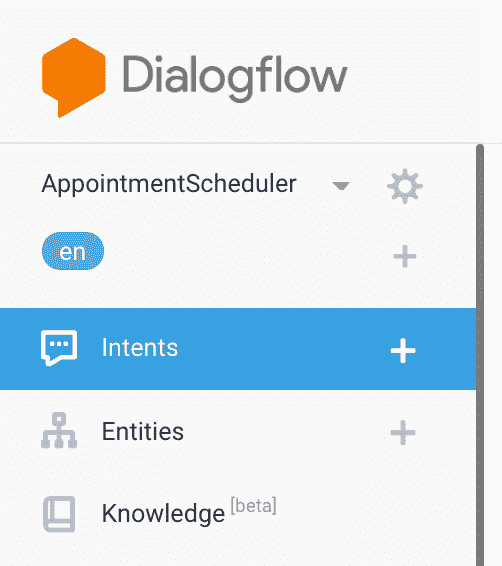

# 解构聊天机器人:理解对话流中的实体

> 原文：<https://medium.com/google-cloud/deconstructing-chatbots-understanding-entities-in-dialogflow-a5d3d4c0fe8d?source=collection_archive---------0----------------------->

# 介绍

[实体](https://dialogflow.com/docs/entities)是 Dialogflow 的机制，用于从自然语言输入中识别和提取有用的数据。

虽然意图允许代理理解特定用户输入背后的动机，但实体用于挑选用户提到的特定信息——从街道地址到产品名称或带有单位的数量。您想从用户请求中获得的任何重要数据都会有相应的实体。

有三种类型的实体:

# 系统实体

Dialogflow 配备了众多的[系统实体](https://dialogflow.com/docs/entities/system-entities)，允许代理提取关于广泛概念的信息，而无需任何额外的配置。例如，系统实体可用于从自然语言输入中提取日期、时间和位置。

# 开发商实体

如果您需要提取 Dialogflow 系统实体之外的概念信息，您可以定义自己的[开发者实体类型](https://dialogflow.com/docs/entities/developer-entities)。例如，一个品牌可能会创建一个实体类型来识别其唯一的产品名称集。

# 会话实体

还可以定义仅适用于特定对话的实体类型。例如，您可以创建一个实体类型来表示特定用户在预订时可用的时间敏感选项。这些被称为[会话实体类型](https://dialogflow.com/docs/entities/session-entities)。

# 你会学到什么

*   如何在 Dialogflow 中创建和使用系统实体
*   如何在 Dialogflow 中创建和使用开发人员实体
*   如何测试代理

# 先决条件

对话流的基本概念和结构。关于介绍基本对话设计的 Dialogflow 教程视频，请查看[解构聊天机器人系列](https://www.youtube.com/watch?v=O00K10xP5MU&list=PLIivdWyY5sqK5SM34zbkitWLOV-b3V40B&index=1)。

我们将使用在本文中构建的同一个约会调度聊天机器人，并在此基础上理解实体。

# 如何在 Dialogflow 中启用和使用系统实体

*   导航至[对话流程控制台](https://console.dialogflow.com/api-client/)。
*   选择我们在前面的 codelab 中创建的 AppointmentScheduler 代理。

*   点击“意图”

*   点击“预约”打开意向设置
*   您会注意到，在当前的意图设置中，有类似“为明天下午 4 点设置一个约会”的训练短语，其中**日期**和**时间**被自动提取为系统实体日期和时间。随意添加更多的训练短语，看看 Dialogflow 是如何自动提取系统实体的。

*   如您所见，系统实体允许代理提取关于广泛概念的信息，而无需任何额外的配置。地址、电子邮件、货币、电话号码等数据是系统实体的一些常见示例。点击了解更多[。](https://dialogflow.com/docs/reference/system-entities)

# 如何在 Dialoglfow 中启用和使用开发人员实体

# 创建开发人员实体

*   到目前为止，我们一直以一种通用的方式处理我们的预约调度程序。假设我们的调度程序是为一个州的机动车管理局(DMV)服务的。
*   驾照和注册是 DMV 提供的两个主要服务，所以让我们创建这些实体。
*   点击实体

*   点击“创建实体”按钮

*   添加实体名称“AppointmentType ”,添加“车辆登记”和“驾驶执照”作为两个具有几个同义词的实体条目，点击**保存**。输入示例见截图。

*   您可以添加更多包含更多服务的行作为实体类型。
*   您可以勾选**“允许自动扩展**”框来自动添加更多实体。开发者实体的自动扩展允许代理识别实体中没有明确列出的值。如果用户的请求包含实体中未列出的项目，自动扩展会将未定义的项目识别为实体中的参数。代理看到用户的请求与提供的示例相似，因此它可以导出请求中的项目。
*   [供您参考]批量上传或下载实体:
*   点击“创建实体”按钮附近的三个点。
*   您将看到“上传实体”按钮

*   然后就可以上传 CSV 或者 JSON 格式的文件了。

*   应该通过说“点击保存”来结束

# 编辑意图以适应新创建的开发人员实体

*   单击左侧窗格中的“Intent”
*   将培训短语添加到“预约”意图中。
*   “明天下午 3 点预约领驾照”。您将看到 Drivers license 被标识为我们在上一节中设置的开发人员实体“AppointmentType”。系统实体时间和日期也会被自动识别。

*   再加几个类似这样的训练短语。
*   周一的许可证更新预约
*   在周一下午 2 点预约领证
*   周一的车辆登记预约

*   还记得第一个 Codelab 的槽填充吗？在此回顾槽填充[。简而言之，要预约一个准确的约会，我们需要全部三条信息:约会类型、日期和时间。如果用户只提供了一个或两个片段，那么 Dialogflow 将在对响应进行操作之前询问剩余的信息。](https://dialogflow.com/docs/concepts/slot-filling)
*   我们需要使“约会类型”像时间和日期一样成为必填字段。为此，请单击 AppointmentType 旁边的复选框。

*   然后添加一个提示，如果用户没有提供预约类型，将使用这个提示。示例提示:“您希望获得什么服务？车管所提供驾照和车辆登记服务。”
*   完成后，**保存**所做的修改。

# 测试你的聊天机器人！

让我们来测试我们的聊天机器人，你可以在模拟器中测试它，或者使用我们在以前的代码实验室中学到的 web 或 google home 集成。

**测试用例 1:** 在这种情况下，用户仅要求设置约会，而没有这三条信息。因此，Dialogflow 的时间段填充使用我们在意向的“动作和参数”部分设置的时间段填充提示来询问日期、时间和约会类型。

*   用户:“设置约会”
*   聊天机器人回应:“什么日期？”
*   用户:“5 月 23 日”
*   聊天机器人回应:“你想什么时候进来？”
*   用户:“上午 10 点”
*   聊天机器人回应:“你希望得到什么服务？车管所提供驾照和车辆登记服务。”
*   用户:“许可证”
*   聊天机器人:“您已经为 2019 年 5 月 23 日 10:00:00 的车辆登记预约做好了准备。到时候见！”

**测试用例 2:** 在这种情况下，用户要求用部分信息来设置约会。因此，Dialogflow 的时间段填充使用我们在意向的“动作和参数”部分设置的时间段填充提示来询问日期、时间和约会类型。

*   用户:“需要预约明天下午 4 点”
*   聊天机器人回应:“你希望得到什么服务？车管所提供驾照和车辆登记服务。”
*   用户:“许可证”
*   聊天机器人:“你已经为 2019 年 4 月 24 日 16:00:00 的驾照预约做好了准备。到时候见！”

**测试用例 3:** 在这种情况下，用户一次性提供所有信息。Dialogflow 处理信息并提供带有预约确认的响应。

*   用户:“明天下午 2 点预约车辆登记”
*   聊天机器人回应:“您已经为 2019 年 4 月 24 日 14:00:00 的车辆登记预约做好了准备。到时候见！”

# 恭喜你！

你创建了一个带有自定义实体的聊天机器人。

# 后续步骤

*   点击查看 Dialogflow 网站[获取文档、API 和更多内容。](https://cloud.google.com/dialogflow-enterprise/)
*   关注[解构聊天机器人](https://www.youtube.com/watch?v=O00K10xP5MU&list=PLIivdWyY5sqK5SM34zbkitWLOV-b3V40B&index=1)视频系列，订阅谷歌云平台 youtube 频道
*   想要更多的故事？查看我的[媒体](/@pvergadia/)，[在 twitter 上关注我](https://twitter.com/pvergadia)。
*   试试 [Dialogflow](https://dialogflow.com/) ，是**免费**打造一个 bot！看看这个。