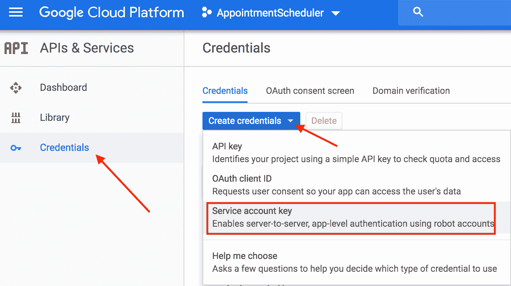

# 解构聊天机器人:通过集成 Dialogflow 和 Google Calendar 理解实现

> 原文：<https://medium.com/google-cloud/deconstructing-chatbots-understanding-fulfillment-by-integrating-dialogflow-with-google-calendar-dde40a3856ff?source=collection_archive---------4----------------------->

# 介绍

在本文中，我们将了解 Dialogflow 如何与后端系统连接，以提供对用户问题的丰富和动态的响应。我们将使用我们在之前的实验中创建的同一代理“预约计划程序”。在代理的 GCP 项目中，我们将启用谷歌日历 API 和一个服务帐户来访问谷歌日历。然后，我们创建实施，并使用我们为日历访问生成的凭证将它与实施连接起来。最后，我们将测试日历邀请是否是根据用户请求设置的。

# 你会学到什么

*   什么是满足感
*   如何为 Google 日历设置服务帐户
*   如何设置谷歌日历
*   如何在 Dialogflow 中启用实施
*   如何测试履行情况

# 先决条件

*   对话流的基本概念和结构。关于介绍基本对话设计的 Dialogflow 教程视频，请查看[解构聊天机器人系列](https://www.youtube.com/watch?v=O00K10xP5MU&list=PLIivdWyY5sqK5SM34zbkitWLOV-b3V40B&index=1)。
*   我们将使用我们在[这篇](/@pvergadia/deconstructing-chatbots-build-an-appointment-scheduler-with-dialogflow-2ee08614b630)文章中构建的同一个约会调度聊天机器人，并在此基础上理解实体。
*   也浏览一下“[解构聊天机器人:理解 Dialogflow](/google-cloud/deconstructing-chatbots-understanding-entities-in-dialogflow-a5d3d4c0fe8d) 中的实体”这篇文章。
*   如果你有兴趣按照视觉指导来做，可以看看 youtube 上的这一集解构聊天机器人。

# 什么是充实？

Fulfillment 是作为 webhook 部署的代码，它允许您的 Dialogflow 代理在一个意图接一个意图的基础上调用业务逻辑。在对话期间，fulfillment 允许您使用 Dialogflow 的自然语言处理提取的信息来生成动态响应或触发后端操作。

大多数对话流代理利用履行。以下是您可以使用实施来扩展座席的一些实例:

*   基于从数据库中查找的信息生成动态响应。
*   根据客户要求的产品下订单。
*   执行游戏的规则和获胜条件。

# 启用日历 API

*   在 [Dialogflow 的控制台](https://console.dialogflow.com/)，进入设置⚙，在常规选项卡下，你会看到带有谷歌云链接的项目 ID 部分，以打开谷歌云控制台。打开谷歌云。

*   在云控制台中，转到菜单图标☰> API 和服务>库
*   搜索 Google Calendar API，然后 **Enable** 在你的云项目上启用 API。

# 设置服务帐户

*   在菜单图标**下☰** 点击**API&服务**然后点击**凭证**
*   点击**创建凭证**，然后点击**服务账户密钥**。

*   在 Create service account key 下，从下拉列表中选择 New Service Account，并输入 AppointmentCalendar 作为名称，然后单击 Create。在弹出窗口中，选择**创建无角色**。
*   一个 JSON 文件将被下载到您的计算机上，您将需要在下面的设置部分。

# 日历设置

*   [打开谷歌日历](https://calendar.google.com/)。在左侧，点击“添加日历”旁边的三个点，然后选择“新建日历”

*   输入约会日历作为日历的名称，然后选择创建日历。
*   接下来，单击新创建的“约会日历”，您会看到它出现在左栏的“我的日历设置”列表中。
*   从我们作为服务帐户设置的一部分下载的 json 文件中复制 client_email。

*   将从上一步复制的 client_email 粘贴到“与特定人员共享”部分的“添加人员”字段中，然后在“权限”下拉列表中选择“更改事件”,并选择“发送”。

*   仍在“设置”中，向下滚动并复制“集成日历”部分中的日历 ID。

# 在 Dialoflow 中设置履行

## 将服务帐户和日历 ID 添加到实现

*   导航至 Dialogflow 代理“预约日程安排程序”并点击“[履行](https://console.dialogflow.com/api-client/#/agent//fulfillment)”
*   **通过切换开关启用**内联代码编辑器。

*   使用以下代码更新 index.js 文件。

*   在 index.js 中，更新您的日历并从前面的部分复制，替换 **<插入您的日历 ID >**
*   还要用 JSON 文件的内容更新“serviceAccount”常量。替换 **<在这里插入你的 JSON 文件内容**
*   (可选)如果不在 PST 中，请根据您日历的“约会日历”时区更改以下字段(以下是 CST 的示例):

const timeZone = '美洲/芝加哥'；

const time zone offset = '-05:00 '；

*   点击页面底部的**部署**。

## 启用实施响应

*   导航到对话流"**意图**"
*   点击**预约**意向。
*   向下滚动到 Fulfillment 并切换“**启用意向的 webhook 调用**

*   点击**保存**保存对代理的修改。
*   每当云功能发生变化时，点击实现下的**部署**。

# 测试你的聊天机器人！

让我们来测试我们的聊天机器人，你可以在模拟器中测试它，或者使用我们在以前的代码实验室中学到的 web 或 google home 集成。

*   用户:“明天下午 2 点预约车辆登记”
*   聊天机器人回应:“好吧，让我看看我们是否能把你安排进去。4 月 24 日下午 2 点可以！."

*   日历预订响应:

# 恭喜你！

您使用内嵌编辑器创建了一个实现，并与 Google Calendar 集成。想想更多这样的整合。

# 后续步骤

*   点击查看 Dialogflow 网站[获取文档、API 和更多内容。](https://cloud.google.com/dialogflow-enterprise/)
*   关注[解构聊天机器人](https://www.youtube.com/watch?v=O00K10xP5MU&list=PLIivdWyY5sqK5SM34zbkitWLOV-b3V40B&index=1)视频系列，订阅谷歌云平台 youtube 频道
*   想要更多的故事？查看我的[媒体](/@pvergadia/)，[在 twitter 上关注我](https://twitter.com/pvergadia)。
*   试试 [Dialogflow](https://dialogflow.com/) ，它是**免费**打造的一个 bot！看看这个。