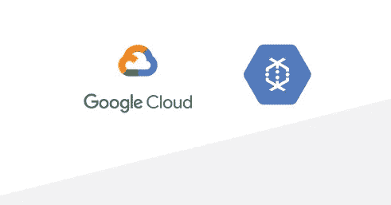

# 将数据流与云任务和云功能分离

> 原文：<https://medium.com/google-cloud/decoupling-dataflow-with-cloud-tasks-and-cloud-functions-ba92142ca961?source=collection_archive---------0----------------------->

**您是否正在 Google Cloud 上开发数据管道，并且有时很难选择合适的产品？您是否觉得各种产品的组合可能适合您的解决方案，但不知道在哪个场景中使用哪个产品？如果你对这些问题的回答是肯定的，请继续阅读。在这篇文章中，我将解释如何将谷歌云数据流与云任务和云功能分离。**

