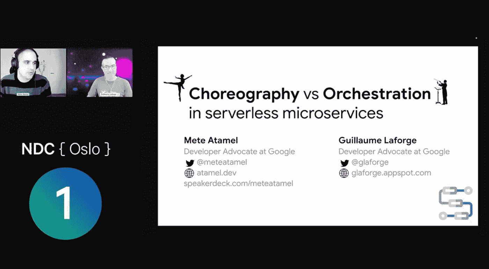

# 深入了解云工作流

> 原文：<https://medium.com/google-cloud/deep-dive-into-cloud-workflows-5db7e501b6d1?source=collection_archive---------2----------------------->

谷歌云开发者倡导者、 [Guillaume Laforge](https://cloud.google.com/developers/advocates/guillaume-laforge?hl=en) [ [网站](http://glaforge.appspot.com/) ]和 [Mete Atamel](https://cloud.google.com/developers/advocates/mete-atamel?hl=en) [ [网站](https://atamel.dev/) ]在过去几个月里做了出色的工作，激励开发者并让他们开始使用各种谷歌云无服务器应用开发/部署架构和服务。

该指南列出了 Guillaume 和 Mete 提供的一组公共资源，以帮助您了解[云工作流](https://cloud.google.com/workflows)，这是一项允许您“通过无服务器工作流编排和自动化 Google 云和基于 HTTP 的 API 服务”的服务该文档包含 Guillaume 和 Mete 创建的内容(研讨会、codelabs、源代码、视频等)的参考，我将这些内容汇总在本文中供您参考。

随着我们深入了解云工作流，下面建议的流程可以帮助您逐步理解。

# 云工作流简介

从这段视频开始，它为您提供了该产品的高度概述:

[介绍谷歌云工作流程](https://youtu.be/aOTFhWpjrFI)

# 编排 v/s 编排

但是，等一下…我可以通过连接到多个事件并编写事件处理程序，将一个业务流程串连起来。那不也是工作流程吗？如果你愿意，你可以这样称呼它，但是现在是研究术语**编排**和**编排**含义的好时机了。

你应该看看下面的两个视频，一个解释编排，另一个深入到编排。理解它们是很重要的，这样您就可以理解如何为跨各种服务的应用程序构建一个中等到复杂的体系结构。一定要注意视频中的利弊，这样当你在两者之间做出选择时，你就能更好地理解权衡。

*   第 1 部分:[微服务中的编排与编排|编排](https://youtu.be/IySueJCBSmM)

*   第 2 部分:[微服务中的编排与编排|编排](https://youtu.be/nJnrkcA7ZdA)

Guillaume 和 Mete 在各种开发者大会上多次介绍了这个主题。一个强烈的建议是观看他们关于这个话题的最新演讲，大约一个小时，但是是关于这个话题的一个坚实的陈述。

*   [无服务器微服务中的编排与编排——Mete Atamel&Guillaume la forge](https://www.youtube.com/watch?v=Z1_D0GJ7CB4)

看看这篇[的博客文章](https://cloud.google.com/blog/topics/developers-practitioners/choosing-right-orchestrator-google-cloud)，这篇文章强调了在谷歌云中选择正确的协调器。

# 谷歌云无服务器产品组合

如果你看过上面的介绍，你会注意到各种谷歌云无服务器产品都有提及。其中包括:云函数、云运行、Eventarc 等等。虽然本文档是专门针对工作流的，但它有助于理解这种无服务器环境，以便我们能够深入了解更多内容。以下是建议的流程:

1.  Mete 在他的 [SpeakerDeck](https://speakerdeck.com/meteatamel) 网站上发布了一系列精彩的演示。你可以看看这个例子来了解谷歌云上的无服务器系统:[https://speaker deck . com/meteatamel/server less-landscape-in-Google-Cloud](https://speakerdeck.com/meteatamel/serverless-landscape-in-google-cloud)
2.  Guillaume 和 Mete 设计并运行了[Pic-a-daily server less Workshop](https://github.com/GoogleCloudPlatform/serverless-photosharing-workshop)，指导您构建照片共享应用程序，该应用程序由云功能、App Engine、Cloud Run、Eventarc 等关键的无服务器选项提供支持。你可以在[这里](https://github.com/GoogleCloudPlatform/serverless-photosharing-workshop)找到 Github 页面，在这里找到 codelabs [。](https://codelabs.developers.google.com/serverless-workshop)

3.有趣的是，你可以看到编排和流程编排在起作用。

4.你应该了解 Eventarc。该服务允许您使用响应状态变化的松散耦合服务，从谷歌服务、SaaS 和您自己的应用程序异步交付事件。它得到了全面管理，最近已正式上市。查看以下博客帖子:

*   [event arc:Google Cloud 中的统一事件体验](https://cloud.google.com/blog/topics/developers-practitioners/eventarc-unified-eventing-experience-google-cloud)
*   [event arc 上的演示](https://speakerdeck.com/meteatamel/eventarc-trigger-cloud-run-services-with-events-from-google-cloud)
*   [Eventarc Samples Github Repo](https://github.com/GoogleCloudPlatform/eventarc-samples)
*   [event arc 前后谷歌官方云博客上的博文列表](https://cloud.google.com/blog/search;query=eventarc;paginate=25;order=newest)。

# 云工作流

至此，您已经对无服务器环境有了初步的了解，对编排和编排有了基本的概念，并且可能已经参加了 Pic-a-Daily 研讨会的部分内容，了解了各种正在运行的服务。

下一组没有特定顺序的参考资料可以帮助您深入了解云工作流。请记住，云工作流将协调各种 Google 云服务，因此了解一些早期的服务非常重要。

# 云工作流入门教程系列

Guillaume 有一个关于工作流的长期系列教程。如果您正在使用工作流，您应该将本系列加入书签，并逐步浏览每个教程。该系列在[这里](https://medium.com/google-cloud/tagged/gcp-workflows)有售，目前正在运行 **20 个部分**！

# 谷歌云官方博客—工作流程

在官方的谷歌云博客中有几篇关于工作流的博文，这里有几篇你一定要看看:

1.  [在工作流程中实施 saga 模式](https://cloud.google.com/blog/topics/developers-practitioners/implementing-saga-pattern-workflows)
2.  [具有工作流和计算引擎的长期运行容器](https://cloud.google.com/blog/topics/developers-practitioners/long-running-containers-workflows-and-compute-engine)
3.  [使用工作流分析 Twitter 情绪](https://cloud.google.com/blog/topics/developers-practitioners/analyzing-twitter-sentiment-new-workflows-processing-capabilities)

# 具有文档人工智能、工作流和云功能的更智能的应用程序

这是一个很好的例子，说明如何通过工作流将多个 Google 云服务结合起来，并围绕费用报告构建一个真实的应用程序。

跟随这篇由 Guillaume 和另一位开发者倡导者 [Anu Srivastava](https://cloud.google.com/developers/advocates/anu-srivastava?hl=en) 撰写的[博客文章](https://cloud.google.com/blog/topics/developers-practitioners/smarter-applications-document-ai-workflows-and-cloud-functions)，了解它是如何被构建的。这篇文章还包含了到 [Github 库](https://github.com/GoogleCloudPlatform/smart-expenses)等的链接。

该架构如下所示:

# 云工作流示例

在 [Github](https://github.com/GoogleCloudPlatform/workflows-demos) 上有一组工作流示例。