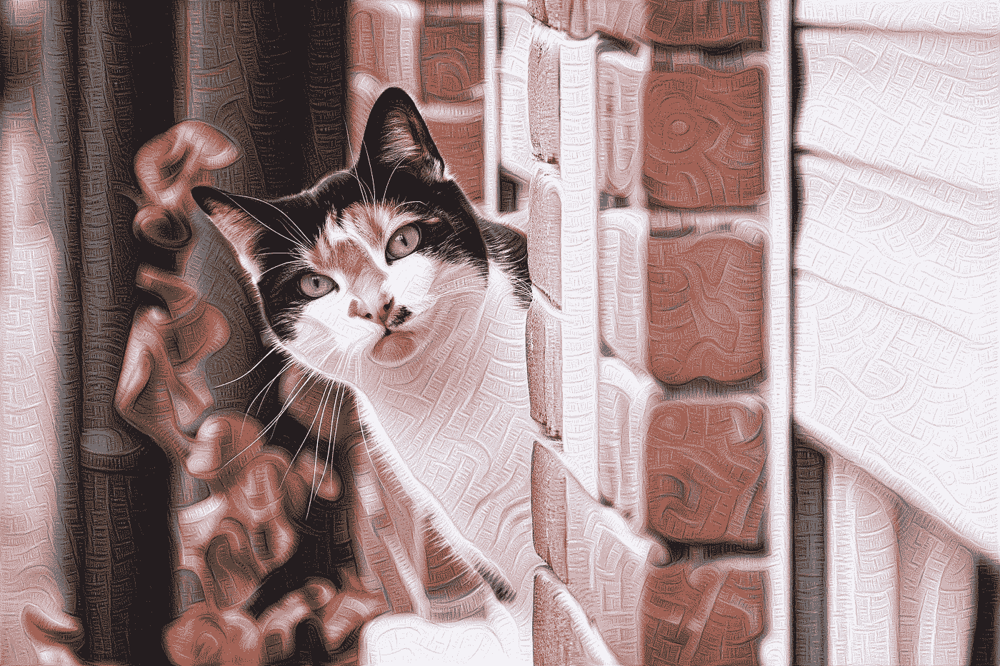
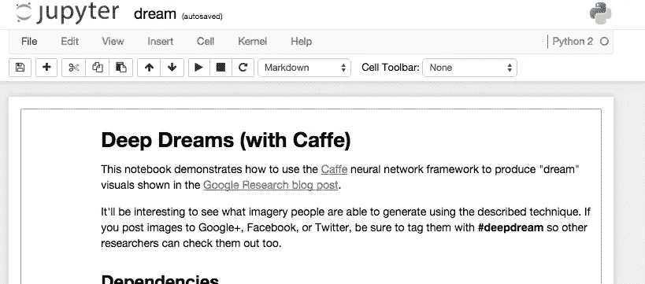
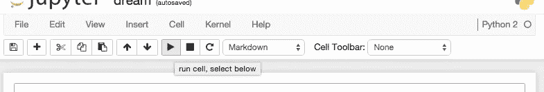
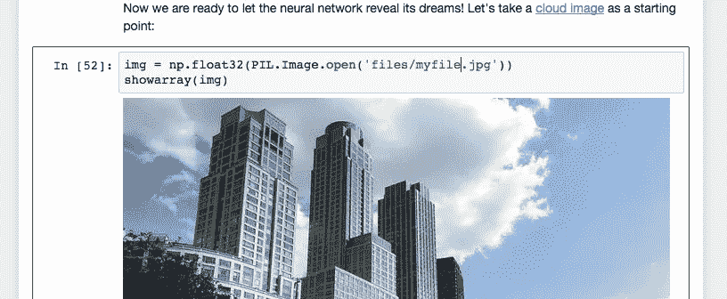
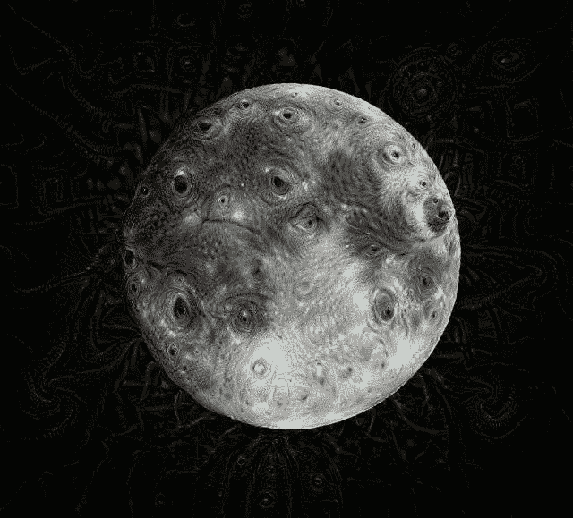
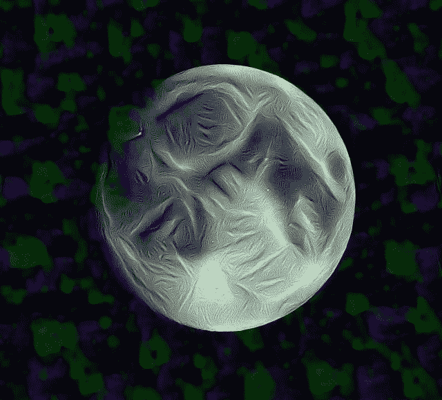

# 容器的深度梦

> 原文：<https://medium.com/google-cloud/deep-dream-with-containers-d28a26e4c8a3?source=collection_archive---------3----------------------->

如果你没有听说过[谷歌深度梦](http://googleresearch.blogspot.com/2015/06/inceptionism-going-deeper-into-neural.html)——去看看吧！简而言之，它“颠倒了(神经)网络……以一种引出特定解释的方式增强输入图像”。或者，简单地说，它可视化了神经网络如何看到和找到它被训练识别的模式。

摄影是我的爱好。当我终于有了空闲时间，我决定从我在 Flickr 上的一些[照片中生成深度梦境图像。](https://flickr.com/photos/saturnism)



[Flickr 上的原创](https://www.flickr.com/photos/saturnism/19453626329)。

## 一场噩梦

深梦[源代码在 GitHub](http://github.com/google/deepdream) 上。我以为下载、安装和运行它会很容易。但事实证明这要困难得多——既没有关于如何运行源代码的说明，也没有关于如何安装依赖项的说明。

网上流传着大量的深度梦安装说明，但每个都略有不同，而且大部分都很复杂。要安装的最复杂的依赖项是 Caffe。

除了在我的笔记本电脑上只安装一次软件，我还想在虚拟机上运行。我需要有一致的和可复制的深层梦依赖的构建，这样我就可以在任何地方运行它。

## 码头工人来救援了

我立刻想到了 Docker。使用 Docker，我可以在一个[Docker 文件](https://github.com/saturnism/deepdream-docker/blob/master/Dockerfile)中编写所有的安装步骤/命令，Docker 将按照指令构建所有的依赖项并安装 Deep Dream 源代码。最终结果是一个可移植的 Docker 容器映像——我可以在本地运行它，或者在任何运行 Docker 的虚拟机中运行它。

我的[深梦 docker 文件在 GitHub](https://github.com/saturnism/deepdream-docker/blob/master/Dockerfile) 上。它将:

1.  安装编译 Caffe 所需的依赖项
2.  编译并安装 Caffe
3.  安装深梦所需的依赖项
4.  安装最新版本的 IPython 笔记本
5.  下载神经网络模型
6.  设置必要的环境变量
7.  最后，启动 IPython 笔记本

[Flickr 上的原创](https://www.flickr.com/photos/saturnism/16828917719)。

## 码头机器

我亲身体会到通过低带宽连接下载 Docker 图像和推送图像是多么令人不快。

在过去的几个月里，我没有使用 [boot2docker](http://boot2docker.io/) 在本地构建和推送 Docker 映像，而是在[谷歌计算引擎](https://cloud.google.com/compute/)上使用 [Docker Machine](https://docs.docker.com/machine/) 。

查看我的另一篇[文章，关于我如何在谷歌计算引擎](/google-cloud-platform-developer-advocates/my-slow-internet-vs-docker-7678ae1cae72?source=your-stories)上设置 Docker 机器。

## 做梦之前

在做深梦之前，你需要建造容器:

```
$ git clone [https://github.com/saturnism/deepdream-docker](https://github.com/saturnism/deepdream-docker)
$ cd deepdream-docker
$ docker build -t deepdream .
...
Successfully built ...
```

要运行它:

```
$ docker run -p 8888:8888 -v /tmp:/deepdream/deepdream/files -ti deepdream
[I 03:25:07.724 NotebookApp] Created profile dir: u'/root/.ipython/profile_default'
...
[I 03:25:07.741 NotebookApp] The IPython Notebook is running at: [http://[all](http://[all/) ip addresses on your system]:8888/
[I 03:25:07.741 NotebookApp] Use Control-C to stop this server and shut down all kernels (twice to skip confirmation).
```

如果您在远程主机上使用 Docker Machine，请确保您允许端口 8888 访问(在我的关于在 Google 计算引擎中使用 Docker Machine 的文章[中了解如何使用)。](/google-cloud-platform-developer-advocates/my-slow-internet-vs-docker-7678ae1cae72?source=your-stories)

你现在应该可以通过浏览 8888 端口上的 Docker 服务器来访问你的 Deep Dream 笔记本了。

```
http://xxx.xxx.xxx.xxx:8888/notebooks/dream.ipynb
```

你会看到这样的东西:



IPython 笔记本

## 你的第一个梦

您可以使用默认图像，从顶部开始运行 IPython 笔记本中的每个单元格:



点击**运行单元**按钮运行深度梦代码。你需要从头到尾看一遍！

这将从默认设置生成非常酷的图像。

当你使用自己的形象时，乐趣才真正开始！要使用您自己的映像，您可以将映像复制到 Docker 主机的/tmp 目录中(因为这是我们挂载它的方式——可以随意更改)。如果您在本地运行 Docker 容器，只需将文件复制到:

```
$ cp myimage.jpg /tmp
```

如果您使用 Docker Machine，那么您可以使用` docker-machine scp `:

```
$ docker-machine scp myimage.jpg mydockermachine:/tmp
```

如果您在 IPython 笔记本中向下滚动，您可以用您上传的文件替换图像文件。您需要再次点击**运行单元**按钮:



开始深度做梦吧！


# 生成深度梦境视频

现在您已经了解了基本知识，您可以使用 Deep Dream IPython 笔记本获得许多乐趣！例如，您可以使用其中一个代码片段来生成 100 帧(或更多)，方法是递归地提供 Deep Dream 自己的输出，并对其应用一点缩放。它将“导致网络在培训期间看到的事物的印象源源不断”，以及一些非常酷的图像。

然后，您可以将所有生成的帧复制到容器之外:

```
$ docker cp containerid:/deepdream/deepdream/frames ~/
```

并使用 ffmpeg 将它们拼接在一起，以制作一个深度梦境视频:

```
$ ffmpeg -framerate 30 -pattern_type glob -i '*.jpg' -c:v libx264 -r 30 -pix_fmt yuv420p out.mp4
```

# 进入深度梦境的最简单方法

运行 IPython Notebook 并使用 UI 创建深度梦境图像可能相当麻烦。我需要一种简单的方法，能够利用我的 Docker 机器上的 CPU 在谷歌计算引擎上创建深度梦境图像。为此，我创建了一个 CLI 友好的 Docker 容器，您可以在 deepdream-cli-docker 库下的 [my GitHub 上找到源代码。](https://github.com/saturnism/deepdream-cli-docker)

要使用它，首先构建图像:

```
$ git clone [https://github.com/saturnism/deepdream-cli-docker.git](https://github.com/saturnism/deepdream-cli-docker.git)
$ cd deepdream-cli-docker
$ docker build -t deepdream-cli .
```

然后你可以直接从命令行生成深度梦境图像。它使用了我从使用 Docker 机器中学到的一些[技巧和诀窍，这些是构建与 UNIX 命令行配合良好的容器的简便方法:](/google-cloud-platform-developer-advocates/my-slow-internet-vs-docker-7678ae1cae72)

```
$ cat moon.jpg | docker run -i deepdream-cli > output.jpg
```



梦里的月亮。[Flickr 上的原创](https://www.flickr.com/photos/saturnism/3883002417/)

你也可以试验一些变量，在不同的神经网络层次，用不同的迭代和八度音阶来深度做梦。生成的图像可能差异很大:

```
$ cat myimage.jpg | docker run -i deepdream-cli -l conv2/3x3 -o 6 > output.jpg
```



梦里的月亮。[Flickr 上的原创](https://www.flickr.com/photos/saturnism/3883002417/)

就像任何命令行工具一样，您可以在这里找到所有可能的参数:

```
$ docker run deepdream-cli -h
```

不幸的是，深梦过程是单线程的。拥有更多 CPU 并不会减少生成单个图像的时间。但是，您可以一次生成多个图像，以便更好地利用资源。例如，要处理一个目录下的所有图像:

```
for f in *.jpg; \
  do { cat $f | docker run -i deepdream-cli > out_$f; } & \
done;
```