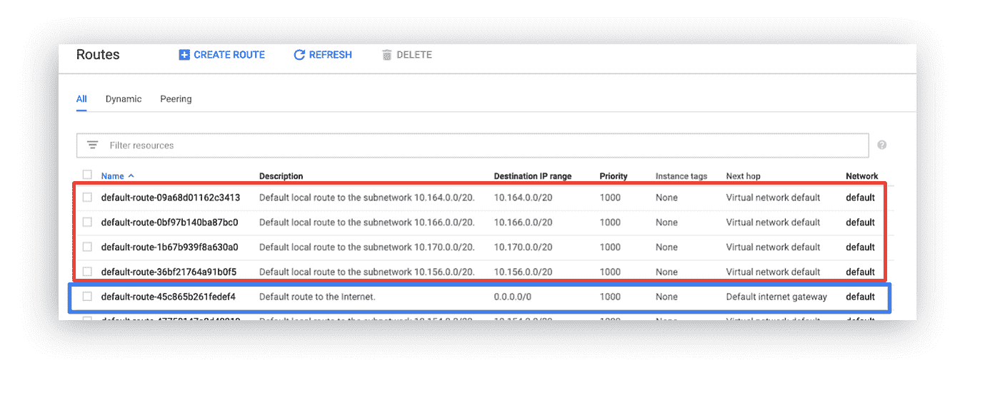

# 用路由定义新路径

> 原文：<https://medium.com/google-cloud/define-new-paths-with-routing-39a7d8eb4356?source=collection_archive---------0----------------------->


## 为什么路由是网络成功的基础，以及如何在 Google Cloud 上设置路由

# 你的网络是战略性的

从本系列文章开始，我就清楚地表明，数据和应用程序与它们运行的网络是不可分的。您的数字基础设施的可靠性直接取决于这个网络。坦率地说，这就是为什么您应该投资使用正确的构建模块来构建它。

问题是，试图将现有的网络技术应用到云是行不通的——无论你是连接来自不同数据中心的资源还是分支机构之间的资源。无论您的内部网络环境设计得多么好或多么复杂，将硬件虚拟化到云中都会保留太多的复杂性。它带来了配置、管理和故障排除，而这些往往忽略了云网络带给您的好处。您的开发运维团队将受到处理这种云连接的支配，不得不改造网络硬件，以试图保持原有的连接和性能预期。

# 一种新的路由方式

云路由不仅是强制性的，而且是从头开始构建强大网络架构的基础部分。把它想象成邮政服务、UPS 或联邦快递。数据包来自世界各地，在本地分拣中心(路由器)着陆，可能在到达目的地之前在其他中心着陆。它们会因为天气、卡车故障和自然灾害而改道。这是物流的惊人壮举。

> 现在想象一下，你不是有 10 个邮局，而是有数千个——同时携带数千倍的包裹。

路由协议是您的系统让网络知道他们在和谁通话以及如何有效地向那里发送信息的一种方式。当网络条件发生变化或设备出现故障时，路由协议可以更改通告给其它网络的路由以进行补偿。

最重要的是，您需要能够将网络连接在一起，而不允许数据被任何位置的任何用户看到。例如，假设 A & B 公司在一栋建筑中共用一面墙，每个公司都有自己的专用网络，但他们希望在不放弃当前网络配置的情况下将这些网络连接在一起。这将意味着让两个网络使用不同的 IP 地址范围，并设置一个连接到这两个网络的路由器，以便在它们之间传递流量。


传统上，为内部网络设置路由器需要相当繁重的工作。这包括物理组装设备，如路由器、交换机、网桥、集线器和防火墙，以在用户和他们使用的应用程序之间建立互连。实施可能需要几天甚至几周的时间，而且随着网络的增长，相关的管理和运营成本也会不成比例地增加。

然而，软件定义的网络旨在消除对硬件管理的需求，并通过更简单的配置提供可扩展性和安全性优势。谷歌云的软件定义路由是围绕一个使用可扩展的分布式虚拟路由机制的 [VPC 网络](https://cloud.google.com/vpc)设计的。路由定义了网络流量从虚拟机实例到其他目的地的路径。这些目的地可以在您的 VPC 网络内部(例如，在另一个虚拟机中)或外部。

# 引擎盖下的云路由

让我们仔细看看:

每条路由都由目的地和下一跳组成，它们是 IP 地址或 IP 地址范围。其目的地 IP 在目的地范围内的流量被发送到下一跳进行传递。


每个虚拟机实例都有一个控制器，该控制器从网络路由表中获知其所有路由。您可能还记得，路由通常是针对每个虚拟机有选择地应用的，但 GCP 的路由表实际上是在全球 VPC 网络级别定义的。基于路由顺序，离开 VM 的每个分组被发送到适用路由的下一跳。当您添加或删除一个路由时，使用[最终一致设计](https://cloud.google.com/vpc/docs/using-routes#order_of_operations)将更改集传播到 VM 控制器。


# 路线类型

现在，GCP VPC 上有两种类型的路线:系统生成的路线或自定义路线。

系统生成的路由给你*子网路由*和*默认路由*。



子网路由(红色)定义了进入 VPC 的流量到每个子网的路径。这些应用于 VPC 网络，并被编程到 VPC 网络中的所有端点。将子网添加到 VPC 时，会自动创建子网路由，以允许虚拟机与同一 VPC 中的其他虚拟机进行通信。只要知道这些路线是不能删除或更改的。子网路由是 [VPC 对等](https://cloud.google.com/vpc/docs/vpc-peering)的工作方式(VPC 对等总是交换所有子网路由)。

默认路径(蓝色)定义了从您的 VPC 到 Google 服务和公共互联网的流量路径。它包括一个到互联网网关的预编程 0.0.0.0/0 路由。与子网路由不同，这些路由*可以*更改。

另一方面，定制路线包括定义你自己的静态路线，或者使用[谷歌云路由器](https://cloud.google.com/router/docs/concepts/overview)定义动态路线。

# 静态路由设置

让我们以 VPN 为例，演示如何创建自定义静态路由:

1.  设置您的项目 ID。

```
gcloud config set project [PROJECT_ID]
```

2.在不同地区创建 2 个 VPC。

```
gcloud compute networks create ohio --subnet-mode=customgcloud compute networks create texas --subnet-mode=customgcloud compute networks subnets create subnet1 --network=ohio — region us-east1 --range=10.0.0.0/24gcloud compute networks subnets create subnet2 --network=texas — region us-central1 --range=10.8.0.0/24
```

3.在每个 VPC 中创建一个计算引擎实例。

```
gcloud compute instances create ohio-server --subnet subnet1 --zone us-east1-bgcloud compute instances create texas-server --subnet subnet2 --zone us-central1-a
```

4.创建防火墙规则，以支持对实例的访问和网络之间的访问。

```
gcloud compute firewall-rules create allow-ssh-ohio --network ohio --allow tcp:22 --source-ranges 0.0.0.0/0gcloud compute firewall-rules create allow-ohio-texas --network ohio --allow tcp:3306,icmp --source-ranges 10.8.0.0/24gcloud compute firewall-rules create allow-texas-ohio --network texas --allow tcp:3306,icmp --source-ranges 10.0.0.0/24
```

5.使用以下配置在每个区域创建 2 个 VPN 网关:

```
gcloud compute target-vpn-gateways create evpn \
--network ohio \
--region us-east1gcloud compute target-vpn-gateways create cvpn \
--network texas \
--region us-central1
```

6.为每个 VPN 网关保留一个区域外部(静态)IP 地址:

```
gcloud compute addresses create east-ip \
--region us-east1gcloud compute addresses create central-ip \
--region us-central1
```

7.为中央网关创建三个转发规则。这些规则指示 Google Cloud 向网关发送 ESP (IPsec)、UDP 500 和 UDP 4500 流量。

```
gcloud compute forwarding-rules create fr-cvpn-esp \
--ip-protocol ESP \
--address central-ip \
--target-vpn-gateway cvpn \
--region us-central1gcloud compute forwarding-rules create fr-cvpn-udp500 \
--ip-protocol UDP \
--ports 500 \
--address central-ip \
--target-vpn-gateway cvpn \
--region us-central1gcloud compute forwarding-rules create fr-cvpn-udp4500 \
--ip-protocol UDP \
--ports 4500 \
--address central-ip \
--target-vpn-gateway cvpn \
--region us-central1
```

8.为东部网关创建 3 个转发规则。

```
gcloud compute forwarding-rules create fr-evpn-esp \
--ip-protocol ESP \
--address east-ip \
--target-vpn-gateway evpn \
--region us-east1gcloud compute forwarding-rules create fr-evpn-udp500 \
--ip-protocol UDP \
--ports 500 \
--address east-ip \
--target-vpn-gateway evpn \
--region us-east1gcloud compute forwarding-rules create fr-evpn-udp4500 \
--ip-protocol UDP \
--ports 4500 \
--address east-ip \
--target-vpn-gateway evpn \
--region us-east1
```

9.接下来[生成一个共享秘密](https://cloud.google.com/vpn/docs/how-to/generating-pre-shared-key)，你将需要它来创建 VPN 隧道。记下它。

10.创建从东部网关到中央网关的基于静态路由的 VPN 隧道。首先从 vpn 网关页面复制 cvpn 的 central-ip 地址。对于基于路由的 VPN，本地和远程流量选择器都是 0.0.0.0/0。


```
gcloud compute vpn-tunnels create tunnele2c \
--peer-address [CVPN_IP] \
--ike-version 1 \
--shared-secret [SHARED_SECRET] \
--local-traffic-selector=0.0.0.0/0 \
--remote-traffic-selector=0.0.0.0/0 \
--target-vpn-gateway evpn \
--region us-east1
```


11.创建从中央网关到东部网关的基于静态路由的 VPN 隧道。首先从 vpn 网关页面复制 evpn 的 east-ip 地址。


```
gcloud compute vpn-tunnels create tunnelc2e \
--peer-address [EVPN-IP] \
--ike-version 1 \
--shared-secret [SHARED_SECRET] \
--local-traffic-selector=0.0.0.0/0 \
--remote-traffic-selector=0.0.0.0/0 \
--target-vpn-gateway cvpn \
--region us-central1
```


在 VPN 通道页面上，您应该首先看到分配资源的状态，并尝试在 VPN 通道状态列下建立第一次握手。然后，在网关之间建立 VPN 连接后，会出现一个绿色复选标记。


12.试着从俄亥俄服务器 pinging 德克萨斯服务器。从计算引擎实例页面获取 texas-server 的内部 IP。然后从计算引擎实例页面 SSH 进入 ohio-server，并输入以下命令。

```
ping [TEXAS_INTERNAL_IP]
```

它将挂起，因为没有指定通过 VPN 隧道从俄亥俄服务器到德克萨斯服务器的路由。

13.接下来，为从东 VPC 到 VPC 中部的流量创建一条静态路由。目标范围是中心子网的内部 IP 范围。下一跳是东到中央的 VPN 隧道。

```
gcloud compute routes create tunnele2c \
--destination-range 10.8.0.0/24 \
--next-hop-vpn-tunnel tunnele2c \
--network ohio \
--next-hop-vpn-tunnel-region us-east1
```

14.现在用同样的方法创建一条从 VPC 中部到东部的路线。

```
gcloud compute routes create tunnelc2e \
--destination-range 10.0.0.0/24 \
--next-hop-vpn-tunnel tunnelc2e \
--network texas \
--next-hop-vpn-tunnel-region us-central1
```

检查 Routes 页面，您应该会看到创建的新静态路由。


15.让我们再一次试着从俄亥俄服务器 pinging 德克萨斯服务器。


您应该会看到一个响应，因为路由允许流量通过 VPN 隧道作为下一跳发送！

使用网络情报中心的[连接测试](https://cloud.google.com/network-intelligence-center/docs/connectivity-tests/concepts/overview)，我为从俄亥俄州服务器到得克萨斯州服务器的流量创建了一个 ICMP 测试，它确认流量通过了我们的 VPN 和静态路由设置:


*在本系列的后面，我们将讨论如何设置这个测试，以及如何使用网络智能中心来监控网络配置。

# 利弊

请记住，对于静态路由，您必须创建或维护路由表。源网络或目的网络的拓扑变化要求您手动更新静态路由。换句话说，如果一条链路出现故障，静态路由不能自动重新路由流量(与动态路由相反，动态路由可以自动重新路由，我将在下一篇文章中详细介绍)。然而，静态路由对于具有稳定拓扑的小型网络来说是完美的，并且您还可以保持对路由表的严格控制，如上面的 VPN 示例所示。

总而言之，谷歌的软件定义路由为您提供了:

*   集中化控制带来的简单性
*   高度自动化
*   内置安全性和加密
*   和高性能

软件定义的路由连接子网和子网，并在 VPC 之间定向流量，甚至定向到您的本地网络。通过路由接口，您将开始看到它是如何改变的，您可以多么容易地开始构建一个高度可扩展的网络。

# 现在怎么办？

1.  在此深入探讨路由[。](https://cloud.google.com/vpc/docs/routes)
2.  订阅 [GCP Youtube 频道](https://www.youtube.com/user/googlecloudplatform)，关注我的视频系列[端到端联网](https://www.youtube.com/playlist?list=PLIivdWyY5sqJ0oXcnZYqOnuNRsLF9H48u)。
3.  查看[网络 102](https://www.youtube.com/watch?v=jQc9P7xA_wU) ，在这里我与网络专家 Ryan Pryzbl 讨论路由问题。
4.  想要更多内容？在[推特](https://twitter.com/swongful) @swongful 上关注我。
5.  看看你身边的[谷歌云事件](https://cloud.google.com/events/)。

请继续关注本系列的更多内容，并感谢您和我一起开启这场揭开云网络神秘面纱的旅程。