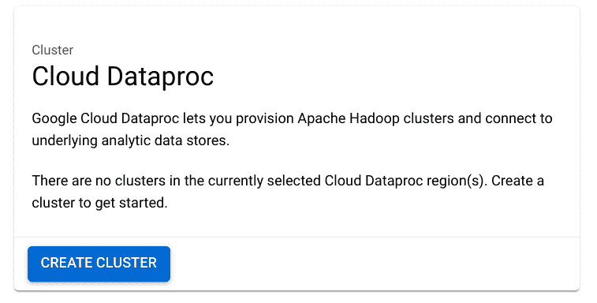
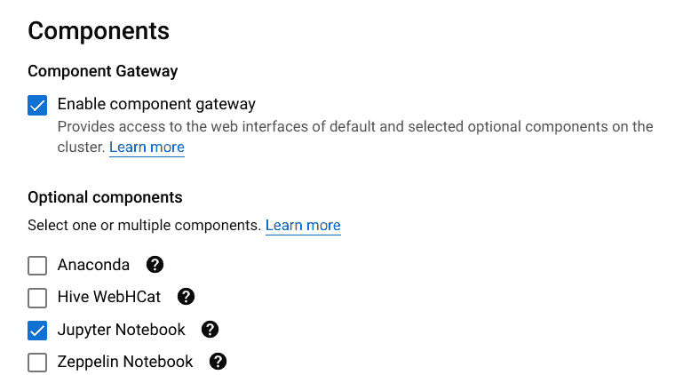
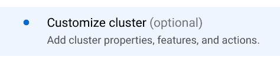
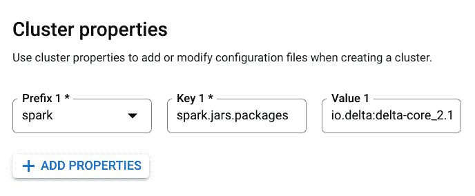
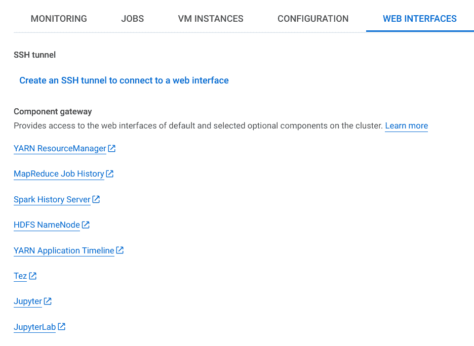
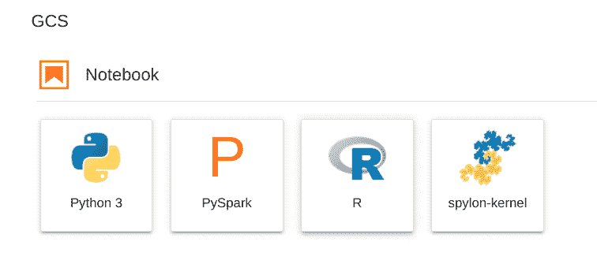
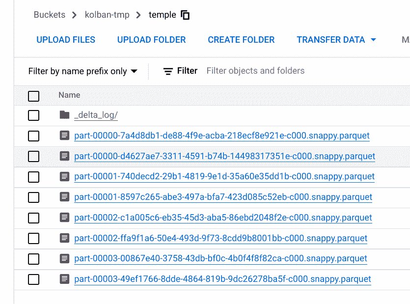
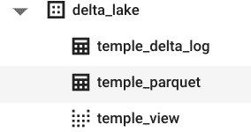

# 带有 Dataproc、Jupyter(和 BigQuery)的增量表

> 原文：<https://medium.com/google-cloud/delta-tables-with-dataproc-jupyter-and-bigquery-ea2509ca9e0f?source=collection_archive---------1----------------------->


最近我想处理增量表格式的数据。我的最终目的是看看如何从 BigQuery 查询它，但这是以后的事了。增量表通常与数据块一起使用，但我没有访问该平台的权限，所以我需要找到一个我可以使用的环境。我可以访问 Dataproc，这是 Google 的 Spark cluster 故事。在搜索文档和互联网之后，我找到了允许我在 Dataproc 上安装 Delta 的方法，但是这些方法假设我将提交 Spark 作业进行处理。在我的故事中，我想用 Jupyter 笔记本来做实验。我找不到允许我通过 Jupyter 环境在 Dataproc 上使用增量表的方法。

经过一个漫长的夜晚，我找到了解决办法。这篇文章是对那个食谱的详细描述。如果我们遵循它，我们将最终得到一个运行中的支持增量表的 Dataproc 集群和一个可以用于实验的 Jupyter 笔记本。

1.  转到控制台中的 Dataproc 页面。这是我们将做大部分工作的地方。我假设您已经启用了 Dataproc，并且有足够的 I am 权限来执行这些任务。
2.  创建一个新的 Dataproc 集群



在组件下，选择启用组件网关和 Jupyter 笔记本:



切换到“定制集群”页面:



添加群集属性:



*   前缀:`spark`
*   按键:`spark.jars.packages`
*   价值:`io.delta:delta-core_2.12:1.0.1`

以上是食谱的核心。这将 maven 坐标为`[io.delta:delta-core_2.12:1.0.1](https://mvnrepository.com/artifact/io.delta/delta-core)`的 Maven 包添加到集群环境中。请注意，我们使用的增量表版本是 1.0.1。我最初错误地认为我可以使用最新的可用版本。这被证明是一个错误。1.0.x 是与 Apache Spark 3.1.x 一起使用的版本。任何更高版本的 Delta 包都需要更高版本的 Spark。在撰写本文时(2022-10)， [Dataproc](https://cloud.google.com/dataproc/docs/concepts/versioning/dataproc-release-2.0) 使用 Apache Spark 3.1.3。当我尝试使用 Delta 的更高版本时，我遇到了 Java 未知的类错误。

单击创建以创建集群

3.打开 Jupyter

深入新集群。找到 Web 界面页面:



点击 JupyterLab。

朱庇特将发射。

4.点击笔记本下的 PySpark 打开 Jupyter PySpark 笔记本



5.创建写入 delta lake 的 PySpark 代码片段

```
from delta import *
from pyspark.sql import SparkSessionspark = SparkSession \
  .builder \
  .appName("DeltaTest") \
  .config("spark.sql.extensions", "io.delta.sql.DeltaSparkSessionExtension") \
  .config("spark.sql.catalog.spark_catalog", "org.apache.spark.sql.delta.catalog.DeltaCatalog") \
  .config("spark.jars.packages", "io.delta:delta-core:1.0.1") \
  .getOrCreate()data = [{"Category": 'A', "ID": 1, "Value": 121.44, "Truth": True},
        {"Category": 'B', "ID": 2, "Value": 300.01, "Truth": False},
        {"Category": 'C', "ID": 3, "Value": 10.99, "Truth": None},
        {"Category": 'D', "ID": 4, "Value": 123.45, "Truth": False}
        ]
df = spark.createDataFrame(data)
df.write.format("delta").mode("overwrite").save('gs://kolban-tmp/temple/')
df.show()
```

请注意 SparkSession 中与增量表相关的额外配置。运行这段代码后，我们会发现 GCS bucket 现在包含了一个增量表。

# 增量到大查询

现在让我们假设 Google 云存储中有增量表。我们将通过表的 GCS 文件夹路径来识别该表。例如:

`gs://kolban-tmp/temple/`

这将是一个驻留在名为`kolban-tmp`的 GCS 存储桶上的增量表，它包含在名为 temple 的文件夹中(该表也因此被称为 temple)。如果我们检查该文件夹中包含的文件，我们会发现一系列拼花文件和一个名为`_delta_logs`的附加文件夹。



我们可以通过 Spark 使用增量库直接处理增量表，但是有一个常见的问题…我可以通过 BigQuery 处理这些增量表吗？

BigQuery 是谷歌的分析数据仓库。通常，我们将希望查询的数据交给 BigQuery，然后 big query 将其存储在自己的私有存储中。将增量表复制到 BigQuery 中很容易。从 Delta 读取并写入 BigQuery 的 spark 作业将能够快速完成复制。但是，如果我们不想复制数据呢？如果我们希望增量表中的更改能够尽快在 BigQuery 中处理呢？最好是接近实时。

BigQuery 支持一个叫做[外部表](https://cloud.google.com/bigquery/docs/external-tables)的概念。外部表是存储在 BigQuery 外部的逻辑表的数据。例如 CSV、JSON、Avro 和 Parquet。当我们引用一个定义为外部的 BigQuery 表时，BigQuery 从非 BigQuery 本地数据源中读取数据并执行处理。不幸的是，增量表格式数据还不是(2022 年 10 月)BigQuery 支持的格式。

幸运的是，一些谷歌工程师已经提出了一些解决办法。在这里，我们将描述和演示其中的一种解决方法。

为了理解这个解决方案，我们将简要描述增量表是如何物理存储的。这不是实施解决方案所必需的，因此如果需要，您可以跳过这一部分。当对增量表进行改变时，一个或多个新的拼花格式文件被写入存储器。这些文件的集合构成了整个增量表。拼花文件一旦写入就不会被修改。因此，如果在增量表中插入新行，将会创建表示这些插入的新拼花文件。但是更新和删除呢？同样，创建了新的拼花文件(以前的文件从不修改),表示表中的变化，但现在我们似乎有了新的挑战…我们现在有过时的拼花文件。现在在存储器中有实际拼花文件的子集，它们构成了表…我们如何知道使用哪一个呢？这就是德尔塔的第二部分发挥作用的地方。Delta 维护一个包含 JSON 文件的日志文件夹，其中每个 JSON 文件代表一个对 Delta 表的更改。JSON 文件描述了用于访问表的一组 parquet 文件。

有了这个松散的总结，我们现在可以着眼于我们的解决方案。该解决方案基于外部数据创建了两个 BigQuery 表，这两个表都基于 GCS 托管的数据。第一个表利用增量表存储中的所有 parquet 文件，第二个表利用增量表存储中的所有 JSON 文件。跨越所有拼花文件的表可以看到所有可能的数据。跨越 JSON 文件的表可以看到所有的指令，从而知道哪些 parquet 文件应该组合在一起。最后，我们使用 JSON files 表的内容作为过滤器，在 parquet files 表上创建一个 BigQuery 视图。该视图可以用作最终用户查询的目标。查询视图将生成与查询增量表相同的结果，我们的工作就完成了。

现在让我们看看实际情况。

假设我们有一个增量表，位于:

`gs://kolban-tmp/temple/`

我们的目标是以一个我们称之为`delta_lake.temple`的 BigQuery 视图结束。

如果我们在 BigQuery 中运行下面的 SQL，我们将实现这个目标:

```
DECLARE BUCKET STRING DEFAULT "kolban-tmp";
DECLARE FOLDER STRING DEFAULT "temple";
DECLARE DATASET STRING DEFAULT "delta_lake";
DECLARE DELTA_TABLE STRING DEFAULT "temple";#
# Implementation
#
DECLARE XXX_PARQUET STRING;
DECLARE XXX_DELTA_LOG STRING;
DECLARE GS_PARQUET STRING;
DECLARE GS_JSON STRING;
DECLARE DELTA_TABLE_VIEW STRING;
DECLARE PATH STRING;
SET PATH = FORMAT("gs://%s/%s/", BUCKET, FOLDER);
SET XXX_PARQUET = FORMAT("%s.%s_parquet", DATASET, DELTA_TABLE);
SET XXX_DELTA_LOG = FORMAT("%s.%s_delta_log", DATASET, DELTA_TABLE);
SET GS_PARQUET = FORMAT("gs://%s/%s/part*.parquet", BUCKET, FOLDER);
SET GS_JSON = FORMAT("gs://%s/%s/_delta_log/*.json", BUCKET, FOLDER);
SET DELTA_TABLE_VIEW = FORMAT("%s.%s_view", DATASET, DELTA_TABLE);
EXECUTE IMMEDIATE FORMAT("CREATE OR REPLACE EXTERNAL TABLE %s OPTIONS (format = 'PARQUET', uris = ['%s'])", XXX_PARQUET, GS_PARQUET);
EXECUTE IMMEDIATE FORMAT("CREATE OR REPLACE EXTERNAL TABLE %s OPTIONS (format = 'CSV', field_delimiter='|', uris = ['%s'])", XXX_DELTA_LOG, GS_JSON);
EXECUTE IMMEDIATE FORMAT("CREATE OR REPLACE VIEW `%s` AS SELECT * FROM  `%s` WHERE _FILE_NAME IN (SELECT CONCAT('%s' , JSON_EXTRACT_SCALAR(string_field_0, '$.add.path')) AS filepath FROM `%s` EXCEPT DISTINCT SELECT CONCAT('%s' , JSON_EXTRACT_SCALAR(string_field_0, '$.remove.path')) AS filepath FROM `%s`)", DELTA_TABLE_VIEW, XXX_PARQUET, PATH, XXX_DELTA_LOG, PATH, XXX_DELTA_LOG) ;
```

SQL 从四个声明开始，您可以针对自己的环境修改这些声明:

*   `BUCKET` —保存增量表的 GCS 存储桶的名称
*   `FOLDER`—GCS 存储桶中保存增量表的文件夹的名称
*   `DATASET` —将保存 BigQuery 表和视图的 BigQuery 数据集的名称
*   `DELTA_TABLE` —将呈现底层增量表的 BigQuery 视图的名称

执行之后，我们将发现 BigQuery 中创建的三个新构件:



`temple_delta_log`表是增量表的 JSON 文件上的外部表。那里没有你需要直接查询的东西。

`temple_parquet`表是增量表的拼花文件的外部表。同样，这里没有您需要直接查询的内容。

`temple_view`是您将查询以查看增量表数据的视图。

最后……一段视频展示了上述步骤:

学分:

*   Adam paterno stro——提出 SQL 方法来处理增量文件的专家。