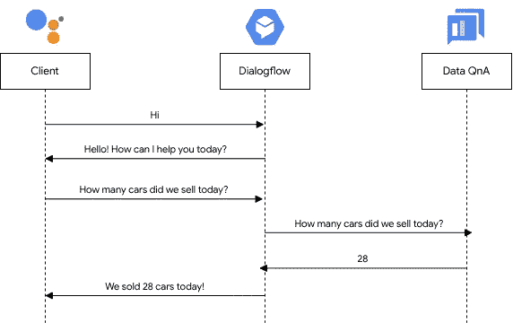
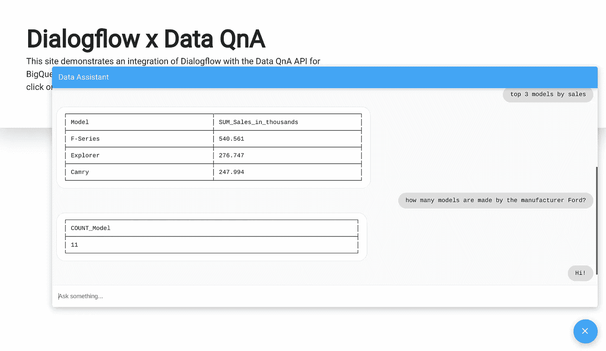

# 通过数据 QnA 实现 BigQuery 上的数据洞察民主化

> 原文：<https://medium.com/google-cloud/democratizing-data-insights-on-bigquery-with-data-qna-a8523aaacbf3?source=collection_archive---------2----------------------->

## 我们如何在整个组织中提供有用的见解，即使是对那些没有技术背景的人？让我们找出答案

今天，数据驱动的决策非常流行。利用对使用情况、性能和各种其他属性的洞察，可以基于真实世界的统计数据而不是直觉或猜测做出决策。

传统上，用于决策的数据洞察力是由专门的数据分析团队从存储在数据仓库中的大量数据中提取的。这些团队使用软件工具和脚本来提取相关数据，并适当地呈现出来，以便理解数据。

虽然这是数据驱动型组织的重要组成部分，但有时可能有必要快速了解您的数据。Data QnA 提供了一种方法来做到这一点，没有技术障碍。

# BigQuery 上的数据 QnA

数据 QnA 是 BigQuery 的一个相对较新的特性，它允许你用简单的英语对你的数据“提问”。在底层，Data QnA 将您的自然语言查询转换成合适的 BigQuery SQL 语句，执行这些语句可以从表中检索数据。

Data QnA 允许在脚本、分析工具和 SQL 方面几乎没有经验的用户从 BigQuery 中快速提取有用的数据。不存在技术障碍—如果您知道您在寻找什么，您可以使用 Data QnA 找到它。

## 设置数据 QnA

需要在您打算使用的每个 BigQuery 表上启用和设置数据 QnA。这是一个简单的三步过程-

1.  在谷歌云控制台中，进入 **BigQuery** 页面。在左侧的下拉菜单下，选择**数据 QnA**
2.  在左侧菜单中，选择**管理**
3.  点击**启用新表**。选择您想要使用的表格

Data QnA 现在将对表进行索引，并为自然语言查询做准备。

每一列都由一个或多个**别名**引用，这些别名在您的自然语言查询中标识。默认情况下，Data QnA 根据表模式为每个列创建别名。要自定义这些别名，

1.  在数据 QnA 页面下，选择**管理**
2.  点击工作台右侧的三个点，并选择**编辑设置**
3.  修改每一列的别名，并点击 S **保存**

Data QnA 现在可以识别您添加的带有任何新别名的列。

## 问问题

您可以直接从 BigQuery 控制台对您的数据提出问题。为了开始，

1.  转到 **BigQuery** 页面，选择一个启用了数据 QnA 的表
2.  点击**提问**
3.  用简单的英语输入你的查询，然后点击**生成等价的 SQL**

您现在可以看到由数据 QnA 生成的 SQL。要运行查询，点击查询编辑器中的**打开，并选择**运行**以执行查询并检索结果。**

虽然这是查询数据的一种方式，但它主要用于测试您的设置，并确保 Data QnA 按预期生成查询。Data QnA 的真正优势在于它的 API。

## 与 Dialogflow 集成

近年来，虚拟助手变得非常强大。除了拥有卓越的自然语言理解能力之外，这些助手还允许我们执行各种各样的操作，从获取天气更新到为您预订机票和酒店房间。想象一下，一个虚拟助手也能从你的数据仓库中为你提取洞察力！

[Dialogflow](https://github.com/dialogflow) 是谷歌构建对话代理的平台。使用 Dialogflow，我们可以构建一个对数据 QnA 的自然扩展，为聊天机器人创建一个基础，该聊天机器人可用于从 BigQuery 获得数据洞察力。

增压你的虚拟助手！[作者图片]

一旦构建了 Dialogflow 代理，就可以将其集成到各种应用程序中，以提供一种类似自然对话的方式来检索数据见解，如 Google Assistant 或 Slack。决策者只需在手机上问一个问题，就能快速了解他们的业务。需要快速做出决定，并寻找一些数据来支持它？只差一个问题了！

为了演示这一点，我们开发了一个示例应用程序来集成 Data QnA API 和 Dialogflow，以提供一个聊天界面来获得数据洞察。项目源代码和安装说明可以在[这里](https://github.com/anihm136/dialogflow-dataqna-demo)找到。

不要查询你的数据库，只要求你的数据[图片作者]

# 下一步是什么？

查看 [Data QnA 产品发布博客](https://cloud.google.com/blog/products/data-analytics/introducing-data-qna)，了解 Data QnA 如何为组织带来革命性的数据洞察。有关其背后技术的更多信息，可以阅读[研究论文](https://research.google/pubs/pub45791/)。

因为数据 QnA API 仍然在 Alpha 中，所以还不能公开访问。如果你真的想马上试用，可以在这里申请接入[。否则，请关注](http://g.co/cloud/data-qna) [BigQuery 发行说明](https://cloud.google.com/bigquery/docs/release-notes)以了解 API 何时上市。敬请期待！